# Senior Fullstack Engineer Interview Handbook

<p class="handbook-version" data-version="v1.5.1">Version <code>v1.5.1</code></p>

---

A practical playbook for the **tech roulette** format and the follow-up system-design interview. It targets a role where Next.js, React, TypeScript, simple REST endpoints and SQL queries, performance, testable code, and owning a feature end to end from the UI to the database all matter.

## How to answer

Answer each term in 20–40 seconds: name the problem, the solution, and the trade-off. Do not pass a definition off as experience: add “I would use it when…”, “The trade-off is…”, or one truthful example from your own practice. If you have not used a technology, say honestly how you would validate the solution and by which criteria you would choose it.

## Abbreviations and acronyms

Say the expansion out loud exactly as written — that is how it naturally sounds in an interview; the right column gives a short meaning. For the most likely terms the expansion is also added next to the acronym in section headings.

| Acronym | Expansion | In short |
|---|---|---|
| ACID | Atomicity, Consistency, Isolation, Durability | Database transaction guarantees |
| AI | Artificial Intelligence | Machine intelligence |
| API | Application Programming Interface | Contract for program-to-program interaction |
| ARIA | Accessible Rich Internet Applications | Accessibility attributes for rich UI |
| CD | Continuous Delivery / Continuous Deployment | Continuous delivery / deployment |
| CDN | Content Delivery Network | Network that serves content close to users |
| CI | Continuous Integration | Continuous integration |
| CLS | Cumulative Layout Shift | Total unexpected layout shift |
| CORS | Cross-Origin Resource Sharing | Browser rules for cross-origin access |
| CPU | Central Processing Unit | Central processor |
| CRDT | Conflict-Free Replicated Data Type | Data structure for conflict-free collaborative editing |
| CQRS | Command Query Responsibility Segregation | Separating command and read models |
| CRUD | Create, Read, Update, Delete | Basic data operations |
| CSP | Content Security Policy | Policy of allowed content sources |
| CSR | Client-Side Rendering | Rendering on the client |
| CSRF | Cross-Site Request Forgery | Forged request on behalf of the user |
| CSS | Cascading Style Sheets | Cascading style sheets |
| CSSOM | CSS Object Model | CSS object model |
| DB | Database | Database |
| DOM | Document Object Model | Document object model |
| DTO | Data Transfer Object | Object for passing data between layers |
| E2E | End-to-End | End-to-end test of a user scenario |
| ETag | Entity Tag | Version of an HTTP resource representation for cache/concurrency |
| ESM | ECMAScript Modules | Standard JavaScript module system |
| FK | Foreign Key | Foreign key linking tables |
| GB | Gigabyte | Gigabyte, unit of data volume |
| GDPR | General Data Protection Regulation | EU personal data protection regulation |
| GPU | Graphics Processing Unit | Graphics processor |
| HTML | HyperText Markup Language | Web page markup language |
| HTTP | HyperText Transfer Protocol | Protocol for transferring web data |
| ID | Identifier | Unique identifier |
| INP | Interaction to Next Paint | Delay until the next paint after an interaction |
| IP | Internet Protocol | Internet protocol; usually a node address |
| ISR | Incremental Static Regeneration | Incremental regeneration of a static page |
| JS | JavaScript | JavaScript programming language |
| JSON | JavaScript Object Notation | Text format for data interchange |
| JWE | JSON Web Encryption | Encrypted JWT profile |
| JWS | JSON Web Signature | Signed JWT profile |
| JWT | JSON Web Token | Token format with claims; usually a signed JWS, not necessarily encrypted |
| LCP | Largest Contentful Paint | Paint of the largest visible element |
| LLM | Large Language Model | Large language model |
| MIME | Multipurpose Internet Mail Extensions | Standard for content type/format |
| NAT | Network Address Translation | Network address translation |
| OT | Operational Transformation | Transformation of competing collaborative-editing operations |
| ORM | Object-Relational Mapping | Mapping objects to relational tables |
| PII | Personally Identifiable Information | Personally identifying data |
| RAG | Retrieval-Augmented Generation | Generation with prior context retrieval |
| REST | Representational State Transfer | Architectural style of HTTP APIs |
| RTK | Redux Toolkit | Standard toolset for Redux |
| RPC | Remote Procedure Call | Remote procedure call |
| RSC | React Server Components | React Server Components |
| SEO | Search Engine Optimization | Search engine optimization |
| SLA | Service Level Agreement | External commitment to a service level |
| SLI | Service Level Indicator | Measured indicator of service level |
| SLO | Service Level Objective | Target value of a service indicator |
| SQL | Structured Query Language | Query language for relational databases |
| SSG | Static Site Generation | Static site generation at build time |
| SSR | Server-Side Rendering | Rendering HTML on the server |
| SSE | Server-Sent Events | One-way server-to-browser events over HTTP |
| SWR | Stale-While-Revalidate | Serving cached data while revalidating in the background |
| TDD | Test-Driven Development | Test-driven development |
| TTFB | Time to First Byte | Time to the first byte of the response |
| TTL | Time To Live | Lifetime of a cache entry/lease |
| UI | User Interface | User interface |
| URL | Uniform Resource Locator | Address of a resource on the internet |
| UX | User Experience | User experience |
| XSS | Cross-Site Scripting | Injection/execution of a malicious script |

**Not acronyms:** GET, POST, PUT, PATCH, DELETE, SELECT, UPDATE, WHERE, JOIN, INNER JOIN, LEFT JOIN, ORDER BY, LIMIT, OFFSET, IN, FOR, and EXPLAIN are HTTP method names or SQL keywords. Their meaning is covered in the corresponding sections.

---

## React

---

### Reconciliation

**Purpose** — React compares the next element tree with the previous one to update only the required DOM.

**How it works / is used** — give list items stable keys; React matches nodes by element type and key.

**Downsides and limits** — changing a key resets state, while unstable index keys can preserve state on the wrong item.

**Mini-example** — use task.id rather than the array index as a task row key.

```tsx
// Bad: key={index} — reordering moves state to the wrong row.
{tasks.map((task) => <TaskRow key={task.id} task={task} />)}
```

---

### Virtual DOM

**Purpose** — it is an in-memory declarative UI model that lets React plan DOM updates.

**How it works / is used** — components return elements; React builds a tree, calculates a diff, then commits DOM mutations in a batch.

**Downsides and limits** — a virtual DOM is not automatically fast; JavaScript, layout work, and very large trees still cost time.

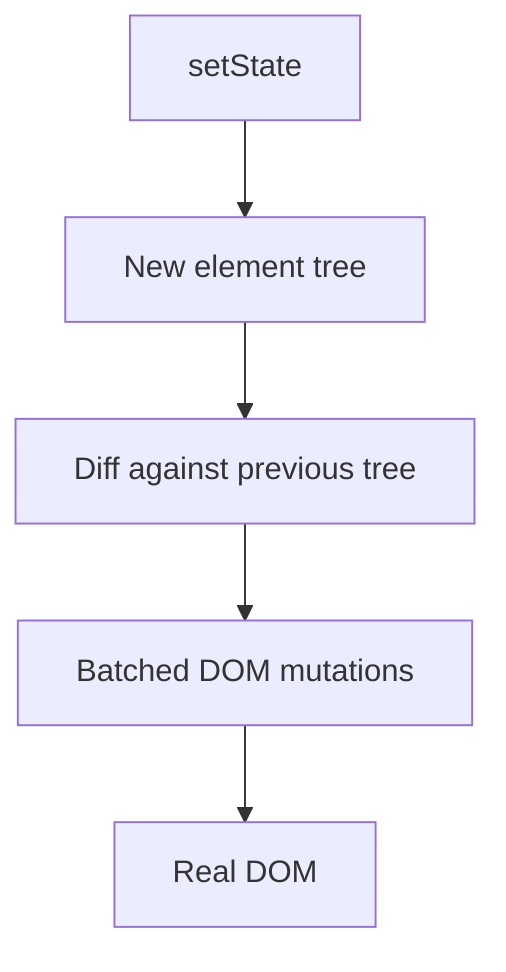

---

### Concurrent rendering

**Purpose** — it keeps the UI responsive by allowing less urgent rendering to yield to user input.

**How it works / is used** — React may start, interrupt, and retry rendering; useTransition marks an update as non-urgent.

**Downsides and limits** — rendering must be pure and idempotent because it is not guaranteed to run exactly once.

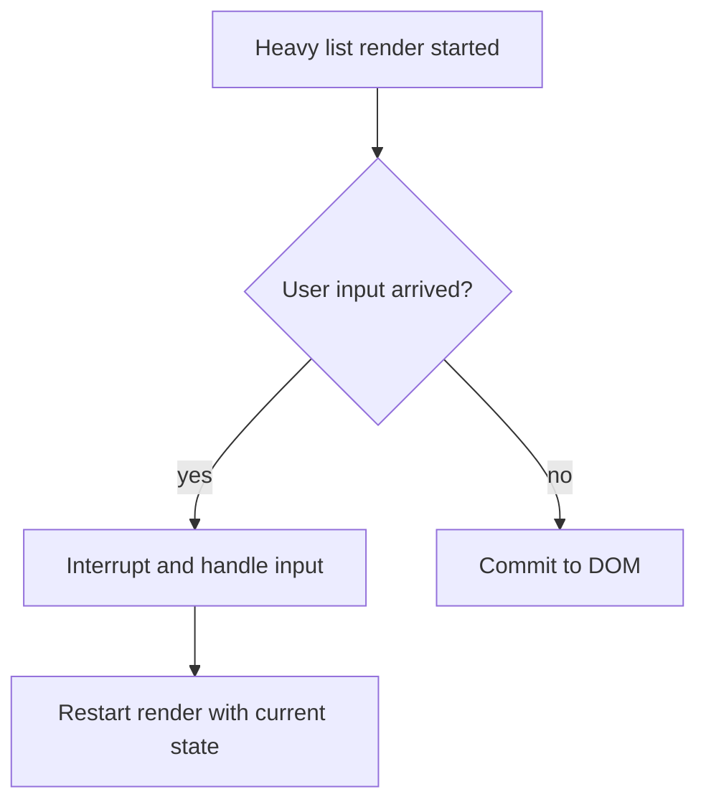

---

### Suspense

**Purpose** — it displays a controlled fallback while a lazy component or a compatible data source is pending.

**How it works / is used** — wrap an independent screen region in Suspense with a local skeleton or loader.

**Downsides and limits** — a boundary placed too high hides the whole screen, and not every data-fetching approach integrates with Suspense.

```tsx
const Chart = lazy(() => import("./Chart"));

<Suspense fallback={<ChartSkeleton />}>
  <Chart projectId={projectId} />
</Suspense>
```

---

### Error Boundary

**Purpose** — it isolates a rendering failure to a UI region and keeps the rest of the app usable.

**How it works / is used** — place a boundary around a route or risky widget, log the error, and offer retry.

**Downsides and limits** — it does not catch event-handler, asynchronous, or server-rendering errors; handle those separately.

```tsx
import { ErrorBoundary } from "react-error-boundary";

<ErrorBoundary fallback={<EditorUnavailable />}>
  <VideoEditor projectId={projectId} />
</ErrorBoundary>
```

---

### React.memo

**Purpose** — it skips rendering a pure child when its props have not changed.

**How it works / is used** — use it after profiling for an expensive component with stable props and shallow comparison.

**Downsides and limits** — comparison has a cost; new objects and callbacks defeat it and increase code complexity.

```tsx
const UserRow = memo(function UserRow({ user }: { user: User }) {
  return <li>{user.name}</li>;
});
```

---

### useMemo

**Purpose** — it memoizes an expensive computation or a stable reference across renders.

**How it works / is used** — use it for measured expensive filtering or a prop passed to a memoized child, with complete dependencies.

**Downsides and limits** — it is an optimization hint, not a guarantee; overuse hurts readability and can cost more than recomputation.

```tsx
const visibleUsers = useMemo(
  () => users.filter((user) => user.name.includes(query)),
  [users, query],
);
```

---

### useCallback

**Purpose** — it preserves a function identity when that matters to a memoized child or an effect dependency.

**How it works / is used** — pass the callback to a memoized component or subscription and list every value it reads.

**Downsides and limits** — it does not speed an app by itself; incomplete dependencies can create stale-closure bugs.

```tsx
const onSelect = useCallback((id: string) => {
  setSelectedId(id);
}, []);

return <MemoizedProjectList onSelect={onSelect} />;
```

---

### useRef

**Purpose** — it stores a mutable value or DOM node without triggering a render.

**How it works / is used** — use it for focus, timers, an AbortController, or a previous value, updating it in an effect or handler.

**Downsides and limits** — mutating a ref does not update the screen, so it should not hold user-visible state.

```tsx
const inputRef = useRef<HTMLInputElement>(null);
<button onClick={() => inputRef.current?.focus()}>Search</button>
<input ref={inputRef} />
```

---

### useEffect

**Purpose** — it synchronizes React with an external system such as a network request, subscription, DOM API, or timer.

**How it works / is used** — run it after commit, return cleanup, and include every reactive dependency.

**Downsides and limits** — it is not for derived state; wrong dependencies cause loops, stale data, and leaks.

```tsx
useEffect(() => {
  const subscription = chat.subscribe(roomId, setMessages);
  return () => subscription.unsubscribe();
}, [roomId]);
```

---

### useLayoutEffect

**Purpose** — it reads layout and synchronously adjusts the DOM before paint to avoid visible flicker.

**How it works / is used** — use it sparingly for measuring a tooltip or restoring scroll position.

**Downsides and limits** — it blocks paint, is unsuitable for normal fetching, and needs care with SSR.

```tsx
useLayoutEffect(() => {
  const rect = tooltipRef.current!.getBoundingClientRect();
  // Adjust position before paint — the user never sees the jump.
  setShiftLeft(rect.right > window.innerWidth);
}, [open]);
```

---

### useTransition

**Purpose** — it keeps urgent UI, such as typing, fast while a list or route update is expensive.

**How it works / is used** — keep input state urgent and start filtering or navigation inside startTransition.

**Downsides and limits** — it is neither debouncing nor network cancellation and cannot control an input value.

```tsx
const [isPending, startTransition] = useTransition();
onChange={(event) => {
  setQuery(event.target.value);
  startTransition(() => setFilter(event.target.value));
}}
```

---

### useDeferredValue

**Purpose** — it lets a slow UI region temporarily lag behind a rapidly changing value.

**How it works / is used** — pass a deferred query to the expensive list while the input immediately shows the latest query.

**Downsides and limits** — slightly stale results are visible, and it does not reduce requests without debouncing and cancellation.

```tsx
const [query, setQuery] = useState("");
const deferredQuery = useDeferredValue(query);

<input value={query} onChange={(event) => setQuery(event.target.value)} />;
<SlowResults query={deferredQuery} />;
```

---

### Context

**Purpose** — it shares cross-cutting data without prop drilling, such as theme, locale, or current user.

**How it works / is used** — place a Provider close to consumers and split contexts by update frequency.

**Downsides and limits** — a value change rerenders all consumers, so it is not a universal replacement for local or server state.

```tsx
const ThemeContext = createContext<"light" | "dark">("light");
<ThemeContext.Provider value="dark"><Editor /></ThemeContext.Provider>
```

---

### Controlled vs uncontrolled components

**Purpose** — a controlled input makes React own the value, while an uncontrolled input leaves it in the DOM.

**How it works / is used** — choose controlled for validation and dependent UI; use uncontrolled with refs for simple forms or integrations.

**Downsides and limits** — controlled fields can rerender too often, and mixing two sources of truth is risky.

```tsx
// Controlled: React state is the source of truth.
<input value={email} onChange={(event) => setEmail(event.target.value)} />

// Uncontrolled: the value lives in the DOM, read via ref.
<input ref={emailRef} defaultValue={initialEmail} />
```

---

### Lifting state up

**Purpose** — it gives several components one source of truth for consistent behavior.

**How it works / is used** — move state to the nearest common parent and pass values and handlers down.

**Downsides and limits** — lifting too high bloats props and rerender scope; composition or context can be better.

```tsx
function Editor() {
  const [selectedId, setSelectedId] = useState<string | null>(null);
  return <>
    <SceneList selectedId={selectedId} onSelect={setSelectedId} />
    <Preview sceneId={selectedId} />
  </>;
}
```

---

### State colocation

**Purpose** — it reduces coupling and unnecessary renders by keeping state close to its only consumers.

**How it works / is used** — start with local state and lift or globalize it only when it is genuinely shared.

**Downsides and limits** — local copies can drift if the data actually needs a shared source of truth.

```tsx
// Bad: filter at the root — every keystroke rerenders the whole page.
function Page() {
  const [filter, setFilter] = useState("");
  return <><Header /><ProjectList filter={filter} onFilter={setFilter} /></>;
}

// Better: state lives inside its only consumer.
function ProjectList() {
  const [filter, setFilter] = useState("");
  // ...
}
```

---

### Server state

**Purpose** — it manages remote, cacheable, and potentially stale API data.

**How it works / is used** — use TanStack Query or SWR for cache keys, loading/error states, invalidation, and mutations.

**Downsides and limits** — do not confuse it with UI state; incorrect keys or invalidation create stale UI.

```tsx
// Server state: a cache with a key, staleness, and refetching.
const { data: projects } = useQuery({ queryKey: ["projects"], queryFn: fetchProjects });

// UI state: local, no cache or invalidation.
const [selectedId, setSelectedId] = useState<string | null>(null);
```

---

### Redux

**Purpose** — it centralizes complex client state and makes transitions predictable through explicit actions and reducers.

**How it works / is used** — keep only genuinely shared client state, describe events as actions, and update state with pure reducers; RTK reduces boilerplate.

**Downsides and limits** — it is often excessive for local UI state or server cache; too much global state hides ownership and makes change harder.

```ts
const projectsSlice = createSlice({
  name: "projects",
  initialState: { selectedId: null as string | null },
  reducers: {
    projectSelected(state, action: PayloadAction<string>) {
      state.selectedId = action.payload; // Immer: "mutation" is safe here
    },
  },
});
```

---

### Zustand

**Purpose** — it provides a small external store for shared client state with less ceremony than Redux.

**How it works / is used** — create focused stores and selectors so a component subscribes only to the state slice it needs.

**Downsides and limits** — simplicity does not replace model design; without conventions a store easily becomes implicit global mutable state.

```ts
const usePlayerStore = create<{ playing: boolean; toggle: () => void }>((set) => ({
  playing: false,
  toggle: () => set((state) => ({ playing: !state.playing })),
}));

const playing = usePlayerStore((state) => state.playing); // subscribe to a slice only
```

---

### TanStack Query / React Query

**Purpose** — it manages server state: caching, loading and error, retries, refetching, invalidation, and optimistic mutations.

**How it works / is used** — include all input parameters in a query key, invalidate or update affected keys after mutation, and choose staleTime from freshness requirements.

**Downsides and limits** — it is not a global UI-state manager; poor keys, uncontrolled retry, or optimistic rollback can produce stale or incorrect UI.

```tsx
const query = useQuery({
  queryKey: ["projects", workspaceId],
  queryFn: () => api.projects.list(workspaceId),
  staleTime: 30_000,
});
```

---

## Next.js

---

### App Router

**Purpose** — it is Next.js’s file-based model for layouts, Server Components, streaming, and server-side fetching.

**How it works / is used** — a route segment contains page, layout, loading, and error files; components are server-side by default.

**Downsides and limits** — clear client/server boundaries are required, and migration from Pages Router has a learning cost.

```txt
app/
  layout.tsx        shared shell
  page.tsx          route /
  projects/
    page.tsx        /projects
    [id]/
      page.tsx      /projects/42
      loading.tsx   segment Suspense fallback
      error.tsx     segment error boundary
```

---

### Pages Router

**Purpose** — it is the earlier Next.js router built around getServerSideProps and getStaticProps.

**How it works / is used** — page files form routes and special data-fetching functions supply their data.

**Downsides and limits** — it does not use the new RSC model, and supporting legacy code can fragment the approach.

```tsx
// pages/projects/[id].tsx — data is fetched by a page-level function, not the component.
export async function getServerSideProps({ params }: GetServerSidePropsContext) {
  const project = await getProject(String(params?.id));
  return { props: { project } };
}

export default function ProjectPage({ project }: { project: Project }) {
  return <ProjectView project={project} />;
}
```

---

### Server Components

**Purpose** — it executes a UI component on the server and keeps its JavaScript out of the browser bundle.

**How it works / is used** — read the database or backend API in an async server component and pass serializable props down.

**Downsides and limits** — no state, effects, browser APIs, or event handlers; arbitrary objects cannot cross the boundary.

```tsx
export default async function ProjectsPage() {
  const projects = await db.project.findMany(); // runs on the server only
  return <ProjectList projects={projects} />;
}
```

---

### Client Components

**Purpose** — it enables interactivity: state, events, effects, and browser APIs.

**How it works / is used** — add the use client directive only at the leaf of the interactive subtree.

**Downsides and limits** — everything it imports enters the client bundle; a boundary too high inflates that bundle.

```tsx
"use client";

export function LikeButton() {
  const [liked, setLiked] = useState(false);
  return <button onClick={() => setLiked(!liked)}>{liked ? "♥" : "♡"}</button>;
}
```

---

### SSR — Server-Side Rendering

**Purpose** — it generates HTML on the server per request for fresh content and a strong initial render.

**How it works / is used** — the server fetches data and renders HTML; the client then hydrates interactive parts.

**Downsides and limits** — it increases TTFB and server load, so caching strategy is crucial at scale.

```tsx
export default async function ProjectPage({ params }: { params: Promise<{ id: string }> }) {
  const project = await getProject((await params).id);
  return <ProjectView project={project} />;
}
```

---

### CSR — Client-Side Rendering

---
**Purpose** — it renders and fetches data in the browser, useful for highly interactive private UI.

**How it works / is used** — serve a shell and JavaScript, then client fetches populate the interface.

**Downsides and limits** — useful content appears later and SEO is weaker; loading and error UX need deliberate design.

---

### SSG — Static Site Generation

**Purpose** — it prebuilds HTML for public pages that change infrequently.

**How it works / is used** — the page is generated at build time and served as a static CDN asset.

**Downsides and limits** — data can become stale until the next build and it does not suit personalized or highly fresh content.

```tsx
export async function generateStaticParams() {
  const posts = await getPosts();
  return posts.map((post) => ({ slug: post.slug })); // pages are generated at build time
}
```

---

### ISR — Incremental Static Regeneration

**Purpose** — it combines static speed with periodic page-cache refresh.

**How it works / is used** — set revalidate or trigger on-demand revalidation after data changes.

**Downsides and limits** — it requires accepting bounded staleness and designing invalidation; bad settings show old data.

**Version note** — in Next.js 16 the current cache model centers on Cache Components and the use cache directive; ISR remains useful terminology, but details depend on version and configuration.

```ts
export const revalidate = 60;
// Next.js regenerates the page at most once per minute.
```

---

### Hydration

**Purpose** — it attaches client React to already rendered server HTML and makes it interactive.

**How it works / is used** — the browser loads JavaScript, React matches markup, and attaches event handlers.

**Downsides and limits** — a large client bundle delays interactivity, and server/client output must match.

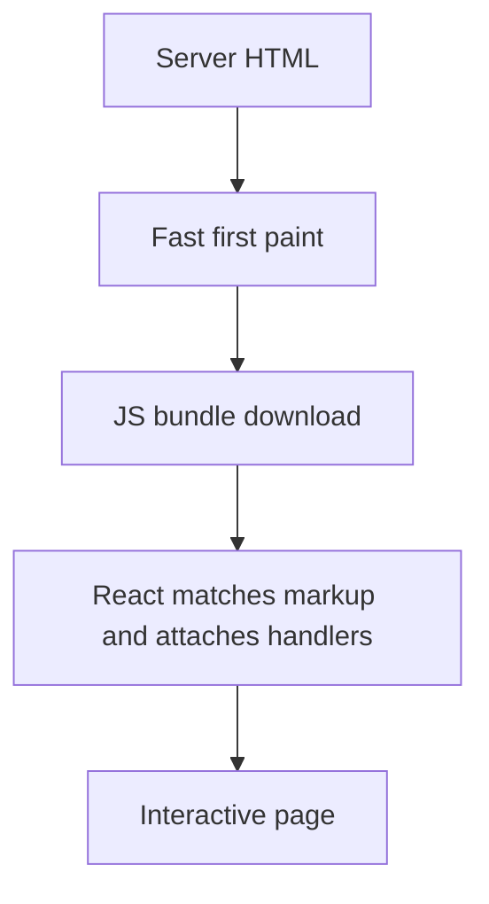

---

### Hydration mismatch

**Purpose** — it is not a feature but a failure where server HTML differs from the first client render.

**How it works / is used** — remove nondeterminism: move Date.now, Math.random, locale, window, and browser-only data into client effects.

**Downsides and limits** — suppressHydrationWarning hides a symptom and rarely fixes the source of divergence.

```tsx
// Bad: server and client render different times.
<span>{new Date().toLocaleTimeString()}</span>

// Good: the nondeterministic value appears after mount.
const [now, setNow] = useState<string | null>(null);
useEffect(() => setNow(new Date().toLocaleTimeString()), []);
```

---

### Layouts

**Purpose** — it preserves shared chrome, navigation, and providers across child routes.

**How it works / is used** — put persistent shell in a layout and route-specific content in a page.

**Downsides and limits** — layout state lives longer than expected, and a global layout should not pull in heavy client dependencies.

```tsx
export default function WorkspaceLayout({ children }: { children: React.ReactNode }) {
  return <>
    <SidebarNav />
    <main>{children}</main>
  </>;
}
```

---

### Route Handlers

**Purpose** — it implements an HTTP API alongside the application in the App Router.

**How it works / is used** — export GET or POST and validate input, authentication, authorization, response shape, and status codes.

**Downsides and limits** — do not turn handlers into the business layer; shared domain code should remain separately testable.

```ts
export async function GET() {
  const projects = await listProjects(await requireUser());
  return Response.json({ projects });
}
```

---

### Proxy (formerly Middleware)

**Purpose** — it performs short request-time logic before a route, such as redirects, rewrites, locale, or a coarse auth gate.

**How it works / is used** — in Next.js 16, use proxy.ts and match only required paths; inspect request or cookie, then return next, rewrite, or redirect.

**Downsides and limits** — it is not for slow data fetching or full session management; endpoints still enforce authorization, and runtime depends on the Next.js version.

```ts
import { NextRequest, NextResponse } from "next/server";

export function proxy(request: NextRequest) {
  if (!request.cookies.get("session")) return NextResponse.redirect(new URL("/login", request.url));
  return NextResponse.next();
}

export const config = { matcher: ["/projects/:path*"] };
```

---

### Streaming

**Purpose** — it sends ready parts of a page earlier instead of waiting for the slowest request.

**How it works / is used** — separate independent areas with Suspense boundaries and show meaningful skeletons.

**Downsides and limits** — poor boundaries cause layout shifts or waterfalls; do not blindly hide critical above-the-fold content.

```tsx
export default function ProjectPage() {
  return <>
    <ProjectHeader />
    <Suspense fallback={<CommentsSkeleton />}>
      <SlowComments /> {/* this part streams in later without blocking the header */}
    </Suspense>
  </>;
}
```

---

### Caching and revalidation

**Purpose** — it reduces repeated work and requests while keeping data acceptably fresh.

**How it works / is used** — explicitly define cache scope, TTL, and invalidation tags or paths after mutations.

**Downsides and limits** — caching is part of correctness: unclear ownership or invalidation creates hard-to-find stale bugs.

```ts
import { revalidatePath } from "next/cache";

await db.project.update({ where: { id }, data: input });
revalidatePath(`/projects/${id}`);
```

---

### Server Actions

**Purpose** — it invokes a server-side mutation from a form with less handwritten API glue.

**How it works / is used** — the action validates input and permissions on the server, performs the mutation, then revalidates affected data.

**Downsides and limits** — it is not a replacement for a public API; security, errors, and progressive enhancement still need design.

```ts
"use server";
export async function renameProject(formData: FormData) {
  await rename(await requireUser(), String(formData.get("id")), String(formData.get("name")));
  revalidatePath("/projects");
}
```

---

### Dynamic imports

**Purpose** — it moves rarely needed code out of the initial bundle to speed page startup.

**How it works / is used** — dynamically load a heavy editor, chart, or browser-only library behind an interaction or route boundary.

**Downsides and limits** — the extra network round trip can hurt a critical path, so provide a fallback and measure it.

```tsx
const VideoTimeline = dynamic(() => import("./VideoTimeline"), {
  loading: () => <TimelineSkeleton />,
  ssr: false,
});
```

---

### Image optimization

**Purpose** — it reduces image bytes and layout shifts, especially in a media product.

**How it works / is used** — provide real dimensions, responsive sizes, a modern format, and priority only for the LCP image.

**Downsides and limits** — wrong sizes can serve oversized files, and dynamic optimization has cache and infrastructure cost.

```tsx
<Image
  src={project.thumbnailUrl}
  alt={project.title}
  width={1280}
  height={720}
  sizes="(max-width: 768px) 100vw, 640px"
  priority
/>
```

---

### Edge Runtime

**Purpose** — it runs short logic closer to users to reduce network latency.

**How it works / is used** — use it for lightweight redirects, personalization hints, or auth checks compatible with Web APIs.

**Downsides and limits** — Node APIs, native modules, and long database calls may be unavailable or a poor fit; in Next.js 16 Proxy uses the Node runtime by default, so Edge must be discussed in the context of the specific version and deployment.

```ts
export const runtime = "edge"; // Web APIs only, no Node modules

export async function GET(request: Request) {
  const country = request.headers.get("x-vercel-ip-country") ?? "US";
  return Response.json({ country });
}
```

---

## JavaScript

---

### Closure

**Purpose** — a function retains its lexical environment and can work with data from an outer scope.

**How it works / is used** — use it for factories, private state, and callbacks; React handlers also close over render values.

**Downsides and limits** — a long-lived closure can retain memory or read stale state.

```ts
function makeCounter() {
  let count = 0;
  return () => ++count;
}
const next = makeCounter();
```

---

### Event loop

**Purpose** — it coordinates synchronous code, task queues, microtasks, and browser rendering.

**How it works / is used** — after the current call stack completes, microtasks drain, then the browser gets a chance to render the next frame.

**Downsides and limits** — a long synchronous task blocks input and paint regardless of async APIs.

```ts
console.log("A");
Promise.resolve().then(() => console.log("microtask"));
setTimeout(() => console.log("task"));
console.log("B"); // A, B, microtask, task
```

---

### Microtasks

**Purpose** — it runs a short continuation of current work before the next task or render.

**How it works / is used** — Promise callbacks and queueMicrotask enter the microtask queue after the stack completes.

**Downsides and limits** — an endless microtask chain starves rendering and other tasks.

```js
setTimeout(() => console.log("task"));
Promise.resolve()
  .then(() => console.log("microtask 1"))
  .then(() => console.log("microtask 2"));
// microtask 1, microtask 2, task — the microtask queue drains fully before the task
```

---

### Macrotasks

---
**Purpose** — it schedules a later unit of work in the task queue.

**How it works / is used** — setTimeout, message events, and I/O callbacks typically create tasks, between which the browser may render.

**Downsides and limits** — a timer is not an exact schedule; a busy main thread delays it.

---

### Promise

**Purpose** — it represents an asynchronous result: pending, fulfilled, or rejected.

**How it works / is used** — attach then/catch/finally or await it and handle errors at the appropriate boundary.

**Downsides and limits** — a Promise is not inherently cancellable, and a missing catch becomes an unhandled rejection.

```js
loadProject(id)
  .then((project) => render(project))
  .catch((error) => showError(error)) // catches reject and throw from earlier in the chain
  .finally(() => setLoading(false));
```

---

### async / await

**Purpose** — it makes sequential Promise code read like synchronous code.

**How it works / is used** — await pauses only its async function; start independent work in parallel with Promise.all.

**Downsides and limits** — sequential awaits without dependency create waterfalls, and Promise.all rejects on the first failure.

```ts
const [project, comments] = await Promise.all([
  getProject(projectId),
  getComments(projectId),
]);
```

---

### AbortController

**Purpose** — it cancels fetch or another supporting operation when its result is no longer needed.

**How it works / is used** — create one controller per request and call abort in effect cleanup or for a newer search query.

**Downsides and limits** — the API must support cancellation; still handle races and distinguish AbortError correctly.

```ts
const controller = new AbortController();
fetch(`/api/search?q=${query}`, { signal: controller.signal });
return () => controller.abort();
```

---

### Hoisting

**Purpose** — it describes bindings being created before a scope executes, not code literally moving upward.

**How it works / is used** — function declarations are available early, var starts as undefined, and let/const have a temporal dead zone.

**Downsides and limits** — relying on hoisting hurts readability, and var creates surprising scope bugs.

```js
console.log(a); // undefined: var is hoisted and initialized to undefined
var a = 1;

console.log(b); // ReferenceError: let is in the temporal dead zone
let b = 2;
```

---

### this

**Purpose** — it provides the receiver of a normal function call.

**How it works / is used** — its value is determined by call site: obj.method(), call/apply/bind, or a constructor; an arrow captures outer this.

**Downsides and limits** — a separately passed method loses its receiver, and an arrow cannot be used as a constructor.

```ts
const player = { title: "Demo", print() { console.log(this.title); } };

const print = player.print; // detached from its receiver
print(); // strict mode: TypeError (this is undefined); sloppy mode: this is globalThis

setTimeout(player.print.bind(player), 0); // "Demo" — receiver fixed by bind
```

---

### Prototype chain

**Purpose** — it implements inheritance and property lookup in JavaScript.

**How it works / is used** — when a property is absent on an object, the engine searches upward through prototypes until null.

**Downsides and limits** — deep or mutable prototypes make reasoning harder; class is syntax over this model.

```js
const base = { greet() { return "hi"; } };
const child = Object.create(base);

child.greet(); // "hi" — not on child, found on the prototype
Object.getPrototypeOf(child) === base; // true
```

---

### Equality: === vs ==

**Purpose** — it compares values either without coercion or with implicit coercion.

**How it works / is used** — use === almost always; use == only when coercion is intentional and tightly scoped, such as a nullish check.

**Downsides and limits** — == has many non-obvious rules, while === still compares objects by reference rather than contents.

```js
0 == "";       // true — implicit type coercion
0 === "";      // false
value == null; // deliberate idiom: true for both null and undefined
```

---

### Shallow copy

**Purpose** — it creates a new top-level container for an immutable update.

**How it works / is used** — spread, Object.assign, or Array.slice copy references to nested objects.

**Downsides and limits** — nested data remains shared and can still be mutated accidentally.

```js
const original = { title: "Demo", meta: { views: 10 } };
const copy = { ...original };

copy.meta.views = 99;
original.meta.views; // 99 — the nested object is still shared
```

---

### Deep copy

**Purpose** — it creates an independent copy of a nested structure when that is genuinely necessary.

**How it works / is used** — structuredClone supports many native types; for domain data prefer targeted immutable updates.

**Downsides and limits** — it costs CPU and memory; JSON stringify breaks Date, Map, undefined, and cyclic references.

```js
const copy = structuredClone(original); // Date, Map, cyclic references — ok

copy.meta.views = 99;
original.meta.views; // 10 — the structure is fully independent
```

---

### Immutability

**Purpose** — it makes change predictable and enables reference comparison, undo, and easier debugging.

**How it works / is used** — return new objects for changed branches and do not mutate state or props.

**Downsides and limits** — copying large structures has a cost; mutable refs are appropriate outside UI state.

```js
const next = {
  ...state,
  scenes: state.scenes.map((scene) =>
    scene.id === id ? { ...scene, title } : scene,
  ),
};
```

---

### Debounce

**Purpose** — it waits for a pause in a burst of events so work does not run on every keystroke.

**How it works / is used** — debounce a search request or autosave and clean up the previous timer.

**Downsides and limits** — it adds deliberate delay and is wrong when regular updates are needed during drag or scroll.

```ts
let timer: ReturnType<typeof setTimeout>;
const searchLater = (query: string) => {
  clearTimeout(timer);
  timer = setTimeout(() => search(query), 250);
};
```

---

### Throttle

**Purpose** — it limits execution frequency during a continuous event stream.

**How it works / is used** — throttle scroll or resize analytics, or use requestAnimationFrame for visual updates.

**Downsides and limits** — the final event may be lost without a trailing call; debouncing is usually better for network search.

```ts
const reportScroll = throttle(() => {
  analytics.track("scrolled", { y: window.scrollY });
}, 500);

window.addEventListener("scroll", reportScroll, { passive: true });
```

---

### Generators and iterators

**Purpose** — it represents a lazy sequence of values without allocating the whole array.

**How it works / is used** — a generator yields items on demand; an iterable implements Symbol.iterator and works with for...of.

**Downsides and limits** — control flow is less familiar, and an exhausted generator cannot be safely reused.

```js
function* ids() {
  let id = 1;
  while (true) yield id++; // values are computed lazily, on demand
}
const seq = ids();
seq.next().value; // 1
seq.next().value; // 2

// Iterator: Symbol.iterator makes the object work with for...of and spread.
const playlist = {
  tracks: ["intro", "demo", "outro"],
  *[Symbol.iterator]() { yield* this.tracks; },
};
for (const track of playlist) console.log(track);
```

---

### Modules

**Purpose** — it isolates scope and declares application dependencies explicitly.

**How it works / is used** — ESM uses static import/export, allowing a bundler to analyze the graph and tree-shake.

**Downsides and limits** — circular dependencies can expose partially initialized bindings, and dynamic import changes loading timing.

```js
// math.js
export const add = (a, b) => a + b;                        // named export
export default function multiply(a, b) { return a * b; }  // default export

// app.js — static import: the bundler sees the graph, tree shaking works.
import multiply, { add } from "./math.js";

// Dynamic import: a separate chunk, loaded at call time.
const { renderChart } = await import("./chart.js");
```

---

### Memory leaks

**Purpose** — it is a diagnostic term: memory remains reachable after the data is no longer needed.

**How it works / is used** — clean up subscriptions, timers, observers, and requests on unmount; inspect heap snapshots.

**Downsides and limits** — memory growth is not always a leak; a cache may be expected, so inspect retainers first.

```ts
useEffect(() => {
  const id = setInterval(poll, 5000);
  window.addEventListener("resize", onResize);
  return () => { // without cleanup the timer and listener outlive unmount
    clearInterval(id);
    window.removeEventListener("resize", onResize);
  };
}, []);
```

---

## TypeScript

---

### any

**Purpose** — it disables type checking, usually as a temporary bridge for untyped legacy code.

**How it works / is used** — avoid it at boundaries; keep data as unknown and narrow it with validation.

**Downsides and limits** — any contaminates expressions and removes the compiler’s main value.

```ts
// Bad: value.name compiles even when value is null.
const value: any = JSON.parse(body);
```

---

### unknown

**Purpose** — it safely accepts a value of unknown shape, especially from network, JSON, or catch.

**How it works / is used** — use a type guard, schema validation, or typeof check before accessing fields.

**Downsides and limits** — it requires explicit narrowing, less convenient than any but safer at runtime.

```ts
const value: unknown = JSON.parse(body);
if (typeof value === "object" && value !== null && "name" in value) {
  console.log(value.name);
}
```

---

### never

**Purpose** — it represents an impossible value or a function that never completes normally.

**How it works / is used** — use assertNever in an exhaustive switch over a closed discriminated union.

**Downsides and limits** — incorrectly declaring never hides a modeling error; the union must really be closed.

```ts
function assertNever(value: never): never { throw new Error(`Unexpected: ${value}`); }
switch (result.status) {
  case "loading": break;
  case "error": break;
  case "success": break;
  default: assertNever(result);
}
```

---

### Type narrowing

**Purpose** — it turns a broad union into a concrete safe type in a code branch.

**How it works / is used** — use typeof, in, instanceof, a discriminant, or a user-defined predicate.

**Downsides and limits** — the check must reflect real runtime data; a type assertion is not validation.

```ts
function format(value: string | Date) {
  return value instanceof Date ? value.toISOString() : value.trim();
}
```

---

### Type guards

**Purpose** — it connects a runtime check with compiler knowledge about a type.

**How it works / is used** — write a small predicate such as value is User and test invalid API-boundary input.

**Downsides and limits** — a guard can falsely promise an object shape; complex schemas are better validated by a library.

```ts
type User = { id: string; name: string };
function isUser(value: unknown): value is User {
  return typeof value === "object" && value !== null && "id" in value && "name" in value;
}
```

---

### Generics

**Purpose** — it expresses a relationship between input and output without losing the concrete type.

**How it works / is used** — parameterize a reusable collection, API helper, or component and constrain T with extends when needed.

**Downsides and limits** — over-abstract generics are hard to read and are unnecessary for one-off code.

```ts
function first<T>(items: readonly T[]): T | undefined {
  return items[0];
}
const project = first([{ id: "p1", name: "Handbook" }]); // object type is preserved
```

---

### keyof

**Purpose** — it obtains the union of an object type’s keys and protects field access.

**How it works / is used** — use K extends keyof T for a generic getter, mapper, or type-safe table column.

**Downsides and limits** — a runtime key still needs validation when it comes from outside.

```ts
function get<T, K extends keyof T>(object: T, key: K): T[K] {
  return object[key];
}
get({ id: "p1", name: "Handbook" }, "name");
```

---

### typeof in type positions

**Purpose** — it derives a type from an existing value without duplicating its declaration.

**How it works / is used** — declare const config as const and derive typeof config for a related function.

**Downsides and limits** — a large inferred literal type sometimes needs intentional widening for a usable API.

```ts
const config = { retries: 3, region: "eu" } as const;
type Config = typeof config;
```

---

### Mapped types

**Purpose** — it builds a new object type by transforming the keys of an existing type.

**How it works / is used** — use it for readonly, optional, or typed form state derived from a domain model.

**Downsides and limits** — complex mapped types make errors harder to read; check built-in utility types first.

```ts
type User = { id: string; name: string; email: string };
type EditableUser = { [K in "name" | "email"]?: User[K] };
```

---

### Conditional types

**Purpose** — it chooses a result type based on the relationship between two types.

**How it works / is used** — useful in reusable library APIs, for example extracting a return type or awaitable result.

**Downsides and limits** — distributive behavior over unions is unintuitive; avoid it for clever type puzzles.

```ts
type ApiResult<T> = T extends Promise<infer Value> ? Value : T;
type Project = ApiResult<Promise<{ id: string }>>;
```

---

### infer

**Purpose** — it extracts part of a type inside a conditional type without naming it beforehand.

**How it works / is used** — use it for an array element type, function return type, or event payload.

**Downsides and limits** — it is more often needed by library authors than application code; complexity must pay for reuse.

```ts
type ElementOf<T> = T extends readonly (infer Item)[] ? Item : never;
type User = ElementOf<readonly [{ id: string }]>;
```

---

### Discriminated unions

**Purpose** — it models finite states with a tag field so invalid combinations become impossible.

**How it works / is used** — a loading, error, or success status determines available fields in a switch.

**Downsides and limits** — every producer must maintain the tag, and open-ended server values need a runtime fallback.

```ts
type Result = { status: "loading" } | { status: "error"; message: string } | { status: "success"; data: User };
if (result.status === "success") console.log(result.data.name);
```

---

### type vs interface

**Purpose** — both describe data shape; interface suits extensible object contracts, while type suits unions and composition.

**How it works / is used** — follow one team style; use interface often for public objects and type for unions.

**Downsides and limits** — it is not an architecture decision, and interface declaration merging can be surprising.

```ts
interface Project { id: string; name: string }
type LoadState = "idle" | "loading" | "error";
```

---

### Utility types

**Purpose** — built-in Partial, Pick, Omit, Record, Required, and Readonly reduce repeated type-level code.

**How it works / is used** — Pick makes a read DTO, Omit removes server-generated fields, and Record describes a map.

**Downsides and limits** — do not derive every DTO mechanically from a domain type when validation and ownership differ.

```ts
type User = { id: string; name: string; passwordHash: string };
type PublicUser = Omit<User, "passwordHash">;
const labels: Record<"draft" | "published", string> = { draft: "Draft", published: "Published" };
```

---

### readonly

**Purpose** — it forbids mutation through a particular typed reference.

**How it works / is used** — mark input models and public collections readonly when the consumer does not own the data.

**Downsides and limits** — it is compile-time protection, not deep runtime immutability.

```ts
function renderTags(tags: readonly string[]) {
  // tags.push("new"); // compile error
  return tags.join(", ");
}
```

---

### as const

**Purpose** — it preserves literal values and readonly structure instead of broad string or number types.

**How it works / is used** — apply it to static config, action names, or tuples from which a union is derived.

**Downsides and limits** — it can make a type too narrow for mutation and is not a runtime freeze.

```ts
const statuses = ["draft", "published"] as const;
type Status = (typeof statuses)[number];
```

---

### satisfies

**Purpose** — it checks conformance to a contract while preserving the expression’s precise inferred type.

**How it works / is used** — use it for a config map that needs both complete key checking and literal values.

**Downsides and limits** — it does not validate JSON at runtime and cannot replace schema validation.

```ts
type Route = "/" | "/projects";
const labels = { "/": "Home", "/projects": "Projects" } satisfies Record<Route, string>;
```

---

### Enums

**Purpose** — it defines a named set of constants, though a string-literal union is often enough.

**How it works / is used** — in web code I usually prefer an as-const object plus a union to control runtime output.

**Downsides and limits** — numeric enums create surprising reverse mapping, and const enums have build-tool caveats.

```ts
const Role = { Admin: "admin", Member: "member" } as const;
type Role = (typeof Role)[keyof typeof Role];
```

---

### Declaration files

**Purpose** — a .d.ts file describes a JavaScript module’s types without generating runtime code.

**How it works / is used** — add a declaration for an untyped dependency or global integration and keep it narrowly scoped.

**Downsides and limits** — a declaration can drift from the runtime API; look for official types or update the dependency first.

```ts
// analytics.d.ts
declare module "legacy-analytics" {
  export function track(event: string, properties?: Record<string, unknown>): void;
}
```

---

## Browser & Performance

---

### Critical rendering path

**Purpose** — it explains the path from HTML, CSS, and JavaScript to pixels and helps locate slow first render.

**How it works / is used** — the browser builds DOM and CSSOM, then layout, paint, and compositing; measure a waterfall and performance trace.

**Downsides and limits** — optimize the bottleneck, not every resource indiscriminately.

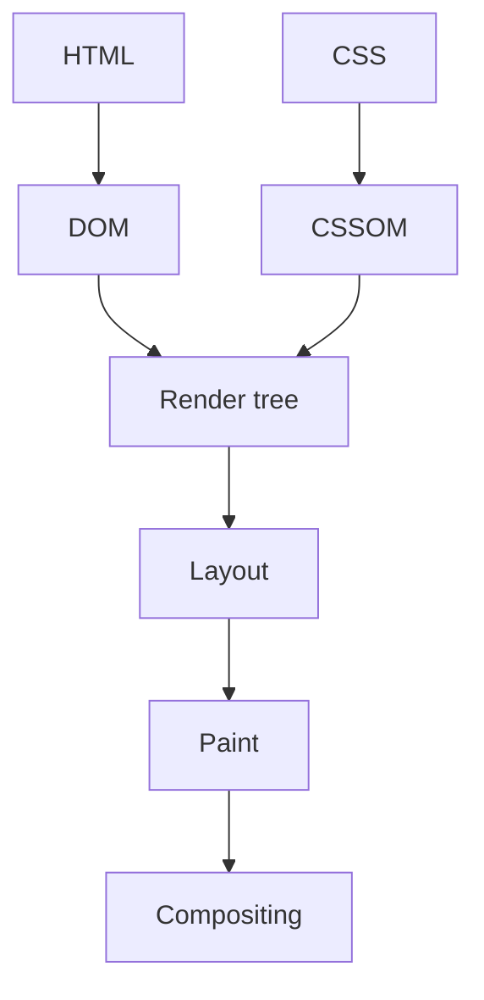

---

### Reflow / layout

**Purpose** — layout computes element geometry after size, text, or CSS-rule changes.

**How it works / is used** — batch DOM reads before writes and avoid layout thrashing in loops or scroll handlers.

**Downsides and limits** — layout is sometimes unavoidable; premature micro-optimization is worse than clear CSS.

```js
// Bad: reads and writes interleave — layout on every iteration.
items.forEach((el) => { el.style.height = el.offsetHeight + 10 + "px"; });

// Better: all reads first, then all writes.
const heights = items.map((el) => el.offsetHeight);
items.forEach((el, i) => { el.style.height = heights[i] + 10 + "px"; });
```

---

### Repaint

---
**Purpose** — it redraws pixels without changing layout, for example after a color change.

**How it works / is used** — animate transform and opacity when possible and inspect paint flashing in DevTools.

**Downsides and limits** — even without layout, a large paint area can be expensive.

---

### Compositing

---
**Purpose** — it combines prepainted layers into a final frame, often on the GPU.

**How it works / is used** — choose composited animations and inspect layers instead of blindly applying translateZ hacks.

**Downsides and limits** — too many layers consume GPU memory and can hurt performance.

---

### Core Web Vitals

---
**Purpose** — it provides user-centric metrics for loading, visual stability, and responsiveness.

**How it works / is used** — inspect field data and lab traces, then connect LCP, CLS, and INP to a user journey.

**Downsides and limits** — a score does not replace product judgment, and synthetic results may differ from real devices.

---

### LCP — Largest Contentful Paint

---
**Purpose** — it measures when the largest visible content element has rendered.

**How it works / is used** — optimize LCP image or text through response time, critical CSS, image sizing, preload, and render blocking.

**Downsides and limits** — the largest element varies by viewport, and preloading everything is counterproductive.

---

### CLS — Cumulative Layout Shift

---
**Purpose** — it measures unexpected layout shifts that frustrate users during loading.

**How it works / is used** — reserve space with width/height or aspect-ratio and avoid inserting late content above existing UI.

**Downsides and limits** — user-initiated shifts are not necessarily bad CLS, so inspect the actual scenario.

---

### INP — Interaction to Next Paint

---
**Purpose** — it measures delay between a user interaction and the next visual feedback.

**How it works / is used** — split long tasks, reduce handler work, and show immediate feedback for a long mutation.

**Downsides and limits** — optimizing one click does not guarantee a good worst-case interaction.

---

### requestAnimationFrame

**Purpose** — it schedules a visual update before the next browser paint.

**How it works / is used** — coalesce mouse or scroll updates into one rAF callback and change transform or opacity.

**Downsides and limits** — the callback still runs on the main thread and is not a scheduler for network work.

```ts
const indicator = document.querySelector<HTMLElement>("#drag-indicator");
let frameId: number | null = null;
let latestX = 0;

window.addEventListener("pointermove", (event) => {
  latestX = event.clientX;
  if (frameId !== null) return;

  frameId = requestAnimationFrame(() => {
    if (indicator) indicator.style.transform = `translateX(${latestX}px)`;
    frameId = null;
  });
});
```

---

### IntersectionObserver

**Purpose** — it observes an element intersecting a viewport or container without continuous scroll polling.

**How it works / is used** — use it for lazy images, an infinite-scroll sentinel, or impression analytics and disconnect the observer.

**Downsides and limits** — threshold and rootMargin need tuning; it does not replace sound pagination and accessibility.

```ts
const observer = new IntersectionObserver(([entry]) => {
  if (entry.isIntersecting) loadNextPage();
});
observer.observe(sentinel);
```

---

### ResizeObserver

**Purpose** — it reacts to size changes of a specific element rather than the whole window.

**How it works / is used** — measure a responsive chart or container-driven layout and update state carefully.

**Downsides and limits** — a state update can create a resize loop, and cleanup is required on unmount.

```ts
const observer = new ResizeObserver(([entry]) => {
  chart.resize(entry.contentRect.width, entry.contentRect.height);
});

observer.observe(chartContainer);
// On component removal: observer.disconnect().
```

---

### Web Workers

**Purpose** — it moves CPU-heavy computation off the main thread to keep the interface responsive.

**How it works / is used** — send a serializable message to a worker for parsing, image processing, or a large search index.

**Downsides and limits** — a worker has no DOM and has serialization and startup overhead; it will not speed up network or simple code.

```ts
const worker = new Worker(new URL("./search-worker.ts", import.meta.url));
worker.postMessage({ type: "index", documents });
worker.onmessage = ({ data }) => setResults(data);
```

---

### Web Vitals field monitoring

**Purpose** — it collects performance from real devices, networks, and user journeys after release.

**How it works / is used** — send sampled, anonymized metrics with route and device context to observability and compare percentiles.

**Downsides and limits** — telemetry needs privacy review and sampling; averages hide slow-user pain.

```ts
import { onCLS, onINP, onLCP } from "web-vitals";

const report = (metric: Metric) =>
  navigator.sendBeacon("/vitals", JSON.stringify({ ...metric, route }));

onLCP(report); onCLS(report); onINP(report);
```

---

### Code splitting

**Purpose** — it splits JavaScript into chunks loaded by route or on demand.

**How it works / is used** — use route-level splitting by default and feature-level splitting when measured initial-bundle benefit exceeds extra requests.

**Downsides and limits** — too many small chunks create waterfalls, so boundaries should reflect the user journey.

```ts
exportButton.addEventListener("click", async () => {
  const { openExportDialog } = await import("./export-dialog"); // separate chunk
  openExportDialog();
});
```

---

### Tree shaking

**Purpose** — it removes unreachable ESM code from a production bundle.

**How it works / is used** — prefer named ESM imports and side-effect-free modules, and analyze the bundle when adding a heavy dependency.

**Downsides and limits** — CommonJS, side effects, and barrel imports can prevent elimination.

```ts
import { debounce } from "es-toolkit"; // named ESM import — unused code is dropped
import lodash from "lodash";           // antipattern: the whole package lands in the bundle
```

---

### Bundle analysis

---
**Purpose** — it reveals the real composition and size of client JavaScript.

**How it works / is used** — run an analyzer before and after a change and look for duplicate packages, heavy editor/media libraries, and client leaks.

**Downsides and limits** — size is not runtime cost; confirm findings with a performance trace and actual UX.

---

### Virtualization

**Purpose** — it renders only the visible slice of a large list, reducing DOM and render cost.

**How it works / is used** — use windowing with overscan for thousands of rows while preserving keyboard navigation and ARIA semantics.

**Downsides and limits** — variable heights, scroll restoration, and accessibility are harder; it is unnecessary for a short list.

```tsx
const parentRef = useRef<HTMLDivElement>(null);
const rows = useVirtualizer({
  count: projects.length,
  getScrollElement: () => parentRef.current,
  estimateSize: () => 40,
  overscan: 5,
});

return <div ref={parentRef} style={{ height: 480, overflow: "auto" }}>
  <div style={{ height: rows.getTotalSize(), position: "relative" }}>
    {rows.getVirtualItems().map((row) => (
      <div key={row.key} style={{ position: "absolute", transform: `translateY(${row.start}px)`, width: "100%" }}>
        <ProjectRow project={projects[row.index]} />
      </div>
    ))}
  </div>
</div>;
```

---

### Caching in the browser

**Purpose** — it reuses data and assets to reduce latency and bandwidth.

**How it works / is used** — distinguish HTTP cache, service-worker cache, and in-memory query cache; define ownership and invalidation.

**Downsides and limits** — stale or offline data affects UX and correctness; do not cache personal secrets unsafely.

```http
# Hashed asset: cache for a year, never revalidate.
Cache-Control: public, max-age=31536000, immutable

# HTML document: always revalidate with the server.
Cache-Control: no-cache
```

---

### localStorage

**Purpose** — it persists small non-sensitive origin data across browser sessions, such as a theme preference or draft key.

**How it works / is used** — access it only in browser context, version the stored shape, and handle parse and quota errors.

**Downsides and limits** — any JavaScript on the origin can read it, making it exposed to XSS; its synchronous API blocks the main thread and it is unsuitable for large or secret data.

```ts
const stored = localStorage.getItem("editor-preferences");
const preferences = stored ? JSON.parse(stored) : { snapToGrid: true };
localStorage.setItem("editor-preferences", JSON.stringify(preferences));
```

---

### sessionStorage

**Purpose** — it persists small non-sensitive data only for one browser tab or session, such as wizard progress.

**How it works / is used** — use the same origin API but expect per-tab storage and cleanup when that tab closes.

**Downsides and limits** — it is also readable by JavaScript during XSS and unsuitable for auth secrets; it is not shared state across tabs.

```ts
const draftKey = `project-draft:${projectId}`;
sessionStorage.setItem(draftKey, JSON.stringify({ title, script }));

const draft = JSON.parse(sessionStorage.getItem(draftKey) ?? "null");
```

---

### Accessibility

**Purpose** — it makes UI usable with keyboard, screen reader, zoom, and different user abilities.

**How it works / is used** — start with semantic HTML, visible focus, labels, correct tab order, and keyboard-only testing.

**Downsides and limits** — ARIA does not repair bad HTML, and custom widgets need particularly careful interaction semantics.

```tsx
<button type="button" aria-expanded={isOpen} aria-controls="filters">
  Filters
</button>
<section id="filters" hidden={!isOpen} aria-label="Project filters">
  <label>Status <select value={status} onChange={onStatusChange}><option>All</option></select></label>
</section>
```

---

### Progressive enhancement

---
**Purpose** — it provides a working baseline without JavaScript and enhances it when browser capabilities exist.

**How it works / is used** — forms and navigation remain semantic; client enhancement adds optimistic UX or richer controls.

**Downsides and limits** — not every rich editor realistically works without JS, and the approach requires server-contract discipline.

---

## HTTP, Backend & Security

---

### REST — Representational State Transfer

**Purpose** — it defines a clear HTTP contract around resources, actions, and standard status codes.

**How it works / is used** — model nouns and operations, version only when necessary, and document request, response, and error shapes.

**Downsides and limits** — REST does not mean forcing every workflow into CRUD; complex flows may need explicit commands.

```http
GET    /api/projects        # list
POST   /api/projects        # create
GET    /api/projects/42     # single resource
PATCH  /api/projects/42     # partial update
DELETE /api/projects/42     # delete
```

---

### GraphQL

**Purpose** — it gives the client a typed graph schema and lets it request exactly needed fields, useful for complex composed screens.

**How it works / is used** — design schema around the domain, limit query depth and cost, authorize every resolver, and batch data access against N+1.

**Downsides and limits** — it does not remove backend complexity; caching, observability, schema evolution, and authorization are harder than in a simple REST endpoint.

```graphql
query ProjectCard($id: ID!) {
  project(id: $id) {
    title
    owner { name }
    comments(first: 5) { text }
  }
}
```

---

### HTTP methods

**Purpose** — it conveys standardized operation semantics: GET reads, POST processes a resource representation, PUT creates or replaces a representation at a known URI, PATCH partially modifies, and DELETE removes.

**How it works / is used** — choose a method by contract and provide matching cache and idempotency expectations.

**Downsides and limits** — HTTP defines GET, PUT, and DELETE as idempotent, while POST and PATCH are not guaranteed to be; server implementation must honor that contract.

```http
GET    /api/projects/42   # read: cacheable, idempotent
PUT    /api/projects/42   # full replacement of the representation: idempotent
PATCH  /api/projects/42   # partial update: not guaranteed idempotent
DELETE /api/projects/42   # idempotent: retry does not change the outcome
POST   /api/projects      # processing/creation: retry may create a duplicate
```

---

### ETag and conditional requests

**Purpose** — it reduces transfer of unchanged representations and supports optimistic concurrency through a resource version.

**How it works / is used** — the server returns an ETag; the client sends If-None-Match for cache validation or If-Match for conditional update.

**Downsides and limits** — an ETag must change when the representation meaningfully changes; shared caches and weak versus strong validators need clear policy.

```http
GET /api/projects/42
If-None-Match: "project-42-v7"

HTTP/1.1 304 Not Modified
```

---

### Idempotency

**Purpose** — it makes a retried request safe by making it equivalent to one successful execution.

**How it works / is used** — for critical POST requests, accept an idempotency key, store the result by key, and return it on retry.

**Downsides and limits** — a key has TTL and scope and does not replace sound concurrency or transaction design.

```http
POST /api/payments
Idempotency-Key: 7d1e2a4b-9f31-4c8e-b2aa-1f0d6c9e5a77

HTTP/1.1 200 OK
# A retry with the same key returns the stored result, not a second charge.
```

---

### Status codes

---
**Purpose** — it gives a client a machine-readable outcome for an HTTP operation.

**How it works / is used** — use 2xx for success, 400 validation, 401 unauthenticated, 403 forbidden, 404 absent, 409 conflict, and 5xx server failure.

**Downsides and limits** — status alone is insufficient without a stable error body, and domain validation should not become a 500.

---

### Pagination

---
**Purpose** — it bounds response size and gives users a predictable way to browse large collections.

**How it works / is used** — return items plus a next cursor or metadata; preserve filters and show loading and error state in UI.

**Downsides and limits** — pagination needs deterministic sorting or pages can skip or duplicate rows.

---

### Cursor pagination

**Purpose** — it pages through a large or changing sorted collection reliably.

**How it works / is used** — a cursor encodes the last sort key and a unique tie-breaker, such as createdAt plus id.

**Downsides and limits** — it cannot easily jump to page 42 and the cursor must be validated or protected.

```sql
SELECT * FROM projects
WHERE (created_at, id) < ($1, $2)
ORDER BY created_at DESC, id DESC
LIMIT 25;
```

---

### Offset pagination

**Purpose** — it simply implements page and limit for small, relatively stable tables.

**How it works / is used** — SQL uses ORDER BY, LIMIT, and OFFSET, while UI shows numbered pages.

**Downsides and limits** — deep offsets are slow and concurrent inserts cause duplicates or holes.

```sql
SELECT * FROM projects
ORDER BY created_at DESC, id DESC
LIMIT 25 OFFSET 50; -- page 3; a deep OFFSET scans every skipped row
```

---

### Authentication

**Purpose** — it establishes who is making a request.

**How it works / is used** — validate a credential, session, or token on the server, create a principal, and pass it to the use case.

**Downsides and limits** — an authenticated user does not necessarily have permission to act; authorization is separate.

```ts
const token = request.headers.get("authorization")?.replace("Bearer ", "");
const principal = await verifyAccessToken(token);
if (!principal) return new Response("Unauthorized", { status: 401 });
```

---

### Authorization

**Purpose** — it checks whether a particular principal can perform an action on a particular resource.

**How it works / is used** — policy checks tenant, ownership, role, and domain rules in the backend, not just by hiding a button.

**Downsides and limits** — a UI check helps UX but does not secure an endpoint, and roles alone often lack resource context.

```ts
const project = await projects.get(projectId);
if (project.tenantId !== user.tenantId || !can(user, "project:edit", project)) {
  return new Response("Forbidden", { status: 403 });
}
```

---

### Sessions and cookies

**Purpose** — it stores server-side login state through an opaque cookie identifier.

**How it works / is used** — set Secure, HttpOnly, SameSite, and reasonable expiry; the server stores or signs session state.

**Downsides and limits** — cookies travel automatically with requests, so CSRF protection and correct domain scope are needed.

```http
HTTP/1.1 200 OK
Set-Cookie: session=opaque-id-7f3a; Secure; HttpOnly; SameSite=Lax; Max-Age=1209600; Path=/
```

---

### JWT — JSON Web Token

**Purpose** — it carries self-contained claims between parties, often without a server-side lookup on every request.

**How it works / is used** — allow only the expected profile: for the common JWS, validate signature, issuer, audience, expiry, and minimal claims; never put secrets in a readable payload.

**Downsides and limits** — a JWT can be a signed JWS, encrypted JWE, or nested token; the common signed JWS does not hide its payload, is hard to revoke, and easily becomes too long-lived.

```txt
header.payload.signature
eyJhbGciOiJSUzI1NiJ9.eyJzdWIiOiI0MiIsImF1ZCI6ImFwaSIsImV4cCI6MTc1MjU4NDAwMH0.MEUCIQ…
payload is signed but not encrypted: base64url is readable by anyone
```

---

### Access token

---
**Purpose** — it is a short-lived credential that proves to an API that a caller is authenticated and carries certain claims or scopes.

**How it works / is used** — the API validates the token on each request and authorizes the specific action; choose short expiry and minimal scopes.

**Downsides and limits** — token theft grants access until expiry; client-side storage must fit the threat model, and a token does not replace resource-level authorization.

---

### Refresh token

**Purpose** — it lets a system issue a new access token without a full login after a short-lived access token expires.

**How it works / is used** — store it more protectively and longer, rotate it on use, detect reuse, and allow server-side revocation of its session family.

**Downsides and limits** — it is a high-value credential, so leakage is more dangerous than for an access token; do not expose it to browser JavaScript without an explicit threat model.

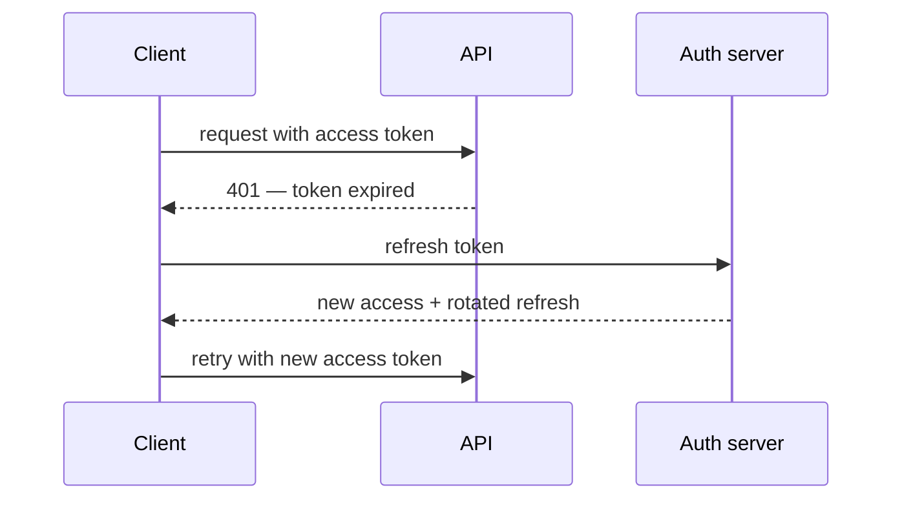

---

### CSRF — Cross-Site Request Forgery

**Purpose** — it is an attack where another site makes a browser send an authenticated cookie request.

**How it works / is used** — use SameSite cookies, a CSRF token, or origin and referrer validation for state-changing requests.

**Downsides and limits** — CORS is not CSRF protection, and token storage plus cross-site flows need a precise threat model.

```http
# The cookie is not sent from another site + the server verifies the header token.
Set-Cookie: session=opaque-id; Secure; HttpOnly; SameSite=Lax

POST /api/projects/42/delete
X-CSRF-Token: f3a91c0d…
```

---

### XSS — Cross-Site Scripting

**Purpose** — it is the risk of executing untrusted script in the application’s origin.

**How it works / is used** — escape output by default, sanitize allowed HTML, use CSP, and avoid unsafe DOM sinks.

**Downsides and limits** — hand-written regex sanitization is unreliable; rich text needs an audited sanitizer.

```js
// Dangerous: the user string executes as HTML.
element.innerHTML = comment.text;

// Safe: text stays text.
element.textContent = comment.text;
```

---

### CORS — Cross-Origin Resource Sharing

**Purpose** — it is a browser policy controlling which cross-origin JavaScript may read a response.

**How it works / is used** — the server allows specific origins, methods, and headers; credentials require an exact origin, not wildcard.

**Downsides and limits** — CORS does not protect a server from direct clients and cannot replace authentication or authorization.

```http
Access-Control-Allow-Origin: https://app.example.com
Access-Control-Allow-Credentials: true
```

---

### CORS preflight

**Purpose** — the browser checks in advance whether a server permits a cross-origin request with non-simple method or headers.

**How it works / is used** — the browser sends credential-free OPTIONS; the server returns allowed origin, methods, headers, and when needed credentials, then the browser decides whether to send the actual request.

**Downsides and limits** — preflight adds latency and cache policy; it does not protect an API from non-browser clients or replace auth.

```http
OPTIONS /api/projects
Access-Control-Request-Method: POST
Access-Control-Request-Headers: content-type

HTTP/1.1 204 No Content
Access-Control-Allow-Origin: https://app.example.com
Access-Control-Allow-Methods: POST
Access-Control-Allow-Headers: Content-Type
```

---

### CSP — Content Security Policy

**Purpose** — it restricts script, style, image, and frame sources to reduce XSS impact.

**How it works / is used** — start in report-only mode, use nonces or hashes for scripts, and tighten directives gradually.

**Downsides and limits** — policy needs maintenance and can break third-party integrations; it is defense in depth, not a substitute for escaping.

```http
Content-Security-Policy: default-src 'self';
  script-src 'self' 'nonce-r4nd0m';
  img-src 'self' https://cdn.example.com;
  frame-ancestors 'none'
```

---

### Rate limiting

**Purpose** — it protects an endpoint from abuse, brute force, and accidental traffic spikes.

**How it works / is used** — choose a key by user, API key, or IP, define window or bucket, and separate login, write, and expensive limits.

**Downsides and limits** — IP is unreliable behind NAT, distributed limits need a shared store, and legitimate traffic must not be blocked unfairly.

```ts
const key = `login:${request.headers.get("x-forwarded-for")}`;
const allowed = await limiter.consume(key, { limit: 5, windowMs: 60_000 });

if (!allowed) return new Response("Too Many Requests", { status: 429 });
```

---

### Webhooks

**Purpose** — it delivers an event from an external system without constant polling.

**How it works / is used** — validate signature and timestamp, acknowledge quickly, enqueue work, and deduplicate event IDs.

**Downsides and limits** — delivery is commonly at-least-once and unordered, requiring retry, idempotency, and observability.

```ts
if (!verifySignature(rawBody, request.headers.get("x-signature"))) {
  return new Response("Invalid signature", { status: 401 });
}
await queue.enqueue({ eventId: payload.id, type: payload.type });
return new Response(null, { status: 202 });
```

---

### File uploads

**Purpose** — it accepts user media or documents safely and at scale.

**How it works / is used** — issue a short-lived signed upload URL, validate size and type server-side, scan, and process asynchronously.

**Downsides and limits** — client MIME cannot be trusted, and direct upload requires strict bucket permissions and lifecycle rules.

```ts
const { uploadUrl, fileKey } = await api.createUpload({ name: file.name, size: file.size });
await fetch(uploadUrl, { method: "PUT", body: file, headers: { "Content-Type": file.type } });
await api.completeUpload({ fileKey });
```

---

### Observability

---
**Purpose** — it helps understand production behavior through logs, metrics, and traces.

**How it works / is used** — add correlation IDs, structured logs, latency and error metrics, and tracing on critical request paths.

**Downsides and limits** — telemetry costs money and can leak PII; signals should be actionable rather than noisy.

---

## SQL & Databases

---

### Relational model

---
**Purpose** — it stores related entities with explicit constraints and supports reliable transactions.

**How it works / is used** — model tables, primary and foreign keys, and constraints around domain invariants, not UI screens.

**Downsides and limits** — join-heavy schemas require understanding access patterns, and not every workload suits a relational database.

---

### Normalization

**Purpose** — it reduces duplication and update anomalies by separating independent facts.

**How it works / is used** — keep user, organization, and membership separately, linked by keys and constraints.

**Downsides and limits** — over-normalization complicates hot reads; deliberate denormalization is acceptable with ownership and a repair plan.

```sql
-- Before: a repeating group in one column.
-- orders(id, customer_name, products = 'camera, tripod')

-- After: each fact is stored once.
CREATE TABLE orders (
  id          bigint PRIMARY KEY,
  customer_id bigint REFERENCES customers (id)
);
CREATE TABLE order_items (
  order_id   bigint REFERENCES orders (id),
  product_id bigint REFERENCES products (id)
);
```

---

### Primary and foreign keys

**Purpose** — a primary key identifies a row uniquely, while a foreign key preserves referential integrity.

**How it works / is used** — choose a stable ID, add FKs, and set an explicit on-delete policy by business meaning.

**Downsides and limits** — cascade delete can remove data unexpectedly, while no FK moves integrity into fragile application code.

```sql
CREATE TABLE comments (
  id         bigint GENERATED ALWAYS AS IDENTITY PRIMARY KEY,
  project_id bigint NOT NULL REFERENCES projects (id) ON DELETE CASCADE,
  body       text NOT NULL
);
```

---

### Index

**Purpose** — it speeds up lookup, sorting, or joins at the cost of storage and slower writes.

**How it works / is used** — build an index for actual WHERE, JOIN, and ORDER BY patterns, then check EXPLAIN and selectivity.

**Downsides and limits** — extra indexes slow inserts and updates, and no index rescues a query returning too much data.

```sql
CREATE INDEX projects_workspace_created_at_idx
ON projects (workspace_id, created_at DESC);
```

---

### Composite index

**Purpose** — it covers a query filtering or sorting by several columns.

**How it works / is used** — choose column order from equality predicates, then range or sort, and verify the real query plan.

**Downsides and limits** — an index on (a,b) does not equally help a query on b alone; do not guess order without EXPLAIN.

```sql
CREATE INDEX projects_workspace_updated_idx
  ON projects (workspace_id, updated_at DESC);

-- Speeds up: WHERE workspace_id = $1 ORDER BY updated_at DESC
```

---

### Query plan / EXPLAIN

**Purpose** — EXPLAIN shows the optimizer’s estimated plan; EXPLAIN ANALYZE executes the query and shows actual rows and timing.

**How it works / is used** — start with EXPLAIN, then in a safe environment compare estimated and actual rows with EXPLAIN ANALYZE and look for sequential scans, bad join order, and missing indexes.

**Downsides and limits** — ANALYZE really executes the statement, so it is risky for destructive statements; plans depend on data distribution and statistics, and a tiny local database can hide a production issue.

```sql
EXPLAIN ANALYZE
SELECT id, title
FROM projects
WHERE workspace_id = $1
ORDER BY updated_at DESC
LIMIT 20;
```

---

### JOIN

**Purpose** — it combines rows from tables through a relationship.

**How it works / is used** — INNER JOIN keeps matches, LEFT JOIN preserves the left side; select only required columns.

**Downsides and limits** — a one-to-many join duplicates parent rows, so cardinality and pagination matter.

```sql
SELECT p.id, p.name, u.name AS owner_name
FROM projects p
LEFT JOIN users u ON u.id = p.owner_id;
```

---

### N+1 queries

**Purpose** — it is an anti-pattern where one list query is followed by a query per row.

**How it works / is used** — find it in traces or logs, then use a join, batched IN query, or ORM eager loading.

**Downsides and limits** — a giant join can also bloat a response; fix the actual access pattern, not merely query count.

```sql
-- Instead of querying the author for every project:
SELECT p.id, p.title, u.name AS author_name
FROM projects p
JOIN users u ON u.id = p.author_id
WHERE p.workspace_id = $1;
```

---

### Transactions

**Purpose** — it guarantees that related writes commit together or roll back together.

**How it works / is used** — wrap a balance change, membership change, or status transition in a short database transaction.

**Downsides and limits** — do not hold a transaction during a network call or user input; long transactions create contention.

```sql
BEGIN;
UPDATE accounts SET balance = balance - 10 WHERE id = $1;
UPDATE accounts SET balance = balance + 10 WHERE id = $2;
COMMIT;
```

---

### ACID — Atomicity, Consistency, Isolation, Durability

**Purpose** — it describes atomicity, consistency, isolation, and durability in a transactional database.

**How it works / is used** — rely on atomic commit and constraints and choose isolation level for concurrency-anomaly risk.

**Downsides and limits** — ACID does not make an entire distributed workflow atomic or eliminate application bugs.

```sql
BEGIN;
UPDATE accounts SET balance = balance - 100 WHERE id = 1;
UPDATE accounts SET balance = balance + 100 WHERE id = 2;
COMMIT; -- atomic: both changes or neither, even on failure
```

---

### Isolation levels

**Purpose** — it defines which concurrent changes a transaction can observe.

**How it works / is used** — start with the database default, then strengthen isolation or locking only for a proven race.

**Downsides and limits** — stricter isolation lowers concurrency and can cause serialization failures that require retry.

```sql
BEGIN ISOLATION LEVEL REPEATABLE READ;
SELECT balance FROM accounts WHERE id = 1;
-- A repeated SELECT returns the same value: a concurrent COMMIT is not visible here.
COMMIT;
```

---

### Optimistic locking

**Purpose** — it prevents silent lost updates without holding a long database lock.

**How it works / is used** — a row stores version or updatedAt; UPDATE includes the old version in WHERE and checks affected rows.

**Downsides and limits** — conflicts need understandable UX, and frequent collisions may favor pessimistic locking.

```sql
UPDATE documents
SET body = $1, version = version + 1
WHERE id = $2 AND version = $3;
```

---

### Pessimistic locking

**Purpose** — it reserves a row in a transaction when concurrent change is unacceptable.

**How it works / is used** — take SELECT FOR UPDATE briefly before a write and release it at commit or rollback.

**Downsides and limits** — it creates waits and deadlocks and is a poor fit for long user-driven flows.

```sql
BEGIN;
SELECT id, seats_left FROM workshops WHERE id = $1 FOR UPDATE;
UPDATE workshops SET seats_left = seats_left - 1 WHERE id = $1 AND seats_left > 0;
COMMIT;
```

---

### Deadlocks

**Purpose** — it is a failure where transactions wait cyclically for each other’s locks.

**How it works / is used** — acquire resources in one order, keep transactions short, and retry a safely aborted transaction.

**Downsides and limits** — retry does not fix a logical contention problem; metrics and root-cause analysis are needed.

```sql
-- T1: UPDATE accounts ... WHERE id = 1;  then waits for the lock on id = 2
-- T2: UPDATE accounts ... WHERE id = 2;  then waits for the lock on id = 1
-- Cycle: the database aborts one transaction.
-- Fix: acquire rows in one consistent order (for example, by id).
```

---

### Unique constraints

**Purpose** — it makes a duplicate business identity impossible even under concurrent requests.

**How it works / is used** — add unique on email or tenant-plus-slug and translate violations into a clear domain error.

**Downsides and limits** — a pre-check such as “email exists?” cannot replace the constraint, and nullable semantics vary by database.

```sql
ALTER TABLE users ADD CONSTRAINT users_email_unique UNIQUE (email);
-- A race between two concurrent signups yields error 23505, not a duplicate.
```

---

### Migrations

**Purpose** — it versions safe production-schema change alongside code.

**How it works / is used** — make additive changes, backfill, use dual read or write if needed, then remove separately after deployment.

**Downsides and limits** — destructive migration or a long lock is dangerous; test migration on realistic data size.

```sql
-- Step 1: safe additive schema change.
ALTER TABLE projects ADD COLUMN slug text;
-- Step 2: backfill; new code writes both fields.
-- Step 3: add NOT NULL/UNIQUE only after rollout.
```

---

### Soft delete

**Purpose** — it hides a record from normal UI while preserving audit and recovery options.

**How it works / is used** — add deletedAt and a centralized default scope, with a separate purge rule for GDPR where required.

**Downsides and limits** — every query must filter deleted rows, and unique indexes plus restoration become harder.

```sql
ALTER TABLE projects ADD COLUMN deleted_at timestamptz;

-- Uniqueness among live rows only:
CREATE UNIQUE INDEX projects_slug_alive_idx
  ON projects (slug) WHERE deleted_at IS NULL;
```

---

### JSON columns

**Purpose** — it stores a flexible attribute set when the schema is genuinely variable.

**How it works / is used** — keep core relational fields in columns, validate JSON on write, and index only needed paths.

**Downsides and limits** — JSON is not a reason to avoid model design; queries, constraints, and migrations become harder.

```sql
SELECT id FROM projects
WHERE settings @> '{"autosave": true}'; -- JSONB containment

CREATE INDEX projects_settings_idx ON projects USING gin (settings);
```

---

## Testing & DevOps

---

### Unit tests

**Purpose** — it quickly verifies an isolated business rule or pure function.

**How it works / is used** — test observable behavior with deterministic inputs, especially boundaries and unhappy paths.

**Downsides and limits** — unit tests do not prove integration, schema correctness, or a real browser flow.

```ts
test("rejects an expired token", () => {
  expect(validateToken(expiredToken)).toEqual({ ok: false, reason: "expired" });
});
```

---

### Integration tests

**Purpose** — it verifies modules, an HTTP layer, a database, or a queue boundary working together.

**How it works / is used** — run a real or ephemeral dependency, or a contract-faithful fake, and assert the full outcome.

**Downsides and limits** — it is slower and more brittle than unit tests, and test data plus isolation need discipline.

```ts
test("POST /projects persists a project", async () => {
  const response = await app.fetch(new Request("http://app/projects", { method: "POST", body: '{"name":"Demo"}' }));
  expect(response.status).toBe(201);
});
```

---

### End-to-end tests

**Purpose** — it verifies a valuable user journey through a real browser and deployment-like system.

**How it works / is used** — cover login, critical create or edit flow, and visual assertions where risk justifies the cost.

**Downsides and limits** — it is slow and flaky, so it cannot replace unit or integration tests and needs stable selectors.

```ts
test("user can create a project", async ({ page }) => {
  await page.goto("/projects");
  await page.getByRole("button", { name: "Create project" }).click();
  await page.getByLabel("Name").fill("Demo");
  await page.getByRole("button", { name: "Save" }).click();
  await expect(page.getByText("Demo")).toBeVisible();
});
```

---

### Test pyramid

**Purpose** — it balances fast cheap tests with fewer high-value integration and E2E checks.

**How it works / is used** — test most logic with units, boundaries with integration, and a few golden journeys end to end.

**Downsides and limits** — it is a heuristic, not a quota; a UI-heavy product may need a different shape.

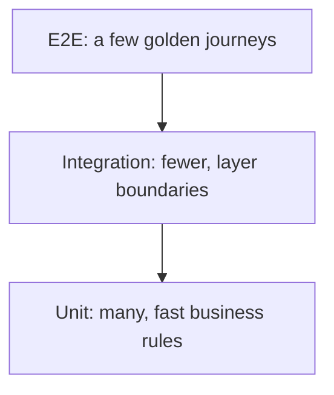

---

### Mock vs fake vs stub

**Purpose** — it isolates a dependency differently: a stub returns answers, a fake is a working simplification, and a mock verifies interaction.

**How it works / is used** — prefer fakes or stubs for outcome tests and use mocks narrowly for important side effects.

**Downsides and limits** — tests coupled to internal calls break during safe refactoring.

```ts
const stub = { getRate: () => 0.2 };      // canned answer
const fake = new InMemoryProjectRepo();   // working simplified implementation
const mock = vi.fn();                     // verifies interaction

await chargeUser(user, { sendReceipt: mock });
expect(mock).toHaveBeenCalledWith(user.email);
```

---

### Contract testing

**Purpose** — it verifies that producer and consumer agree on an API or message contract.

**How it works / is used** — define request and response schema and run compatibility checks in CI, especially across independently deployed services.

**Downsides and limits** — it does not replace end-to-end behavior and needs contract ownership and versioning.

```ts
expect(response).toMatchObject({
  status: 200,
  body: { id: expect.any(String), title: expect.any(String) },
});
```

---

### TDD — Test-Driven Development

---
**Purpose** — it helps state behavior and a small design seam before implementing the minimum solution.

**How it works / is used** — a red test states an acceptance criterion, green implementation makes it pass, and refactor restores clarity.

**Downsides and limits** — do not turn TDD into ritual for CSS or exploratory prototypes; the test must be meaningful.

---

### Test flakiness

---
**Purpose** — it is a nondeterministic failure that destroys trust in CI.

**How it works / is used** — remove real time, randomness, shared state, arbitrary sleeps, and network dependency; retry is temporary containment only.

**Downsides and limits** — ignoring a flaky test is dangerous because it hides regressions and slows the team.

---

### CI — Continuous Integration

**Purpose** — it automatically verifies every change before merge.

**How it works / is used** — run typecheck, tests, lint, build, and fast security checks in a clean reproducible environment.

**Downsides and limits** — teams bypass slow or noisy pipelines, so local and CI gates must agree.

```yaml
- run: bun install --frozen-lockfile
- run: bun run lint
- run: bun test
```

---

### CD — Continuous Delivery / Continuous Deployment

**Purpose** — it reliably delivers a verified artifact to an environment through a repeatable process.

**How it works / is used** — build once, promote the artifact, run migrations and health checks, and retain deployment audit trail.

**Downsides and limits** — automatic deployment does not remove the need for feature flags, monitoring, and rollback plan.

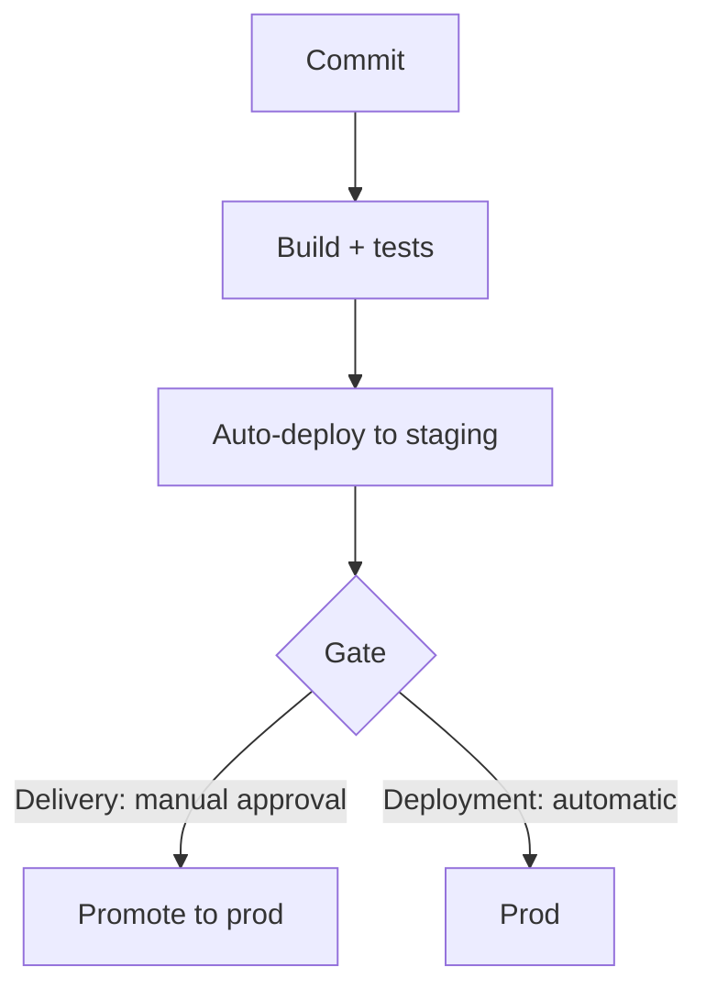

---

### Docker

**Purpose** — it packages an application and dependencies into a reproducible image.

**How it works / is used** — use multi-stage builds for a small runtime image, pin the base image, and run as non-root.

**Downsides and limits** — a container does not replace configuration, security, or observability; a large image hurts cold start and supply-chain risk.

```dockerfile
FROM node:22-alpine AS build
WORKDIR /app
COPY . .
RUN npm ci && npm run build
FROM node:22-alpine
COPY --from=build /app/dist ./dist
CMD ["node", "dist/server.js"]
```

---

### Environment configuration

**Purpose** — it separates deployment-specific values and secrets from application code.

**How it works / is used** — validate an env schema at startup, keep secrets in a secret manager, and document required variables.

**Downsides and limits** — env sprawl does not replace typed config, and a secret must not be logged or sent to the client bundle.

```ts
const config = {
  databaseUrl: process.env.DATABASE_URL,
  port: Number(process.env.PORT ?? 3000),
};

if (!config.databaseUrl) throw new Error("DATABASE_URL is required");
```

---

### Feature flags

**Purpose** — it decouples deployment from release, enabling gradual feature exposure and safe rollback.

**How it works / is used** — a flag has owner, audience, expiry, and metric; roll out by tenant, user, or percentage.

**Downsides and limits** — stale flags create combinatorial complexity, and security-sensitive access cannot rely on a frontend flag alone.

```ts
if (flags.isEnabled("new-timeline", { tenantId, userId })) {
  return <NewTimeline />;
}
return <LegacyTimeline />;
```

---

### Blue-green deployment

**Purpose** — it switches traffic between two equivalent versions for fast rollback.

**How it works / is used** — the new environment passes smoke and health checks, then the load balancer moves traffic.

**Downsides and limits** — it temporarily doubles infrastructure and requires backward-compatible database schema.

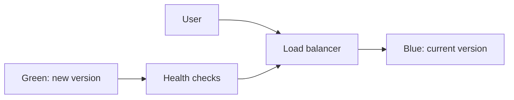

---

### Canary deployment

**Purpose** — it limits blast radius by exposing a new version to a small share of users first.

**How it works / is used** — gradually increase traffic when error, latency, and business metrics remain healthy.

**Downsides and limits** — it needs strong observability and enough traffic for confidence; data-migration issues can still affect everyone.

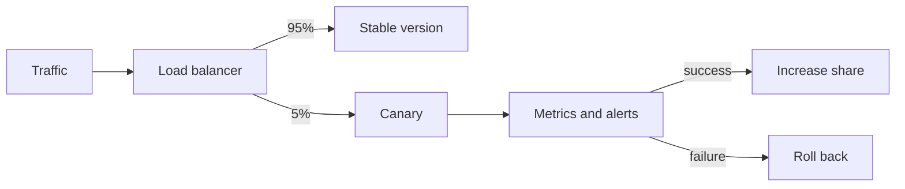

---

### Rollback

**Purpose** — it quickly returns a service to a known working version after a harmful release.

**How it works / is used** — define triggers in advance, keep one-click artifact rollback, and use compatible schema and feature flags.

**Downsides and limits** — code rollback does not undo irreversible data mutation, so critical writes need a repair strategy.

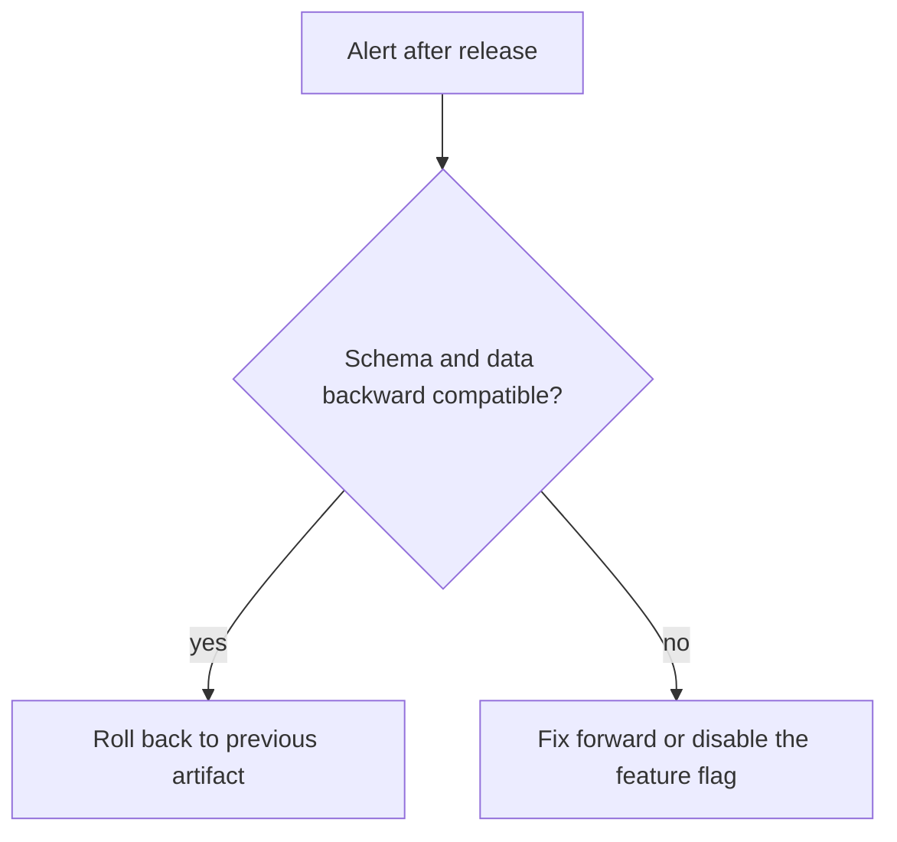

---

### SLI, SLO, SLA — Service Level Indicator, Objective, Agreement

---
**Purpose** — SLI measures service behavior, SLO sets a target, and SLA is an external promise with consequences.

**How it works / is used** — choose a user-facing indicator, such as successful video-publish latency, and use an error budget for release decisions.

**Downsides and limits** — a metric without user value drives wrong optimization, and SLA should not be promised without operational capacity.

---

### Incident response

---
**Purpose** — it structures response to a production incident to reduce impact and recovery time.

**How it works / is used** — assign an incident lead, record a timeline, stabilize service, communicate, and write a blameless postmortem.

**Downsides and limits** — a postmortem without follow-up owners changes nothing, and an incident is not the time to find blame.

---

## Architecture & System Design

---

### Monolith

---
**Purpose** — it puts product functionality in one deployable, simplifying local development and transactions.

**How it works / is used** — keep clear modules and internal boundaries in one repo or process, extracting a service only for proven pressure.

**Downsides and limits** — without modularity coupling and deployment blast radius grow; one runtime does not mean one giant file.

---

### Microservices

**Purpose** — it enables independent deployment, scaling, and ownership for genuinely independent bounded contexts.

**How it works / is used** — extract a service after a clear domain boundary, API ownership, and team operational capability exist.

**Downsides and limits** — it adds network, distributed-data, observability, and on-call complexity; it is not the default starting architecture.

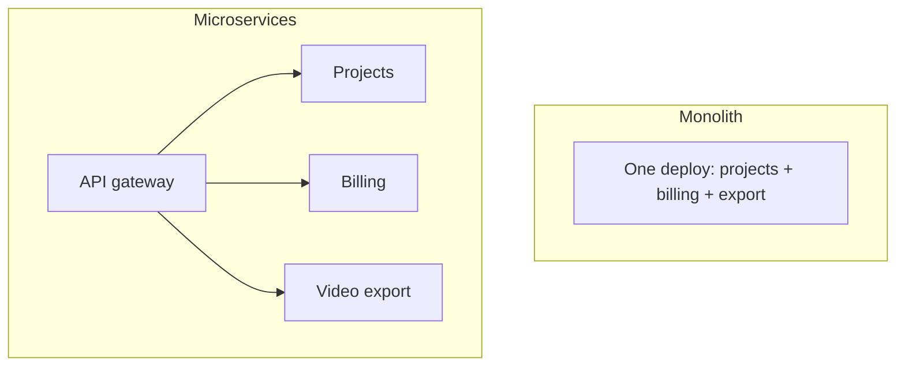

---

### Modular monolith

---
**Purpose** — it combines simple deployment with domain modules and enforced internal boundaries.

**How it works / is used** — modules communicate through explicit interfaces or events and do not import each other’s private persistence details.

**Downsides and limits** — boundaries need discipline and tooling, while a shared database still allows architectural bypass.

---

### Bounded context

**Purpose** — it defines where a domain term and model have one precise meaning.

**How it works / is used** — separate content authoring, rendering, and billing with explicit translated contracts between them.

**Downsides and limits** — do not split mechanically by tables or org chart; a boundary should reflect language and change patterns.

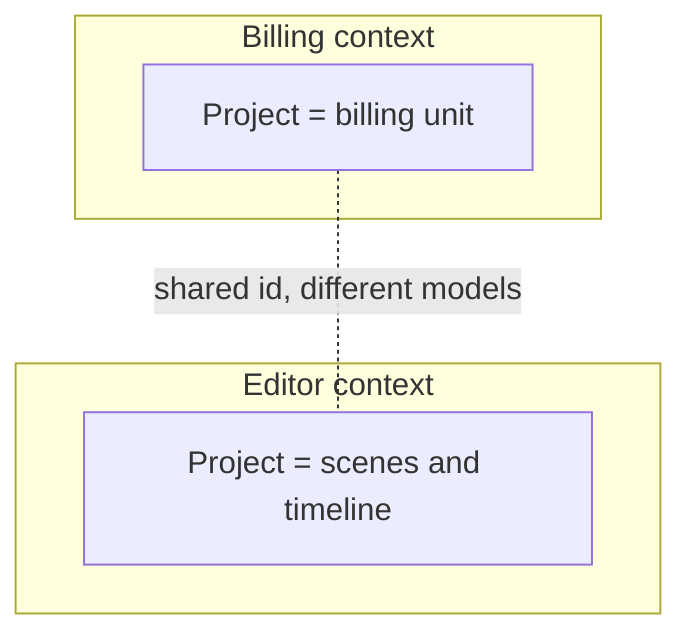

---

### Clean architecture

**Purpose** — it keeps domain and use-case logic independent from framework, database, and transport.

**How it works / is used** — handlers and adapters translate input, while an application service applies business rules through ports.

**Downsides and limits** — extra layers for simple CRUD slow delivery; abstraction should match volatility.

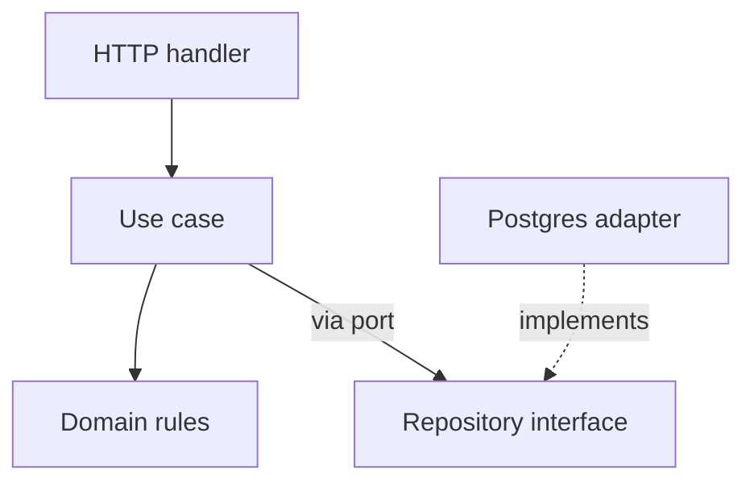

---

### Hexagonal architecture

**Purpose** — it isolates a domain through ports and adapters for HTTP, DB, queues, and external APIs.

**How it works / is used** — a use case depends on an interface and a concrete adapter is wired at the composition root.

**Downsides and limits** — not every helper deserves a port, and too many interfaces hide a simple flow.

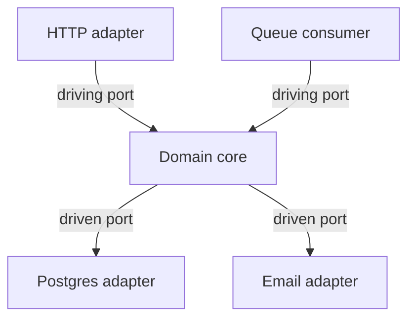

---

### CQRS — Command Query Responsibility Segregation

**Purpose** — it separates command and query models or paths when their requirements differ greatly.

**How it works / is used** — the write model protects invariants while a read projection is optimized for a specific screen or query.

**Downsides and limits** — it complicates consistency and operations; ordinary CRUD often needs only a normal read model.

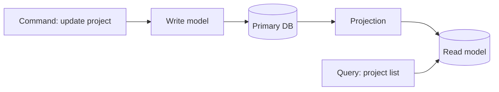

---

### Event sourcing

**Purpose** — it stores an immutable sequence of domain events as the source of state and audit history.

**How it works / is used** — an aggregate is rebuilt from events, projections make read models, and event schemas are versioned.

**Downsides and limits** — replay, evolution, debugging, and eventual consistency are costly; an audit log alone does not require event sourcing.

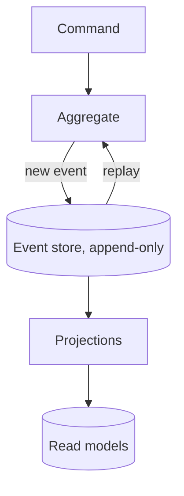

---

### Event-driven architecture

**Purpose** — it loosely couples producers and asynchronous consumers for background workflows.

**How it works / is used** — a producer publishes a named fact, consumers process it idempotently, and lag and failure are monitored.

**Downsides and limits** — tracing and ordering are harder, and an event must not be treated as synchronous RPC with another name.

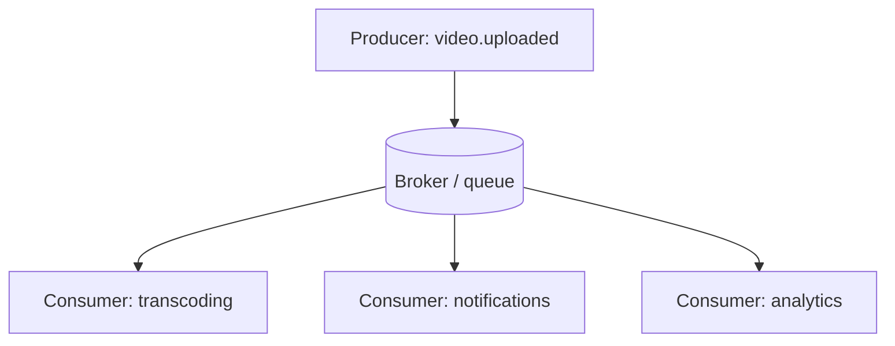

---

### WebSocket

**Purpose** — it maintains a bidirectional persistent connection between client and server for presence, collaboration, live status, or low-latency interaction.

**How it works / is used** — establish an authenticated connection, define message schema and versioning, heartbeat, reconnect and backoff, and server-side fan-out through pub/sub across instances.

**Downsides and limits** — connection lifecycle, scaling, and authorization are more complex than HTTP; do not use WebSocket when infrequent updates are simpler with polling or SSE.

```ts
const socket = new WebSocket("wss://api.example.com/live");
socket.addEventListener("message", ({ data }) => updateProject(JSON.parse(data)));
```

---

### SSE — Server-Sent Events

**Purpose** — it delivers a server-to-client stream of updates over ordinary HTTP, such as video-generation progress or notifications.

**How it works / is used** — the browser opens EventSource, the server sends named events and IDs, and the client reconnects and can provide the last event ID for continuation.

**Downsides and limits** — the channel is one-way and text-based; client-to-server commands still use normal HTTP, and connection limits or proxy buffering must be verified.

```ts
const events = new EventSource("/api/jobs/42/events");
events.addEventListener("progress", (event) => setProgress(JSON.parse(event.data)));
```

---

### Message queue

**Purpose** — it buffers slow or retryable work such as video rendering, email, or document processing.

**How it works / is used** — API saves a job, enqueues a message, and a worker takes work with retry, visibility timeout, and dead-letter policy.

**Downsides and limits** — queues are usually at-least-once, so handlers must be idempotent and observable.

```ts
await queue.enqueue({ type: "render-video", jobId });
queue.consume("render-video", async ({ jobId }) => await renderVideo(jobId));
```

---

### Idempotent consumer

**Purpose** — it safely processes a duplicate message or webhook without repeating a side effect.

**How it works / is used** — store processed event IDs or make a write naturally unique or conditional inside a transaction.

**Downsides and limits** — a dedup store also needs retention and concurrency safety; do not rely on the broker alone.

```sql
INSERT INTO processed_events (event_id) VALUES ($1)
ON CONFLICT DO NOTHING;
-- Run the side effect only if a new row was inserted.
```

---

### Outbox pattern

**Purpose** — it prevents losing an event between a database commit and broker publish.

**How it works / is used** — write the business change and outbox row in one transaction; a relay publishes the row and marks it delivered.

**Downsides and limits** — it adds polling, relay, and cleanup, and consumers still must be idempotent.

```sql
BEGIN;
INSERT INTO videos (id, status) VALUES ($1, 'queued');
INSERT INTO outbox (topic, payload) VALUES ('video.queued', json_build_object('id', $1));
COMMIT;
```

---

### Cache-aside

**Purpose** — it lowers read latency and load while keeping the database as source of truth.

**How it works / is used** — reads try cache, load DB on miss, and populate TTL; mutations invalidate or update the key.

**Downsides and limits** — stale cache and stampede need design; do not cache without an explicit freshness requirement.

```ts
let project = await cache.get(`project:${id}`);
if (!project) {
  project = await db.projects.find(id);
  await cache.set(`project:${id}`, project, { ttl: 60 });
}
```

---

### Distributed lock

**Purpose** — it coordinates single execution of a scheduled or critical job across instances.

**How it works / is used** — use a lease with TTL and owner token, while making downstream writes safe under duplicate execution.

**Downsides and limits** — a lock can expire mid-work; it is not exactly-once magic and needs a failure model.

```ts
const token = crypto.randomUUID();
const lock = await redis.set(`render:${videoId}`, token, { NX: true, PX: 30_000 });
if (!lock) return;
try {
  await renderVideo(videoId);
} finally {
  // Atomic compare-and-delete: never release a lease acquired by another worker.
  await redis.eval(
    'if redis.call("get", KEYS[1]) == ARGV[1] then return redis.call("del", KEYS[1]) end',
    { keys: [`render:${videoId}`], arguments: [token] },
  );
}
```

---

### Load balancing

**Purpose** — it distributes requests across healthy instances for availability and horizontal scale.

**How it works / is used** — a load balancer performs health checks and routing, sometimes sticky sessions; keep the app as stateless as possible.

**Downsides and limits** — session affinity weakens balance and failover, while shared dependencies often become the real bottleneck.

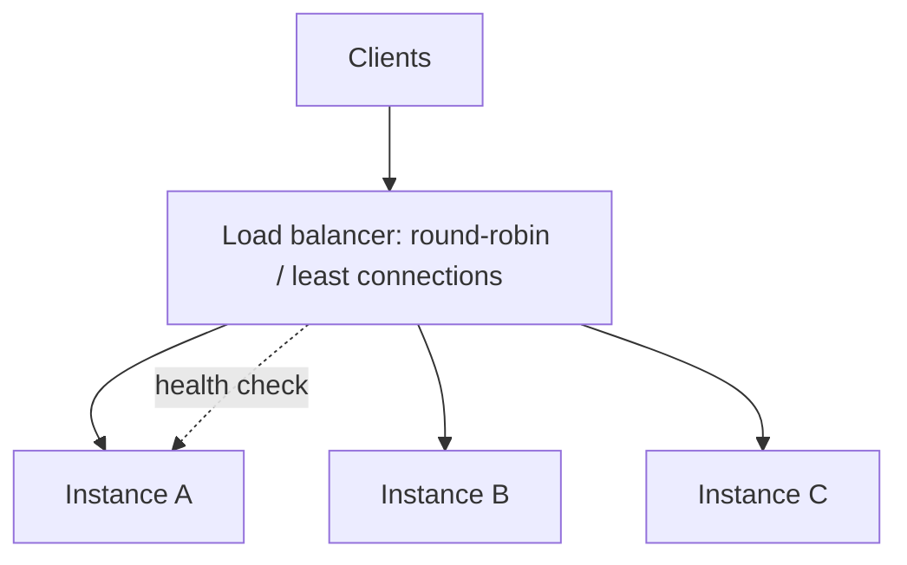

---

### Backpressure

**Purpose** — it prevents collapse when a producer creates work faster than a consumer can process it.

**How it works / is used** — limit concurrency or queue size, return a retryable response or slow the producer, and monitor lag.

**Downsides and limits** — dropping or limiting work is a product decision; an infinite queue only delays failure.

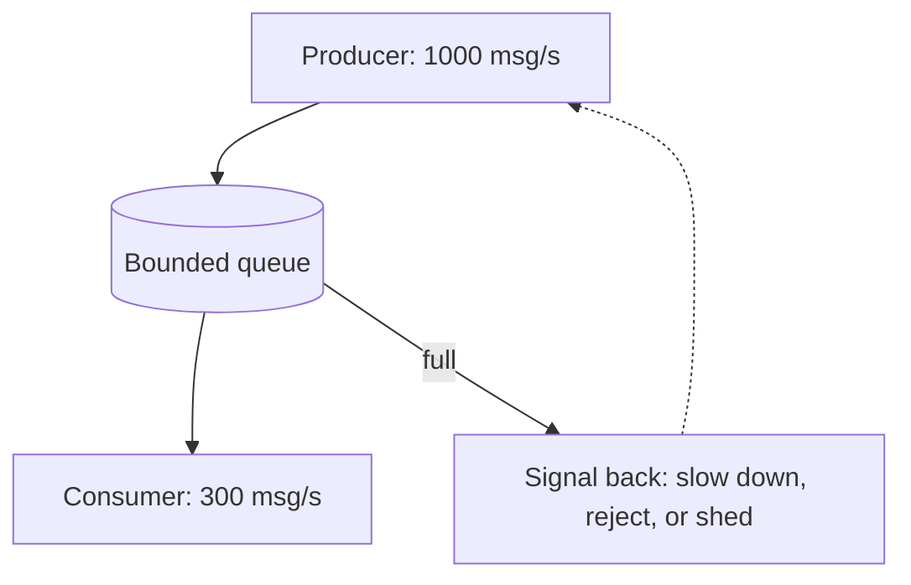

---

### Rate limiting vs backpressure

---
**Purpose** — rate limiting protects a policy or abuse boundary, while backpressure protects downstream capacity.

**How it works / is used** — apply API limits to callers and concurrency or queue limits to service or worker capacity.

**Downsides and limits** — one mechanism does not replace the other, and limits without user messaging look like random failure.

---

### System-design interview framing

---
**Purpose** — it turns an ambiguous prompt into a reasoned engineering design.

**How it works / is used** — clarify users, core flow, scale, latency, consistency, failures, and non-goals, then start with the simplest viable design.

**Downsides and limits** — do not prematurely draw Kafka or microservices, but do not silently make risky assumptions either.

---

## AI, LLM & Product Engineering

---

### LLM — Large Language Model

---
**Purpose** — it generates or transforms text or structured output from a prompt and supplied context.

**How it works / is used** — treat the model as a probabilistic component: constrain the task and provide relevant context, schema, and evaluation.

**Downsides and limits** — output can be wrong, variable, and expensive; the model is not a source of truth.

---

### Prompt engineering

---
**Purpose** — it makes a model task clearer, more reproducible, and more testable.

**How it works / is used** — specify role and task, constraints, input delimiters, desired format, and few-shot examples only when proven useful.

**Downsides and limits** — a long prompt raises latency and cost and cannot replace retrieval, validation, or product design.

---

### System prompt

---
**Purpose** — it sets durable model-behavior rules and product guardrails.

**How it works / is used** — separate system instructions from user content, version them, and evaluate changes on a representative eval set.

**Downsides and limits** — a system prompt is not a security boundary against malicious input; tools need least privilege and output validation.

---

### Tokens and context window

**Purpose** — tokens determine billing and latency, while the context window limits input and output the model can consider per request.

**How it works / is used** — budget instructions, retrieved evidence, and response; chunk documents by meaning rather than arbitrary limits.

**Downsides and limits** — large context does not guarantee attention to the right fact and can worsen cost or quality.

```txt
A 200k-token window — input and output share one budget:
  system prompt        1k
  chat history        12k
  RAG context          8k
  question            0.2k
  output reserve       8k   ← without a reserve the answer gets truncated
Does not fit → summarize the history instead of silently dropping the tail.
```

---

### Embeddings

**Purpose** — it turns content into a vector for semantic similarity, search, or clustering.

**How it works / is used** — embed chunks and queries with one model family, store metadata and filter fields, and reindex when the model changes.

**Downsides and limits** — similarity does not prove factual relevance; multilingual and domain quality must be measured on real queries.

```ts
const [a, b] = await embed(["how to trim a video", "clip cutting tool"]);
cosineSimilarity(a, b); // ~0.8 — semantically close with no shared words
```

---

### Vector database

**Purpose** — it stores embeddings and rapidly finds approximate nearest neighbors with metadata filters.

**How it works / is used** — index chunks with source, version, and permissions metadata, run top-k search, and apply tenant filters before response.

**Downsides and limits** — it does not replace a source database or access control; index freshness, deletes, and cost need ownership.

```ts
const matches = await vectorIndex.search({
  vector: await embed(question),
  limit: 8,
  filter: { tenantId, permission: "read" },
});
```

---

### RAG — Retrieval-Augmented Generation

**Purpose** — it adds retrieved, authorized, and fresh knowledge to a prompt before generation.

**How it works / is used** — query, retrieve, rerank or filter, assemble cited context, then generate with source links.

**Downsides and limits** — strong models cannot rescue bad retrieval, and RAG reduces but does not eliminate hallucinations.

**Mini-example** — for a policy question, retrieve current policy chunks rather than asking the model to remember.

```ts
const matches = await vectorSearch.embedAndFind(question, { tenantId, limit: 8 });
const context = matches.map(({ text, sourceUrl }) => ({ text, sourceUrl }));
const answer = await llm.generate({ question, context });
```

---

### Reranking

---
**Purpose** — it improves the order of initial retrieval results before sending them to the model.

**How it works / is used** — retrieve a broad cheap top-k with vector search, then use a reranker for small high-precision context.

**Downsides and limits** — it adds latency and cost; poor chunks or filters remain a poor foundation.

---

### Hallucination

---
**Purpose** — it is a failure mode where a model confidently asserts an unsupported or fabricated fact.

**How it works / is used** — constrain answers to supplied sources, require citations, validate structured fields, and provide an abstain path.

**Downsides and limits** — a prompt warning not to hallucinate is insufficient; high-stakes output needs human review or deterministic verification.

---

### Structured output

**Purpose** — it turns a model response into a predictable object usable in a product workflow.

**How it works / is used** — define a JSON schema or function tool, validate server-side, and retry or repair malformed output a bounded number of times.

**Downsides and limits** — schema validates shape, not truth; a complex schema raises failure rate and prompt cost.

```ts
const answer = await llm.generate({
  responseFormat: {
    type: "json_schema",
    schema: { type: "object", required: ["summary", "risks"] },
  },
});

const result = SummarySchema.parse(answer);
```

---

### Tool calling

**Purpose** — it lets a model request an action or data through a strictly described application tool.

**How it works / is used** — the model selects a tool and arguments, the backend validates permissions and arguments, executes, then returns a result.

**Downsides and limits** — the model must never receive direct database or production access, and tool output can also contain prompt injection.

```ts
const tools = [{ name: "get_project", parameters: { type: "object", properties: { id: { type: "string" } } } }];
if (call.name === "get_project") return getProjectForUser(userId, call.arguments.id);
```

---

### Prompt injection

**Purpose** — it is an attack or failure where untrusted content tries to override instructions or obtain data or tool actions.

**How it works / is used** — label untrusted content as data, limit tool permissions, validate operations, and never expose secrets to the model.

**Downsides and limits** — delimiters alone are insufficient; treat external documents, web pages, and user text as hostile inputs.

```ts
const tool = tools[call.name];
if (!tool || !canUseTool(user, tool) || !tool.schema.safeParse(call.arguments).success) {
  throw new Error("Rejected tool call");
}
```

---

### Evaluation (evals)

**Purpose** — it measures whether an LLM feature actually solves its task before and after a prompt or model change.

**How it works / is used** — collect representative examples, rubric or expected facts, automated checks, and human calibration; track quality, latency, and cost.

**Downsides and limits** — a small “nice” eval set is easy to overfit, so production feedback is still needed.

```ts
for (const example of evalSet) {
  const answer = await generate(example.input);
  expect(score(answer, example.expected)).toBeGreaterThanOrEqual(0.9);
}
```

---

### AI — Artificial Intelligence: latency and cost

---
**Purpose** — it makes an LLM feature economically and interactively viable.

**How it works / is used** — choose the smallest capable model, reduce context and output, cache safe results, run long generation asynchronously, and show progress.

**Downsides and limits** — a cheaper model can increase quality or support cost; do not cache personal or fresh content without policy.

---

### Human-in-the-loop

---
**Purpose** — it keeps a human as final decision-maker where the cost of an AI error is high.

**How it works / is used** — the model proposes a draft or score with evidence, a person approves, edits, or rejects, and feedback improves evals.

**Downsides and limits** — manual review creates a queue and latency; choose risky decision points rather than reviewing everything.

---

### Product discovery

---
**Purpose** — it validates which user problem is worth solving before large-scale implementation.

**How it works / is used** — define target user, job to be done, current workaround, hypothesis, and smallest experiment with a success signal.

**Downsides and limits** — interviews are not the same as behavior, and discovery must not become endless delivery delay.

---

### Product metrics

---
**Purpose** — it shows whether a feature creates user or business value rather than merely technical output.

**How it works / is used** — connect input, activation, success, and guardrail metrics to a specific journey and segment by cohort or tenant.

**Downsides and limits** — vanity metrics can rise without value, and metrics need privacy and ethics review.

---

### A/B testing

---
**Purpose** — it causally compares feature or product-decision variants on randomly assigned users.

**How it works / is used** — define hypothesis, primary metric, guardrails, sample size, and assignment unit before analysis.

**Downsides and limits** — poor randomization, peeking, and multiple comparisons create false conclusions, and not every change needs an experiment.

---

### Analytics events

**Purpose** — it records user actions and funnel steps for product analysis and debugging.

**How it works / is used** — an event has stable name, schema, timestamp, actor and context, plus documented ownership; send only necessary data.

**Downsides and limits** — PII and duplicate events distort analytics, so a tracking plan needs versioning and privacy controls.

```ts
track("project_exported", {
  projectId,
  format: "mp4",
  durationSec: 42,
  plan: user.plan, // no PII: identifiers instead of email
});
```

---

### Optimistic UI

**Purpose** — it provides immediate feedback by showing expected mutation results before the network response.

**How it works / is used** — update local cache predictably, retain previous state, and roll back on error; the server remains source of truth.

**Downsides and limits** — it is a poor fit for high-conflict or irreversible actions, and error plus reconciliation UX must be explicit.

```ts
const previous = queryClient.getQueryData(["projects"]);
queryClient.setQueryData(["projects"], addProjectOptimistically(input));
try { await api.createProject(input); }
catch { queryClient.setQueryData(["projects"], previous); }
```

---

### Design systems

---
**Purpose** — it creates a reusable language of components, tokens, and accessibility patterns for speed and consistency.

**How it works / is used** — start with shared primitives and documented usage, maintain versioning, visual regression, and design-engineering collaboration.

**Downsides and limits** — do not build one universal component for every case; premature systemization slows product learning.

---

## Fast system-design practice prompts

Before the interview, talk through each scenario out loud for 10–15 minutes: requirements → API/data model → happy path → failure/retry → scale/observability → trade-offs.

---

### 1. Создать AI-видео из текста

**In English:** I would start with POST /projects/:id/renders and an idempotency key. One transaction creates a render job and outbox event; a worker consumes it, accesses authorized input assets, runs generation and rendering stages, and saves the result to object storage. The database keeps a state machine (queued → running → completed/failed/cancelled), while the UI receives status through polling or SSE. Retry only transient failures, make cancellation idempotent, and check it between stages. I would begin with a modular monolith plus workers and separately scale CPU/GPU rendering only when queue pressure proves the need.

---

### 2. Совместное редактирование учебного сценария

**In English:** I would first clarify whether true simultaneous text editing is required. For autosave without real-time collaboration, a revision number and optimistic locking are enough: the client sends its base revision and the server returns 409 Conflict for a stale version. Presence and live cursors travel over WebSocket as ephemeral data. If users must edit the same rich-text field concurrently without conflicts, I would choose CRDT or OT, store snapshots plus append-only operations, and check permissions on every connection and write.

---

### 3. Загрузка 5 GB видео

**In English:** The browser should not proxy 5 GB through the application server. The API authorizes the upload and issues short-lived signed multipart URLs; the browser uploads parts directly to storage, supports resume, and shows local progress. After complete, the server verifies ownership, size, and type, queues scanning and transcoding, and marks the asset usable only afterward. Include quota, expiry for incomplete uploads, byte-level content validation, malware scanning, and lifecycle policy.

---

### 4. Поиск по проектам и сценариям

**In English:** I would start with Postgres full-text search and structured filters rather than a separate search cluster. The API accepts query, filters, and cursor, then returns results with deterministic sort (rank, updated_at, id); authorization and tenant filters apply before returning results. The UI debounces query input, cancels stale requests, and uses cursor pagination. I would add vector retrieval only if keyword and full-text search fail to cover semantic intent; its results still pass metadata and permission filters.

---

### 5. Analytics для learning content

**In English:** I would first define events and metrics, for example lesson_started, scene_completed, and assessment_submitted, rather than vague “engagement.” The client sends a versioned, PII-minimized event with event ID and timestamp; the ingestion API validates schema and stores it in a durable queue or storage. An asynchronous pipeline deduplicates, handles late events, and builds dashboard aggregates. Retention follows privacy and legal requirements, and metric definitions live beside the dashboard.

---

### 6. Notification system

**In English:** A domain mutation writes notification intent and an outbox event in one transaction. A worker applies user preferences, a dedupe key, and channel policy, then creates a delivery record and sends email or in-app notification through a provider. Provider webhooks update delivery state idempotently; transient failures receive exponential backoff and dead-letter visibility. Apply unsubscribe and quiet hours before send. The in-app inbox lives in the database, while SSE or WebSocket only accelerates UI updates and is not the source of truth.

---

## Final interview reminders
