# Senior Fullstack Engineer Interview Handbook

<p class="handbook-version" data-version="v1.5.1">Версія <code>v1.5.1</code></p>

---

Практичний конспект для формату **tech roulette** та подальшого system-design інтерв'ю. Він орієнтований на роль, де важливі Next.js, React, TypeScript, прості REST-ендпоінти та SQL-запити, продуктивність, тестований код і самостійне ведення фічі від UI до бази даних.

## Як відповідати

На кожен термін дайте відповідь за 20–40 секунд: назвіть проблему, рішення і trade-off. Не видавайте визначення за досвід: додайте «I would use it when…», «The trade-off is…» або один правдивий приклад із власної практики. Якщо технологію не використовували, чесно скажіть, як би перевірили рішення і за якими критеріями його обрали.

## Скорочення та абревіатури

Розшифровку подано англійською — саме так її природно вимовляти на інтерв'ю; праворуч наведено короткий український зміст. У заголовках найімовірніших термінів розшифровку також додано поряд зі скороченням.

| Скорочення | Розшифровка | Коротко |
|---|---|---|
| ACID | Atomicity, Consistency, Isolation, Durability | Гарантії транзакції БД |
| AI | Artificial Intelligence | Штучний інтелект |
| API | Application Programming Interface | Контракт взаємодії програм |
| ARIA | Accessible Rich Internet Applications | Атрибути доступності для rich UI |
| CD | Continuous Delivery / Continuous Deployment | Безперервна доставка / розгортання |
| CDN | Content Delivery Network | Мережа доставки контенту |
| CI | Continuous Integration | Безперервна інтеграція |
| CLS | Cumulative Layout Shift | Сумарний неочікуваний зсув layout |
| CORS | Cross-Origin Resource Sharing | Правила cross-origin доступу в браузері |
| CPU | Central Processing Unit | Центральний процесор |
| CRDT | Conflict-Free Replicated Data Type | Структура даних для conflict-free спільного редагування |
| CQRS | Command Query Responsibility Segregation | Розділення моделей команд і читання |
| CRUD | Create, Read, Update, Delete | Базові операції з даними |
| CSP | Content Security Policy | Політика джерел контенту |
| CSR | Client-Side Rendering | Рендеринг на клієнті |
| CSRF | Cross-Site Request Forgery | Підробка запиту від імені користувача |
| CSS | Cascading Style Sheets | Каскадні таблиці стилів |
| CSSOM | CSS Object Model | Об'єктна модель CSS |
| DB | Database | База даних |
| DOM | Document Object Model | Об'єктна модель документа |
| DTO | Data Transfer Object | Об'єкт передачі даних між шарами |
| E2E | End-to-End | Наскрізний тест користувацького сценарію |
| ETag | Entity Tag | Версія HTTP-подання ресурсу для cache/concurrency |
| ESM | ECMAScript Modules | Стандартна модульна система JavaScript |
| FK | Foreign Key | Зовнішній ключ, що зв'язує таблиці |
| GB | Gigabyte | Гігабайт, одиниця обсягу даних |
| GDPR | General Data Protection Regulation | Регламент ЄС про захист персональних даних |
| GPU | Graphics Processing Unit | Графічний процесор |
| HTML | HyperText Markup Language | Мова розмітки веб-сторінки |
| HTTP | HyperText Transfer Protocol | Протокол передавання веб-даних |
| ID | Identifier | Унікальний ідентифікатор |
| INP | Interaction to Next Paint | Затримка до наступного відмалювання після дії |
| IP | Internet Protocol | Інтернет-протокол; зазвичай адреса вузла |
| ISR | Incremental Static Regeneration | Поступова регенерація статичної сторінки |
| JS | JavaScript | Мова програмування JavaScript |
| JSON | JavaScript Object Notation | Текстовий формат обміну даними |
| JWE | JSON Web Encryption | Зашифрований профіль JWT |
| JWS | JSON Web Signature | Підписаний профіль JWT |
| JWT | JSON Web Token | Формат токена з claims; частіше підписаний JWS, не обов'язково зашифрований |
| LCP | Largest Contentful Paint | Відмалювання найбільшого видимого елемента |
| LLM | Large Language Model | Велика мовна модель |
| MIME | Multipurpose Internet Mail Extensions | Стандарт типу/формату вмісту |
| NAT | Network Address Translation | Трансляція мережевих адрес |
| OT | Operational Transformation | Перетворення конкурентних операцій спільного редагування |
| ORM | Object-Relational Mapping | Відображення об'єктів на реляційні таблиці |
| PII | Personally Identifiable Information | Персональні ідентифікуючі дані |
| RAG | Retrieval-Augmented Generation | Генерація з попереднім пошуком контексту |
| REST | Representational State Transfer | Архітектурний стиль HTTP API |
| RTK | Redux Toolkit | Стандартний набір інструментів для Redux |
| RPC | Remote Procedure Call | Віддалений виклик процедури |
| RSC | React Server Components | Серверні компоненти React |
| SEO | Search Engine Optimization | Пошукова оптимізація |
| SLA | Service Level Agreement | Зовнішнє зобов'язання щодо рівня сервісу |
| SLI | Service Level Indicator | Вимірюваний показник рівня сервісу |
| SLO | Service Level Objective | Цільове значення показника сервісу |
| SQL | Structured Query Language | Мова запитів до реляційних БД |
| SSG | Static Site Generation | Генерація статичного сайту під час build |
| SSR | Server-Side Rendering | Рендеринг HTML на сервері |
| SSE | Server-Sent Events | Односторонні події від сервера до браузера по HTTP |
| SWR | Stale-While-Revalidate | Показ cache-даних із фоновим оновленням |
| TDD | Test-Driven Development | Розробка через тести |
| TTFB | Time to First Byte | Час до першого байта відповіді |
| TTL | Time To Live | Термін життя cache-запису/lease |
| UI | User Interface | Користувацький інтерфейс |
| URL | Uniform Resource Locator | Адреса ресурсу в інтернеті |
| UX | User Experience | Користувацький досвід |
| XSS | Cross-Site Scripting | Впровадження/виконання шкідливого скрипту |

**Не є скороченнями:** GET, POST, PUT, PATCH, DELETE, SELECT, UPDATE, WHERE, JOIN, INNER JOIN, LEFT JOIN, ORDER BY, LIMIT, OFFSET, IN, FOR та EXPLAIN — це назви HTTP-методів або ключові слова SQL. Їхній зміст розкрито у відповідних розділах.

---

## React

---

### Reconciliation

**Що це** — алгоритм React, що зіставляє нове дерево елементів із попереднім.

**Для чого використовується** — зберігає стан правильного елемента й обмежує зміни реального DOM лише тими вузлами, які справді змінилися.

**Як використовується / працює** — розробник дає стабільні типи компонентів і ключі у списках; React зіставляє вузли за типом і ключем.

**Мінуси й обмеження** — зміна ключа навмисно скидає стан; погані або індексні ключі призводять до неправильного стану й зайвих оновлень.

**Міні-приклад** — для списку задач ключем має бути ідентифікатор задачі, а не її поточний індекс.

```tsx
// Bad: key={index} — reordering moves state to the wrong row.
{tasks.map((task) => <TaskRow key={task.id} task={task} />)}
```

---

### Virtual DOM

**Що це** — декларативне подання інтерфейсу в пам’яті, яке React перетворює на зміни DOM.

**Для чого використовується** — відокремлює опис інтерфейсу від ручних DOM-мутацій і дозволяє React пакетувати оновлення.

**Як використовується / працює** — компонент повертає елементи; React будує дерево, обчислює різницю й застосовує пакет DOM-мутацій.

**Мінуси й обмеження** — віртуальний DOM не гарантує швидкості й не скасовує вартості JavaScript, перерахунку розкладки та великих дерев.

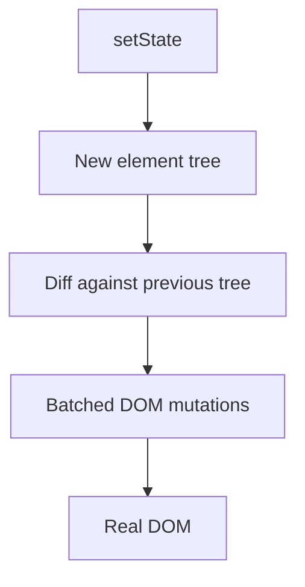

---

### Concurrent rendering

**Що це** — модель рендерингу React, у якій менш пріоритетну роботу можна перервати й відновити.

**Для чого використовується** — зберігає чутливість вводу, коли оновлення списку, маршруту або обчислень займає помітний час.

**Як використовується / працює** — React може почати, перервати й повторити рендеринг; useTransition позначає нетермінові оновлення.

**Мінуси й обмеження** — рендеринг має бути чистим та ідемпотентним; не можна розраховувати, що він виконається один раз.

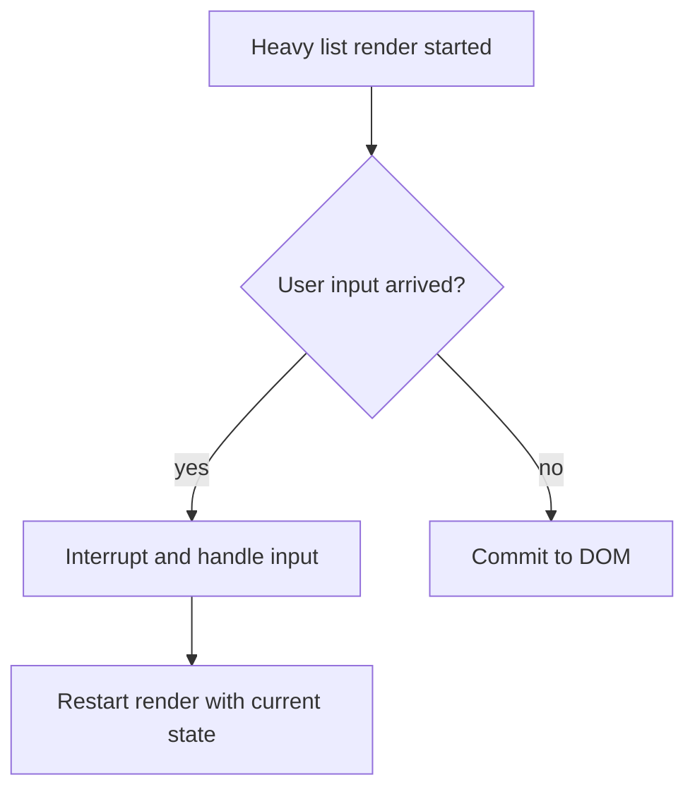

---

### Suspense

**Що це** — межа React, що показує запасний інтерфейс, поки вкладений код або сумісні дані не готові.

**Для чого використовується** — ізолює очікування в частині екрана, щоб решта інтерфейсу залишалася доступною.

**Як використовується / працює** — обгортаю незалежну частину екрана в Suspense з локальною каркасною заглушкою або індикатором завантаження.

**Мінуси й обмеження** — межа, поставлена надто високо, ховає весь екран; не кожен спосіб отримання даних інтегрований із Suspense.

```tsx
const Chart = lazy(() => import("./Chart"));

<Suspense fallback={<ChartSkeleton />}>
  <Chart projectId={projectId} />
</Suspense>
```

---

### Error Boundary

**Що це** — компонентна межа, що перехоплює помилки рендера дочірнього піддерева.

**Для чого використовується** — повідомляє, що частина інтерфейсу не змогла відмалюватися, і не дає цій помилці покласти весь екран.

**Як використовується / працює** — ставлю межу обробки помилок навколо маршруту або ризикованого віджета, записую помилку в журнал і пропоную повторити дію.

**Мінуси й обмеження** — не ловить помилок обробників подій, асинхронного коду та SSR; їх потрібно обробляти окремо.

```tsx
import { ErrorBoundary } from "react-error-boundary";

<ErrorBoundary fallback={<EditorUnavailable />}>
  <VideoEditor projectId={projectId} />
</ErrorBoundary>
```

---

### React.memo

**Що це** — обгортка React, що мемоїзує результат рендера компонента за його властивостями.

**Для чого використовується** — зменшує вартість зайвих рендерів дорогого дочірнього компонента, коли батько оновлюється частіше за його дані.

**Як використовується / працює** — застосовую після профілювання до дорогого компонента зі стабільними властивостями й поверхневим порівнянням.

**Мінуси й обмеження** — порівняння теж коштує часу; нові об’єкти та функції зворотного виклику зводять вигоду нанівець, а код стає складнішим.

```tsx
const UserRow = memo(function UserRow({ user }: { user: User }) {
  return <li>{user.name}</li>;
});
```

---

### useMemo

**Що це** — хук React, що мемоїзує значення обчислення між рендерами.

**Для чого використовується** — виправданий після профілювання для дорогих обчислень або стабільних посилань, від яких залежить мемоїзація нащадка.

**Як використовується / працює** — використовую для вимірно дорогої фільтрації або для властивості, що передається мемоїзованому дочірньому компоненту, вказуючи всі залежності.

**Мінуси й обмеження** — це підказка оптимізації, а не гарантія; зайве застосування погіршує читаність і часом повільніше за обчислення.

```tsx
const visibleUsers = useMemo(
  () => users.filter((user) => user.name.includes(query)),
  [users, query],
);
```

---

### useCallback

**Що це** — хук React, що мемоїзує посилання на функцію між рендерами.

**Для чого використовується** — потрібен, коли нова функція сама по собі спричиняє зайвий рендер мемоїзованого нащадка або повторну підписку ефекту.

**Як використовується / працює** — передаю функцію зворотного виклику в мемоїзований компонент або підписку й перелічую значення, які вона читає.

**Мінуси й обмеження** — сам по собі не пришвидшує застосунок; застаріле замикання через неповні залежності створює приховані помилки.

```tsx
const onSelect = useCallback((id: string) => {
  setSelectedId(id);
}, []);

return <MemoizedProjectList onSelect={onSelect} />;
```

---

### useRef

**Що це** — хук React для змінюваного контейнера, що не бере участі в рендерингу.

**Для чого використовується** — зберігає DOM-вузол, ідентифікатор таймера або попереднє значення там, де зміна не повинна оновлювати інтерфейс.

**Як використовується / працює** — застосовую для фокусування, таймера, AbortController або попереднього значення, оновлюючи посилання в ефекті чи обробнику.

**Мінуси й обмеження** — зміна посилання не оновлює екран; не варто зберігати там стан, який має бути видимим користувачеві.

```tsx
const inputRef = useRef<HTMLInputElement>(null);
<button onClick={() => inputRef.current?.focus()}>Search</button>
<input ref={inputRef} />
```

---

### useEffect

**Що це** — хук для синхронізації відмальованого компонента із зовнішньою системою.

**Для чого використовується** — пов’язує життєвий цикл компонента з підпискою, таймером, DOM API або запитом, у якого є очищення.

**Як використовується / працює** — запускаю ефект після фіксації змін, повертаю функцію очищення й перелічую всі реактивні залежності.

**Мінуси й обмеження** — не потрібен для обчислення похідного стану; неправильні залежності спричиняють цикли, застарілі дані й витоки.

```tsx
useEffect(() => {
  const subscription = chat.subscribe(roomId, setMessages);
  return () => subscription.unsubscribe();
}, [roomId]);
```

---

### useLayoutEffect

**Що це** — варіант ефекту, що виконується синхронно після зміни DOM і до відмальовування кадру.

**Для чого використовується** — потрібен для вимірювання геометрії або негайної корекції позиції, коли користувач не повинен побачити проміжний стан.

**Як використовується / працює** — використовую зрідка для вимірювання спливної підказки чи поповера або відновлення позиції прокручування.

**Мінуси й обмеження** — блокує відмальовування й не підходить для звичайних запитів; у SSR потребує акуратності.

```tsx
useLayoutEffect(() => {
  const rect = tooltipRef.current!.getBoundingClientRect();
  // Adjust position before paint — the user never sees the jump.
  setShiftLeft(rect.right > window.innerWidth);
}, [open]);
```

---

### useTransition

**Що це** — хук, що позначає оновлення React як нетермінове.

**Для чого використовується** — відокремлює чутливий ввід від важкої фільтрації або навігації, щоб інтерфейс не зависав під час обчислень.

**Як використовується / працює** — залишаю стан поля вводу терміновим, а фільтрацію або навігацію запускаю всередині startTransition.

**Мінуси й обмеження** — це не відкладений виклик і не скасування мережі; не можна застосовувати для значення, що контролює поле вводу.

```tsx
const [isPending, startTransition] = useTransition();
onChange={(event) => {
  setQuery(event.target.value);
  startTransition(() => setFilter(event.target.value));
}}
```

---

### useDeferredValue

**Що це** — хук, що повертає відкладену версію значення, яке швидко змінюється.

**Для чого використовується** — дозволяє важкому списку або графіку наздоганяти ввід користувача без затримки самого поля вводу.

**Як використовується / працює** — передаю відкладений пошуковий запит у важкий список, поки текстове поле одразу показує актуальний запит.

**Мінуси й обмеження** — відображаються трохи застарілі дані; це не зменшує кількості запитів без відкладеного виклику та скасування.

```tsx
const [query, setQuery] = useState("");
const deferredQuery = useDeferredValue(query);

<input value={query} onChange={(event) => setQuery(event.target.value)} />;
<SlowResults query={deferredQuery} />;
```

---

### Context

**Що це** — механізм React для передавання одного значення піддереву без явного передавання властивостей на кожному рівні.

**Для чого використовується** — підходить для глобальних даних, що рідко змінюються, як-от тема, локаль або поточний користувач.

**Як використовується / працює** — розміщую провайдер близько до споживачів і розділяю контексти за частотою оновлення.

**Мінуси й обмеження** — зміна значення перерендерює всіх споживачів; це не універсальна заміна локальному або серверному стану.

```tsx
const ThemeContext = createContext<"light" | "dark">("light");
<ThemeContext.Provider value="dark"><Editor /></ThemeContext.Provider>
```

---

### Controlled vs uncontrolled components

**Що це** — два способи зберігати значення поля: у стані React або безпосередньо в DOM.

**Для чого використовується** — керований варіант потрібен для валідації та залежного інтерфейсу; некерований — для простих форм та інтеграцій.

**Як використовується / працює** — керований варіант обираю для валідації та залежного інтерфейсу; некерований із посиланням — для простої форми або інтеграції.

**Мінуси й обмеження** — керовані поля можуть рендеритися надто часто; змішувати два джерела істини небезпечно.

```tsx
// Controlled: React state is the source of truth.
<input value={email} onChange={(event) => setEmail(event.target.value)} />

// Uncontrolled: the value lives in the DOM, read via ref.
<input ref={emailRef} defaultValue={initialEmail} />
```

---

### Lifting state up

**Що це** — перенесення спільного стану до найближчого спільного батьківського компонента.

**Для чого використовується** — запобігає розсинхронізації кількох компонентів, яким потрібно узгоджено відображати й змінювати одні дані.

**Як використовується / працює** — піднімаю стан до найближчого спільного батька й передаю значення та обробники вниз.

**Мінуси й обмеження** — підняття надто високо роздуває властивості й область ререндерів; іноді краща композиція або контекст.

```tsx
function Editor() {
  const [selectedId, setSelectedId] = useState<string | null>(null);
  return <>
    <SceneList selectedId={selectedId} onSelect={setSelectedId} />
    <Preview sceneId={selectedId} />
  </>;
}
```

---

### State colocation

**Що це** — принцип розміщення стану поруч із компонентом, який його використовує.

**Для чого використовується** — зменшує область ререндерів і зв’язаність, поки стан не потрібен кільком незалежним частинам інтерфейсу.

**Як використовується / працює** — починаю з локального стану й піднімаю або глобалізую його лише за реальної спільної потреби.

**Мінуси й обмеження** — локальні копії можуть розсинхронізуватися, якщо дані все-таки мають бути спільними.

```tsx
// Bad: filter at the root — every keystroke rerenders the whole page.
function Page() {
  const [filter, setFilter] = useState("");
  return <><Header /><ProjectList filter={filter} onFilter={setFilter} /></>;
}

// Better: state lives inside its only consumer.
function ProjectList() {
  const [filter, setFilter] = useState("");
  // ...
}
```

---

### Server state

**Що це** — дані з сервера, що мають власний життєвий цикл кешування, застарівання й повторного отримання.

**Для чого використовується** — відокремлює кеш API від локального стану інтерфейсу й дає єдиний спосіб оновлювати дані після мутацій.

**Як використовується / працює** — застосовую TanStack Query/SWR для ключа кешу, станів завантаження й помилки, інвалідації та мутацій.

**Мінуси й обмеження** — не можна плутати зі станом інтерфейсу; неправильні ключі або інвалідація дають застарілий інтерфейс.

```tsx
// Server state: a cache with a key, staleness, and refetching.
const { data: projects } = useQuery({ queryKey: ["projects"], queryFn: fetchProjects });

// UI state: local, no cache or invalidation.
const [selectedId, setSelectedId] = useState<string | null>(null);
```

---

### Redux

**Що це** — централізоване сховище клієнтського стану з оновленнями через дії та редюсери.

**Для чого використовується** — виправдано для складної спільної бізнес-логіки, де важливо бачити всі переходи стану й відтворювати їх передбачувано.

**Як використовується / працює** — зберігаю лише справді спільний клієнтський стан, описую події діями й оновлюю стан чистими редюсерами; RTK зменшує шаблонний код.

**Мінуси й обмеження** — для локального стану інтерфейсу та серверного кешу це часто надлишково; забагато глобального стану ховає володіння даними й ускладнює зміни.

```ts
const projectsSlice = createSlice({
  name: "projects",
  initialState: { selectedId: null as string | null },
  reducers: {
    projectSelected(state, action: PayloadAction<string>) {
      state.selectedId = action.payload; // Immer: "mutation" is safe here
    },
  },
});
```

---

### Zustand

**Що це** — мінімалістичне зовнішнє сховище стану з підписками через селектори.

**Для чого використовується** — підходить для невеликого спільного клієнтського стану, коли Redux додає більше церемоній, ніж цінності.

**Як використовується / працює** — створюю вузькоспеціалізовані сховища й селектори, щоб компонент підписувався лише на потрібний зріз стану.

**Мінуси й обмеження** — простота не замінює проєктування моделі; без правил сховище легко стає неявним глобальним змінюваним станом.

```ts
const usePlayerStore = create<{ playing: boolean; toggle: () => void }>((set) => ({
  playing: false,
  toggle: () => set((state) => ({ playing: !state.playing })),
}));

const playing = usePlayerStore((state) => state.playing); // subscribe to a slice only
```

---

### TanStack Query / React Query

**Що це** — бібліотека керування серверними запитами, кешем і мутаціями в React.

**Для чого використовується** — усуває ручну обробку завантаження, помилок, повторних запитів і застарілого кешу в кожному компоненті.

**Як використовується / працює** — ключ запиту містить усі вхідні параметри; після мутації інвалідую або оновлюю зачеплений ключ, а staleTime обираю за вимогою до свіжості.

**Мінуси й обмеження** — це не менеджер глобального стану інтерфейсу; погані ключі, безконтрольні повторні спроби або відкат оптимістичної мутації дають застарілий чи неправильний інтерфейс.

```tsx
const query = useQuery({
  queryKey: ["projects", workspaceId],
  queryFn: () => api.projects.list(workspaceId),
  staleTime: 30_000,
});
```

---

## Next.js

---

### App Router

**Що це** — файловий маршрутизатор Next.js на базі серверних компонентів і вкладених сегментів.

**Для чого використовується** — дає єдиний спосіб зібрати сторінку із спільних макетів, серверних даних, станів завантаження та помилок.

**Як використовується / працює** — сегмент маршруту містить файли page, layout, loading і error; компоненти серверні за замовчуванням.

**Мінуси й обмеження** — потрібні чіткі межі клієнтської та серверної частин; міграція зі старого Pages Router потребує звикання.

```txt
app/
  layout.tsx        shared shell
  page.tsx          route /
  projects/
    page.tsx        /projects
    [id]/
      page.tsx      /projects/42
      loading.tsx   segment Suspense fallback
      error.tsx     segment error boundary
```

---

### Pages Router

**Що це** — колишня файлова модель маршрутизації Next.js із функціями отримання даних на рівні сторінок.

**Для чого використовується** — корисна під час підтримки наявного проєкту, який ще використовує getServerSideProps або getStaticProps.

**Як використовується / працює** — файли page формують маршрути, а дані завантажуються через спеціальні функції отримання даних.

**Мінуси й обмеження** — не отримує нову RSC-модель; підтримка застарілого коду може ускладнити єдиний підхід.

```tsx
// pages/projects/[id].tsx — data is fetched by a page-level function, not the component.
export async function getServerSideProps({ params }: GetServerSidePropsContext) {
  const project = await getProject(String(params?.id));
  return { props: { project } };
}

export default function ProjectPage({ project }: { project: Project }) {
  return <ProjectView project={project} />;
}
```

---

### Server Components

**Що це** — React-компонент, що виконується лише на сервері й не потрапляє в клієнтський JavaScript-бандл.

**Для чого використовується** — скорочує обсяг клієнтського коду й дає змогу отримувати серверні дані поруч із представленням.

**Як використовується / працює** — читаю БД або серверний API прямо в асинхронному серверному компоненті та передаю вниз властивості, які можна серіалізувати.

**Мінуси й обмеження** — не можна використовувати стан, ефекти, API браузера чи обробники подій; не можна передавати довільні об’єкти.

```tsx
export default async function ProjectsPage() {
  const projects = await db.project.findMany(); // runs on the server only
  return <ProjectList projects={projects} />;
}
```

---

### Client Components

**Що це** — React-компонент Next.js, який виконується в браузері й може використовувати стан, події та ефекти.

**Для чого використовується** — обмежує клієнтський JavaScript лише інтерактивними частинами екрана.

**Як використовується / працює** — додаю директиву use client лише на листі інтерактивної частини дерева.

**Мінуси й обмеження** — усе імпортоване потрапляє в клієнтський бандл; надто висока межа роздуває його.

```tsx
"use client";

export function LikeButton() {
  const [liked, setLiked] = useState(false);
  return <button onClick={() => setLiked(!liked)}>{liked ? "♥" : "♡"}</button>;
}
```

---

### SSR — Server-Side Rendering

**Що це** — створення HTML на сервері для кожного запиту.

**Для чого використовується** — обирається для актуального, персоналізованого або SEO-важливого контенту, який не можна безпечно віддати зі статики.

**Як використовується / працює** — сервер отримує дані, рендерить HTML, потім клієнт гідратує інтерактивні частини.

**Мінуси й обмеження** — збільшує TTFB і навантаження на сервер; стратегія кешування критична для масштабування.

```tsx
export default async function ProjectPage({ params }: { params: Promise<{ id: string }> }) {
  const project = await getProject((await params).id);
  return <ProjectView project={project} />;
}
```

---

### CSR — Client-Side Rendering

**Що це** — рендеринг і отримання даних після завантаження JavaScript у браузері.

**Для чого використовується** — зручний для закритих робочих інтерфейсів, де первинний SEO-контент не важливіший за інтерактивність.

**Як використовується / працює** — віддаємо оболонку і JavaScript, потім запит із клієнта заповнює інтерфейс.

**Мінуси й обмеження** — корисний перший екран з’являється повільніше й гірше для SEO; потрібен продуманий UX завантаження та помилок.

---

### SSG — Static Site Generation

**Що це** — генерація HTML сторінки під час збирання.

**Для чого використовується** — дає найдешевшу та найшвидшу роздачу публічного контенту, який змінюється рідко.

**Як використовується / працює** — сторінка генерується під час build і роздається через CDN як статичний asset.

**Мінуси й обмеження** — дані можуть застаріти до наступного build; не підходить для персонального або дуже свіжого контенту.

```tsx
export async function generateStaticParams() {
  const posts = await getPosts();
  return posts.map((post) => ({ slug: post.slug })); // pages are generated at build time
}
```

---

### ISR — Incremental Static Regeneration

**Що це** — статична сторінка Next.js, яку можна перестворювати після публікації.

**Для чого використовується** — зменшує навантаження порівняно з SSR, зберігаючи дані достатньо свіжими для каталогу, документації або вітрини.

**Як використовується / працює** — задаю revalidate або запускаю on-demand revalidation після зміни даних.

**Мінуси й обмеження** — потрібно прийняти bounded staleness і продумати invalidation; неправильне налаштування показує старі дані.

**Примітка щодо версій** — у Next.js 16 актуальна cache-модель будується навколо Cache Components і директиви use cache; термін ISR залишається корисним, але деталі залежать від версії та конфігурації.

```ts
export const revalidate = 60;
// Next.js regenerates the page at most once per minute.
```

---

### Hydration

**Що це** — процес, у якому React пов’язує серверний HTML із клієнтським JavaScript і обробниками подій.

**Для чого використовується** — перетворює швидко показаний серверний HTML на робочий інтерактивний інтерфейс.

**Як використовується / працює** — браузер завантажує JS, React звіряє markup і навішує event handlers.

**Мінуси й обмеження** — великий client bundle затримує інтерактивність; серверний і клієнтський output мають збігатися.

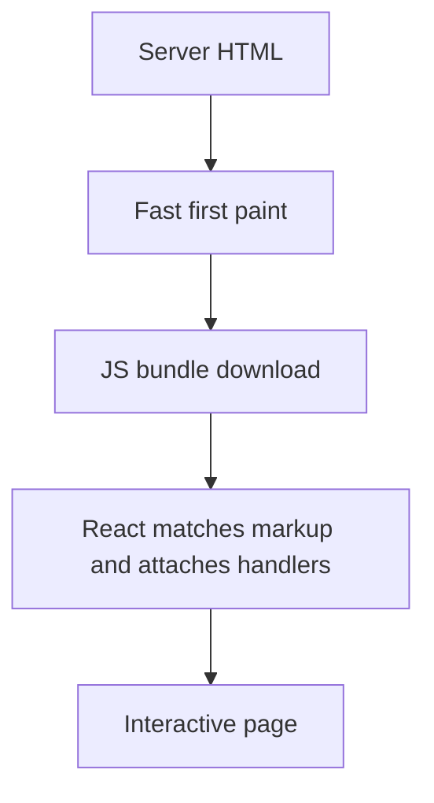

---

### Hydration mismatch

**Що це** — помилка, за якої перший клієнтський рендер React не збігається з HTML, надісланим сервером.

**Для чого використовується** — повідомляє, що перший клієнтський рендер відрізняється від HTML, створеного сервером, і вказує на потребу шукати недетерміновані дані.

**Як використовується / працює** — усуваю nondeterminism: Date.now, Math.random, locale, window і дані браузера переношу в client effect.

**Мінуси й обмеження** — suppressHydrationWarning приховує симптом, але рідко виправляє джерело розсинхронізації.

```tsx
// Bad: server and client render different times.
<span>{new Date().toLocaleTimeString()}</span>

// Good: the nondeterministic value appears after mount.
const [now, setNow] = useState<string | null>(null);
useEffect(() => setNow(new Date().toLocaleTimeString()), []);
```

---

### Layouts

**Що це** — спільний маршрутний компонент Next.js, що зберігається між дочірніми сторінками.

**Для чого використовується** — усуває дублювання навігації, провайдерів і каркаса екрана між пов’язаними маршрутами.

**Як використовується / працює** — кладу стійку chrome-частину в layout, а контент маршруту — в page.

**Мінуси й обмеження** — state у layout живе довше, ніж очікується; глобальний layout не повинен тягнути важкі client dependencies.

```tsx
export default function WorkspaceLayout({ children }: { children: React.ReactNode }) {
  return <>
    <SidebarNav />
    <main>{children}</main>
  </>;
}
```

---

### Route Handlers

**Що це** — обробник HTTP-запитів у директорії `app` Next.js.

**Для чого використовується** — підходить для тонкого API-шару поруч з інтерфейсом: форми, вебхуки та BFF-ендпоінти.

**Як використовується / працює** — export-ую GET/POST і валідую input, auth, authorisation, response shape і status codes.

**Мінуси й обмеження** — не перетворюю їх на шар бізнес-логіки; shared domain code має бути окремо тестованим.

```ts
export async function GET() {
  const projects = await listProjects(await requireUser());
  return Response.json({ projects });
}
```

---

### Proxy (formerly Middleware)

**Що це** — попередній обробник запиту Next.js, що працює до маршруту.

**Для чого використовується** — застосовується для перенаправлення, локалі або грубої перевірки доступу до завантаження сторінки.

**Як використовується / працює** — у Next.js 16 використовую proxy.ts і matcher лише для потрібних paths; читаю request/cookie і повертаю next, rewrite або redirect.

**Мінуси й обмеження** — не підходить для slow data fetching або повного session management; остаточну авторизацію все одно перевіряє endpoint, а runtime залежить від версії Next.js.

```ts
import { NextRequest, NextResponse } from "next/server";

export function proxy(request: NextRequest) {
  if (!request.cookies.get("session")) return NextResponse.redirect(new URL("/login", request.url));
  return NextResponse.next();
}

export const config = { matcher: ["/projects/:path*"] };
```

---

### Streaming

**Що це** — поетапна передача HTML-відповіді в міру готовності її частин.

**Для чого використовується** — зменшує відчутне очікування, даючи змогу показати незалежні частини сторінки до завершення найповільнішого запиту.

**Як використовується / працює** — розділяю незалежні області Suspense boundaries і показую meaningful skeletons.

**Мінуси й обмеження** — погана межа створює стрибки layout або «водоспад»; критичний above-the-fold контент не можна приховувати бездумно.

```tsx
export default function ProjectPage() {
  return <>
    <ProjectHeader />
    <Suspense fallback={<CommentsSkeleton />}>
      <SlowComments /> {/* this part streams in later without blocking the header */}
    </Suspense>
  </>;
}
```

---

### Caching and revalidation

**Що це** — механізми кешування даних і рендера в Next.js та правила їх інвалідації (revalidation).

**Для чого використовується** — дає змогу явно обрати допустиму свіжість даних і не платити за однакову роботу на кожному запиті.

**Як використовується / працює** — явно визначаю cache scope, TTL та invalidation tags/path після mutation.

**Мінуси й обмеження** — cache — це частина коректності: неясний ownership або invalidation створюють stale bugs, які важко відловити.

```ts
import { revalidatePath } from "next/cache";

await db.project.update({ where: { id }, data: input });
revalidatePath(`/projects/${id}`);
```

---

### Server Actions

**Що це** — серверні функції Next.js, що викликаються з форм і клієнтського коду без ручного API-шару.

**Для чого використовується** — зменшує обсяг проміжного коду для серверної мутації форми, зберігаючи перевірку прав і вхідних даних на сервері.

**Як використовується / працює** — action валідує input і права на сервері, виконує mutation, потім revalidate-ить affected data.

**Мінуси й обмеження** — це не заміна публічному API; endpoint-level security, errors і progressive enhancement мають бути продумані.

```ts
"use server";
export async function renameProject(formData: FormData) {
  await rename(await requireUser(), String(formData.get("id")), String(formData.get("name")));
  revalidatePath("/projects");
}
```

---

### Dynamic imports

**Що це** — ліниве підключення модуля або компонента окремим chunk-ом у момент потреби.

**Для чого використовується** — відкладає завантаження редактора, графіка або рідко потрібної функції до моменту, коли користувач справді її запросив.

**Як використовується / працює** — динамічно завантажую важкий editor, chart або browser-only library за interaction/route boundary.

**Мінуси й обмеження** — додатковий network round trip може погіршити важливий сценарій; потрібен fallback і вимірювання.

```tsx
const VideoTimeline = dynamic(() => import("./VideoTimeline"), {
  loading: () => <TimelineSkeleton />,
  ssr: false,
});
```

---

### Image optimization

**Що це** — набір технік і компонент next/image для віддачі зображень потрібного розміру, формату та пріоритету.

**Для чого використовується** — прискорює показ візуального контенту й запобігає зсуву інтерфейсу через невідомий розмір зображення.

**Як використовується / працює** — задаю реальні dimensions, responsive sizes, сучасний format і priority лише для LCP-зображення.

**Мінуси й обмеження** — неправильні sizes можуть віддати завеликий файл; динамічна оптимізація має cache та інфраструктурну ціну.

```tsx
<Image
  src={project.thumbnailUrl}
  alt={project.title}
  width={1280}
  height={720}
  sizes="(max-width: 768px) 100vw, 640px"
  priority
/>
```

---

### Edge Runtime

**Що це** — обмежене середовище виконання на базі Web APIs, яке може працювати ближче до користувача.

**Для чого використовується** — зменшує мережеву затримку короткого рішення на кшталт редиректу або легкої перевірки до основного застосунку.

**Як використовується / працює** — застосовую для легких redirects, personalization hints або auth checks, сумісних із Web APIs.

**Мінуси й обмеження** — Node APIs, native modules і довгі DB-виклики можуть бути недоступними або невигідними; у Next.js 16 Proxy за замовчуванням використовує Node runtime, тому Edge потрібно обговорювати з урахуванням конкретної версії/deployment.

```ts
export const runtime = "edge"; // Web APIs only, no Node modules

export async function GET(request: Request) {
  const country = request.headers.get("x-vercel-ip-country") ?? "US";
  return Response.json({ country });
}
```

---

## JavaScript

---

### Closure

**Що це** — функція разом із доступним їй лексичним оточенням зовнішньої області.

**Для чого використовується** — дозволяє створювати фабрики, обробники та інкапсульований стан без глобальних змінних.

**Як використовується / працює** — застосовую для фабрик, private state і callbacks; React handlers також замикають values render-у.

**Мінуси й обмеження** — довгоживуча closure може утримувати пам'ять або читати застарілий state.

```ts
function makeCounter() {
  let count = 0;
  return () => ++count;
}
const next = makeCounter();
```

---

### Event loop

**Що це** — модель JavaScript-рантайму, що планує стек викликів, черги задач, мікрозадачі та відмальовування.

**Для чого використовується** — пояснює порядок асинхронних операцій і допомагає знаходити зависання інтерфейсу або неочікуваний порядок логів.

**Як використовується / працює** — поточний call stack завершується, потім draining microtasks, потім browser отримує шанс відмалювати наступний кадр.

**Мінуси й обмеження** — довгий synchronous task блокує ввід і paint незалежно від async API.

```ts
console.log("A");
Promise.resolve().then(() => console.log("microtask"));
setTimeout(() => console.log("task"));
console.log("B"); // A, B, microtask, task
```

---

### Microtasks

**Що це** — черга продовжень, що виконуються після поточного стека і до наступної звичайної задачі.

**Для чого використовується** — важлива для передбачення поведінки Promise і запобігання голодуванню відмальовування довгим ланцюжком мікрозадач.

**Як використовується / працює** — Promise callbacks і queueMicrotask потрапляють у microtask queue після завершення stack.

**Мінуси й обмеження** — нескінченний ланцюжок microtasks starvation-ить rendering та інші tasks.

```js
setTimeout(() => console.log("task"));
Promise.resolve()
  .then(() => console.log("microtask 1"))
  .then(() => console.log("microtask 2"));
// microtask 1, microtask 2, task — the microtask queue drains fully before the task
```

---

### Macrotasks

**Що це** — звичайна задача черги подій, що виконується після завершення поточного циклу.

**Для чого використовується** — дозволяє відкласти роботу і дати браузеру можливість обробити ввід або відмалювати кадр між задачами.

**Як використовується / працює** — setTimeout, message events та I/O callbacks зазвичай створюють tasks, між якими браузер може рендерити.

**Мінуси й обмеження** — timer не є точним розкладом; активний main thread затримує його виконання.

---

### Promise

**Що це** — об'єкт стану майбутнього результату асинхронної операції.

**Для чого використовується** — стандартизує композицію асинхронних операцій і передачу помилки до вибраної межі обробки.

**Як використовується / працює** — чіпляю then/catch/finally або await і обробляю помилку на потрібній межі.

**Мінуси й обмеження** — Promise не скасовується сам; забутий catch перетворюється на unhandled rejection.

```js
loadProject(id)
  .then((project) => render(project))
  .catch((error) => showError(error)) // catches reject and throw from earlier in the chain
  .finally(() => setLoading(false));
```

---

### async / await

**Що це** — синтаксис JavaScript поверх Promise для очікування результату всередині асинхронної функції.

**Для чого використовується** — робить залежну послідовність кроків читабельною, не блокуючи потік виконання.

**Як використовується / працює** — await призупиняє лише async function; незалежні операції запускаю паралельно через Promise.all.

**Мінуси й обмеження** — послідовні await без залежності створюють waterfall; Promise.all падає на першій помилці.

```ts
const [project, comments] = await Promise.all([
  getProject(projectId),
  getComments(projectId),
]);
```

---

### AbortController

**Що це** — об'єкт сигналу скасування для Fetch та інших API, що його підтримують.

**Для чого використовується** — запобігає роботі й обробці застарілого результату після зміни запиту, маршруту або розмонтування компонента.

**Як використовується / працює** — створюю controller на запит і викликаю abort у cleanup effect або при новому search query.

**Мінуси й обмеження** — скасування має підтримуватися API; все одно треба ігнорувати race-відповіді й коректно відрізняти AbortError.

```ts
const controller = new AbortController();
fetch(`/api/search?q=${query}`, { signal: controller.signal });
return () => controller.abort();
```

---

### Hoisting

**Що це** — правила створення прив'язок імен перед виконанням області видимості JavaScript.

**Для чого використовується** — допомагає пояснити помилки доступу до оголошення й уникати неочевидних залежностей від `var`.

**Як використовується / працює** — function declarations доступні раніше, var ініціалізується undefined, let/const живуть у temporal dead zone.

**Мінуси й обмеження** — reliance на hoisting погіршує читабельність; var створює неочікувані scope bugs.

```js
console.log(a); // undefined: var is hoisted and initialized to undefined
var a = 1;

console.log(b); // ReferenceError: let is in the temporal dead zone
let b = 2;
```

---

### this

**Що це** — значення-отримувач, що визначається способом виклику звичайної функції.

**Для чого використовується** — потрібне для коректної роботи методів об'єктів та інтеграцій, де функція передається як callback.

**Як використовується / працює** — значення визначається call site: obj.method(), call/apply/bind або constructor; arrow бере зовнішнє this.

**Мінуси й обмеження** — переданий окремо method втрачає receiver; arrow не можна використовувати як constructor.

```ts
const player = { title: "Demo", print() { console.log(this.title); } };

const print = player.print; // detached from its receiver
print(); // strict mode: TypeError (this is undefined); sloppy mode: this is globalThis

setTimeout(player.print.bind(player), 0); // "Demo" — receiver fixed by bind
```

---

### Prototype chain

**Що це** — ланцюжок об'єктів-прототипів, яким JavaScript шукає відсутню властивість.

**Для чого використовується** — пояснює наслідування, методи класів і вартість динамічного пошуку властивостей.

**Як використовується / працює** — за відсутності властивості на об'єкті рушій шукає її вгору по prototype chain до null.

**Мінуси й обмеження** — глибокі або змінювані prototypes ускладнюють reasoning; class — лише синтаксис над цією моделлю.

```js
const base = { greet() { return "hi"; } };
const child = Object.create(base);

child.greet(); // "hi" — not on child, found on the prototype
Object.getPrototypeOf(child) === base; // true
```

---

### Equality: === vs ==

**Що це** — два оператори порівняння: строгий без неявного перетворення і нестрогий з ним.

**Для чого використовується** — строгий оператор запобігає прихованим помилкам перетворення типів у прикладній логіці.

**Як використовується / працює** — майже завжди використовую ===; == допустимий лише коли coercion усвідомлений і добре обмежений, наприклад nullish check.

**Мінуси й обмеження** — == містить багато неочевидних правил; === все одно порівнює об'єкти за посиланням, а не за вмістом.

```js
0 == "";       // true — implicit type coercion
0 === "";      // false
value == null; // deliberate idiom: true for both null and undefined
```

---

### Shallow copy

**Що це** — копіювання лише верхнього рівня масиву або об'єкта зі збереженням посилань на вкладені дані.

**Для чого використовується** — достатньо для точкового незмінного оновлення верхнього рівня стану без дорогої повної копії.

**Як використовується / працює** — spread, Object.assign або Array.slice копіюють посилання на вкладені об'єкти.

**Мінуси й обмеження** — nested data залишається спільною і може бути випадково змінена.

```js
const original = { title: "Demo", meta: { views: 10 } };
const copy = { ...original };

copy.meta.views = 99;
original.meta.views; // 99 — the nested object is still shared
```

---

### Deep copy

**Що це** — копіювання всієї вкладеної структури без спільних посилань із вихідним об'єктом.

**Для чого використовується** — застосовується лише коли незалежність вкладених даних справді важливіша за вартість пам'яті та процесора.

**Як використовується / працює** — structuredClone підходить багатьом native types; для domain data віддаю перевагу точковому immutable update.

**Мінуси й обмеження** — це дорого по CPU/пам'яті; JSON stringify ламає Date, Map, undefined і циклічні посилання.

```js
const copy = structuredClone(original); // Date, Map, cyclic references — ok

copy.meta.views = 99;
original.meta.views; // 10 — the structure is fully independent
```

---

### Immutability

**Що це** — підхід, за якого наявні дані не змінюються, а створюється новий стан.

**Для чого використовується** — спрощує порівняння змін, відкат, налагодження і коректні оновлення React-стану.

**Як використовується / працює** — повертаю нові об'єкти для змінених гілок і не мутую state/props.

**Мінуси й обмеження** — повне копіювання великих структур дороге; mutable refs доречні поза UI state.

```js
const next = {
  ...state,
  scenes: state.scenes.map((scene) =>
    scene.id === id ? { ...scene, title } : scene,
  ),
};
```

---

### Debounce

**Що це** — відкладений запуск функції після паузи в серії подій.

**Для чого використовується** — зменшує кількість мережевих запитів або збережень, коли проміжні значення вводу не мають самостійної цінності.

**Як використовується / працює** — debounce search request або autosave з cleanup попереднього таймера.

**Мінуси й обмеження** — додає навмисну затримку; не підходить, якщо потрібна регулярна реакція під час drag/scroll.

```ts
let timer: ReturnType<typeof setTimeout>;
const searchLater = (query: string) => {
  clearTimeout(timer);
  timer = setTimeout(() => search(query), 250);
};
```

---

### Throttle

**Що це** — обмеження максимальної частоти виклику функції в безперервному потоці подій.

**Для чого використовується** — захищає обробники прокручування, зміни розміру та аналітики від надмірного навантаження.

**Як використовується / працює** — throttle scroll/resize analytics або використовую requestAnimationFrame для візуальних оновлень.

**Мінуси й обмеження** — остання подія може загубитися без trailing call; для мережевого пошуку частіше кращий debounce.

```ts
const reportScroll = throttle(() => {
  analytics.track("scrolled", { y: window.scrollY });
}, 500);

window.addEventListener("scroll", reportScroll, { passive: true });
```

---

### Generators and iterators

**Що це** — протокол послідовного отримання значень і функція, яка може видавати їх ліниво.

**Для чого використовується** — економить пам'ять і дозволяє обробляти великі або потенційно нескінченні послідовності по одному елементу.

**Як використовується / працює** — generator yield-ить елементи на вимогу; iterable підтримує Symbol.iterator і for...of.

**Мінуси й обмеження** — control flow стає менш звичним; generator не можна безпечно повторно використовувати після вичерпання.

```js
function* ids() {
  let id = 1;
  while (true) yield id++; // values are computed lazily, on demand
}
const seq = ids();
seq.next().value; // 1
seq.next().value; // 2

// Iterator: Symbol.iterator makes the object work with for...of and spread.
const playlist = {
  tracks: ["intro", "demo", "outro"],
  *[Symbol.iterator]() { yield* this.tracks; },
};
for (const track of playlist) console.log(track);
```

---

### Modules

**Що це** — одиниця ізоляції JavaScript-коду з явними імпортами та експортами.

**Для чого використовується** — робить залежності оглядовими, тестованими і доступними для оптимізації збирачем.

**Як використовується / працює** — ESM використовує static import/export, що дозволяє bundler-у аналізувати граф і tree-shake.

**Мінуси й обмеження** — циклічні залежності дають частково ініціалізовані bindings; dynamic import змінює timing завантаження.

```js
// math.js
export const add = (a, b) => a + b;                        // named export
export default function multiply(a, b) { return a * b; }  // default export

// app.js — static import: the bundler sees the graph, tree shaking works.
import multiply, { add } from "./math.js";

// Dynamic import: a separate chunk, loaded at call time.
const { renderChart } = await import("./chart.js");
```

---

### Memory leaks

**Що це** — ситуація, коли пам'ять залишається досяжною після того, як дані більше не потрібні.

**Для чого використовується** — сигналізує, що дані або підписки утримуються довше за життєвий цикл екрана; допомагає спрямувати діагностику на утримувальні посилання.

**Як використовується / працює** — очищаю subscriptions, timers, observers і abort-аю requests при unmount; профілюю heap snapshots.

**Мінуси й обмеження** — зростання пам'яті не завжди leak: cache може бути очікуваним, тому спочатку вимірюю retainers.

```ts
useEffect(() => {
  const id = setInterval(poll, 5000);
  window.addEventListener("resize", onResize);
  return () => { // without cleanup the timer and listener outlive unmount
    clearInterval(id);
    window.removeEventListener("resize", onResize);
  };
}, []);
```

---

## TypeScript

---

### any

**Що це** — спеціальний тип TypeScript, що вимикає перевірку операцій над значенням.

**Для чого використовується** — допустимий як короткий міст під час міграції старого коду, але не як тип даних на зовнішніх межах.

**Як використовується / працює** — уникаю його на межах; натомість залишаю unknown і звужую тип validation-ом.

**Мінуси й обмеження** — any заражає вирази й позбавляє compiler його головної цінності.

```ts
// Bad: value.name compiles even when value is null.
const value: any = JSON.parse(body);
```

---

### unknown

**Що це** — тип для значення невідомої форми, над яким не можна виконувати операції без перевірки.

**Для чого використовується** — захищає межі застосунку: JSON, мережа та `catch` не отримують довіри лише через анотацію типу.

**Як використовується / працює** — перед доступом до полів роблю type guard, schema validation або typeof check.

**Мінуси й обмеження** — вимагає явного narrowing, тому менш зручний за any, але ця ціна запобігає runtime bugs.

```ts
const value: unknown = JSON.parse(body);
if (typeof value === "object" && value !== null && "name" in value) {
  console.log(value.name);
}
```

---

### never

**Що це** — тип неможливого значення або результату функції, яка не повертається нормально.

**Для чого використовується** — дозволяє компілятору перевірити, що всі варіанти закритого об’єднання оброблені.

**Як використовується / працює** — використовую exhaustive switch з assertNever для закритих discriminated unions.

**Мінуси й обмеження** — неправильно оголошений never маскує помилку моделі; union має бути справді закритим.

```ts
function assertNever(value: never): never { throw new Error(`Unexpected: ${value}`); }
switch (result.status) {
  case "loading": break;
  case "error": break;
  case "success": break;
  default: assertNever(result);
}
```

---

### Type narrowing

**Що це** — уточнення широкого об’єднання до конкретного типу після перевірки під час виконання.

**Для чого використовується** — робить доступ до полів безпечним без небезпечних тверджень типу.

**Як використовується / працює** — застосовую typeof, in, instanceof, discriminant або користувацький predicate.

**Мінуси й обмеження** — перевірка має відображати реальні runtime дані; type assertion не є validation.

```ts
function format(value: string | Date) {
  return value instanceof Date ? value.toISOString() : value.trim();
}
```

---

### Type guards

**Що це** — функція або перевірка, що повідомляє TypeScript, який тип підтверджено під час виконання.

**Для чого використовується** — поєднує валідацію зовнішнього вводу з безпечним доступом до даних усередині застосунку.

**Як використовується / працює** — пишу маленький predicate виду value is User і тестую invalid input на API boundary.

**Мінуси й обмеження** — guard може хибно обіцяти форму об’єкта; складні схеми краще валідувати бібліотекою.

```ts
type User = { id: string; name: string };
function isUser(value: unknown): value is User {
  return typeof value === "object" && value !== null && "id" in value && "name" in value;
}
```

---

### Generics

**Що це** — параметр типу, що пов’язує типи входу, виходу та обмежень в одному узагальненому API.

**Для чого використовується** — дозволяє перевикористовувати функцію або компонент, не втрачаючи інформацію про конкретний тип користувача API.

**Як використовується / працює** — параметризую reusable collection, API helper або component і обмежую T через extends за потреби.

**Мінуси й обмеження** — надмірно абстрактні generics гірше читаються; не потрібні для одноразового коду.

```ts
function first<T>(items: readonly T[]): T | undefined {
  return items[0];
}
const project = first([{ id: "p1", name: "Handbook" }]); // object type is preserved
```

---

### keyof

**Що це** — оператор, що формує об’єднання допустимих ключів типу об’єкта.

**Для чого використовується** — запобігає зверненню до неіснуючого поля в узагальнених помічниках і конфігурації таблиць.

**Як використовується / працює** — використовую K extends keyof T для generic getter, mapper або type-safe table column.

**Мінуси й обмеження** — runtime-ключ усе ще потрібно перевіряти, якщо він прийшов ззовні.

```ts
function get<T, K extends keyof T>(object: T, key: K): T[K] {
  return object[key];
}
get({ id: "p1", name: "Handbook" }, "name");
```

---

### typeof in type positions

**Що це** — оператор у позиції типу, що витягує тип уже оголошеного значення.

**Для чого використовується** — не дає конфігурації та її опису розходитися під час змін.

**Як використовується / працює** — оголошую const config as const і отримую typeof config для пов’язаної функції.

**Мінуси й обмеження** — занадто великий inferred literal type іноді потрібно навмисно розширити для зручного API.

```ts
const config = { retries: 3, region: "eu" } as const;
type Config = typeof config;
```

---

### Mapped types

**Що це** — конструкція типу, що будує новий object type перетворенням ключів наявного.

**Для чого використовується** — виводить узгоджений тип форми, DTO або лише-для-читання подання з доменної моделі без ручного дублювання полів.

**Як використовується / працює** — застосовую для readonly, optional або typed form-state на основі domain model.

**Мінуси й обмеження** — складні mapped types погіршують повідомлення помилок; спочатку перевіряю готові utility types.

```ts
type User = { id: string; name: string; email: string };
type EditableUser = { [K in "name" | "email"]?: User[K] };
```

---

### Conditional types

**Що це** — конструкція типу виду T extends U ? X : Y, що обирає результат за відношенням типів.

**Для чого використовується** — описує типовий API, чий результат залежить від форми вхідного типу, особливо в перевикористовуваній бібліотеці.

**Як використовується / працює** — корисний у reusable library API, наприклад щоб витягти return type або awaitable result.

**Мінуси й обмеження** — distributive behavior на unions неінтуїтивний; не використовую заради «розумної» типової головоломки.

```ts
type ApiResult<T> = T extends Promise<infer Value> ? Value : T;
type Project = ApiResult<Promise<{ id: string }>>;
```

---

### infer

**Що це** — ключове слово в conditional type, що витягує частину типу без її попереднього оголошення.

**Для чого використовується** — витягує елемент масиву, результат функції або корисне навантаження події без дублювання вже відомого типу.

**Як використовується / працює** — застосовую для ElementType масиву, return type функції або payload event-а.

**Мінуси й обмеження** — частіше потрібен авторам бібліотек, ніж application-коду; складність має окупатися повторним використанням.

```ts
type ElementOf<T> = T extends readonly (infer Item)[] ? Item : never;
type User = ElementOf<readonly [{ id: string }]>;
```

---

### Discriminated unions

**Що це** — union типів зі спільним tag-полем, за яким компілятор розрізняє варіанти.

**Для чого використовується** — не дозволяє представити недопустиму комбінацію стану й даних, наприклад успішний результат без даних.

**Як використовується / працює** — status: loading | error | success визначає доступні поля в switch.

**Мінуси й обмеження** — tag потрібно підтримувати в усіх producers; open-ended server values вимагають runtime fallback.

```ts
type Result = { status: "loading" } | { status: "error"; message: string } | { status: "success"; data: User };
if (result.status === "success") console.log(result.data.name);
```

---

### type vs interface

**Що це** — два способи описати форму даних: interface — розширюваний object contract, type — unions і композиції.

**Для чого використовується** — допомагає обрати читабельну форму опису даних: розширюваний об’єктний контракт або об’єднання й композицію типів.

**Як використовується / працює** — обираю єдиний style команди; для public object contract часто interface, для union — type.

**Мінуси й обмеження** — це не архітектурне рішення; declaration merging interface може бути несподіваним.

```ts
interface Project { id: string; name: string }
type LoadState = "idle" | "loading" | "error";
```

---

### Utility types

**Що це** — вбудовані типи-помічники (Partial, Pick, Omit, Record, Required, Readonly) для похідних типів.

**Для чого використовується** — швидко будує похідний тип для часткового оновлення, публічної відповіді або словника без власної типової магії.

**Як використовується / працює** — Pick створює read DTO, Omit виключає server-generated поля, Record описує map.

**Мінуси й обмеження** — не роблю DTO автоматично з domain type, якщо правила валідації й ownership відрізняються.

```ts
type User = { id: string; name: string; passwordHash: string };
type PublicUser = Omit<User, "passwordHash">;
const labels: Record<"draft" | "published", string> = { draft: "Draft", published: "Published" };
```

---

### readonly

**Що це** — модифікатор типу, що забороняє mutation через конкретну typed reference.

**Для чого використовується** — забороняє споживачеві змінювати дані, якими він не володіє, ще на етапі компіляції.

**Як використовується / працює** — ставлю readonly для вхідних моделей і public collections, де consumer не володіє даними.

**Мінуси й обмеження** — це захист на етапі компіляції, а не deep runtime immutability.

```ts
function renderTags(tags: readonly string[]) {
  // tags.push("new"); // compile error
  return tags.join(", ");
}
```

---

### as const

**Що це** — assertion, що фіксує literal values і readonly структуру замість широких string/number типів.

**Для чого використовується** — зберігає точні літеральні значення конфігурації, щоб безпечно вивести з них об’єднання або ключі.

**Як використовується / працює** — застосовую до static config, action names або tuple, з яких потім виводжу union.

**Мінуси й обмеження** — може зробити тип занадто вузьким для mutation; це не runtime freeze.

```ts
const statuses = ["draft", "published"] as const;
type Status = (typeof statuses)[number];
```

---

### satisfies

**Що це** — оператор перевірки виразу на відповідність типу без втрати його точного inferred type.

**Для чого використовується** — перевіряє повноту конфігурації, але не розширює її точні літеральні значення до загального типу.

**Як використовується / працює** — використовую для config map, де потрібні і перевірка всіх ключів, і literal values.

**Мінуси й обмеження** — не валідує JSON у runtime і не замінює schema validation.

```ts
type Route = "/" | "/projects";
const labels = { "/": "Home", "/projects": "Projects" } satisfies Record<Route, string>;
```

---

### Enums

**Що це** — конструкція TypeScript для іменованого набору констант; часто замінна string literal union.

**Для чого використовується** — задає обмежений набір значень; у веб-коді часто замінюється об’єктом `as const` із прозорішим результатом під час виконання.

**Як використовується / працює** — для web-коду зазвичай віддаю перевагу as const object плюс union, щоб контролювати runtime output.

**Мінуси й обмеження** — numeric enum створює неочевидний reverse mapping; const enum має build-tool caveats.

```ts
const Role = { Admin: "admin", Member: "member" } as const;
type Role = (typeof Role)[keyof typeof Role];
```

---

### Declaration files

**Що це** — .d.ts описує типи JavaScript-модуля без генерації runtime-коду.

**Для чого використовується** — додає безпечний мінімальний контракт до JavaScript-залежності без переписування її в TypeScript.

**Як використовується / працює** — додаю declaration для untyped dependency або global integration, зберігаючи його максимально вузьким.

**Мінуси й обмеження** — declaration може розходитися з runtime API; спочатку шукаю офіційні types або оновлюю dependency.

```ts
// analytics.d.ts
declare module "legacy-analytics" {
  export function track(event: string, properties?: Record<string, unknown>): void;
}
```

---

## Browser & Performance

---

### Critical rendering path

**Що це** — послідовність кроків браузера від отримання HTML/CSS/JS до відмальовування пікселів.

**Для чого використовується** — допомагає знайти конкретну причину повільного першого відображення замість безсистемної оптимізації всіх ресурсів.

**Як використовується / працює** — браузер будує DOM і CSSOM, layout, paint і compositing; вимірюю waterfall і performance trace.

**Мінуси й обмеження** — оптимізувати треба bottleneck, а не всі ресурси поспіль.

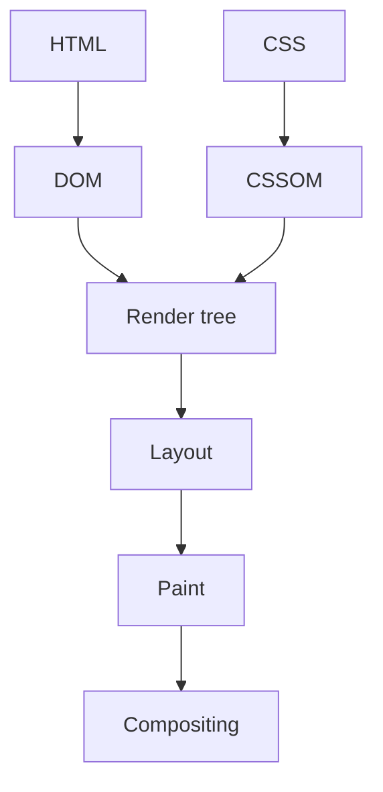

---

### Reflow / layout

**Що це** — етап рендерингу, на якому браузер перераховує геометрію елементів після зміни розмірів, тексту або CSS rules.

**Для чого використовується** — дозволяє уникнути дорогих повторних розрахунків геометрії під час анімацій, обробників прокручування та великих списків.

**Як використовується / працює** — batch-у DOM reads перед writes і уникаю layout thrashing у циклах/scroll handlers.

**Мінуси й обмеження** — layout іноді неминучий; рання мікрооптимізація гірша за зрозумілий CSS.

```js
// Bad: reads and writes interleave — layout on every iteration.
items.forEach((el) => { el.style.height = el.offsetHeight + 10 + "px"; });

// Better: all reads first, then all writes.
const heights = items.map((el) => el.offsetHeight);
items.forEach((el, i) => { el.style.height = heights[i] + 10 + "px"; });
```

---

### Repaint

**Що це** — етап рендерингу, що перемальовує пікселі без перерахунку layout, наприклад після зміни кольору.

**Для чого використовується** — допомагає вибрати властивості анімації з меншою вартістю перемальовування на слабких пристроях.

**Як використовується / працює** — анімую transform і opacity, коли можливо, і перевіряю paint flashing у DevTools.

**Мінуси й обмеження** — навіть без layout великі paint area можуть бути дорогими.

---

### Compositing

**Що це** — етап рендерингу, що збирає попередньо відмальовані layers у фінальний кадр, часто на GPU.

**Для чого використовується** — пояснює, чому анімація `transform` або `opacity` часто працює плавніше за зміну геометрії елемента.

**Як використовується / працює** — вибираю composited animations і перевіряю layers замість бездумного translateZ hack.

**Мінуси й обмеження** — забагато layers витрачає GPU memory і може погіршити performance.

---

### Core Web Vitals

**Що це** — набір user-centric метрик Google: LCP (loading), CLS (visual stability) та INP (responsiveness).

**Для чого використовується** — пов'язує швидкість завантаження, стабільність layout і чуйність із реальним користувацьким досвідом і допомагає вибрати пріоритет оптимізацій.

**Як використовується / працює** — дивлюся field data і lab trace, потім пов'язую LCP, CLS та INP із конкретним користувацьким шляхом.

**Мінуси й обмеження** — score не замінює product judgment; synthetic результати не завжди збігаються з реальними пристроями.

---

### LCP — Largest Contentful Paint

**Що це** — метрика часу відмальовування найбільшого видимого content element сторінки.

**Для чого використовується** — показує, як швидко користувач бачить основний контент сторінки, і спрямовує оптимізацію першого рендеру.

**Як використовується / працює** — оптимізую LCP image/text: response time, critical CSS, image size, preload і render blocking.

**Мінуси й обмеження** — «найбільший» елемент змінюється залежно від viewport; не варто preload-ити все поспіль.

---

### CLS — Cumulative Layout Shift

**Що це** — метрика сумарного неочікуваного зсуву layout протягом життя сторінки.

**Для чого використовується** — показує, наскільки інтерфейс зсувається під час завантаження, і допомагає знайти елементи без зарезервованого місця.

**Як використовується / працює** — резервую місце через width/height або aspect-ratio, не вставляю пізній контент над поточним UI.

**Мінуси й обмеження** — припустимі user-initiated shifts не дорівнюють поганому CLS; треба перевіряти конкретний сценарій.

---

### INP — Interaction to Next Paint

**Що це** — метрика затримки між користувацькою взаємодією та наступним відмальовуванням кадру.

**Для чого використовується** — показує, наскільки швидко інтерфейс візуально відповідає на дії користувача, і виявляє довгі задачі на main thread.

**Як використовується / працює** — розбиваю long tasks, зменшую handler work і показую immediate feedback для довгої mutation.

**Мінуси й обмеження** — оптимізація лише одного click не гарантує хороший worst-case interaction.

---

### requestAnimationFrame

**Що це** — browser API для планування callback-а перед найближчим відмальовуванням кадру.

**Для чого використовується** — синхронізує візуальне оновлення з наступним кадром браузера і зменшує зайву роботу між кадрами.

**Як використовується / працює** — коалесціюю mouse/scroll updates в один rAF callback і змінюю transform/opacity.

**Мінуси й обмеження** — callback усе ще на main thread; не використовую його як scheduler для network work.

**Міні-приклад** — за частих подій `pointermove` оновлюю положення індикатора не на кожну подію, а щонайбільше раз за кадр:

```ts
const indicator = document.querySelector<HTMLElement>("#drag-indicator");
let frameId: number | null = null;
let latestX = 0;

window.addEventListener("pointermove", (event) => {
  latestX = event.clientX;
  if (frameId !== null) return;

  frameId = requestAnimationFrame(() => {
    if (indicator) indicator.style.transform = `translateX(${latestX}px)`;
    frameId = null;
  });
});
```

---

### IntersectionObserver

**Що це** — browser API для спостереження перетину елемента із viewport або container без scroll polling.

**Для чого використовується** — реалізує ліниве завантаження, нескінченне прокручування та аналітику показів без постійного ручного опитування прокручування.

**Як використовується / працює** — застосовую для lazy image, infinite scroll sentinel або impression analytics і disconnect-аю observer.

**Мінуси й обмеження** — threshold і rootMargin потребують налаштування; не замінює нормальну pagination та accessibility.

```ts
const observer = new IntersectionObserver(([entry]) => {
  if (entry.isIntersecting) loadNextPage();
});
observer.observe(sentinel);
```

---

### ResizeObserver

**Що це** — browser API для спостереження зміни розміру конкретного елемента, а не всього вікна.

**Для чого використовується** — дозволяє компоненту реагувати на свій контейнер, а не лише на зміну вікна браузера.

**Як використовується / працює** — вимірюю responsive chart або container-driven layout і обережно оновлюю state.

**Мінуси й обмеження** — state update може створити resize loop; відписуюся під час unmount.

```ts
const observer = new ResizeObserver(([entry]) => {
  chart.resize(entry.contentRect.width, entry.contentRect.height);
});

observer.observe(chartContainer);
// On component removal: observer.disconnect().
```

---

### Web Workers

**Що це** — механізм браузера для виконання JavaScript в окремому потоці без доступу до DOM.

**Для чого використовується** — зберігає інтерфейс чуйним під час важкого обчислення, розбору файлу або побудови пошукового індексу.

**Як використовується / працює** — надсилаю serializable message у worker для parsing, image processing або великого search index.

**Мінуси й обмеження** — worker не має DOM і несе serialization/startup overhead; мережу чи простий код не пришвидшить.

```ts
const worker = new Worker(new URL("./search-worker.ts", import.meta.url));
worker.postMessage({ type: "index", documents });
worker.onmessage = ({ data }) => setResults(data);
```

---

### Web Vitals field monitoring

**Що це** — збір performance-метрик із реальних пристроїв, мереж і user journeys після релізу.

**Для чого використовується** — показує продуктивність у реальних користувачів, а не лише в лабораторії, і дозволяє помітити регресію після релізу.

**Як використовується / працює** — надсилаю sampled, anonymized metrics із route/device context в observability platform і порівнюю percentiles.

**Мінуси й обмеження** — telemetry потребує privacy review і sampling; averages приховують страждання повільних користувачів.

```ts
import { onCLS, onINP, onLCP } from "web-vitals";

const report = (metric: Metric) =>
  navigator.sendBeacon("/vitals", JSON.stringify({ ...metric, route }));

onLCP(report); onCLS(report); onINP(report);
```

---

### Code splitting

**Що це** — поділ JavaScript-бандла на chunks, які завантажуються за route або за потребою.

**Для чого використовується** — скорочує обсяг JavaScript, який користувач має завантажити до першої корисної взаємодії.

**Як використовується / працює** — route-level splitting роблю за замовчуванням, feature-level — коли виміряна initial bundle користь вища за extra request.

**Мінуси й обмеження** — забагато small chunks створює waterfall; boundary має відображати user journey.

```ts
exportButton.addEventListener("click", async () => {
  const { openExportDialog } = await import("./export-dialog"); // separate chunk
  openExportDialog();
});
```

---

### Tree shaking

**Що це** — видалення недосяжного ESM-коду з production bundle під час збірки.

**Для чого використовується** — не дає невикористаному коду бібліотек потрапляти в клієнтську збірку.

**Як використовується / працює** — віддаю перевагу named ESM imports і side-effect-free modules, аналізую bundle під час додавання важкої dependency.

**Мінуси й обмеження** — CommonJS, side effects і barrel imports можуть завадити elimination.

```ts
import { debounce } from "es-toolkit"; // named ESM import — unused code is dropped
import lodash from "lodash";           // antipattern: the whole package lands in the bundle
```

---

### Bundle analysis

**Що це** — аналіз реального складу й розміру клієнтського JavaScript-бандла.

**Для чого використовується** — показує, яка залежність або маршрут насправді роздуває збірку, перш ніж починати оптимізацію.

**Як використовується / працює** — запускаю analyzer до/після зміни і шукаю duplicate packages, важкі editor/media libraries і client leaks.

**Мінуси й обмеження** — розмір не дорівнює runtime cost; підтверджую знахідку performance trace-ом і реальним UX.

---

### Virtualization

**Що це** — техніка рендерингу лише видимої частини великого списку (windowing).

**Для чого використовується** — робить довгий список чуйним, обмежуючи кількість одночасно створених DOM-елементів.

**Як використовується / працює** — застосовую windowing з overscan для тисяч рядків, зберігаючи keyboard navigation і aria semantics.

**Мінуси й обмеження** — variable heights, scroll restore та accessibility складніші; не потрібно для короткого списку.

```tsx
const parentRef = useRef<HTMLDivElement>(null);
const rows = useVirtualizer({
  count: projects.length,
  getScrollElement: () => parentRef.current,
  estimateSize: () => 40,
  overscan: 5,
});

return <div ref={parentRef} style={{ height: 480, overflow: "auto" }}>
  <div style={{ height: rows.getTotalSize(), position: "relative" }}>
    {rows.getVirtualItems().map((row) => (
      <div key={row.key} style={{ position: "absolute", transform: `translateY(${row.start}px)`, width: "100%" }}>
        <ProjectRow project={projects[row.index]} />
      </div>
    ))}
  </div>
</div>;
```

---

### Caching in the browser

**Що це** — шари повторного використання даних і assets у браузері: HTTP cache, service worker, in-memory.

**Для чого використовується** — зменшує повторне завантаження й затримку, коли ресурс можна безпечно використати повторно.

**Як використовується / працює** — розрізняю HTTP cache, service worker cache та in-memory query cache; задаю ownership та invalidation.

**Мінуси й обмеження** — stale/offline data змінює UX і коректність; не кешую персональні secrets небезпечно.

```http
# Hashed asset: cache for a year, never revalidate.
Cache-Control: public, max-age=31536000, immutable

# HTML document: always revalidate with the server.
Cache-Control: no-cache
```

---

### localStorage

**Що це** — синхронне key-value сховище браузера за origin, що переживає закриття вкладки й сесії.

**Для чого використовується** — зберігає невеликі несекретні користувацькі налаштування між сесіями браузера.

**Як використовується / працює** — читаю його лише в browser context, version-ую stored shape і обробляю parse/quota errors.

**Мінуси й обмеження** — доступне будь-якому JavaScript на origin і вразливе при XSS; synchronous API блокує main thread і не годиться для великих/секретних даних.

```ts
const stored = localStorage.getItem("editor-preferences");
const preferences = stored ? JSON.parse(stored) : { snapToGrid: true };
localStorage.setItem("editor-preferences", JSON.stringify(preferences));
```

---

### sessionStorage

**Що це** — key-value сховище браузера, що живе в межах однієї вкладки та її сесії.

**Для чого використовується** — зберігає тимчасовий стан конкретної вкладки, не переносячи його в наступну сесію чи іншу вкладку.

**Як використовується / працює** — використовую той самий origin API, але розраховую на окреме сховище кожної вкладки й очищення після її закриття.

**Мінуси й обмеження** — так само доступне JavaScript при XSS і не підходить для auth secrets; не синхронізується як shared state між вкладками.

```ts
const draftKey = `project-draft:${projectId}`;
sessionStorage.setItem(draftKey, JSON.stringify({ title, script }));

const draft = JSON.parse(sessionStorage.getItem(draftKey) ?? "null");
```

---

### Accessibility

**Що це** — властивість інтерфейсу бути придатним для keyboard, screen reader, zoom і різних можливостей користувачів.

**Для чого використовується** — робить продукт доступним для клавіатури, скрінрідерів і різних способів взаємодії, а не лише для миші.

**Як використовується / працює** — починаю з semantic HTML, visible focus, labels, правильного tab order і тесту keyboard-only.

**Мінуси й обмеження** — ARIA не виправляє поганий HTML; custom widgets потребують особливо ретельної interaction semantics.

```tsx
<button type="button" aria-expanded={isOpen} aria-controls="filters">
  Filters
</button>
<section id="filters" hidden={!isOpen} aria-label="Project filters">
  <label>Status <select value={status} onChange={onStatusChange}><option>All</option></select></label>
</section>
```

---

### Progressive enhancement

**Що це** — підхід, за якого базовий сценарій працює без JavaScript, а можливості браузера його покращують.

**Для чого використовується** — зберігає базовий сценарій доступним за повільної мережі, вимкненого JavaScript або обмежених можливостей пристрою.

**Як використовується / працює** — forms і navigation залишаються семантичними; client enhancement додає optimistic UX або richer controls.

**Мінуси й обмеження** — не будь-який rich editor реалістично працює без JS; підхід потребує дисципліни в server contract.

---

## HTTP, Backend & Security

---

### REST — Representational State Transfer

**Що це** — архітектурний стиль HTTP API навколо ресурсів, стандартних методів і status codes.

**Для чого використовується** — дає передбачуваний HTTP-контракт для типових операцій над ресурсами, який простіше підтримувати клієнтам і командам.

**Як використовується / працює** — моделюю nouns і операції, версіоную лише за потреби, документую request/response/error shape.

**Мінуси й обмеження** — REST не означає CRUD за будь-яку ціну; складні workflow іноді краще виразити явною командою.

```http
GET    /api/projects        # list
POST   /api/projects        # create
GET    /api/projects/42     # single resource
PATCH  /api/projects/42     # partial update
DELETE /api/projects/42     # delete
```

---

### GraphQL

**Що це** — мова запитів і typed schema, що дозволяють клієнту запросити рівно потрібні поля за один запит.

**Для чого використовується** — скорочує кількість запитів і надлишок полів у складних екранах, де клієнтам потрібні різні подання тих самих даних.

**Як використовується / працює** — проєктую schema навколо domain, обмежую query depth/cost, authorise-ю кожен resolver і batch-ю data access проти N+1.

**Мінуси й обмеження** — не усуває backend complexity; caching, observability, schema evolution і authorization складніші, ніж у простому REST endpoint.

```graphql
query ProjectCard($id: ID!) {
  project(id: $id) {
    title
    owner { name }
    comments(first: 5) { text }
  }
}
```

---

### HTTP methods

**Що це** — стандартні дієслова HTTP із закріпленою семантикою: GET читає, POST обробляє подання ресурсу, PUT створює або замінює representation за відомим URI, PATCH змінює частину, DELETE видаляє.

**Для чого використовується** — виражає намір запиту стандартним способом, що важливо для кешів, повторів, проксі та зрозумілості API.

**Як використовується / працює** — обираю method за contract і забезпечую відповідні cache/idempotency очікування.

**Мінуси й обмеження** — HTTP семантика вважає GET, PUT і DELETE ідемпотентними, а POST/PATCH — не гарантовано; server implementation зобов’язана дотримуватися цього contract.

```http
GET    /api/projects/42   # read: cacheable, idempotent
PUT    /api/projects/42   # full replacement of the representation: idempotent
PATCH  /api/projects/42   # partial update: not guaranteed idempotent
DELETE /api/projects/42   # idempotent: retry does not change the outcome
POST   /api/projects      # processing/creation: retry may create a duplicate
```

---

### ETag and conditional requests

**Що це** — HTTP-механізм версії representation (ETag) та умовних запитів If-None-Match/If-Match.

**Для чого використовується** — знижує трафік, коли дані не змінилися, і захищає від перезапису новішої версії ресурсу.

**Як використовується / працює** — сервер повертає ETag; client надсилає If-None-Match для cache validation або If-Match для conditional update.

**Мінуси й обмеження** — ETag має змінюватися при змістовній зміні representation; shared caches і weak/strong validators потребують ясної політики.

```http
GET /api/projects/42
If-None-Match: "project-42-v7"

HTTP/1.1 304 Not Modified
```

---

### Idempotency

**Що це** — властивість операції, за якої її повтор еквівалентний одному успішному виконанню.

**Для чого використовується** — дозволяє безпечно повторити запит після мережевого збою, не створюючи друге списання, замовлення чи запис.

**Як використовується / працює** — для критичного POST приймаю idempotency key, зберігаю результат за key і повертаю його повторно.

**Мінуси й обмеження** — key має TTL і scope; не можна застосовувати його замість правильного concurrency/transaction design.

```http
POST /api/payments
Idempotency-Key: 7d1e2a4b-9f31-4c8e-b2aa-1f0d6c9e5a77

HTTP/1.1 200 OK
# A retry with the same key returns the stored result, not a second charge.
```

---

### Status codes

**Що це** — стандартизований machine-readable результат HTTP-операції у відповіді сервера.

**Для чого використовується** — дає клієнту і спостережуваності машинозчитуваний результат запиту: успіх, помилка клієнта, відсутність прав або тимчасовий збій.

**Як використовується / працює** — 2xx — success, 400 validation, 401 unauthenticated, 403 forbidden, 404 absent, 409 conflict, 5xx server failure.

**Мінуси й обмеження** — status без стабільного error body недостатній; не маскую domain validation під 500.

---

### Pagination

**Що це** — видача великої колекції порціями обмеженого розміру.

**Для чого використовується** — обмежує розмір відповіді та час виконання запиту при роботі зі зростаючими колекціями.

**Як використовується / працює** — API повертає items і next cursor/metadata; UI зберігає filters і показує loading/error стан.

**Мінуси й обмеження** — pagination потребує deterministic sort; без нього з’являються пропуски й duplicates між сторінками.

---

### Cursor pagination

**Що це** — пагінація через вказівник на останній елемент (cursor) замість номера сторінки.

**Для чого використовується** — дає стабільну послідовну видачу у великій змінюваній колекції без дорогих зміщень.

**Як використовується / працює** — cursor кодує останній sort key і unique tie-breaker, наприклад createdAt плюс id.

**Мінуси й обмеження** — не можна легко стрибнути на page 42 і потрібно захищати/валідувати cursor.

```sql
SELECT * FROM projects
WHERE (created_at, id) < ($1, $2)
ORDER BY created_at DESC, id DESC
LIMIT 25;
```

---

### Offset pagination

**Що це** — пагінація через номер сторінки і зміщення (LIMIT/OFFSET).

**Для чого використовується** — зручна для невеликих стабільних таблиць та інтерфейсів, де потрібен перехід на конкретну сторінку.

**Як використовується / працює** — SQL використовує ORDER BY, LIMIT і OFFSET, а UI відображає numbered pages.

**Мінуси й обмеження** — глибокий offset повільний, а concurrent inserts спричиняють duplicates/holes.

```sql
SELECT * FROM projects
ORDER BY created_at DESC, id DESC
LIMIT 25 OFFSET 50; -- page 3; a deep OFFSET scans every skipped row
```

---

### Authentication

**Що це** — процес встановлення того, хто виконує запит.

**Для чого використовується** — не дає анонімному клієнту видавати себе за користувача або сервіс; це перший крок перед перевіркою прав.

**Як використовується / працює** — перевіряю credential/session/token на сервері, створюю principal і передаю його в use case.

**Мінуси й обмеження** — authenticated користувач не обов’язково має право на дію; це окрема authorization перевірка.

```ts
const token = request.headers.get("authorization")?.replace("Bearer ", "");
const principal = await verifyAccessToken(token);
if (!principal) return new Response("Unauthorized", { status: 401 });
```

---

### Authorization

**Що це** — перевірка права конкретного principal виконати дію над конкретним ресурсом.

**Для чого використовується** — запобігає доступу автентифікованого користувача до чужих даних і заборонених дій.

**Як використовується / працює** — policy перевіряє tenant, ownership, role і domain rules у backend, а не лише ховає кнопку.

**Мінуси й обмеження** — UI check корисний для UX, але не захищає endpoint; ролі часто недостатні без resource context.

```ts
const project = await projects.get(projectId);
if (project.tenantId !== user.tenantId || !can(user, "project:edit", project)) {
  return new Response("Forbidden", { status: 403 });
}
```

---

### Sessions and cookies

**Що це** — схема зберігання server-side login state з непрозорим ідентифікатором у cookie.

**Для чого використовується** — зберігає авторизований стан між запитами без передавання облікових даних у кожній дії користувача.

**Як використовується / працює** — ставлю Secure, HttpOnly, SameSite і розумний expiry; сервер зберігає або підписує session state.

**Мінуси й обмеження** — cookies автоматично йдуть із запитом, тому потрібні CSRF protections і коректний domain scope.

```http
HTTP/1.1 200 OK
Set-Cookie: session=opaque-id-7f3a; Secure; HttpOnly; SameSite=Lax; Max-Age=1209600; Path=/
```

---

### JWT — JSON Web Token

**Що це** — токен-формат із self-contained claims, який перевіряється без server-side lookup на кожен запит.

**Для чого використовується** — дозволяє переносити перевірювані твердження про суб’єкта між сервісами без звернення до спільної сесії на кожен запит.

**Як використовується / працює** — дозволяю лише очікуваний профіль: для типового JWS валідую signature, issuer, audience, expiry і мінімальний набір claims; не кладу секрети в readable payload.

**Мінуси й обмеження** — JWT може бути підписаним JWS, зашифрованим JWE або nested; найпоширеніший signed JWS не приховує payload, важко відкликається і легко стає надто довгоживучим.

```txt
header.payload.signature
eyJhbGciOiJSUzI1NiJ9.eyJzdWIiOiI0MiIsImF1ZCI6ImFwaSIsImV4cCI6MTc1MjU4NDAwMH0.MEUCIQ…
payload is signed but not encrypted: base64url is readable by anyone
```

---

### Access token

**Що це** — короткоживучий credential, який доводить API, що caller authenticated, і несе його claims/scopes.

**Для чого використовується** — дає клієнту короткоживучу можливість звертатися до захищеного API від імені суб’єкта.

**Як використовується / працює** — API валідує token на кожному request і authorise-ить конкретну дію; обираю короткий expiry і мінімальні scopes.

**Мінуси й обмеження** — token theft дає доступ до expiry; client-side storage має відповідати threat model, а token не замінює resource-level authorization.

---

### Refresh token

**Що це** — довгоживучий credential, який дозволяє випустити новий access token без повторного full login.

**Для чого використовується** — подовжує сесію без довгоживучого токена доступу в кожному запиті й дозволяє серверу відкликати оновлення.

**Як використовується / працює** — зберігаю його більш захищено і довше, rotation-ю при використанні, відстежую reuse і можу відкликати server-side session family.

**Мінуси й обмеження** — це високоцінний credential: витік небезпечніший за access token; не можна видавати його browser JavaScript без явної моделі загроз.

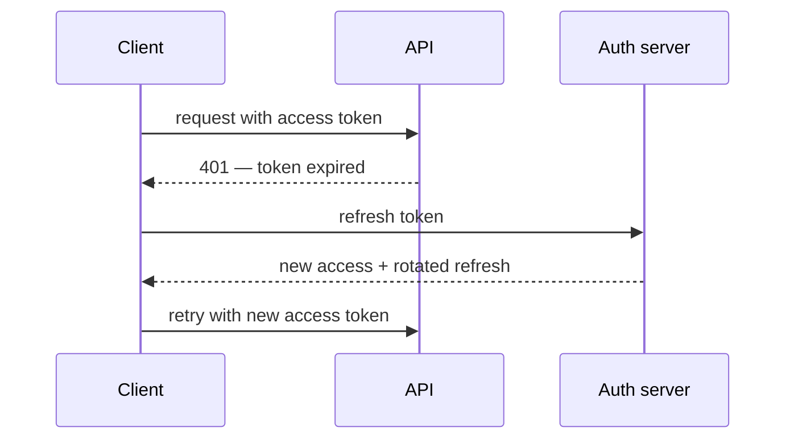

---

### CSRF — Cross-Site Request Forgery

**Що це** — атака, за якої чужий сайт змушує browser надіслати authenticated cookie request.

**Для чого використовується** — захищає cookie-автентифікацію від виконання запиту, що змінює стан, з чужого сайту від імені користувача.

**Як використовується / працює** — застосовую SameSite cookies, CSRF token або origin/referrer validation для state-changing requests.

**Мінуси й обмеження** — CORS не є CSRF захистом; token storage і cross-site flows потребують точної моделі загроз.

```http
# The cookie is not sent from another site + the server verifies the header token.
Set-Cookie: session=opaque-id; Secure; HttpOnly; SameSite=Lax

POST /api/projects/42/delete
X-CSRF-Token: f3a91c0d…
```

---

### XSS — Cross-Site Scripting

**Що це** — клас атак із виконанням недовіреного script в origin застосунку.

**Для чого використовується** — описує ризик виконання чужого сценарію в браузері користувача і спрямовує захист на виведення даних та політику контенту.

**Як використовується / працює** — екраную output за замовчуванням, sanitise-ю дозволений HTML, застосовую CSP і не використовую unsafe DOM sinks.

**Мінуси й обмеження** — ручна regex-sanitization ненадійна; rich-text feature потребує audited sanitizer.

```js
// Dangerous: the user string executes as HTML.
element.innerHTML = comment.text;

// Safe: text stays text.
element.textContent = comment.text;
```

---

### CORS — Cross-Origin Resource Sharing

**Що це** — політика браузера, яка визначає, який cross-origin JavaScript може читати response.

**Для чого використовується** — дозволяє браузерному клієнту на іншому джерелі читати лише явно схвалені відповіді API.

**Як використовується / працює** — сервер дозволяє конкретні origins, methods і headers; credentials потребують точного origin, а не wildcard.

**Мінуси й обмеження** — CORS не захищає server від прямого клієнта і не замінює authentication/authorization.

```http
Access-Control-Allow-Origin: https://app.example.com
Access-Control-Allow-Credentials: true
```

---

### CORS preflight

**Що це** — попередній OPTIONS-запит браузера, який перевіряє, чи дозволяє server cross-origin request з non-simple method або headers.

**Для чого використовується** — дає серверу можливість заздалегідь відхилити небезпечний міжсайтовий запит до надсилання його основного тіла.

**Як використовується / працює** — browser надсилає OPTIONS без credentials; server відповідає allow-origin, methods, headers і за потреби allow-credentials, після чого browser вирішує, чи надсилати actual request.

**Мінуси й обмеження** — preflight додає latency і cache policy; він не захищає API від non-browser client і не замінює auth.

```http
OPTIONS /api/projects
Access-Control-Request-Method: POST
Access-Control-Request-Headers: content-type

HTTP/1.1 204 No Content
Access-Control-Allow-Origin: https://app.example.com
Access-Control-Allow-Methods: POST
Access-Control-Allow-Headers: Content-Type
```

---

### CSP — Content Security Policy

**Що це** — HTTP-політика, яка обмежує допустимі джерела script, style, images і frames.

**Для чого використовується** — обмежує джерела скриптів і ресурсів, зменшуючи наслідки XSS та випадкового підключення недовіреного коду.

**Як використовується / працює** — починаю з report-only, задаю nonce/hash для scripts і поступово посилюю directives.

**Мінуси й обмеження** — policy потребує maintenance і може зламати third-party integrations; вона defence-in-depth, а не заміна output escaping.

```http
Content-Security-Policy: default-src 'self';
  script-src 'self' 'nonce-r4nd0m';
  img-src 'self' https://cdn.example.com;
  frame-ancestors 'none'
```

---

### Rate limiting

**Що це** — обмеження частоти запитів до endpoint за ключем (user, API key, IP).

**Для чого використовується** — захищає API від зловживань, випадкових піків і вичерпання обмеженого ресурсу.

**Як використовується / працює** — обираю key за user/API key/IP, window/bucket і роздільні limits для login, write та expensive operations.

**Мінуси й обмеження** — IP ненадійний за NAT, а distributed limits потребують shared store; legitimate traffic не можна безпідставно блокувати.

```ts
const key = `login:${request.headers.get("x-forwarded-for")}`;
const allowed = await limiter.consume(key, { limit: 5, windowMs: 60_000 });

if (!allowed) return new Response("Too Many Requests", { status: 429 });
```

---

### Webhooks

**Що це** — HTTP-callback: зовнішня система сама надсилає подію на ваш endpoint замість polling.

**Для чого використовується** — дозволяє зовнішній системі повідомляти про зміну одразу, замість постійного опитування її API.

**Як використовується / працює** — перевіряю signature і timestamp, швидко ack-аю, ставлю роботу в queue і дедуплікую event id.

**Мінуси й обмеження** — delivery зазвичай at-least-once і невпорядкований; потрібні retry, idempotency і observability.

```ts
if (!verifySignature(rawBody, request.headers.get("x-signature"))) {
  return new Response("Invalid signature", { status: 401 });
}
await queue.enqueue({ eventId: payload.id, type: payload.type });
return new Response(null, { status: 202 });
```

---

### File uploads

**Що це** — приймання користувацьких файлів, зазвичай напряму в object storage за signed URL.

**Для чого використовується** — відокремлює важке передавання користувацького файлу від основного API і знижує ризик прийняти небезпечний або надмірно великий контент.

**Як використовується / працює** — видаю short-lived signed upload URL, перевіряю size/type server-side, сканую і обробляю async.

**Мінуси й обмеження** — MIME від клієнта довіряти не можна; прямий upload потребує суворих bucket permissions і lifecycle rules.

```ts
const { uploadUrl, fileKey } = await api.createUpload({ name: file.name, size: file.size });
await fetch(uploadUrl, { method: "PUT", body: file, headers: { "Content-Type": file.type } });
await api.completeUpload({ fileKey });
```

---

### Observability

**Що це** — властивість системи бути зрозумілою ззовні через logs, metrics і traces.

**Для чого використовується** — дозволяє зрозуміти поведінку production-системи за телеметрією і знайти причину збою без локального відтворення.

**Як використовується / працює** — додаю correlation id, structured logs, latency/error metrics і tracing по critical request path.

**Мінуси й обмеження** — telemetry коштує грошей і може спричинити витік PII; сигнал має бути actionable, а не просто шумним.

---

## SQL & Databases

---

### Relational model

**Що це** — модель даних із таблиць, ключів і constraints з підтримкою транзакцій.

**Для чого використовується** — дає надійну модель пов'язаних сутностей, обмежень і запитів для транзакційних продуктових даних.

**Як використовується / працює** — моделюю tables, primary/foreign keys і constraints навколо domain invariants, а не навколо екранів UI.

**Мінуси й обмеження** — join-heavy schema вимагає розуміння access patterns; не кожне навантаження краще розв'язується реляційною БД.

---

### Normalization

**Що це** — приведення схеми до форми, де кожен незалежний факт зберігається один раз.

**Для чого використовується** — зменшує суперечливі дублі даних і спрощує оновлення єдиного джерела істини.

**Як використовується / працює** — тримаю user, organization і membership окремо, пов'язуючи їх keys і constraints.

**Мінуси й обмеження** — надмірна нормалізація ускладнює hot reads; свідома денормалізація допустима з ownership і repair plan.

```sql
-- Before: a repeating group in one column.
-- orders(id, customer_name, products = 'camera, tripod')

-- After: each fact is stored once.
CREATE TABLE orders (
  id          bigint PRIMARY KEY,
  customer_id bigint REFERENCES customers (id)
);
CREATE TABLE order_items (
  order_id   bigint REFERENCES orders (id),
  product_id bigint REFERENCES products (id)
);
```

---

### Primary and foreign keys

**Що це** — primary key однозначно ідентифікує row, foreign key зберігає посилальну цілісність.

**Для чого використовується** — не дає втратити ідентичність запису і створити посилання на неіснуючу пов'язану сутність.

**Як використовується / працює** — обираю stable ID, додаю FK і явну on delete policy за бізнес-сенсом.

**Мінуси й обмеження** — cascade delete може несподівано видалити дані; відсутність FK переносить цілісність у крихкий application code.

```sql
CREATE TABLE comments (
  id         bigint GENERATED ALWAYS AS IDENTITY PRIMARY KEY,
  project_id bigint NOT NULL REFERENCES projects (id) ON DELETE CASCADE,
  body       text NOT NULL
);
```

---

### Index

**Що це** — допоміжна структура даних БД для швидкого lookup, sorting або join.

**Для чого використовується** — скорочує затримку частих фільтрів, сортувань і з'єднань таблиць без зміни інтерфейсу запиту.

**Як використовується / працює** — будую index під реальний WHERE/JOIN/ORDER BY, перевіряю EXPLAIN і selectivity.

**Мінуси й обмеження** — зайві indexes сповільнюють insert/update; index не врятує query, що повертає забагато даних.

```sql
CREATE INDEX projects_workspace_created_at_idx
ON projects (workspace_id, created_at DESC);
```

---

### Composite index

**Що це** — індекс за кількома колонками в заданому порядку.

**Для чого використовується** — прискорює реальний багатоколонковий шаблон запиту, коли одного індексу на окремому полі недостатньо.

**Як використовується / працює** — порядок колонок обираю за equality predicates, потім range/sort і фактичним query plan.

**Мінуси й обмеження** — index (a,b) не рівноцінно допомагає запиту лише за b; не вгадую порядок без EXPLAIN.

```sql
CREATE INDEX projects_workspace_updated_idx
  ON projects (workspace_id, updated_at DESC);

-- Speeds up: WHERE workspace_id = $1 ORDER BY updated_at DESC
```

---

### Query plan / EXPLAIN

**Що це** — EXPLAIN показує оцінний plan optimizer-а; EXPLAIN ANALYZE виконує запит і показує actual rows/time.

**Для чого використовується** — показує фактичну стратегію БД і дозволяє виправляти повільний запит за даними, а не здогадками.

**Як використовується / працює** — починаю з EXPLAIN, потім у безпечному середовищі порівнюю estimated і actual rows через EXPLAIN ANALYZE, шукаю sequential scan, bad join order і missing index.

**Мінуси й обмеження** — ANALYZE реально виконує запит, тому небезпечний для destructive statement-ів; plan залежить від data distribution і stats, а локальна маленька БД може приховати production проблему.

```sql
EXPLAIN ANALYZE
SELECT id, title
FROM projects
WHERE workspace_id = $1
ORDER BY updated_at DESC
LIMIT 20;
```

---

### JOIN

**Що це** — операція SQL, що об'єднує rows із таблиць за умовою зв'язку.

**Для чого використовується** — дозволяє отримати пов'язані дані за один узгоджений запит замість склеювання записів у застосунку.

**Як використовується / працює** — INNER JOIN бере збіги, LEFT JOIN зберігає ліву сторону; обираю лише потрібні columns.

**Мінуси й обмеження** — join з one-to-many розмножує батьківські rows; потрібно розуміти cardinality і pagination.

```sql
SELECT p.id, p.name, u.name AS owner_name
FROM projects p
LEFT JOIN users u ON u.id = p.owner_id;
```

---

### N+1 queries

**Що це** — анти-патерн, за якого після одного list query виконується запит на кожен рядок.

**Для чого використовується** — виявляє причину зростання затримки пропорційно до кількості рядків і підказує об'єднати або пакетувати запити.

**Як використовується / працює** — виявляю через trace/logs, потім роблю join, batch IN query або ORM eager loading.

**Мінуси й обмеження** — giant join теж може роздувати response; лікую конкретний access pattern, а не лише кількість запитів.

```sql
-- Instead of querying the author for every project:
SELECT p.id, p.title, u.name AS author_name
FROM projects p
JOIN users u ON u.id = p.author_id
WHERE p.workspace_id = $1;
```

---

### Transactions

**Що це** — одиниця роботи БД, у якій пов'язані writes фіксуються разом або відкочуються разом.

**Для чого використовується** — не допускає часткового застосування пов'язаної бізнес-зміни, наприклад переказу грошей або зміни членства.

**Як використовується / працює** — обгортаю зміну балансу, membership або status transition у short DB transaction.

**Мінуси й обмеження** — не можна тримати transaction під час мережевого виклику або user input; long transactions створюють contention.

```sql
BEGIN;
UPDATE accounts SET balance = balance - 10 WHERE id = $1;
UPDATE accounts SET balance = balance + 10 WHERE id = $2;
COMMIT;
```

---

### ACID — Atomicity, Consistency, Isolation, Durability

**Що це** — набір гарантій транзакційної БД: atomicity, consistency, isolation, durability.

**Для чого використовується** — задає очікувані гарантії для критичних змін даних і допомагає обрати відповідний рівень ізоляції.

**Як використовується / працює** — спираюся на atomic commit і constraints, обираю isolation level за ризиком конкурентних аномалій.

**Мінуси й обмеження** — ACID не робить весь distributed workflow атомарним і не скасовує application bugs.

```sql
BEGIN;
UPDATE accounts SET balance = balance - 100 WHERE id = 1;
UPDATE accounts SET balance = balance + 100 WHERE id = 2;
COMMIT; -- atomic: both changes or neither, even on failure
```

---

### Isolation levels

**Що це** — налаштування транзакції, що визначає, які concurrent changes вона бачить.

**Для чого використовується** — дозволяє врівноважити коректність конкурентних операцій і вартість блокувань для конкретного сценарію.

**Як використовується / працює** — починаю з database default, потім посилюю isolation або locking лише для доведеного race.

**Мінуси й обмеження** — суворіша isolation знижує concurrency і може давати serialization failures, які потрібно retry-їти.

```sql
BEGIN ISOLATION LEVEL REPEATABLE READ;
SELECT balance FROM accounts WHERE id = 1;
-- A repeated SELECT returns the same value: a concurrent COMMIT is not visible here.
COMMIT;
```

---

### Optimistic locking

**Що це** — контроль конкурентних змін через версію запису замість утримання lock.

**Для чого використовується** — запобігає мовчазній втраті зміни за рідкісних конфліктів без утримання блокування під час редагування.

**Як використовується / працює** — row зберігає version/updatedAt; UPDATE включає old version у WHERE і перевіряє affected rows.

**Мінуси й обмеження** — conflict має бути зрозумілим користувачеві; за частих collisions pessimistic lock може бути кращим.

```sql
UPDATE documents
SET body = $1, version = version + 1
WHERE id = $2 AND version = $3;
```

---

### Pessimistic locking

**Що це** — явне блокування row у transaction на час зміни.

**Для чого використовується** — захищає критичний ресурс за частих конфліктів, коли відкат оптимістичної зміни надто дорогий.

**Як використовується / працює** — SELECT FOR UPDATE беру коротко перед write і звільняю lock разом із commit/rollback.

**Мінуси й обмеження** — створює waits/deadlocks і погано підходить для довгих user-driven flows.

```sql
BEGIN;
SELECT id, seats_left FROM workshops WHERE id = $1 FOR UPDATE;
UPDATE workshops SET seats_left = seats_left - 1 WHERE id = $1 AND seats_left > 0;
COMMIT;
```

---

### Deadlocks

**Що це** — взаємне блокування, за якого transactions циклічно чекають на locks одна одної.

**Для чого використовується** — повідомляє про циклічне очікування транзакцій і допомагає шукати конфліктний порядок захоплення блокувань.

**Як використовується / працює** — беру resources в єдиному порядку, тримаю transactions короткими і retry-ю безпечну aborted transaction.

**Мінуси й обмеження** — retry не виправляє логічну contention проблему; потрібні метрики і root-cause analysis.

```sql
-- T1: UPDATE accounts ... WHERE id = 1;  then waits for the lock on id = 2
-- T2: UPDATE accounts ... WHERE id = 2;  then waits for the lock on id = 1
-- Cycle: the database aborts one transaction.
-- Fix: acquire rows in one consistent order (for example, by id).
```

---

### Unique constraints

**Що це** — обмеження БД, що гарантує унікальність значення або комбінації колонок.

**Для чого використовується** — переносить гарантію унікальності в базу даних і захищає від гонок між паралельними запитами.

**Як використовується / працює** — задаю unique на email або tenant-plus-slug і перетворюю violation на зрозумілу domain error.

**Мінуси й обмеження** — pre-check «такий email є?» не замінює constraint; nullable semantics відрізняються між БД.

```sql
ALTER TABLE users ADD CONSTRAINT users_email_unique UNIQUE (email);
-- A race between two concurrent signups yields error 23505, not a duplicate.
```

---

### Migrations

**Що це** — версіоновані скрипти зміни schema, що застосовуються разом із кодом.

**Для чого використовується** — робить зміну схеми повторюваною, перевірюваною і узгодженою між розробкою, CI і продакшеном.

**Як використовується / працює** — роблю additive change, backfill, dual-read/write за потреби, потім окреме removal після deploy.

**Мінуси й обмеження** — destructive migration або long lock небезпечні; migration має бути tested на realistic copy/data size.

```sql
-- Step 1: safe additive schema change.
ALTER TABLE projects ADD COLUMN slug text;
-- Step 2: backfill; new code writes both fields.
-- Step 3: add NOT NULL/UNIQUE only after rollout.
```

---

### Soft delete

**Що це** — позначення запису видаленим (deletedAt) замість фізичного видалення.

**Для чого використовується** — зберігає можливість аудиту і відновлення запису, коли фізичне видалення небезпечне або передчасне.

**Як використовується / працює** — додаю deletedAt і централізований default scope, а для GDPR визначаю окреме purge правило.

**Мінуси й обмеження** — усі queries мають фільтрувати deleted rows; unique indexes і відновлення ускладнюються.

```sql
ALTER TABLE projects ADD COLUMN deleted_at timestamptz;

-- Uniqueness among live rows only:
CREATE UNIQUE INDEX projects_slug_alive_idx
  ON projects (slug) WHERE deleted_at IS NULL;
```

---

### JSON columns

**Що це** — колонки типу JSON/JSONB для зберігання варіативного attribute set.

**Для чого використовується** — дозволяє зберігати рідкісні або еволюційні атрибути без міграції кожної варіації схеми.

**Як використовується / працює** — залишаю core relational fields у columns, валідую JSON на записі і index-ую лише потрібні paths.

**Мінуси й обмеження** — JSON не привід уникати model design; queries, constraints і migrations стають складнішими.

```sql
SELECT id FROM projects
WHERE settings @> '{"autosave": true}'; -- JSONB containment

CREATE INDEX projects_settings_idx ON projects USING gin (settings);
```

---

## Testing & DevOps

---

### Unit tests

**Що це** — швидкі тести ізольованого business rule або pure function.

**Для чого використовується** — швидко фіксує бізнес-правило й захищає його від регресії без запуску мережі, браузера чи бази даних.

**Як використовується / працює** — тестую observable behavior з детермінованими inputs, особливо boundary та unhappy paths.

**Мінуси й обмеження** — unit tests не доводять інтеграцію, schema correctness або справжній browser flow.

```ts
test("rejects an expired token", () => {
  expect(validateToken(expiredToken)).toEqual({ ok: false, reason: "expired" });
});
```

---

### Integration tests

**Що це** — тести спільної роботи modules, HTTP layer, database або queue boundary.

**Для чого використовується** — перевіряє, що домовленість між шарами справді працює, а не лише що кожен шар коректний ізольовано.

**Як використовується / працює** — піднімаю реальний/ephemeral dependency або contract-faithful fake і перевіряю повний outcome.

**Мінуси й обмеження** — повільніші й крихкіші за unit tests; test data та isolation потребують дисципліни.

```ts
test("POST /projects persists a project", async () => {
  const response = await app.fetch(new Request("http://app/projects", { method: "POST", body: '{"name":"Demo"}' }));
  expect(response.status).toBe(201);
});
```

---

### End-to-end tests

**Що це** — тести користувацького шляху через справжній browser і deployed-like систему.

**Для чого використовується** — страхує найцінніші користувацькі сценарії від поломок, яких не видно на рівні окремих модулів.

**Як використовується / працює** — покриваю login, critical create/edit flow і visual assertion там, де ризик виправдовує вартість.

**Мінуси й обмеження** — повільні та flaky, тому не замінюють unit/integration tests і потребують stable selectors.

```ts
test("user can create a project", async ({ page }) => {
  await page.goto("/projects");
  await page.getByRole("button", { name: "Create project" }).click();
  await page.getByLabel("Name").fill("Demo");
  await page.getByRole("button", { name: "Save" }).click();
  await expect(page.getByText("Demo")).toBeVisible();
});
```

---

### Test pyramid

**Що це** — евристика розподілу тестів: багато швидких unit, менше integration, одиниці E2E.

**Для чого використовується** — утримує зворотний зв'язок швидким і стійким, залишаючи дорогі E2E лише для справді критичних шляхів.

**Як використовується / працює** — більшу частину logic перевіряю unit, boundaries integration, а кілька golden journeys end-to-end.

**Мінуси й обмеження** — це евристика, а не quota; продукт із важкою UI-інтеграцією може потребувати іншої форми.

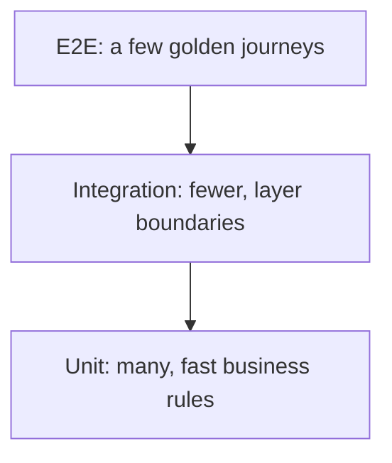

---

### Mock vs fake vs stub

**Що це** — три види тестових замін: stub повертає готову відповідь, fake — робоча спрощена реалізація, mock перевіряє interaction.

**Для чого використовується** — допомагає обрати тестову заміну, яка ізолює перевірку, але не робить тест безглуздо схожим на реалізацію.

**Як використовується / працює** — віддаю перевагу fake/stub для outcome tests, mock застосовую вузько для важливого side effect.

**Мінуси й обмеження** — tests, прив'язані до внутрішніх викликів, ламаються під час безпечного refactor.

```ts
const stub = { getRate: () => 0.2 };      // canned answer
const fake = new InMemoryProjectRepo();   // working simplified implementation
const mock = vi.fn();                     // verifies interaction

await chargeUser(user, { sendReceipt: mock });
expect(mock).toHaveBeenCalledWith(user.email);
```

---

### Contract testing

**Що це** — тести узгодженості producer і consumer за API/message contract.

**Для чого використовується** — ловить несумісну зміну API до того, як вона потрапить до споживача окремого сервісу.

**Як використовується / працює** — фіксую request/response schema та compatibility checks у CI, особливо між independently deployed services.

**Мінуси й обмеження** — не замінює end-to-end behavior і потребує ownership/versioning contract-у.

```ts
expect(response).toMatchObject({
  status: 200,
  body: { id: expect.any(String), title: expect.any(String) },
});
```

---

### TDD — Test-Driven Development

**Що це** — цикл розробки red → green → refactor: тест формулює behavior до реалізації.

**Для чого використовується** — змушує сформулювати спостережувану поведінку до реалізації та залишає регресійний тест разом із рішенням.

**Як використовується / працює** — red test описує acceptance criterion, green implementation робить його pass, refactor зберігає clarity.

**Мінуси й обмеження** — не перетворюю TDD на ритуал для CSS чи exploratory prototype; тест має бути meaningful.

---

### Test flakiness

**Що це** — недетерміновані падіння тесту, що руйнують довіру до CI.

**Для чого використовується** — сигналізує, що тест залежить від часу, порядку, спільного середовища або мережі; це привід шукати джерело недетермінізму, а не лише перезапускати тест.

**Як використовується / працює** — прибираю real time, random, shared state, arbitrary sleeps і network dependency; retry — лише тимчасовий containment.

**Мінуси й обмеження** — ігнорувати flaky test небезпечно: він приховує regression і сповільнює команду.

---

### CI — Continuous Integration

**Що це** — автоматична перевірка кожної зміни до merge у спільну гілку.

**Для чого використовується** — не дає неперевіреній зміні потрапити до спільної гілки й робить якість збірки спільним правилом команди.

**Як використовується / працює** — запускаю typecheck, tests, lint, build і швидкі security checks на clean reproducible environment.

**Мінуси й обмеження** — повільний/noisy pipeline обходять; local і CI gates мають бути узгоджені.

```yaml
- run: bun install --frozen-lockfile
- run: bun run lint
- run: bun test
```

---

### CD — Continuous Delivery / Continuous Deployment

**Що це** — repeatable процес доставлення перевіреного artifact до environment.

**Для чого використовується** — скорочує ризик і час доставлення перевіреної версії від коміту до оточення.

**Як використовується / працює** — build once, promote artifact, застосовую migrations/health checks і зберігаю audit trail deployment-у.

**Мінуси й обмеження** — автоматичний deploy не скасовує feature flags, monitoring і rollback plan.

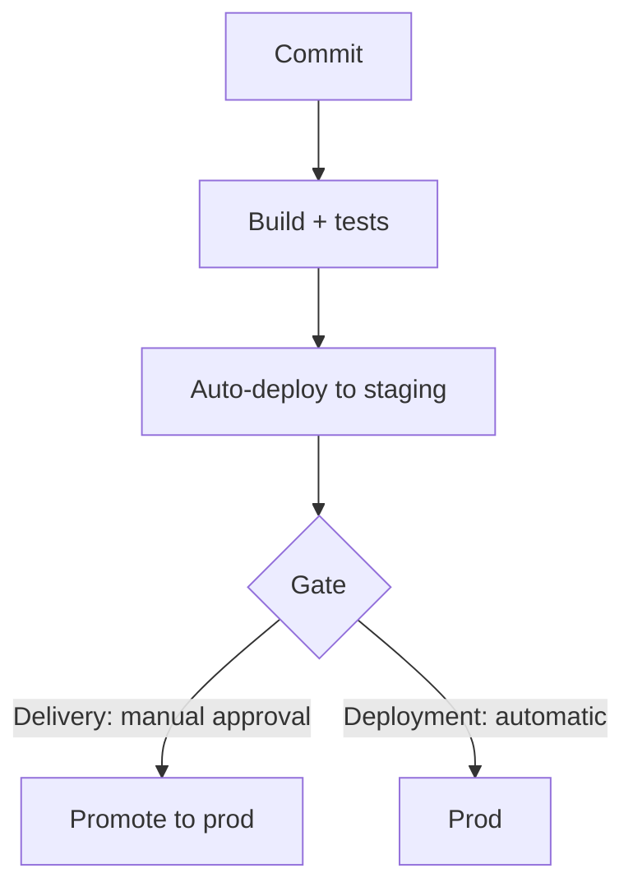

---

### Docker

**Що це** — контейнеризація: пакування застосунку й dependencies у відтворюваний image.

**Для чого використовується** — зменшує розбіжність між локальною розробкою, CI та розгорнутим оточенням.

**Як використовується / працює** — multi-stage build залишає runtime image маленьким, pin-ю base image і запускаю як non-root.

**Мінуси й обмеження** — container не замінює config/security/observability; large image погіршує cold start і supply-chain ризик.

```dockerfile
FROM node:22-alpine AS build
WORKDIR /app
COPY . .
RUN npm ci && npm run build
FROM node:22-alpine
COPY --from=build /app/dist ./dist
CMD ["node", "dist/server.js"]
```

---

### Environment configuration

**Що це** — винесення deploy-specific values і secrets із application code в оточення.

**Для чого використовується** — відокремлює код від різних адрес, секретів і перемикачів оточень без вшивання їх у збірку.

**Як використовується / працює** — валідую env schema на startup, зберігаю secrets у secret manager і документую required variables.

**Мінуси й обмеження** — env sprawl не замінює typed config; secret не можна логувати або відправляти в client bundle.

```ts
const config = {
  databaseUrl: process.env.DATABASE_URL,
  port: Number(process.env.PORT ?? 3000),
};

if (!config.databaseUrl) throw new Error("DATABASE_URL is required");
```

---

### Feature flags

**Що це** — runtime-перемикачі функціональності, що розділяють deploy і release.

**Для чого використовується** — дозволяє вмикати функцію поступово, тестувати на сегменті та швидко зупинити її без нового розгортання.

**Як використовується / працює** — flag має owner, audience, expiry і metric; rollout роблю за tenant/user percentage.

**Мінуси й обмеження** — stale flags створюють combinatorial complexity; security-sensitive access не можна залишати лише на frontend flag.

```ts
if (flags.isEnabled("new-timeline", { tenantId, userId })) {
  return <NewTimeline />;
}
return <LegacyTimeline />;
```

---

### Blue-green deployment

**Що це** — схема релізу з двома однаковими оточеннями та перемиканням traffic між ними.

**Для чого використовується** — дає швидке й оборотне перемикання між двома версіями застосунку під час випуску.

**Як використовується / працює** — нова environment проходить smoke/health checks, потім load balancer переводить traffic.

**Мінуси й обмеження** — подвоює infrastructure на певний час і потребує backward-compatible DB schema.

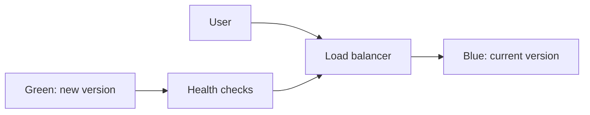

---

### Canary deployment

**Що це** — схема релізу з поступовим переведенням малої частки користувачів на нову версію.

**Для чого використовується** — обмежує радіус ураження нової версії, спочатку показуючи її невеликій частці трафіку.

**Як використовується / працює** — поступово збільшую traffic за стабільних error, latency і business metrics.

**Мінуси й обмеження** — потрібен хороший observability і статистично достатньо traffic; проблеми data migration можуть зачепити всіх.

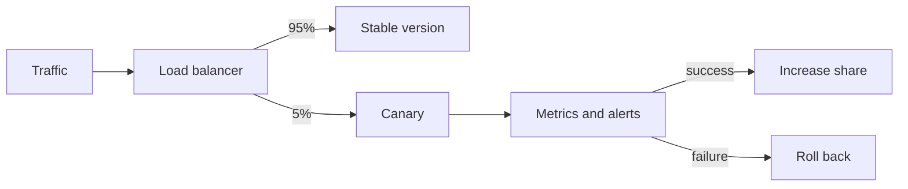

---

### Rollback

**Що це** — повернення сервісу до відомої working version після harmful release.

**Для чого використовується** — скорочує час відновлення після невдалого релізу й робить ризик випуску керованим.

**Як використовується / працює** — заздалегідь визначаю trigger, one-click artifact rollback і compatible schema/feature flags.

**Мінуси й обмеження** — code rollback не скасовує незворотну data mutation, тому critical writes потребують repair strategy.

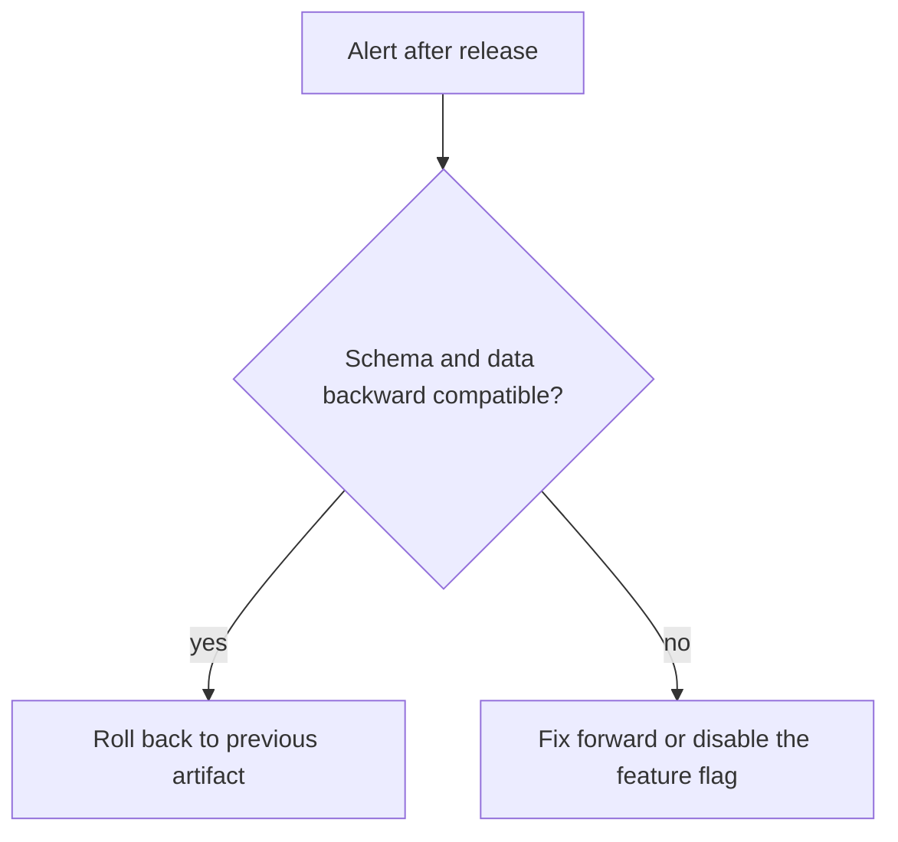

---

### SLI, SLO, SLA — Service Level Indicator, Objective, Agreement

**Що це** — SLI вимірює service behavior, SLO задає цільовий рівень, SLA — зовнішня обіцянка з наслідками.

**Для чого використовується** — переводить надійність сервісу у вимірювані цілі й дає error budget для рішень про темп релізів.

**Як використовується / працює** — обираю user-facing indicator, наприклад successful video publish latency, і error budget для release decisions.

**Мінуси й обмеження** — metric без user value стимулює хибну оптимізацію; SLA не варто обіцяти без operational capacity.

---

### Incident response

**Що це** — процес реакції на production incident: ролі, комунікація, стабілізація, postmortem.

**Для чого використовується** — скорочує збитки й час відновлення під час production-збою завдяки заздалегідь визначеним ролям і процесу.

**Як використовується / працює** — призначаю incident lead, фіксую timeline, стабілізую service, communicate-ю і роблю blameless postmortem.

**Мінуси й обмеження** — postmortem без follow-up owners нічого не змінює; не треба в момент інциденту шукати винного.

---

## Architecture & System Design

---

### Monolith

**Що це** — архітектура з однією deployable одиницею для всієї product functionality.

**Для чого використовується** — мінімізує операційну складність, доки межі домену й незалежне масштабування не вимагають окремих сервісів.

**Як використовується / працює** — тримаю clear modules та internal boundaries всередині одного repo/process, виділяючи сервіс лише за доведеного тиску.

**Мінуси й обмеження** — без modularity зростає coupling і deployment blast radius; один runtime не означає один величезний файл.

---

### Microservices

**Що це** — архітектура з незалежно розгортуваних сервісів навколо bounded contexts.

**Для чого використовується** — дає незалежне володіння, масштабування та випуск лише там, де ця свобода виправдовує розподілену складність.

**Як використовується / працює** — виділяю service після ясної domain boundary, API ownership і operational capability команди.

**Мінуси й обмеження** — додає network, distributed data, observability та on-call complexity; не стартова архітектура за замовчуванням.

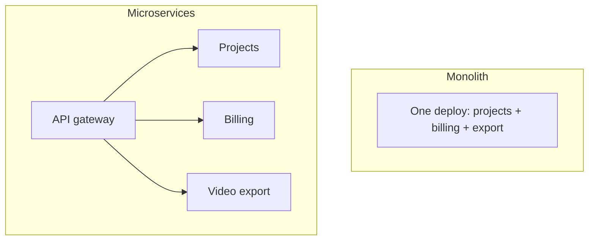

---

### Modular monolith

**Що це** — моноліт із domain modules та enforced internal boundaries всередині одного deployable.

**Для чого використовується** — зберігає простоту одного розгортання, але не дозволяє доменним частинам непомітно перетворитися на спагеті-код.

**Як використовується / працює** — модулі спілкуються через explicit interfaces/events, не імпортують private persistence деталі одне одного.

**Мінуси й обмеження** — boundaries вимагають discipline/tooling; shared database усе ще допускає обхід архітектури.

---

### Bounded context

**Що це** — межа домену, всередині якої term і model мають одне точне значення.

**Для чого використовується** — запобігає змішуванню різних значень тих самих сутностей між командами та доменами.

**Як використовується / працює** — відокремлюю, наприклад, content authoring, rendering і billing з явними translated contracts між ними.

**Мінуси й обмеження** — не ділю за таблицями чи оргструктурою механічно; boundary має відображати мову та change patterns.

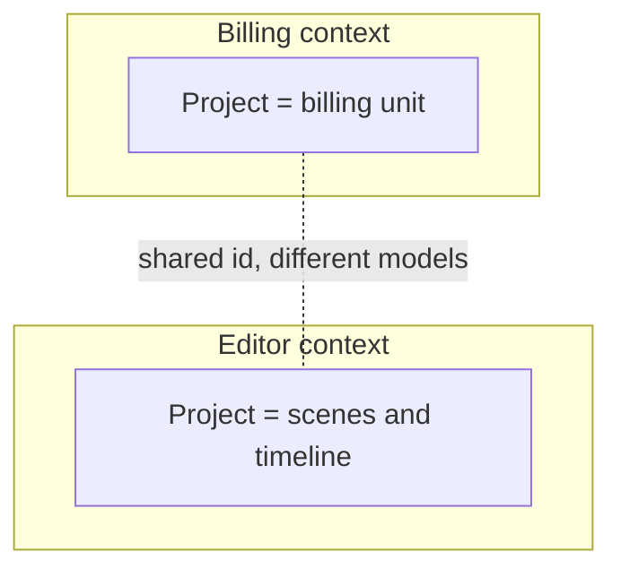

---

### Clean architecture

**Що це** — шарувата архітектура, де domain/use-case logic не залежить від framework, database і transport.

**Для чого використовується** — знижує залежність бізнес-правил від фреймворку, бази та транспорту, полегшуючи тестування й заміну інфраструктури.

**Як використовується / працює** — handlers/adapters перекладають input, application service застосовує business rule через ports.

**Мінуси й обмеження** — зайві layers для простої CRUD-фічі сповільнюють delivery; abstraction має відповідати volatility.

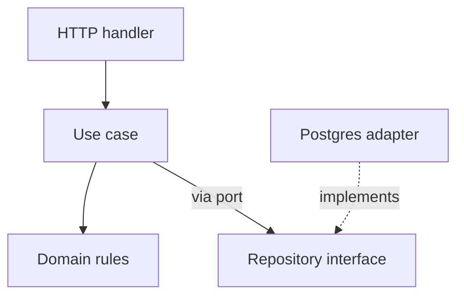

---

### Hexagonal architecture

**Що це** — архітектура ports-and-adapters: domain спілкується з HTTP, DB, queue та зовнішніми API через інтерфейси.

**Для чого використовується** — дає застосунку змінювати HTTP, базу, чергу чи зовнішній сервіс через адаптери без переписування доменної логіки.

**Як використовується / працює** — use case залежить від interface, а конкретний adapter підключається на composition root.

**Мінуси й обмеження** — не кожен helper заслуговує на port; забагато interfaces приховує простий flow.

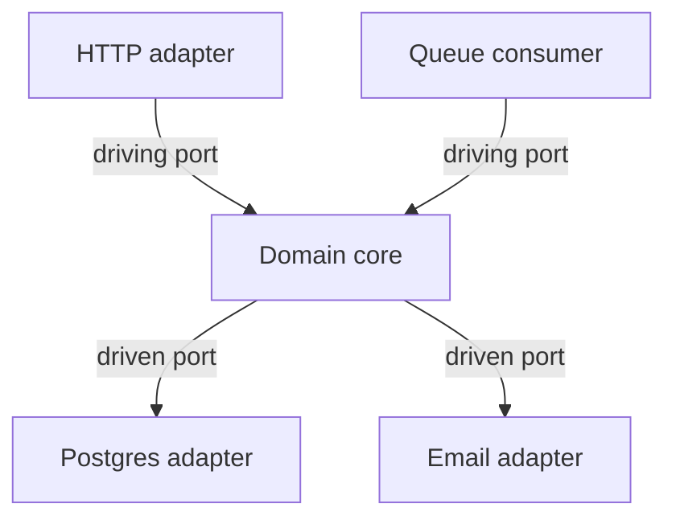

---

### CQRS — Command Query Responsibility Segregation

**Що це** — патерн розділення моделей і шляхів команд (write) та читання (read).

**Для чого використовується** — дозволяє оптимізувати читання й запис під різні вимоги, коли однієї моделі стає недостатньо.

**Як використовується / працює** — write model захищає invariants, read projection оптимізується під конкретний screen/query.

**Мінуси й обмеження** — ускладнює consistency та operations; для звичайного CRUD часто достатньо звичайної read model.

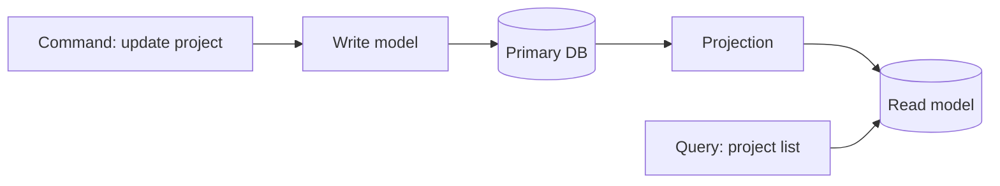

---

### Event sourcing

**Що це** — зберігання стану як immutable послідовності domain events.

**Для чого використовується** — зберігає повну історію бізнес-змін і дозволяє відновити стан або побудувати нове подання даних.

**Як використовується / працює** — aggregate відтворюється з events, projections будують read models, schema events version-ується.

**Мінуси й обмеження** — replay, evolution, debugging та eventual consistency дорогі; audit log сам по собі не вимагає event sourcing.

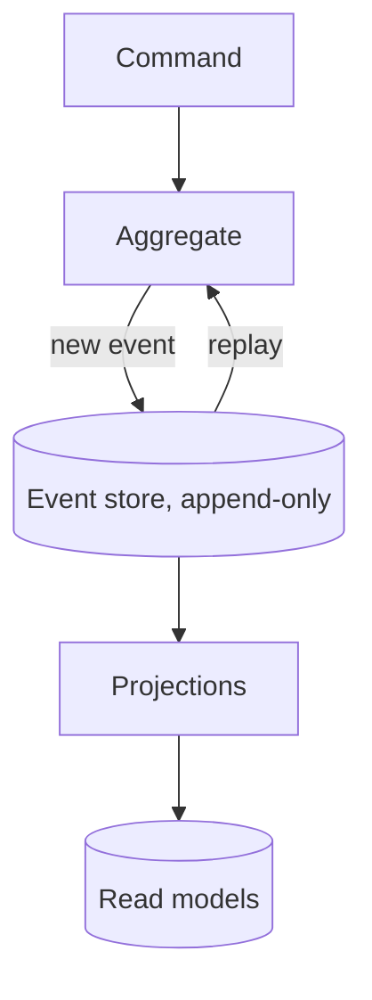

---

### Event-driven architecture

**Що це** — архітектура, де producer публікує події, а asynchronous consumers реагують на них.

**Для чого використовується** — послаблює зв’язок між виробником і споживачами фонових дій та інтеграцій.

**Як використовується / працює** — producer публікує named fact, consumers idempotently обробляють його та моніторять lag/failure.

**Мінуси й обмеження** — tracing і ordering складніші; event не можна трактувати як synchronous RPC з іншою назвою.

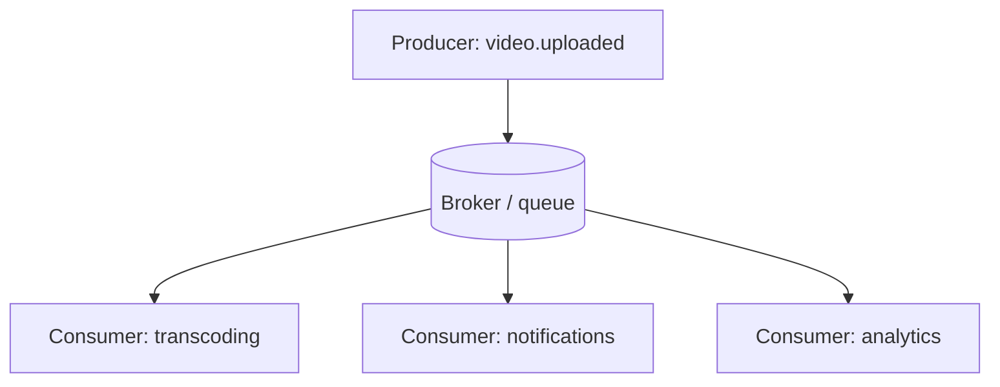

---

### WebSocket

**Що це** — протокол двостороннього persistent connection між client і server поверх одного TCP-з’єднання.

**Для чого використовується** — доставляє двосторонні оновлення з малою затримкою для спільної роботи, статусу та присутності.

**Як використовується / працює** — встановлюю authenticated connection, задаю message schema/version, heartbeat, reconnect/backoff і server-side fan-out через pub/sub за кількох instances.

**Мінуси й обмеження** — connection lifecycle, scaling і authorization складніші за HTTP; не використовую WebSocket, якщо рідкісний update простіше доставити polling або SSE.

```ts
const socket = new WebSocket("wss://api.example.com/live");
socket.addEventListener("message", ({ data }) => updateProject(JSON.parse(data)));
```

---

### SSE — Server-Sent Events

**Що це** — односторонній server-to-client stream подій по звичайному HTTP (EventSource).

**Для чого використовується** — спрощує односторонню доставку прогресу й сповіщень через звичайне HTTP-з’єднання.

**Як використовується / працює** — browser відкриває EventSource, server надсилає named events та id; client робить reconnect і може передати last event id для continuation.

**Мінуси й обмеження** — канал односторонній і text-based; client-to-server commands все одно йдуть звичайним HTTP, а connection limits/proxy buffering треба перевірити.

```ts
const events = new EventSource("/api/jobs/42/events");
events.addEventListener("progress", (event) => setProgress(JSON.parse(event.data)));
```

---

### Message queue

**Що це** — буфер асинхронних задач між producer і worker-ами.

**Для чого використовується** — відокремлює довгу або повторювану роботу від HTTP-відповіді та згладжує тимчасові піки навантаження.

**Як використовується / працює** — API зберігає job, enqueue-ить message, worker бере task з retry, visibility timeout і dead-letter policy.

**Мінуси й обмеження** — queue зазвичай at-least-once; handler зобов’язаний бути idempotent і observable.

```ts
await queue.enqueue({ type: "render-video", jobId });
queue.consume("render-video", async ({ jobId }) => await renderVideo(jobId));
```

---

### Idempotent consumer

**Що це** — обробник повідомлень, у якого повторна доставка не повторює side effect.

**Для чого використовується** — не дає повторній доставці повідомлення повторно виконати побічний ефект, наприклад списання чи надсилання листа.

**Як використовується / працює** — зберігаю processed event id або роблю write природно unique/conditional у transaction.

**Мінуси й обмеження** — dedup store теж вимагає retention і concurrency safety; не покладаюся лише на message broker.

```sql
INSERT INTO processed_events (event_id) VALUES ($1)
ON CONFLICT DO NOTHING;
-- Run the side effect only if a new row was inserted.
```

---

### Outbox pattern

**Що це** — патерн атомарного запису події в таблицю outbox тією ж транзакцією, що й business write.

**Для чого використовується** — не втрачає подію між успішним записом у БД і публікацією в брокер.

**Як використовується / працює** — business write і outbox row пишуться однією transaction; relay публікує row і позначає його delivered.

**Мінуси й обмеження** — додає polling/relay/cleanup, а consumer все одно має бути idempotent.

```sql
BEGIN;
INSERT INTO videos (id, status) VALUES ($1, 'queued');
INSERT INTO outbox (topic, payload) VALUES ('video.queued', json_build_object('id', $1));
COMMIT;
```

---

### Cache-aside

**Що це** — патерн кешування: застосунок сам читає cache, за miss іде в БД і заповнює cache.

**Для чого використовується** — знижує затримку й навантаження читання, зберігаючи базу даних джерелом істини.

**Як використовується / працює** — read пробує cache, за miss читає DB і заповнює TTL; mutation invalidates/updates key.

**Мінуси й обмеження** — stale cache і stampede вимагають design; не можна кешувати без явної freshness requirement.

```ts
let project = await cache.get(`project:${id}`);
if (!project) {
  project = await db.projects.find(id);
  await cache.set(`project:${id}`, project, { ttl: 60 });
}
```

---

### Distributed lock

**Що це** — механізм взаємного виключення між instances через спільне сховище (lease з TTL).

**Для чого використовується** — координує єдине виконання критичної задачі кількома екземплярами застосунку.

**Як використовується / працює** — застосовую lease з TTL і owner token, а downstream write роблю safe за duplicate execution.

**Мінуси й обмеження** — lock може спливти під час роботи; це не магія exactly-once і вимагає failure model.

```ts
const token = crypto.randomUUID();
const lock = await redis.set(`render:${videoId}`, token, { NX: true, PX: 30_000 });
if (!lock) return;
try {
  await renderVideo(videoId);
} finally {
  // Atomic compare-and-delete: never release a lease acquired by another worker.
  await redis.eval(
    'if redis.call("get", KEYS[1]) == ARGV[1] then return redis.call("del", KEYS[1]) end',
    { keys: [`render:${videoId}`], arguments: [token] },
  );
}
```

---

### Load balancing

**Що це** — розподіл requests між healthy instances через виділений балансувальник.

**Для чого використовується** — розподіляє навантаження й дає застосунку пережити відмову окремого екземпляра.

**Як використовується / працює** — load balancer робить health checks, routing та іноді sticky sessions; app залишається stateless наскільки можливо.

**Мінуси й обмеження** — session affinity погіршує баланс і failover; shared dependencies часто стають реальним bottleneck.

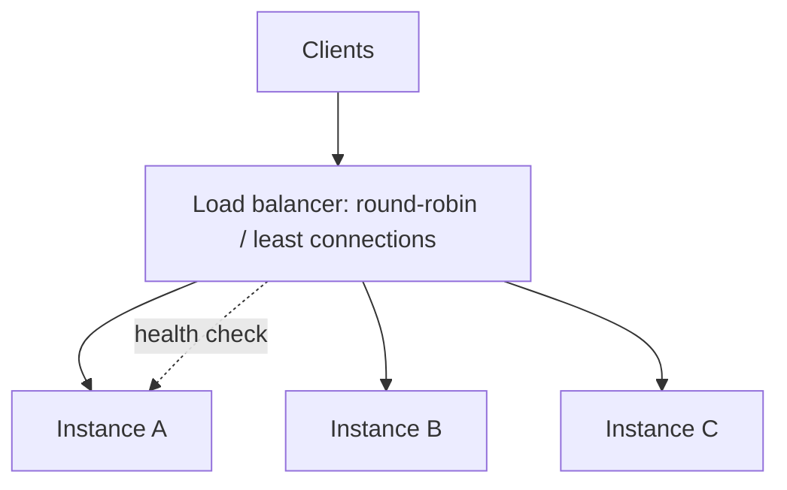

---

### Backpressure

**Що це** — механізм стримування producer-а, коли робота надходить швидше, ніж consumer її обробляє.

**Для чого використовується** — повідомляє, що вхідний потік роботи перевищує пропускну здатність споживача, і підказує обмежити паралелізм, чергу або швидкість приймання.

**Як використовується / працює** — обмежую concurrency/queue size, повертаю retryable response або сповільнюю producer, моніторю lag.

**Мінуси й обмеження** — dropping/limiting work — product decision; нескінченна черга лише відкладе failure.

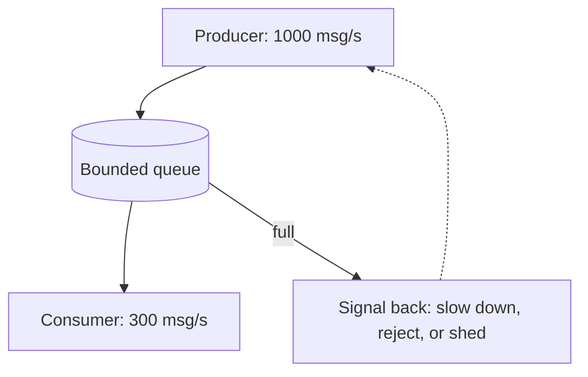

---

### Rate limiting vs backpressure

**Що це** — rate limit захищає policy/abuse boundary, backpressure захищає downstream capacity.

**Для чого використовується** — розділяє захист політики API і захист реальної пропускної здатності залежних систем.

**Як використовується / працює** — API limit ставлю на caller, а concurrency/queue limit — на service or worker capacity.

**Мінуси й обмеження** — один механізм не замінює інший; limits без user messaging виглядають як випадкова поломка.

---

### System-design interview framing

**Що це** — структура відповіді на system-design інтерв’ю: від вимог до обґрунтованої схеми.

**Для чого використовується** — перетворює розпливчасте інтерв’ю-завдання на перевірювані вимоги, а рішення — на послідовне інженерне обґрунтування.

**Як використовується / працює** — уточнюю users, core flow, scale, latency, consistency, failures і non-goals, потім починаю з simplest viable design.

**Мінуси й обмеження** — не можна передчасно малювати Kafka/мікросервіси; але й не можна мовчки робити небезпечні assumptions.

---

## AI, LLM & Product Engineering

---

### LLM — Large Language Model

**Що це** — нейромережева модель, що генерує або перетворює text/structured output за prompt і context.

**Для чого використовується** — автоматизує генерацію та перетворення мови там, де результат можна перевірити, обмежити контекстом або залишити на затвердження людині.

**Як використовується / працює** — розглядаю модель як імовірнісний component: обмежую task, даю relevant context, schema та evaluation.

**Мінуси й обмеження** — output може бути неправильним, нестабільним і дорогим; модель не є source of truth.

---

### Prompt engineering

**Що це** — практика формулювання задачі для моделі: роль, обмеження, формат, приклади.

**Для чого використовується** — підвищує відтворюваність результату моделі без спроби компенсувати промптом відсутність даних, валідації чи продуктового рішення.

**Як використовується / працює** — задаю role/task, constraints, input delimiters, desired format і few-shot examples лише за доведеної користі.

**Мінуси й обмеження** — довгий prompt підвищує latency/cost і не замінює retrieval, validation чи product design.

---

### System prompt

**Що це** — службова інструкція зі сталими правилами поведінки моделі та product guardrails.

**Для чого використовується** — задає стабільні продуктові правила моделі, не змішуючи їх із користувацьким вмістом.

**Як використовується / працює** — відокремлюю system instructions від user content, версіоную їх і оцінюю зміни на representative eval set.

**Мінуси й обмеження** — system prompt не є security boundary проти malicious input; потрібні least privilege у tools і validation output.

---

### Tokens and context window

**Що це** — tokens визначають billing/latency, а context window — скільки input/output модель може враховувати за запит.

**Для чого використовується** — дає змогу контролювати вартість, затримку та обсяг доказів, які модель справді зможе врахувати.

**Як використовується / працює** — budget-ую instructions, retrieved evidence і response; chunk-ую документи за змістом, а не за випадковим лімітом.

**Мінуси й обмеження** — великий context не гарантує уваги до потрібного факту й може погіршити cost/якість.

```txt
A 200k-token window — input and output share one budget:
  system prompt        1k
  chat history        12k
  RAG context          8k
  question            0.2k
  output reserve       8k   ← without a reserve the answer gets truncated
Does not fit → summarize the history instead of silently dropping the tail.
```

---

### Embeddings

**Що це** — векторне подання контенту для оцінки семантичної близькості, пошуку та кластеризації.

**Для чого використовується** — дає змогу знаходити семантично схожі документи, кластери та рекомендації, коли точного збігу слів недостатньо.

**Як використовується / працює** — embed-жу chunks і query однією model family, зберігаю metadata/filter fields і re-index-ую при зміні моделі.

**Мінуси й обмеження** — similarity не доводить factual relevance; multilingual/domain quality треба вимірювати на власних запитах.

```ts
const [a, b] = await embed(["how to trim a video", "clip cutting tool"]);
cosineSimilarity(a, b); // ~0.8 — semantically close with no shared words
```

---

### Vector database

**Що це** — сховище embeddings зі швидким пошуком approximate nearest neighbors і metadata filters.

**Для чого використовується** — робить пошук найближчого релевантного контексту достатньо швидким для прикладних сценаріїв RAG і рекомендацій.

**Як використовується / працює** — індексую chunks із source/version/permissions metadata, виконую top-k search і застосовую tenant filter до відповіді.

**Мінуси й обмеження** — це не заміна source database і access control; index freshness, deletes і cost потребують ownership.

```ts
const matches = await vectorIndex.search({
  vector: await embed(question),
  limit: 8,
  filter: { tenantId, permission: "read" },
});
```

---

### RAG — Retrieval-Augmented Generation

**Що це** — патерн генерації з попереднім пошуком: знайдені дозволені знання додаються в prompt.

**Для чого використовується** — пов’язує відповідь моделі з дозволеними та свіжими джерелами, знижуючи ризик відповіді «з пам’яті» моделі.

**Як використовується / працює** — query → retrieve → rerank/filter → assemble cited context → generate answer with source links.

**Мінуси й обмеження** — поганий retrieval не врятує сильна модель; RAG знижує, але не усуває hallucinations.

**Міні-приклад** — для питання про policy спочатку дістаю актуальні policy chunks, а не прошу модель «згадати».

```ts
const matches = await vectorSearch.embedAndFind(question, { tenantId, limit: 8 });
const context = matches.map(({ text, sourceUrl }) => ({ text, sourceUrl }));
const answer = await llm.generate({ question, context });
```

---

### Reranking

**Що це** — другий етап пошуку, що переупорядковує initial retrieval results точнішою моделлю.

**Для чого використовується** — покращує точність малого контексту для моделі після швидкого, але більш шумного первинного пошуку.

**Як використовується / працює** — беру широкий cheap top-k за vector search, потім reranker вибирає невеликий high-precision context.

**Мінуси й обмеження** — додає latency/cost; погані chunks або filters залишаються поганою базою.

---

### Hallucination

**Що це** — режим збою, за якого модель упевнено стверджує непідтверджений або вигаданий факт.

**Для чого використовується** — повідомляє, що відповідь моделі може бути впевненою, але не підтвердженою фактами; потребує перевірки джерел і критичних полів.

**Як використовується / працює** — обмежую answer наданими sources, вимагаю citations, валідую structured fields і даю abstain path.

**Мінуси й обмеження** — prompt warning «не галюцинуй» недостатній; high-stakes output потребує human review або deterministic verification.

---

### Structured output

**Що це** — відповідь моделі в заданій схемі (JSON schema/function tool) замість вільного тексту.

**Для чого використовується** — перетворює відповідь моделі на перевірюваний контракт, придатний для наступного кроку продукту чи сервера.

**Як використовується / працює** — задаю JSON schema/function tool, валідую відповідь на сервері та retry-ю/repair-ю malformed output bounded кількістю разів.

**Мінуси й обмеження** — schema validates shape, а не truth; складна schema збільшує failure rate і prompt cost.

```ts
const answer = await llm.generate({
  responseFormat: {
    type: "json_schema",
    schema: { type: "object", required: ["summary", "risks"] },
  },
});

const result = SummarySchema.parse(answer);
```

---

### Tool calling

**Що це** — механізм, у якому модель запитує дію або дані через строго описаний application tool.

**Для чого використовується** — дозволяє моделі ініціювати обмежену дію через перевірюваний серверний контракт, а не давати їй прямий доступ до систем.

**Як використовується / працює** — model вибирає tool і arguments, backend валідує permissions/arguments, виконує дію та повертає result.

**Мінуси й обмеження** — model ніколи не отримує прямого доступу до DB/production; tool output теж може містити prompt injection.

```ts
const tools = [{ name: "get_project", parameters: { type: "object", properties: { id: { type: "string" } } } }];
if (call.name === "get_project") return getProjectForUser(userId, call.arguments.id);
```

---

### Prompt injection

**Що це** — атака, за якої недовірений контент намагається перевизначити інструкції моделі або виманити дані та дії інструментів.

**Для чого використовується** — повідомляє про спробу недовіреного вмісту змінити інструкції моделі або отримати доступ до даних і дій інструментів.

**Як використовується / працює** — позначаю untrusted content як data, обмежую tool permissions, validate-ю operations і не розкриваю secrets моделі.

**Мінуси й обмеження** — одного delimiter недостатньо; treat external documents, web pages і user text як hostile inputs.

```ts
const tool = tools[call.name];
if (!tool || !canUseTool(user, tool) || !tool.schema.safeParse(call.arguments).success) {
  throw new Error("Rejected tool call");
}
```

---

### Evaluation (evals)

**Що це** — вимірювані перевірки якості LLM feature на репрезентативному наборі прикладів.

**Для чого використовується** — показує, покращила чи погіршила зміна промпта або моделі якість фічі до викочування на користувачів.

**Як використовується / працює** — збираю representative examples, rubric/expected facts, automated checks і human calibration; track-ю quality, latency, cost.

**Мінуси й обмеження** — маленький «гарний» eval set легко overfit-иться; production feedback усе одно потрібен.

```ts
for (const example of evalSet) {
  const answer = await generate(example.input);
  expect(score(answer, example.expected)).toBeGreaterThanOrEqual(0.9);
}
```

---

### AI — Artificial Intelligence: latency and cost

**Що це** — інженерна дисципліна утримання LLM feature інтерактивною та економічно виправданою.

**Для чого використовується** — утримує функцію зі ШІ інтерактивною та економічно виправданою за реального навантаження.

**Як використовується / працює** — вибираю smallest capable model, скорочую context/output, cache-ю safe results, async-ю long generation і показую progress.

**Мінуси й обмеження** — дешева модель може погіршити quality/support cost; cache не можна застосовувати до personal/fresh content без policy.

---

### Human-in-the-loop

**Що це** — схема роботи, у якій фінальне рішення залишається за людиною, а модель готує draft.

**Для чого використовується** — залишає людині контроль там, де ціна помилкового рішення моделі вища за вартість перевірки.

**Як використовується / працює** — модель пропонує draft/score з evidence, людина approve/edit/reject, а feedback покращує evals.

**Мінуси й обмеження** — ручний review створює чергу та latency; треба вибирати ризиковані decision points, а не все підряд.

---

### Product discovery

**Що це** — процес перевірки, яку проблему користувача варто розв’язувати, до масштабної реалізації.

**Для чого використовується** — перевіряє, що команда розв’язує реальну проблему користувача до дорогої реалізації та масштабування.

**Як використовується / працює** — формулюю target user, job-to-be-done, current workaround, hypothesis і smallest experiment із success signal.

**Мінуси й обмеження** — interviews не дорівнюють реальній поведінці; discovery не повинна ставати нескінченним відкладанням доставки.

---

### Product metrics

**Що це** — вимірювані показники користі фічі для користувача та бізнесу.

**Для чого використовується** — показує, чи приносить фіча цінність користувачеві та бізнесу, а не лише працює технічно.

**Як використовується / працює** — пов’язую input, activation, success і guardrail metrics із конкретним journey; сегментую за cohort/tenant.

**Мінуси й обмеження** — vanity metrics легко ростуть без value; metric не можна використовувати без privacy/ethics review.

---

### A/B testing

**Що це** — контрольований експеримент із випадковим розподілом користувачів між варіантами.

**Для чого використовується** — вимірює причинний ефект зміни продукту, а не покладається на враження чи порівняння різних періодів.

**Як використовується / працює** — заздалегідь задаю hypothesis, primary metric, guardrails, sample size і assignment unit, потім аналізую ефект.

**Мінуси й обмеження** — погана randomization, peeking і multiple comparisons створюють хибні висновки; не кожен change вартий експерименту.

---

### Analytics events

**Що це** — структуровані записи дій користувача та кроків воронки для продуктового аналізу й налагодження.

**Для чого використовується** — дає дані про реальну поведінку користувачів для воронок, експериментів і налагодження продуктових гіпотез.

**Як використовується / працює** — event має stable name, schema, timestamp, actor/context і documented ownership; надсилаю лише потрібні дані.

**Мінуси й обмеження** — PII та duplicate events спотворюють аналітику; tracking plan потребує versioning і privacy controls.

```ts
track("project_exported", {
  projectId,
  format: "mp4",
  durationSec: 42,
  plan: user.plan, // no PII: identifiers instead of email
});
```

---

### Optimistic UI

**Що це** — патерн UI, що показує очікуваний результат mutation до network response.

**Для чого використовується** — скорочує сприйману затримку, показуючи очікуваний результат до відповіді сервера там, де відкат зрозумілий користувачеві.

**Як використовується / працює** — оновлюю local cache передбачувано, зберігаю previous state і rollback-ю при помилці; server залишається source of truth.

**Мінуси й обмеження** — погано підходить для high-conflict/irreversible actions; error/reconciliation UX має бути явним.

```ts
const previous = queryClient.getQueryData(["projects"]);
queryClient.setQueryData(["projects"], addProjectOptimistically(input));
try { await api.createProject(input); }
catch { queryClient.setQueryData(["projects"], previous); }
```

---

### Design systems

**Що це** — перевикористовуваний набір компонентів, tokens і accessibility patterns із документацією.

**Для чого використовується** — прискорює створення узгоджених інтерфейсів і не дає доступності чи візуальним правилам розходитися між фічами.

**Як використовується / працює** — починаю зі shared primitives і documented usage, підтримую versioning, visual regression і design-engineering collaboration.

**Мінуси й обмеження** — не роблю універсальний компонент на всі випадки; premature systemisation сповільнює product learning.

---

## Fast system-design practice prompts

Перед інтерв'ю проговоріть уголос по 10–15 хвилин кожен сценарій: requirements → API/data model → happy path → failure/retry → scale/observability → trade-offs.

---

### 1. Создать AI-видео из текста

**Українською:** починаю з POST /projects/:id/renders з idempotency key. В одній transaction створюю render job і outbox event; worker бере job із queue, отримує дозволені input assets, викликає generation/render stages і зберігає результат в object storage. У БД зберігаю state machine (queued → running → completed/failed/cancelled), а UI отримує status через polling або SSE. Retries лише для transient failure, cancel — ідемпотентний і перевіряється між stages. Спочатку це modular monolith з worker-ами; окремо масштабую CPU/GPU rendering лише за виміряної черги/навантаження.

---

### 2. Совместное редактирование учебного сценария

**Українською:** спершу уточнюю, чи потрібне справжнє одночасне редагування тексту. Для autosave без real-time collaboration достатньо revision number і optimistic locking: client надсилає base revision, server повертає 409 Conflict за застарілої версії. Presence і live cursors ідуть через WebSocket як ephemeral data. Якщо потрібне одночасне редагування одного rich-text поля без конфліктів, обираю CRDT або OT, зберігаю snapshots і append-only operations, а permissions перевіряю на кожному connection і write.

---

### 3. Загрузка 5 GB видео

**Українською:** browser не проксує 5 GB через application server. API авторизує upload і видає short-lived signed multipart URL; browser завантажує частини безпосередньо в storage, вміє resume і показує локальний progress. Після complete server перевіряє ownership/size/type, ставить scan/transcode job у чергу і лише потім позначає asset usable. Потрібні quota, expiry незавершених uploads, content validation по байтах, malware scan і lifecycle policy.

---

### 4. Поиск по проектам и сценариям

**Українською:** починаю з Postgres full-text search і structured filters, а не з окремого search cluster. API приймає query/filters/cursor і повертає results з deterministic sort (rank, updated_at, id); authorization/tenant filter застосовуються до видачі. UI debounce-ить query, скасовує застарілий request і показує cursor pagination. Vector retrieval додаю, лише якщо keyword/full-text search не покриває semantic intent; його results все одно проходять metadata і permission filters.

---

### 5. Analytics для learning content

**Українською:** спершу визначаю події та метрики: наприклад, lesson_started, scene_completed, assessment_submitted, а не розпливчастий «engagement». Client надсилає versioned, мінімальний за PII event з event id і timestamp; ingestion API валідує schema і кладе event у durable queue/storage. Асинхронний pipeline дедуплікує, обробляє late events і будує aggregates для dashboard. Зберігання і retention узгоджую з privacy/legal requirements, а metric definitions документую поряд із dashboard.

---

### 6. Notification system

**Українською:** domain mutation записує notification intent і outbox event в одній transaction. Worker застосовує user preferences, dedupe key і channel policy, потім створює delivery record і надсилає email/in-app notification через provider. Provider webhooks оновлюють delivery state ідемпотентно; transient errors отримують exponential backoff і dead-letter visibility. Unsubscribe і quiet hours застосовуються до відправлення. In-app inbox зберігається в БД, а SSE/WebSocket — лише прискорює його оновлення в UI, не є source of truth.

---

## Final interview reminders
