# Senior Fullstack Engineer Interview Handbook

<p class="handbook-version" data-version="v1.2.9">Версия <code>v1.2.9</code></p>

Практический конспект для формата **tech roulette** и последующего system-design интервью. Он ориентирован на роль, где важны Next.js, React, TypeScript, простые REST-эндпоинты и SQL-запросы, производительность, тестируемый код и самостоятельное ведение фичи от UI до базы данных.

## Как отвечать

На каждый термин дайте ответ за 20–40 секунд: назовите проблему, решение и trade-off. Не выдавайте определение за опыт: добавьте «I would use it when…», «The trade-off is…» или один правдивый пример из своей практики. Если технологии не использовали, честно скажите, как бы проверили решение и по каким критериям выбрали его.

## Сокращения и аббревиатуры

Расшифровка дана по-английски — именно так её естественно произносить на интервью; справа приведён короткий русский смысл. В заголовках наиболее вероятных терминов расшифровка также добавлена рядом с сокращением.

| Сокращение | Расшифровка | Коротко |
|---|---|---|
| ACID | Atomicity, Consistency, Isolation, Durability | Гарантии транзакции БД |
| AI | Artificial Intelligence | Искусственный интеллект |
| API | Application Programming Interface | Контракт взаимодействия программ |
| ARIA | Accessible Rich Internet Applications | Атрибуты доступности для rich UI |
| CD | Continuous Delivery / Continuous Deployment | Непрерывная доставка / развёртывание |
| CDN | Content Delivery Network | Сеть доставки контента |
| CI | Continuous Integration | Непрерывная интеграция |
| CLS | Cumulative Layout Shift | Суммарное неожиданное смещение layout |
| CORS | Cross-Origin Resource Sharing | Правила cross-origin доступа в браузере |
| CPU | Central Processing Unit | Центральный процессор |
| CRDT | Conflict-Free Replicated Data Type | Структура данных для conflict-free совместного редактирования |
| CQRS | Command Query Responsibility Segregation | Разделение моделей команд и чтения |
| CRUD | Create, Read, Update, Delete | Базовые операции с данными |
| CSP | Content Security Policy | Политика источников контента |
| CSR | Client-Side Rendering | Рендеринг на клиенте |
| CSRF | Cross-Site Request Forgery | Подделка запроса от имени пользователя |
| CSS | Cascading Style Sheets | Каскадные таблицы стилей |
| CSSOM | CSS Object Model | Объектная модель CSS |
| DB | Database | База данных |
| DOM | Document Object Model | Объектная модель документа |
| DTO | Data Transfer Object | Объект передачи данных между слоями |
| E2E | End-to-End | Сквозной тест пользовательского сценария |
| ETag | Entity Tag | Версия HTTP-представления ресурса для cache/concurrency |
| ESM | ECMAScript Modules | Стандартная модульная система JavaScript |
| FK | Foreign Key | Внешний ключ, связывающий таблицы |
| GB | Gigabyte | Гигабайт, единица объёма данных |
| GDPR | General Data Protection Regulation | Регламент ЕС о защите персональных данных |
| GPU | Graphics Processing Unit | Графический процессор |
| HTML | HyperText Markup Language | Язык разметки веб-страницы |
| HTTP | HyperText Transfer Protocol | Протокол передачи веб-данных |
| ID | Identifier | Уникальный идентификатор |
| INP | Interaction to Next Paint | Задержка до следующей отрисовки после действия |
| IP | Internet Protocol | Интернет-протокол; обычно адрес узла |
| ISR | Incremental Static Regeneration | Постепенная регенерация статической страницы |
| JS | JavaScript | Язык программирования JavaScript |
| JSON | JavaScript Object Notation | Текстовый формат обмена данными |
| JWE | JSON Web Encryption | Зашифрованный профиль JWT |
| JWS | JSON Web Signature | Подписанный профиль JWT |
| JWT | JSON Web Token | Формат токена с claims; чаще подписанный JWS, не обязательно зашифрованный |
| LCP | Largest Contentful Paint | Отрисовка крупнейшего видимого элемента |
| LLM | Large Language Model | Большая языковая модель |
| MIME | Multipurpose Internet Mail Extensions | Стандарт типа/формата содержимого |
| NAT | Network Address Translation | Трансляция сетевых адресов |
| OT | Operational Transformation | Преобразование конкурирующих операций совместного редактирования |
| ORM | Object-Relational Mapping | Отображение объектов на реляционные таблицы |
| PII | Personally Identifiable Information | Персональные идентифицирующие данные |
| RAG | Retrieval-Augmented Generation | Генерация с предварительным поиском контекста |
| REST | Representational State Transfer | Архитектурный стиль HTTP API |
| RTK | Redux Toolkit | Стандартный набор инструментов для Redux |
| RPC | Remote Procedure Call | Удалённый вызов процедуры |
| RSC | React Server Components | Серверные компоненты React |
| SEO | Search Engine Optimization | Поисковая оптимизация |
| SLA | Service Level Agreement | Внешнее обязательство по уровню сервиса |
| SLI | Service Level Indicator | Измеряемый показатель уровня сервиса |
| SLO | Service Level Objective | Целевое значение показателя сервиса |
| SQL | Structured Query Language | Язык запросов к реляционным БД |
| SSG | Static Site Generation | Генерация статического сайта при build |
| SSR | Server-Side Rendering | Рендеринг HTML на сервере |
| SSE | Server-Sent Events | Односторонние события от сервера к браузеру по HTTP |
| SWR | Stale-While-Revalidate | Показ cache-данных с фоновым обновлением |
| TDD | Test-Driven Development | Разработка через тесты |
| TTFB | Time to First Byte | Время до первого байта ответа |
| TTL | Time To Live | Срок жизни cache-записи/lease |
| UI | User Interface | Пользовательский интерфейс |
| URL | Uniform Resource Locator | Адрес ресурса в интернете |
| UX | User Experience | Пользовательский опыт |
| XSS | Cross-Site Scripting | Внедрение/исполнение вредоносного скрипта |

**Не являются сокращениями:** GET, POST, PUT, PATCH, DELETE, SELECT, UPDATE, WHERE, JOIN, INNER JOIN, LEFT JOIN, ORDER BY, LIMIT, OFFSET, IN, FOR и EXPLAIN — это названия HTTP-методов или ключевые слова SQL. Их смысл раскрыт в соответствующих разделах.

## Содержание

- [Как отвечать](#как-отвечать)
- [React](#react)
- [Next.js](#nextjs)
- [JavaScript](#javascript)
- [TypeScript](#typescript)
- [Browser & Performance](#browser--performance)
- [HTTP, Backend & Security](#http-backend--security)
- [SQL & Databases](#sql--databases)
- [Testing & DevOps](#testing--devops)
- [Architecture & System Design](#architecture--system-design)
- [AI, LLM & Product Engineering](#ai-llm--product-engineering)
- [Fast system-design practice prompts](#fast-system-design-practice-prompts)
- [Final interview reminders](#final-interview-reminders)

## React

---
### Reconciliation

**Что это** — алгоритм React, сопоставляющий новое дерево элементов с предыдущим.

**Для чего используется** — сохраняет состояние правильного элемента и ограничивает изменения реальным DOM только теми узлами, которые действительно изменились.

**Как используется / работает** — разработчик даёт стабильные типы компонентов и ключи в списках; React сопоставляет узлы по типу и ключу.

**Минусы и ограничения** — смена ключа намеренно сбрасывает состояние; плохие или индексные ключи приводят к неверному состоянию и лишним обновлениям.

**Мини-пример** — для списка задач ключом должен быть идентификатор задачи, а не её текущий индекс.

```tsx
// Bad: key={index} — reordering moves state to the wrong row.
{tasks.map((task) => <TaskRow key={task.id} task={task} />)}
```

**Purpose** — React compares the next element tree with the previous one to update only the required DOM.

**How it works / is used** — give list items stable keys; React matches nodes by element type and key.

**Downsides and limits** — changing a key resets state, while unstable index keys can preserve state on the wrong item.

**Mini-example** — use task.id rather than the array index as a task row key.

---
### Virtual DOM

**Что это** — декларативное представление интерфейса в памяти, которое React преобразует в изменения DOM.

**Для чего используется** — отделяет описание интерфейса от ручных DOM-мутаций и позволяет React пакетировать обновления.

**Как используется / работает** — компонент возвращает элементы; React строит дерево, вычисляет разницу и применяет пакет DOM-мутаций.

**Минусы и ограничения** — виртуальный DOM не гарантирует скорость и не отменяет стоимость JavaScript, перерасчёта раскладки и больших деревьев.

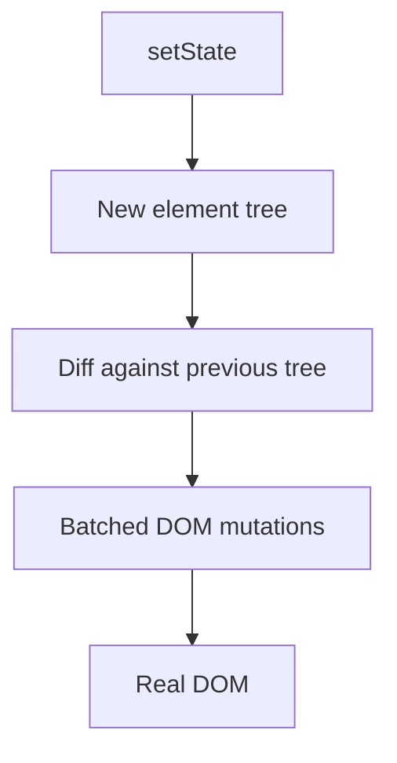

**Purpose** — it is an in-memory declarative UI model that lets React plan DOM updates.

**How it works / is used** — components return elements; React builds a tree, calculates a diff, then commits DOM mutations in a batch.

**Downsides and limits** — a virtual DOM is not automatically fast; JavaScript, layout work, and very large trees still cost time.

---
### Concurrent rendering

**Что это** — модель рендеринга React, в которой менее приоритетную работу можно прервать и возобновить.

**Для чего используется** — сохраняет отзывчивость ввода, когда обновление списка, маршрута или вычислений занимает заметное время.

**Как используется / работает** — React может начать, прервать и повторить рендеринг; useTransition помечает несрочные обновления.

**Минусы и ограничения** — рендеринг должен быть чистым и идемпотентным; нельзя рассчитывать, что он выполнится один раз.

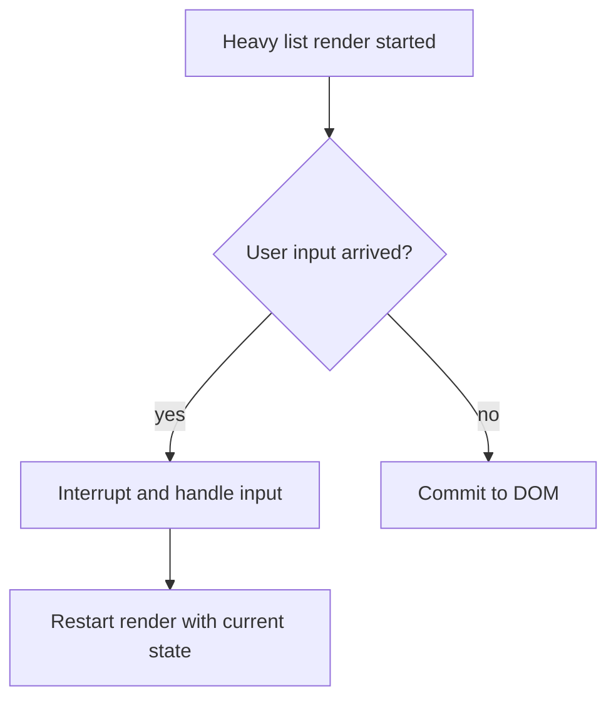

**Purpose** — it keeps the UI responsive by allowing less urgent rendering to yield to user input.

**How it works / is used** — React may start, interrupt, and retry rendering; useTransition marks an update as non-urgent.

**Downsides and limits** — rendering must be pure and idempotent because it is not guaranteed to run exactly once.

---
### Suspense

**Что это** — граница React, показывающая запасной интерфейс, пока вложенный код или совместимые данные не готовы.

**Для чего используется** — изолирует ожидание в части экрана, чтобы остальной интерфейс оставался доступным.

**Как используется / работает** — оборачиваю независимую часть экрана в Suspense с локальной каркасной заглушкой или индикатором загрузки.

**Минусы и ограничения** — граница, поставленная слишком высоко, скрывает весь экран; не каждый способ получения данных интегрирован с Suspense.

```tsx
const Chart = lazy(() => import("./Chart"));

<Suspense fallback={<ChartSkeleton />}>
  <Chart projectId={projectId} />
</Suspense>
```

**Purpose** — it displays a controlled fallback while a lazy component or a compatible data source is pending.

**How it works / is used** — wrap an independent screen region in Suspense with a local skeleton or loader.

**Downsides and limits** — a boundary placed too high hides the whole screen, and not every data-fetching approach integrates with Suspense.

---
### Error Boundary

**Что это** — компонентная граница, перехватывающая ошибки рендера дочернего поддерева.

**Для чего используется** — сообщает, что часть интерфейса не смогла отрисоваться, и не даёт этой ошибке уронить весь экран.

**Как используется / работает** — ставлю границу обработки ошибок вокруг маршрута или рискованного виджета, записываю ошибку в журнал и предлагаю повторить действие.

**Минусы и ограничения** — не ловит ошибки обработчиков событий, асинхронного кода и SSR; их нужно обрабатывать отдельно.

```tsx
import { ErrorBoundary } from "react-error-boundary";

<ErrorBoundary fallback={<EditorUnavailable />}>
  <VideoEditor projectId={projectId} />
</ErrorBoundary>
```
**Purpose** — it isolates a rendering failure to a UI region and keeps the rest of the app usable.

**How it works / is used** — place a boundary around a route or risky widget, log the error, and offer retry.

**Downsides and limits** — it does not catch event-handler, asynchronous, or server-rendering errors; handle those separately.

---
### React.memo

**Что это** — обёртка React, мемоизирующая результат рендера компонента по его свойствам.

**Для чего используется** — уменьшает стоимость лишних рендеров дорогого дочернего компонента, когда родитель обновляется чаще его данных.

**Как используется / работает** — применяю после профилирования к дорогому компоненту со стабильными свойствами и поверхностным сравнением.

**Минусы и ограничения** — сравнение тоже стоит времени; новые объекты и функции обратного вызова обнуляют выгоду, а код становится сложнее.

```tsx
const UserRow = memo(function UserRow({ user }: { user: User }) {
  return <li>{user.name}</li>;
});
```
**Purpose** — it skips rendering a pure child when its props have not changed.

**How it works / is used** — use it after profiling for an expensive component with stable props and shallow comparison.

**Downsides and limits** — comparison has a cost; new objects and callbacks defeat it and increase code complexity.

---
### useMemo

**Что это** — хук React, мемоизирующий значение вычисления между рендерами.

**Для чего используется** — оправдан после профилирования для дорогих вычислений или стабильных ссылок, от которых зависит мемоизация потомка.

**Как используется / работает** — использую для измеренно дорогой фильтрации либо для свойства, передаваемого мемоизированному дочернему компоненту, указывая все зависимости.

**Минусы и ограничения** — это подсказка оптимизации, а не гарантия; лишнее применение ухудшает читаемость и иногда медленнее вычисления.

```tsx
const visibleUsers = useMemo(
  () => users.filter((user) => user.name.includes(query)),
  [users, query],
);
```

**Purpose** — it memoizes an expensive computation or a stable reference across renders.

**How it works / is used** — use it for measured expensive filtering or a prop passed to a memoized child, with complete dependencies.

**Downsides and limits** — it is an optimization hint, not a guarantee; overuse hurts readability and can cost more than recomputation.

---
### useCallback

**Что это** — хук React, мемоизирующий ссылку на функцию между рендерами.

**Для чего используется** — нужен, когда новая функция сама по себе вызывает лишний рендер мемоизированного потомка или переподписку эффекта.

**Как используется / работает** — передаю функцию обратного вызова в мемоизированный компонент или подписку и перечисляю значения, которые она читает.

**Минусы и ограничения** — сам по себе не ускоряет приложение; устаревшее замыкание из-за неполных зависимостей создаёт скрытые ошибки.

```tsx
const onSelect = useCallback((id: string) => {
  setSelectedId(id);
}, []);

return <MemoizedProjectList onSelect={onSelect} />;
```
**Purpose** — it preserves a function identity when that matters to a memoized child or an effect dependency.

**How it works / is used** — pass the callback to a memoized component or subscription and list every value it reads.

**Downsides and limits** — it does not speed an app by itself; incomplete dependencies can create stale-closure bugs.

---
### useRef

**Что это** — хук React для изменяемого контейнера, не участвующего в рендеринге.

**Для чего используется** — хранит DOM-узел, идентификатор таймера или предыдущее значение там, где изменение не должно обновлять интерфейс.

**Как используется / работает** — применяю для фокусировки, таймера, AbortController или предыдущего значения, обновляя ссылку в эффекте либо обработчике.

**Минусы и ограничения** — изменение ссылки не обновляет экран; не стоит хранить там состояние, которое должно быть видно пользователю.

```tsx
const inputRef = useRef<HTMLInputElement>(null);
<button onClick={() => inputRef.current?.focus()}>Search</button>
<input ref={inputRef} />
```

**Purpose** — it stores a mutable value or DOM node without triggering a render.

**How it works / is used** — use it for focus, timers, an AbortController, or a previous value, updating it in an effect or handler.

**Downsides and limits** — mutating a ref does not update the screen, so it should not hold user-visible state.

---
### useEffect

**Что это** — хук для синхронизации отрисованного компонента с внешней системой.

**Для чего используется** — связывает жизненный цикл компонента с подпиской, таймером, DOM API или запросом, у которого есть очистка.

**Как используется / работает** — запускаю эффект после фиксации изменений, возвращаю функцию очистки и перечисляю все реактивные зависимости.

**Минусы и ограничения** — не нужен для вычисления производного состояния; неверные зависимости вызывают циклы, устаревшие данные и утечки.

```tsx
useEffect(() => {
  const subscription = chat.subscribe(roomId, setMessages);
  return () => subscription.unsubscribe();
}, [roomId]);
```

**Purpose** — it synchronizes React with an external system such as a network request, subscription, DOM API, or timer.

**How it works / is used** — run it after commit, return cleanup, and include every reactive dependency.

**Downsides and limits** — it is not for derived state; wrong dependencies cause loops, stale data, and leaks.

---
### useLayoutEffect

**Что это** — вариант эффекта, выполняющийся синхронно после изменения DOM и до отрисовки кадра.

**Для чего используется** — нужен для измерения геометрии или немедленной коррекции позиции, когда пользователь не должен увидеть промежуточное состояние.

**Как используется / работает** — использую редко для измерения всплывающей подсказки или поповера либо восстановления позиции прокрутки.

**Минусы и ограничения** — блокирует отрисовку и не подходит для обычных запросов; в SSR требует аккуратности.

```tsx
useLayoutEffect(() => {
  const rect = tooltipRef.current!.getBoundingClientRect();
  // Adjust position before paint — the user never sees the jump.
  setShiftLeft(rect.right > window.innerWidth);
}, [open]);
```

**Purpose** — it reads layout and synchronously adjusts the DOM before paint to avoid visible flicker.

**How it works / is used** — use it sparingly for measuring a tooltip or restoring scroll position.

**Downsides and limits** — it blocks paint, is unsuitable for normal fetching, and needs care with SSR.

---
### useTransition

**Что это** — хук, помечающий обновление React как несрочное.

**Для чего используется** — отделяет отзывчивый ввод от тяжёлой фильтрации или навигации, чтобы интерфейс не зависал во время вычислений.

**Как используется / работает** — оставляю состояние поля ввода срочным, а фильтрацию или навигацию запускаю внутри startTransition.

**Минусы и ограничения** — это не отложенный вызов и не отмена сети; нельзя применять для значения, контролирующего поле ввода.

```tsx
const [isPending, startTransition] = useTransition();
onChange={(event) => {
  setQuery(event.target.value);
  startTransition(() => setFilter(event.target.value));
}}
```

**Purpose** — it keeps urgent UI, such as typing, fast while a list or route update is expensive.

**How it works / is used** — keep input state urgent and start filtering or navigation inside startTransition.

**Downsides and limits** — it is neither debouncing nor network cancellation and cannot control an input value.

---
### useDeferredValue

**Что это** — хук, возвращающий отложенную версию быстро меняющегося значения.

**Для чего используется** — позволяет тяжёлому списку или графику догонять ввод пользователя без задержки самого поля ввода.

**Как используется / работает** — передаю отложенный поисковый запрос в тяжёлый список, пока текстовое поле сразу показывает актуальный запрос.

**Минусы и ограничения** — отображаются слегка устаревшие данные; это не уменьшает число запросов без отложенного вызова и отмены.

```tsx
const [query, setQuery] = useState("");
const deferredQuery = useDeferredValue(query);

<input value={query} onChange={(event) => setQuery(event.target.value)} />;
<SlowResults query={deferredQuery} />;
```
**Purpose** — it lets a slow UI region temporarily lag behind a rapidly changing value.

**How it works / is used** — pass a deferred query to the expensive list while the input immediately shows the latest query.

**Downsides and limits** — slightly stale results are visible, and it does not reduce requests without debouncing and cancellation.

---
### Context

**Что это** — механизм React для передачи одного значения поддереву без явной передачи свойств на каждом уровне.

**Для чего используется** — подходит для редко меняющихся глобальных данных, таких как тема, локаль или текущий пользователь.

**Как используется / работает** — размещаю провайдер близко к потребителям и разделяю контексты по частоте обновления.

**Минусы и ограничения** — изменение значения перерендеривает всех потребителей; это не универсальная замена локальному или серверному состоянию.

```tsx
const ThemeContext = createContext<"light" | "dark">("light");
<ThemeContext.Provider value="dark"><Editor /></ThemeContext.Provider>
```

**Purpose** — it shares cross-cutting data without prop drilling, such as theme, locale, or current user.

**How it works / is used** — place a Provider close to consumers and split contexts by update frequency.

**Downsides and limits** — a value change rerenders all consumers, so it is not a universal replacement for local or server state.

---
### Controlled vs uncontrolled components

**Что это** — два способа хранить значение поля: в состоянии React или непосредственно в DOM.

**Для чего используется** — управляемый вариант нужен для валидации и зависимого интерфейса; неуправляемый — для простых форм и интеграций.

**Как используется / работает** — управляемый вариант выбираю для валидации и зависимого интерфейса; неуправляемый со ссылкой — для простой формы или интеграции.

**Минусы и ограничения** — управляемые поля могут рендерить слишком часто; смешивать два источника истины опасно.

```tsx
// Controlled: React state is the source of truth.
<input value={email} onChange={(event) => setEmail(event.target.value)} />

// Uncontrolled: the value lives in the DOM, read via ref.
<input ref={emailRef} defaultValue={initialEmail} />
```

**Purpose** — a controlled input makes React own the value, while an uncontrolled input leaves it in the DOM.

**How it works / is used** — choose controlled for validation and dependent UI; use uncontrolled with refs for simple forms or integrations.

**Downsides and limits** — controlled fields can rerender too often, and mixing two sources of truth is risky.

---
### Lifting state up

**Что это** — перенос общего состояния к ближайшему общему родительскому компоненту.

**Для чего используется** — предотвращает рассинхронизацию нескольких компонентов, которым нужно согласованно отображать и менять одни данные.

**Как используется / работает** — поднимаю состояние до ближайшего общего родителя и передаю значение и обработчики вниз.

**Минусы и ограничения** — подъём слишком высоко раздувает свойства и область ререндеров; иногда лучше композиция или контекст.

```tsx
function Editor() {
  const [selectedId, setSelectedId] = useState<string | null>(null);
  return <>
    <SceneList selectedId={selectedId} onSelect={setSelectedId} />
    <Preview sceneId={selectedId} />
  </>;
}
```

**Purpose** — it gives several components one source of truth for consistent behavior.

**How it works / is used** — move state to the nearest common parent and pass values and handlers down.

**Downsides and limits** — lifting too high bloats props and rerender scope; composition or context can be better.

---
### State colocation

**Что это** — принцип размещения состояния рядом с компонентом, который его использует.

**Для чего используется** — уменьшает область ререндеров и связанность, пока состояние не требуется нескольким независимым частям интерфейса.

**Как используется / работает** — начинаю с локального состояния и поднимаю или глобализирую его только при реальной общей потребности.

**Минусы и ограничения** — локальные копии могут рассинхронизироваться, если данные всё-таки должны быть общими.

```tsx
// Bad: filter at the root — every keystroke rerenders the whole page.
function Page() {
  const [filter, setFilter] = useState("");
  return <><Header /><ProjectList filter={filter} onFilter={setFilter} /></>;
}

// Better: state lives inside its only consumer.
function ProjectList() {
  const [filter, setFilter] = useState("");
  // ...
}
```

**Purpose** — it reduces coupling and unnecessary renders by keeping state close to its only consumers.

**How it works / is used** — start with local state and lift or globalize it only when it is genuinely shared.

**Downsides and limits** — local copies can drift if the data actually needs a shared source of truth.

---
### Server state

**Что это** — данные с сервера, имеющие собственный жизненный цикл кэширования, устаревания и повторного получения.

**Для чего используется** — отделяет кэш API от локального состояния интерфейса и даёт единый способ обновлять данные после мутаций.

**Как используется / работает** — применяю TanStack Query/SWR для ключа кэша, состояний загрузки и ошибки, инвалидации и мутаций.

**Минусы и ограничения** — нельзя путать с состоянием интерфейса; неверные ключи или инвалидация дают устаревший интерфейс.

```tsx
// Server state: a cache with a key, staleness, and refetching.
const { data: projects } = useQuery({ queryKey: ["projects"], queryFn: fetchProjects });

// UI state: local, no cache or invalidation.
const [selectedId, setSelectedId] = useState<string | null>(null);
```

**Purpose** — it manages remote, cacheable, and potentially stale API data.

**How it works / is used** — use TanStack Query or SWR for cache keys, loading/error states, invalidation, and mutations.

**Downsides and limits** — do not confuse it with UI state; incorrect keys or invalidation create stale UI.

---
### Redux

**Что это** — централизованное хранилище клиентского состояния с обновлениями через действия и редьюсеры.

**Для чего используется** — оправдано для сложной общей бизнес-логики, где важно видеть все переходы состояния и воспроизводить их предсказуемо.

**Как используется / работает** — храню только действительно общее клиентское состояние, описываю события действиями и обновляю состояние чистыми редьюсерами; RTK уменьшает шаблонный код.

**Минусы и ограничения** — для локального состояния интерфейса и серверного кэша это часто избыточно; слишком много глобального состояния скрывает владение данными и усложняет изменение.

```ts
const projectsSlice = createSlice({
  name: "projects",
  initialState: { selectedId: null as string | null },
  reducers: {
    projectSelected(state, action: PayloadAction<string>) {
      state.selectedId = action.payload; // Immer: "mutation" is safe here
    },
  },
});
```

**Purpose** — it centralizes complex client state and makes transitions predictable through explicit actions and reducers.

**How it works / is used** — keep only genuinely shared client state, describe events as actions, and update state with pure reducers; RTK reduces boilerplate.

**Downsides and limits** — it is often excessive for local UI state or server cache; too much global state hides ownership and makes change harder.

---
### Zustand

**Что это** — минималистичное внешнее хранилище состояния с подписками через селекторы.

**Для чего используется** — подходит для небольшого общего клиентского состояния, когда Redux добавляет больше церемоний, чем ценности.

**Как используется / работает** — создаю узкоспециализированные хранилища и селекторы, чтобы компонент подписывался только на нужный срез состояния.

**Минусы и ограничения** — простота не заменяет проектирование модели; без правил хранилище легко становится неявным глобальным изменяемым состоянием.

```ts
const usePlayerStore = create<{ playing: boolean; toggle: () => void }>((set) => ({
  playing: false,
  toggle: () => set((state) => ({ playing: !state.playing })),
}));

const playing = usePlayerStore((state) => state.playing); // subscribe to a slice only
```

**Purpose** — it provides a small external store for shared client state with less ceremony than Redux.

**How it works / is used** — create focused stores and selectors so a component subscribes only to the state slice it needs.

**Downsides and limits** — simplicity does not replace model design; without conventions a store easily becomes implicit global mutable state.

---
### TanStack Query / React Query

**Что это** — библиотека управления серверными запросами, кэшем и мутациями в React.

**Для чего используется** — устраняет ручную обработку загрузки, ошибок, повторных запросов и устаревшего кэша в каждой компоненте.

**Как используется / работает** — ключ запроса включает все входные параметры; после мутации инвалидирую или обновляю затронутый ключ, а staleTime выбираю по требованию к свежести.

**Минусы и ограничения** — это не менеджер глобального состояния интерфейса; плохие ключи, бесконтрольные повторные попытки или откат оптимистичной мутации дают устаревший либо неверный интерфейс.

```tsx
const query = useQuery({
  queryKey: ["projects", workspaceId],
  queryFn: () => api.projects.list(workspaceId),
  staleTime: 30_000,
});
```

**Purpose** — it manages server state: caching, loading and error, retries, refetching, invalidation, and optimistic mutations.

**How it works / is used** — include all input parameters in a query key, invalidate or update affected keys after mutation, and choose staleTime from freshness requirements.

**Downsides and limits** — it is not a global UI-state manager; poor keys, uncontrolled retry, or optimistic rollback can produce stale or incorrect UI.

## Next.js

---
### App Router

**Что это** — файловый маршрутизатор Next.js на базе серверных компонентов и вложенных сегментов.

**Для чего используется** — даёт единый способ собрать страницу из общих макетов, серверных данных, загрузочных и ошибочных состояний.

**Как используется / работает** — сегмент маршрута содержит файлы page, layout, loading и error; компоненты серверные по умолчанию.

**Минусы и ограничения** — нужны ясные границы клиентской и серверной частей; миграция со старого Pages Router требует привыкания.

```txt
app/
  layout.tsx        shared shell
  page.tsx          route /
  projects/
    page.tsx        /projects
    [id]/
      page.tsx      /projects/42
      loading.tsx   segment Suspense fallback
      error.tsx     segment error boundary
```

**Purpose** — it is Next.js’s file-based model for layouts, Server Components, streaming, and server-side fetching.

**How it works / is used** — a route segment contains page, layout, loading, and error files; components are server-side by default.

**Downsides and limits** — clear client/server boundaries are required, and migration from Pages Router has a learning cost.

---
### Pages Router

**Что это** — прежняя файловая модель маршрутизации Next.js с функциями получения данных на уровне страниц.

**Для чего используется** — полезна при поддержке существующего проекта, который ещё использует getServerSideProps или getStaticProps.

**Как используется / работает** — файлы page формируют маршруты, а данные загружаются через специальные функции получения данных.

**Минусы и ограничения** — не получает новую RSC-модель; поддержка устаревшего кода может усложнить единый подход.

```tsx
// pages/projects/[id].tsx — data is fetched by a page-level function, not the component.
export async function getServerSideProps({ params }: GetServerSidePropsContext) {
  const project = await getProject(String(params?.id));
  return { props: { project } };
}

export default function ProjectPage({ project }: { project: Project }) {
  return <ProjectView project={project} />;
}
```

**Purpose** — it is the earlier Next.js router built around getServerSideProps and getStaticProps.

**How it works / is used** — page files form routes and special data-fetching functions supply their data.

**Downsides and limits** — it does not use the new RSC model, and supporting legacy code can fragment the approach.

---
### Server Components

**Что это** — React-компонент, выполняемый только на сервере и не попадающий в клиентский JavaScript-бандл.

**Для чего используется** — сокращает размер клиентского кода и позволяет получать серверные данные рядом с представлением.

**Как используется / работает** — читаю БД или серверный API прямо в асинхронном серверном компоненте и передаю вниз сериализуемые свойства.

**Минусы и ограничения** — нельзя использовать состояние, эффекты, API браузера или обработчики событий; нельзя передавать произвольные объекты.

```tsx
export default async function ProjectsPage() {
  const projects = await db.project.findMany(); // runs on the server only
  return <ProjectList projects={projects} />;
}
```

**Purpose** — it executes a UI component on the server and keeps its JavaScript out of the browser bundle.

**How it works / is used** — read the database or backend API in an async server component and pass serializable props down.

**Downsides and limits** — no state, effects, browser APIs, or event handlers; arbitrary objects cannot cross the boundary.

---
### Client Components

**Что это** — React-компонент Next.js, который выполняется в браузере и может использовать состояние, события и эффекты.

**Для чего используется** — ограничивает клиентский JavaScript только интерактивными частями экрана.

**Как используется / работает** — добавляю директиву use client только на листе интерактивной части дерева.

**Минусы и ограничения** — всё импортируемое попадает в клиентский бандл; слишком высокая граница раздувает его.

```tsx
"use client";

export function LikeButton() {
  const [liked, setLiked] = useState(false);
  return <button onClick={() => setLiked(!liked)}>{liked ? "♥" : "♡"}</button>;
}
```

**Purpose** — it enables interactivity: state, events, effects, and browser APIs.

**How it works / is used** — add the use client directive only at the leaf of the interactive subtree.

**Downsides and limits** — everything it imports enters the client bundle; a boundary too high inflates that bundle.

---
### SSR — Server-Side Rendering

**Что это** — создание HTML на сервере для каждого запроса.

**Для чего используется** — выбирается для актуального, персонализированного или SEO-важного контента, который нельзя безопасно отдать из статики.

**Как используется / работает** — сервер получает данные, рендерит HTML, затем клиент гидратирует интерактивные части.

**Минусы и ограничения** — увеличивает TTFB и нагрузку сервера; стратегия кэширования критична для масштабирования.

```tsx
export default async function ProjectPage({ params }: { params: Promise<{ id: string }> }) {
  const project = await getProject((await params).id);
  return <ProjectView project={project} />;
}
```

**Purpose** — it generates HTML on the server per request for fresh content and a strong initial render.

**How it works / is used** — the server fetches data and renders HTML; the client then hydrates interactive parts.

**Downsides and limits** — it increases TTFB and server load, so caching strategy is crucial at scale.

---
### CSR — Client-Side Rendering

**Что это** — рендеринг и получение данных после загрузки JavaScript в браузере.

**Для чего используется** — удобен для закрытых рабочих интерфейсов, где первичный SEO-контент не важнее интерактивности.

**Как используется / работает** — отдаём оболочку и JavaScript, затем запрос из клиента заполняет интерфейс.

**Минусы и ограничения** — полезный первый экран появляется медленнее и хуже SEO; требуется продуманный UX загрузки и ошибок.

---
**Purpose** — it renders and fetches data in the browser, useful for highly interactive private UI.

**How it works / is used** — serve a shell and JavaScript, then client fetches populate the interface.

**Downsides and limits** — useful content appears later and SEO is weaker; loading and error UX need deliberate design.

---
### SSG — Static Site Generation

**Что это** — генерация HTML страницы во время сборки.

**Для чего используется** — даёт самую дешёвую и быструю раздачу публичного контента, который меняется редко.

**Как используется / работает** — страница генерируется во время build и раздаётся через CDN как статический asset.

**Минусы и ограничения** — данные могут устареть до следующего build; не подходит для персонального или очень свежего контента.

```tsx
export async function generateStaticParams() {
  const posts = await getPosts();
  return posts.map((post) => ({ slug: post.slug })); // pages are generated at build time
}
```

**Purpose** — it prebuilds HTML for public pages that change infrequently.

**How it works / is used** — the page is generated at build time and served as a static CDN asset.

**Downsides and limits** — data can become stale until the next build and it does not suit personalized or highly fresh content.

---
### ISR — Incremental Static Regeneration

**Что это** — статическая страница Next.js, которую можно пересоздавать после публикации.

**Для чего используется** — уменьшает нагрузку по сравнению с SSR, сохраняя данные достаточно свежими для каталога, документации или витрины.

**Как используется / работает** — задаю revalidate или запускаю on-demand revalidation после изменения данных.

**Минусы и ограничения** — нужно принять bounded staleness и продумать invalidation; неверная настройка показывает старые данные.

**Версионная заметка** — в Next.js 16 актуальная cache-модель строится вокруг Cache Components и директивы use cache; термин ISR остаётся полезным, но детали зависят от версии и конфигурации.

```ts
export const revalidate = 60;
// Next.js regenerates the page at most once per minute.
```

**Purpose** — it combines static speed with periodic page-cache refresh.

**How it works / is used** — set revalidate or trigger on-demand revalidation after data changes.

**Downsides and limits** — it requires accepting bounded staleness and designing invalidation; bad settings show old data.

**Version note** — in Next.js 16 the current cache model centers on Cache Components and the use cache directive; ISR remains useful terminology, but details depend on version and configuration.

---
### Hydration

**Что это** — процесс, в котором React связывает серверный HTML с клиентским JavaScript и обработчиками событий.

**Для чего используется** — превращает быстро показанный серверный HTML в работающий интерактивный интерфейс.

**Как используется / работает** — браузер загружает JS, React сверяет markup и навешивает event handlers.

**Минусы и ограничения** — большой client bundle задерживает интерактивность; серверный и клиентский output должны совпадать.

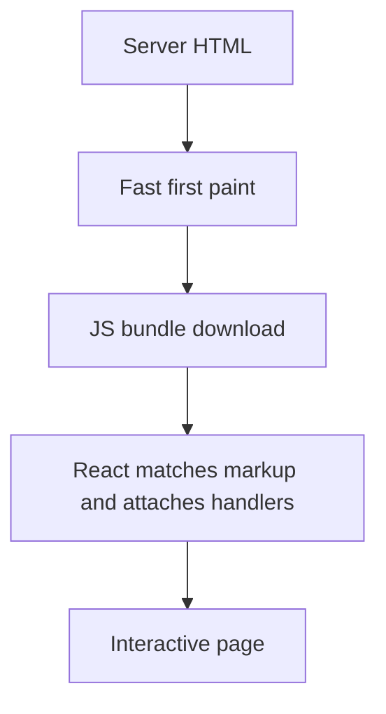

**Purpose** — it attaches client React to already rendered server HTML and makes it interactive.

**How it works / is used** — the browser loads JavaScript, React matches markup, and attaches event handlers.

**Downsides and limits** — a large client bundle delays interactivity, and server/client output must match.

---
### Hydration mismatch

**Что это** — ошибка, при которой первый клиентский рендер React не совпадает с HTML, отправленным сервером.

**Для чего используется** — сообщает, что первый клиентский рендер отличается от HTML, созданного сервером, и указывает на необходимость искать недетерминированные данные.

**Как используется / работает** — устраняю nondeterminism: Date.now, Math.random, locale, window и данные браузера переношу в client effect.

**Минусы и ограничения** — suppressHydrationWarning скрывает симптом, но редко исправляет источник рассинхронизации.

```tsx
// Bad: server and client render different times.
<span>{new Date().toLocaleTimeString()}</span>

// Good: the nondeterministic value appears after mount.
const [now, setNow] = useState<string | null>(null);
useEffect(() => setNow(new Date().toLocaleTimeString()), []);
```

**Purpose** — it is not a feature but a failure where server HTML differs from the first client render.

**How it works / is used** — remove nondeterminism: move Date.now, Math.random, locale, window, and browser-only data into client effects.

**Downsides and limits** — suppressHydrationWarning hides a symptom and rarely fixes the source of divergence.

---
### Layouts

**Что это** — общий маршрутный компонент Next.js, сохраняющийся между дочерними страницами.

**Для чего используется** — устраняет дублирование навигации, провайдеров и каркаса экрана между связанными маршрутами.

**Как используется / работает** — кладу устойчивую chrome-часть в layout, а контент маршрута — в page.

**Минусы и ограничения** — state в layout живёт дольше ожидаемого; глобальный layout не должен тащить тяжёлые client dependencies.

```tsx
export default function WorkspaceLayout({ children }: { children: React.ReactNode }) {
  return <>
    <SidebarNav />
    <main>{children}</main>
  </>;
}
```

**Purpose** — it preserves shared chrome, navigation, and providers across child routes.

**How it works / is used** — put persistent shell in a layout and route-specific content in a page.

**Downsides and limits** — layout state lives longer than expected, and a global layout should not pull in heavy client dependencies.

---
### Route Handlers

**Что это** — обработчик HTTP-запросов в директории `app` Next.js.

**Для чего используется** — подходит для тонкого API-слоя рядом с интерфейсом: формы, вебхуки и BFF-эндпоинты.

**Как используется / работает** — export-ирую GET/POST и валидирую input, auth, authorisation, response shape и status codes.

**Минусы и ограничения** — не превращаю их в слой бизнес-логики; shared domain code должен быть отдельно тестируемым.

```ts
export async function GET() {
  const projects = await listProjects(await requireUser());
  return Response.json({ projects });
}
```

**Purpose** — it implements an HTTP API alongside the application in the App Router.

**How it works / is used** — export GET or POST and validate input, authentication, authorization, response shape, and status codes.

**Downsides and limits** — do not turn handlers into the business layer; shared domain code should remain separately testable.

---
### Proxy (formerly Middleware)

**Что это** — предварительный обработчик запроса Next.js, работающий до маршрута.

**Для чего используется** — применяется для перенаправления, локали или грубой проверки доступа до загрузки страницы.

**Как используется / работает** — в Next.js 16 использую proxy.ts и matcher только для нужных paths; читаю request/cookie и возвращаю next, rewrite или redirect.

**Минусы и ограничения** — не подходит для slow data fetching или полного session management; окончательную авторизацию всё равно проверяет endpoint, а runtime зависит от версии Next.js.

```ts
import { NextRequest, NextResponse } from "next/server";

export function proxy(request: NextRequest) {
  if (!request.cookies.get("session")) return NextResponse.redirect(new URL("/login", request.url));
  return NextResponse.next();
}

export const config = { matcher: ["/projects/:path*"] };
```
**Purpose** — it performs short request-time logic before a route, such as redirects, rewrites, locale, or a coarse auth gate.

**How it works / is used** — in Next.js 16, use proxy.ts and match only required paths; inspect request or cookie, then return next, rewrite, or redirect.

**Downsides and limits** — it is not for slow data fetching or full session management; endpoints still enforce authorization, and runtime depends on the Next.js version.

---
### Streaming

**Что это** — поэтапная передача HTML-ответа по мере готовности его частей.

**Для чего используется** — уменьшает воспринимаемое ожидание, позволяя показать независимые части страницы до завершения самого медленного запроса.

**Как используется / работает** — разделяю независимые области Suspense boundaries и показываю meaningful skeletons.

**Минусы и ограничения** — плохая граница создаёт прыжки layout или «водопад»; критический above-the-fold контент нельзя скрывать бездумно.

```tsx
export default function ProjectPage() {
  return <>
    <ProjectHeader />
    <Suspense fallback={<CommentsSkeleton />}>
      <SlowComments /> {/* this part streams in later without blocking the header */}
    </Suspense>
  </>;
}
```

**Purpose** — it sends ready parts of a page earlier instead of waiting for the slowest request.

**How it works / is used** — separate independent areas with Suspense boundaries and show meaningful skeletons.

**Downsides and limits** — poor boundaries cause layout shifts or waterfalls; do not blindly hide critical above-the-fold content.

---
### Caching and revalidation

**Что это** — механизмы кэширования данных и рендера в Next.js и правила их инвалидации (revalidation).

**Для чего используется** — позволяет явно выбрать допустимую свежесть данных и не платить за одинаковую работу на каждом запросе.

**Как используется / работает** — явно определяю cache scope, TTL и invalidation tags/path после mutation.

**Минусы и ограничения** — cache — это часть корректности: неясный ownership или invalidation создают трудноуловимые stale bugs.

```ts
import { revalidatePath } from "next/cache";

await db.project.update({ where: { id }, data: input });
revalidatePath(`/projects/${id}`);
```
**Purpose** — it reduces repeated work and requests while keeping data acceptably fresh.

**How it works / is used** — explicitly define cache scope, TTL, and invalidation tags or paths after mutations.

**Downsides and limits** — caching is part of correctness: unclear ownership or invalidation creates hard-to-find stale bugs.

---
### Server Actions

**Что это** — серверные функции Next.js, вызываемые из форм и клиентского кода без ручного API-слоя.

**Для чего используется** — уменьшает объём промежуточного кода для серверной мутации формы, сохраняя проверку прав и входных данных на сервере.

**Как используется / работает** — action валидирует input и права на сервере, выполняет mutation, затем revalidate-ит affected data.

**Минусы и ограничения** — это не замена публичному API; endpoint-level security, errors и progressive enhancement должны быть продуманы.

```ts
"use server";
export async function renameProject(formData: FormData) {
  await rename(await requireUser(), String(formData.get("id")), String(formData.get("name")));
  revalidatePath("/projects");
}
```

**Purpose** — it invokes a server-side mutation from a form with less handwritten API glue.

**How it works / is used** — the action validates input and permissions on the server, performs the mutation, then revalidates affected data.

**Downsides and limits** — it is not a replacement for a public API; security, errors, and progressive enhancement still need design.

---
### Dynamic imports

**Что это** — ленивое подключение модуля или компонента отдельным chunk-ом в момент необходимости.

**Для чего используется** — откладывает загрузку редактора, графика или редкой функции до момента, когда пользователь действительно её запросил.

**Как используется / работает** — динамически загружаю тяжёлый editor, chart или browser-only library за interaction/route boundary.

**Минусы и ограничения** — дополнительный network round trip может ухудшить важный сценарий; нужен fallback и измерение.

```tsx
const VideoTimeline = dynamic(() => import("./VideoTimeline"), {
  loading: () => <TimelineSkeleton />,
  ssr: false,
});
```
**Purpose** — it moves rarely needed code out of the initial bundle to speed page startup.

**How it works / is used** — dynamically load a heavy editor, chart, or browser-only library behind an interaction or route boundary.

**Downsides and limits** — the extra network round trip can hurt a critical path, so provide a fallback and measure it.

---
### Image optimization

**Что это** — набор техник и компонент next/image для отдачи изображений нужного размера, формата и приоритета.

**Для чего используется** — ускоряет показ визуального контента и предотвращает сдвиг интерфейса из-за неизвестного размера изображения.

**Как используется / работает** — задаю реальные dimensions, responsive sizes, современный format и priority только для LCP-изображения.

**Минусы и ограничения** — неверные sizes могут отдать слишком большой файл; динамическая оптимизация имеет cache и инфраструктурную цену.

```tsx
<Image
  src={project.thumbnailUrl}
  alt={project.title}
  width={1280}
  height={720}
  sizes="(max-width: 768px) 100vw, 640px"
  priority
/>
```
**Purpose** — it reduces image bytes and layout shifts, especially in a media product.

**How it works / is used** — provide real dimensions, responsive sizes, a modern format, and priority only for the LCP image.

**Downsides and limits** — wrong sizes can serve oversized files, and dynamic optimization has cache and infrastructure cost.

---
### Edge Runtime

**Что это** — ограниченная среда исполнения на Web APIs, которая может выполняться ближе к пользователю.

**Для чего используется** — уменьшает сетевую задержку короткого решения вроде редиректа или лёгкой проверки до основного приложения.

**Как используется / работает** — применяю для лёгких redirects, personalization hints или auth checks, совместимых с Web APIs.

**Минусы и ограничения** — Node APIs, native modules и долгие DB-вызовы могут быть недоступны или невыгодны; в Next.js 16 Proxy по умолчанию использует Node runtime, поэтому Edge нужно обсуждать с учётом конкретной версии/deployment.

```ts
export const runtime = "edge"; // Web APIs only, no Node modules

export async function GET(request: Request) {
  const country = request.headers.get("x-vercel-ip-country") ?? "US";
  return Response.json({ country });
}
```

**Purpose** — it runs short logic closer to users to reduce network latency.

**How it works / is used** — use it for lightweight redirects, personalization hints, or auth checks compatible with Web APIs.

**Downsides and limits** — Node APIs, native modules, and long database calls may be unavailable or a poor fit; in Next.js 16 Proxy uses the Node runtime by default, so Edge must be discussed in the context of the specific version and deployment.

## JavaScript

---
### Closure

**Что это** — функция вместе с доступным ей лексическим окружением внешней области.

**Для чего используется** — позволяет создавать фабрики, обработчики и инкапсулированное состояние без глобальных переменных.

**Как используется / работает** — применяю для фабрик, private state и callbacks; React handlers также замыкают values render-а.

**Минусы и ограничения** — долгоживущая closure может удерживать память или читать устаревший state.

```ts
function makeCounter() {
  let count = 0;
  return () => ++count;
}
const next = makeCounter();
```

**Purpose** — a function retains its lexical environment and can work with data from an outer scope.

**How it works / is used** — use it for factories, private state, and callbacks; React handlers also close over render values.

**Downsides and limits** — a long-lived closure can retain memory or read stale state.

---
### Event loop

**Что это** — модель JavaScript-рантайма, планирующая стек вызовов, очереди задач, микрозадачи и отрисовку.

**Для чего используется** — объясняет порядок асинхронных операций и помогает находить зависания интерфейса или неожиданный порядок логов.

**Как используется / работает** — текущий call stack заканчивается, затем draining microtasks, затем browser получает шанс отрисовать следующий кадр.

**Минусы и ограничения** — длинный synchronous task блокирует ввод и paint независимо от async API.

```ts
console.log("A");
Promise.resolve().then(() => console.log("microtask"));
setTimeout(() => console.log("task"));
console.log("B"); // A, B, microtask, task
```

**Purpose** — it coordinates synchronous code, task queues, microtasks, and browser rendering.

**How it works / is used** — after the current call stack completes, microtasks drain, then the browser gets a chance to render the next frame.

**Downsides and limits** — a long synchronous task blocks input and paint regardless of async APIs.

---
### Microtasks

**Что это** — очередь продолжений, выполняемых после текущего стека и до следующей обычной задачи.

**Для чего используется** — важна для предсказания поведения Promise и предотвращения голодания отрисовки длинной цепочкой микрозадач.

**Как используется / работает** — Promise callbacks и queueMicrotask попадают в microtask queue после завершения stack.

**Минусы и ограничения** — бесконечная цепочка microtasks starvation-ит rendering и другие tasks.

```js
setTimeout(() => console.log("task"));
Promise.resolve()
  .then(() => console.log("microtask 1"))
  .then(() => console.log("microtask 2"));
// microtask 1, microtask 2, task — the microtask queue drains fully before the task
```

**Purpose** — it runs a short continuation of current work before the next task or render.

**How it works / is used** — Promise callbacks and queueMicrotask enter the microtask queue after the stack completes.

**Downsides and limits** — an endless microtask chain starves rendering and other tasks.

---
### Macrotasks

**Что это** — обычная задача очереди событий, выполняемая после завершения текущего цикла.

**Для чего используется** — позволяет отложить работу и дать браузеру возможность обработать ввод или отрисовать кадр между задачами.

**Как используется / работает** — setTimeout, message events и I/O callbacks обычно создают tasks, между которыми браузер может рендерить.

**Минусы и ограничения** — timer не является точным расписанием; активный main thread задерживает его выполнение.

---
**Purpose** — it schedules a later unit of work in the task queue.

**How it works / is used** — setTimeout, message events, and I/O callbacks typically create tasks, between which the browser may render.

**Downsides and limits** — a timer is not an exact schedule; a busy main thread delays it.

---
### Promise

**Что это** — объект состояния будущего результата асинхронной операции.

**Для чего используется** — стандартизирует композицию асинхронных операций и передачу ошибки к выбранной границе обработки.

**Как используется / работает** — цепляю then/catch/finally или await и обрабатываю ошибку на нужной границе.

**Минусы и ограничения** — Promise не отменяется сам; забытый catch превращается в unhandled rejection.

```js
loadProject(id)
  .then((project) => render(project))
  .catch((error) => showError(error)) // catches reject and throw from earlier in the chain
  .finally(() => setLoading(false));
```

**Purpose** — it represents an asynchronous result: pending, fulfilled, or rejected.

**How it works / is used** — attach then/catch/finally or await it and handle errors at the appropriate boundary.

**Downsides and limits** — a Promise is not inherently cancellable, and a missing catch becomes an unhandled rejection.

---
### async / await

**Что это** — синтаксис JavaScript поверх Promise для ожидания результата внутри асинхронной функции.

**Для чего используется** — делает зависимую последовательность шагов читаемой, не блокируя поток выполнения.

**Как используется / работает** — await приостанавливает только async function; независимые операции запускаю параллельно через Promise.all.

**Минусы и ограничения** — последовательные await без зависимости создают waterfall; Promise.all падает на первой ошибке.

```ts
const [project, comments] = await Promise.all([
  getProject(projectId),
  getComments(projectId),
]);
```
**Purpose** — it makes sequential Promise code read like synchronous code.

**How it works / is used** — await pauses only its async function; start independent work in parallel with Promise.all.

**Downsides and limits** — sequential awaits without dependency create waterfalls, and Promise.all rejects on the first failure.

---
### AbortController

**Что это** — объект сигнала отмены для Fetch и других поддерживающих API.

**Для чего используется** — предотвращает работу и обработку устаревшего результата после смены запроса, маршрута или размонтирования компонента.

**Как используется / работает** — создаю controller на запрос и вызываю abort в cleanup effect или при новом search query.

**Минусы и ограничения** — отмена должна поддерживаться API; всё равно нужно игнорировать race-ответы и корректно отличать AbortError.

```ts
const controller = new AbortController();
fetch(`/api/search?q=${query}`, { signal: controller.signal });
return () => controller.abort();
```

**Purpose** — it cancels fetch or another supporting operation when its result is no longer needed.

**How it works / is used** — create one controller per request and call abort in effect cleanup or for a newer search query.

**Downsides and limits** — the API must support cancellation; still handle races and distinguish AbortError correctly.

---
### Hoisting

**Что это** — правила создания привязок имён перед исполнением области видимости JavaScript.

**Для чего используется** — помогает объяснить ошибки доступа до объявления и избегать неочевидных зависимостей от `var`.

**Как используется / работает** — function declarations доступны раньше, var инициализируется undefined, let/const живут в temporal dead zone.

**Минусы и ограничения** — reliance на hoisting ухудшает читаемость; var создаёт неожиданные scope bugs.

```js
console.log(a); // undefined: var is hoisted and initialized to undefined
var a = 1;

console.log(b); // ReferenceError: let is in the temporal dead zone
let b = 2;
```

**Purpose** — it describes bindings being created before a scope executes, not code literally moving upward.

**How it works / is used** — function declarations are available early, var starts as undefined, and let/const have a temporal dead zone.

**Downsides and limits** — relying on hoisting hurts readability, and var creates surprising scope bugs.

---
### this

**Что это** — значение-получатель, определяемое способом вызова обычной функции.

**Для чего используется** — нужно для корректной работы методов объектов и интеграций, где функция передаётся как callback.

**Как используется / работает** — значение определяется call site: obj.method(), call/apply/bind или constructor; arrow берёт внешнее this.

**Минусы и ограничения** — переданный отдельно method теряет receiver; arrow нельзя использовать как constructor.

```ts
const player = { title: "Demo", print() { console.log(this.title); } };

const print = player.print; // detached from its receiver
print(); // strict mode: TypeError (this is undefined); sloppy mode: this is globalThis

setTimeout(player.print.bind(player), 0); // "Demo" — receiver fixed by bind
```
**Purpose** — it provides the receiver of a normal function call.

**How it works / is used** — its value is determined by call site: obj.method(), call/apply/bind, or a constructor; an arrow captures outer this.

**Downsides and limits** — a separately passed method loses its receiver, and an arrow cannot be used as a constructor.

---
### Prototype chain

**Что это** — цепочка объектов-прототипов, по которой JavaScript ищет отсутствующее свойство.

**Для чего используется** — объясняет наследование, методы классов и стоимость динамического поиска свойств.

**Как используется / работает** — при отсутствии свойства на объекте движок ищет его вверх по prototype chain до null.

**Минусы и ограничения** — глубокие или изменяемые prototypes усложняют reasoning; class — лишь синтаксис над этой моделью.

```js
const base = { greet() { return "hi"; } };
const child = Object.create(base);

child.greet(); // "hi" — not on child, found on the prototype
Object.getPrototypeOf(child) === base; // true
```

**Purpose** — it implements inheritance and property lookup in JavaScript.

**How it works / is used** — when a property is absent on an object, the engine searches upward through prototypes until null.

**Downsides and limits** — deep or mutable prototypes make reasoning harder; class is syntax over this model.

---
### Equality: === vs ==

**Что это** — два оператора сравнения: строгий без неявного преобразования и нестрогий с ним.

**Для чего используется** — строгий оператор предотвращает скрытые ошибки преобразования типов в прикладной логике.

**Как используется / работает** — почти всегда использую ===; == допустим лишь когда coercion осознан и хорошо ограничен, например nullish check.

**Минусы и ограничения** — == содержит много неочевидных правил; === всё равно сравнивает объекты по ссылке, не по содержимому.

```js
0 == "";       // true — implicit type coercion
0 === "";      // false
value == null; // deliberate idiom: true for both null and undefined
```

**Purpose** — it compares values either without coercion or with implicit coercion.

**How it works / is used** — use === almost always; use == only when coercion is intentional and tightly scoped, such as a nullish check.

**Downsides and limits** — == has many non-obvious rules, while === still compares objects by reference rather than contents.

---
### Shallow copy

**Что это** — копирование только верхнего уровня массива или объекта при сохранении ссылок на вложенные данные.

**Для чего используется** — достаточно для точечного неизменяемого обновления верхнего уровня состояния без дорогой полной копии.

**Как используется / работает** — spread, Object.assign или Array.slice копируют ссылки на вложенные объекты.

**Минусы и ограничения** — nested data остаётся общей и может быть случайно изменена.

```js
const original = { title: "Demo", meta: { views: 10 } };
const copy = { ...original };

copy.meta.views = 99;
original.meta.views; // 99 — the nested object is still shared
```

**Purpose** — it creates a new top-level container for an immutable update.

**How it works / is used** — spread, Object.assign, or Array.slice copy references to nested objects.

**Downsides and limits** — nested data remains shared and can still be mutated accidentally.

---
### Deep copy

**Что это** — копирование всей вложенной структуры без общих ссылок с исходным объектом.

**Для чего используется** — применяется только когда независимость вложенных данных действительно важнее стоимости памяти и процессора.

**Как используется / работает** — structuredClone подходит многим native types; для domain data предпочитаю точечный immutable update.

**Минусы и ограничения** — это дорого по CPU/памяти; JSON stringify ломает Date, Map, undefined и циклические ссылки.

```js
const copy = structuredClone(original); // Date, Map, cyclic references — ok

copy.meta.views = 99;
original.meta.views; // 10 — the structure is fully independent
```

**Purpose** — it creates an independent copy of a nested structure when that is genuinely necessary.

**How it works / is used** — structuredClone supports many native types; for domain data prefer targeted immutable updates.

**Downsides and limits** — it costs CPU and memory; JSON stringify breaks Date, Map, undefined, and cyclic references.

---
### Immutability

**Что это** — подход, при котором существующие данные не изменяются, а создаётся новое состояние.

**Для чего используется** — упрощает сравнение изменений, откат, отладку и корректные обновления React-состояния.

**Как используется / работает** — возвращаю новые объекты для изменённых ветвей и не мутирую state/props.

**Минусы и ограничения** — полное копирование больших структур дорого; mutable refs уместны вне UI state.

```js
const next = {
  ...state,
  scenes: state.scenes.map((scene) =>
    scene.id === id ? { ...scene, title } : scene,
  ),
};
```

**Purpose** — it makes change predictable and enables reference comparison, undo, and easier debugging.

**How it works / is used** — return new objects for changed branches and do not mutate state or props.

**Downsides and limits** — copying large structures has a cost; mutable refs are appropriate outside UI state.

---
### Debounce

**Что это** — отложенный запуск функции после паузы в серии событий.

**Для чего используется** — уменьшает число сетевых запросов или сохранений, когда промежуточные значения ввода не имеют самостоятельной ценности.

**Как используется / работает** — debounce search request или autosave с cleanup предыдущего таймера.

**Минусы и ограничения** — добавляет намеренную задержку; не подходит, если нужна регулярная реакция во время drag/scroll.

```ts
let timer: ReturnType<typeof setTimeout>;
const searchLater = (query: string) => {
  clearTimeout(timer);
  timer = setTimeout(() => search(query), 250);
};
```

**Purpose** — it waits for a pause in a burst of events so work does not run on every keystroke.

**How it works / is used** — debounce a search request or autosave and clean up the previous timer.

**Downsides and limits** — it adds deliberate delay and is wrong when regular updates are needed during drag or scroll.

---
### Throttle

**Что это** — ограничение максимальной частоты вызова функции в непрерывном потоке событий.

**Для чего используется** — защищает обработчики прокрутки, изменения размера и аналитики от чрезмерной нагрузки.

**Как используется / работает** — throttle scroll/resize analytics или использую requestAnimationFrame для визуальных обновлений.

**Минусы и ограничения** — последнее событие может потеряться без trailing call; для сетевого поиска чаще лучше debounce.

```ts
const reportScroll = throttle(() => {
  analytics.track("scrolled", { y: window.scrollY });
}, 500);

window.addEventListener("scroll", reportScroll, { passive: true });
```
**Purpose** — it limits execution frequency during a continuous event stream.

**How it works / is used** — throttle scroll or resize analytics, or use requestAnimationFrame for visual updates.

**Downsides and limits** — the final event may be lost without a trailing call; debouncing is usually better for network search.

---
### Generators and iterators

**Что это** — протокол последовательного получения значений и функция, которая может выдавать их лениво.

**Для чего используется** — экономит память и позволяет обрабатывать большие либо потенциально бесконечные последовательности по одному элементу.

**Как используется / работает** — generator yield-ит элементы по требованию; iterable поддерживает Symbol.iterator и for...of.

**Минусы и ограничения** — control flow становится менее привычным; generator нельзя безопасно повторно использовать после исчерпания.

```js
function* ids() {
  let id = 1;
  while (true) yield id++; // values are computed lazily, on demand
}
const seq = ids();
seq.next().value; // 1
seq.next().value; // 2

// Iterator: Symbol.iterator makes the object work with for...of and spread.
const playlist = {
  tracks: ["intro", "demo", "outro"],
  *[Symbol.iterator]() { yield* this.tracks; },
};
for (const track of playlist) console.log(track);
```

**Purpose** — it represents a lazy sequence of values without allocating the whole array.

**How it works / is used** — a generator yields items on demand; an iterable implements Symbol.iterator and works with for...of.

**Downsides and limits** — control flow is less familiar, and an exhausted generator cannot be safely reused.

---
### Modules

**Что это** — единица изоляции JavaScript-кода с явными импортами и экспортами.

**Для чего используется** — делает зависимости обозримыми, тестируемыми и доступными для оптимизации сборщиком.

**Как используется / работает** — ESM использует static import/export, что позволяет bundler-у анализировать граф и tree-shake.

**Минусы и ограничения** — циклические зависимости дают частично инициализированные bindings; dynamic import меняет timing загрузки.

```js
// math.js
export const add = (a, b) => a + b;                        // named export
export default function multiply(a, b) { return a * b; }  // default export

// app.js — static import: the bundler sees the graph, tree shaking works.
import multiply, { add } from "./math.js";

// Dynamic import: a separate chunk, loaded at call time.
const { renderChart } = await import("./chart.js");
```

**Purpose** — it isolates scope and declares application dependencies explicitly.

**How it works / is used** — ESM uses static import/export, allowing a bundler to analyze the graph and tree-shake.

**Downsides and limits** — circular dependencies can expose partially initialized bindings, and dynamic import changes loading timing.

---
### Memory leaks

**Что это** — ситуация, когда память остаётся достижимой после того, как данные больше не нужны.

**Для чего используется** — сигнализирует, что данные или подписки удерживаются дольше жизненного цикла экрана; помогает направить диагностику на удерживающие ссылки.

**Как используется / работает** — очищаю subscriptions, timers, observers и abort-аю requests при unmount; профилирую heap snapshots.

**Минусы и ограничения** — рост памяти не всегда leak: cache может быть ожидаемым, поэтому сначала измеряю retainers.

```ts
useEffect(() => {
  const id = setInterval(poll, 5000);
  window.addEventListener("resize", onResize);
  return () => { // without cleanup the timer and listener outlive unmount
    clearInterval(id);
    window.removeEventListener("resize", onResize);
  };
}, []);
```

**Purpose** — it is a diagnostic term: memory remains reachable after the data is no longer needed.

**How it works / is used** — clean up subscriptions, timers, observers, and requests on unmount; inspect heap snapshots.

**Downsides and limits** — memory growth is not always a leak; a cache may be expected, so inspect retainers first.

## TypeScript

---
### any

**Что это** — специальный тип TypeScript, отключающий проверку операций над значением.

**Для чего используется** — допустим как краткий мост при миграции старого кода, но не как тип данных на внешних границах.

**Как используется / работает** — избегаю его на границах; вместо этого оставляю unknown и сужаю тип validation-ом.

**Минусы и ограничения** — any заражает выражения и лишает compiler его главной ценности.

```ts
// Bad: value.name compiles even when value is null.
const value: any = JSON.parse(body);
```

**Purpose** — it disables type checking, usually as a temporary bridge for untyped legacy code.

**How it works / is used** — avoid it at boundaries; keep data as unknown and narrow it with validation.

**Downsides and limits** — any contaminates expressions and removes the compiler’s main value.

---
### unknown

**Что это** — тип для значения неизвестной формы, над которым нельзя выполнять операции без проверки.

**Для чего используется** — защищает границы приложения: JSON, сеть и `catch` не получают доверия только из-за аннотации типа.

**Как используется / работает** — перед доступом к полям делаю type guard, schema validation или typeof check.

**Минусы и ограничения** — требует явного narrowing, поэтому неудобнее any, но эта цена предотвращает runtime bugs.

```ts
const value: unknown = JSON.parse(body);
if (typeof value === "object" && value !== null && "name" in value) {
  console.log(value.name);
}
```

**Purpose** — it safely accepts a value of unknown shape, especially from network, JSON, or catch.

**How it works / is used** — use a type guard, schema validation, or typeof check before accessing fields.

**Downsides and limits** — it requires explicit narrowing, less convenient than any but safer at runtime.

---
### never

**Что это** — тип невозможного значения либо результата функции, которая не возвращается нормально.

**Для чего используется** — позволяет компилятору проверить, что все варианты закрытого объединения обработаны.

**Как используется / работает** — использую exhaustive switch с assertNever для закрытых discriminated unions.

**Минусы и ограничения** — неверно объявленный never маскирует ошибку модели; union должен быть действительно закрытым.

```ts
function assertNever(value: never): never { throw new Error(`Unexpected: ${value}`); }
switch (result.status) {
  case "loading": break;
  case "error": break;
  case "success": break;
  default: assertNever(result);
}
```

**Purpose** — it represents an impossible value or a function that never completes normally.

**How it works / is used** — use assertNever in an exhaustive switch over a closed discriminated union.

**Downsides and limits** — incorrectly declaring never hides a modeling error; the union must really be closed.

---
### Type narrowing

**Что это** — уточнение широкого объединения до конкретного типа после проверки во время выполнения.

**Для чего используется** — делает доступ к полям безопасным без небезопасных утверждений типа.

**Как используется / работает** — применяю typeof, in, instanceof, discriminant или пользовательский predicate.

**Минусы и ограничения** — проверка должна отражать реальные runtime данные; type assertion не является validation.

```ts
function format(value: string | Date) {
  return value instanceof Date ? value.toISOString() : value.trim();
}
```

**Purpose** — it turns a broad union into a concrete safe type in a code branch.

**How it works / is used** — use typeof, in, instanceof, a discriminant, or a user-defined predicate.

**Downsides and limits** — the check must reflect real runtime data; a type assertion is not validation.

---
### Type guards

**Что это** — функция или проверка, сообщающая TypeScript, какой тип подтверждён во время выполнения.

**Для чего используется** — объединяет валидацию внешнего ввода с безопасным доступом к данным внутри приложения.

**Как используется / работает** — пишу маленький predicate вида value is User и тестирую invalid input на API boundary.

**Минусы и ограничения** — guard может ложно обещать форму объекта; сложные схемы лучше валидировать библиотекой.

```ts
type User = { id: string; name: string };
function isUser(value: unknown): value is User {
  return typeof value === "object" && value !== null && "id" in value && "name" in value;
}
```

**Purpose** — it connects a runtime check with compiler knowledge about a type.

**How it works / is used** — write a small predicate such as value is User and test invalid API-boundary input.

**Downsides and limits** — a guard can falsely promise an object shape; complex schemas are better validated by a library.

---
### Generics

**Что это** — параметр типа, связывающий типы входа, выхода и ограничений в одном обобщённом API.

**Для чего используется** — позволяет переиспользовать функцию или компонент, не теряя информацию о конкретном типе пользователя API.

**Как используется / работает** — параметризую reusable collection, API helper или component и ограничиваю T через extends при необходимости.

**Минусы и ограничения** — чрезмерно абстрактные generics хуже читаются; не нужны для одноразового кода.

```ts
function first<T>(items: readonly T[]): T | undefined {
  return items[0];
}
const project = first([{ id: "p1", name: "Handbook" }]); // object type is preserved
```

**Purpose** — it expresses a relationship between input and output without losing the concrete type.

**How it works / is used** — parameterize a reusable collection, API helper, or component and constrain T with extends when needed.

**Downsides and limits** — over-abstract generics are hard to read and are unnecessary for one-off code.

---
### keyof

**Что это** — оператор, формирующий объединение допустимых ключей типа объекта.

**Для чего используется** — предотвращает обращение к несуществующему полю в обобщённых помощниках и конфигурации таблиц.

**Как используется / работает** — использую K extends keyof T для generic getter, mapper или type-safe table column.

**Минусы и ограничения** — runtime-ключ всё ещё нужно проверять, если он пришёл извне.

```ts
function get<T, K extends keyof T>(object: T, key: K): T[K] {
  return object[key];
}
get({ id: "p1", name: "Handbook" }, "name");
```

**Purpose** — it obtains the union of an object type’s keys and protects field access.

**How it works / is used** — use K extends keyof T for a generic getter, mapper, or type-safe table column.

**Downsides and limits** — a runtime key still needs validation when it comes from outside.

---
### typeof in type positions

**Что это** — оператор в позиции типа, извлекающий тип уже объявленного значения.

**Для чего используется** — не даёт конфигурации и её описанию расходиться при изменениях.

**Как используется / работает** — объявляю const config as const и получаю typeof config для связанной функции.

**Минусы и ограничения** — слишком большой inferred literal type иногда нужно намеренно расширить для удобного API.

```ts
const config = { retries: 3, region: "eu" } as const;
type Config = typeof config;
```

**Purpose** — it derives a type from an existing value without duplicating its declaration.

**How it works / is used** — declare const config as const and derive typeof config for a related function.

**Downsides and limits** — a large inferred literal type sometimes needs intentional widening for a usable API.

---
### Mapped types

**Что это** — конструкция типа, строящая новый object type преобразованием ключей существующего.

**Для чего используется** — выводит согласованный тип формы, DTO или только-для-чтения представления из доменной модели без ручного дублирования полей.

**Как используется / работает** — применяю для readonly, optional или typed form-state на основе domain model.

**Минусы и ограничения** — сложные mapped types ухудшают сообщения ошибок; сначала проверяю готовые utility types.

```ts
type User = { id: string; name: string; email: string };
type EditableUser = { [K in "name" | "email"]?: User[K] };
```

**Purpose** — it builds a new object type by transforming the keys of an existing type.

**How it works / is used** — use it for readonly, optional, or typed form state derived from a domain model.

**Downsides and limits** — complex mapped types make errors harder to read; check built-in utility types first.

---
### Conditional types

**Что это** — конструкция типа вида T extends U ? X : Y, выбирающая результат по отношению типов.

**Для чего используется** — описывает типовой API, чей результат зависит от формы входного типа, особенно в переиспользуемой библиотеке.

**Как используется / работает** — полезен в reusable library API, например чтобы извлечь return type или awaitable result.

**Минусы и ограничения** — distributive behavior на unions неинтуитивен; не использую ради «умной» типовой головоломки.

```ts
type ApiResult<T> = T extends Promise<infer Value> ? Value : T;
type Project = ApiResult<Promise<{ id: string }>>;
```

**Purpose** — it chooses a result type based on the relationship between two types.

**How it works / is used** — useful in reusable library APIs, for example extracting a return type or awaitable result.

**Downsides and limits** — distributive behavior over unions is unintuitive; avoid it for clever type puzzles.

---
### infer

**Что это** — ключевое слово в conditional type, извлекающее часть типа без её предварительного объявления.

**Для чего используется** — извлекает элемент массива, результат функции или полезную нагрузку события без дублирования уже известного типа.

**Как используется / работает** — применяю для ElementType массива, return type функции или payload event-а.

**Минусы и ограничения** — чаще нужен авторам библиотек, чем application-коду; сложность должна окупаться повторным использованием.

```ts
type ElementOf<T> = T extends readonly (infer Item)[] ? Item : never;
type User = ElementOf<readonly [{ id: string }]>;
```

**Purpose** — it extracts part of a type inside a conditional type without naming it beforehand.

**How it works / is used** — use it for an array element type, function return type, or event payload.

**Downsides and limits** — it is more often needed by library authors than application code; complexity must pay for reuse.

---
### Discriminated unions

**Что это** — union типов с общим tag-полем, по которому компилятор различает варианты.

**Для чего используется** — не позволяет представить недопустимую комбинацию состояния и данных, например успешный результат без данных.

**Как используется / работает** — status: loading | error | success определяет доступные поля в switch.

**Минусы и ограничения** — tag нужно поддерживать во всех producers; open-ended server values требуют runtime fallback.

```ts
type Result = { status: "loading" } | { status: "error"; message: string } | { status: "success"; data: User };
if (result.status === "success") console.log(result.data.name);
```

**Purpose** — it models finite states with a tag field so invalid combinations become impossible.

**How it works / is used** — a loading, error, or success status determines available fields in a switch.

**Downsides and limits** — every producer must maintain the tag, and open-ended server values need a runtime fallback.

---
### type vs interface

**Что это** — два способа описать форму данных: interface — расширяемый object contract, type — unions и композиции.

**Для чего используется** — помогает выбрать читаемую форму описания данных: расширяемый объектный контракт или объединение и композицию типов.

**Как используется / работает** — выбираю единый style команды; для public object contract часто interface, для union — type.

**Минусы и ограничения** — это не архитектурное решение; declaration merging interface может быть неожиданным.

```ts
interface Project { id: string; name: string }
type LoadState = "idle" | "loading" | "error";
```

**Purpose** — both describe data shape; interface suits extensible object contracts, while type suits unions and composition.

**How it works / is used** — follow one team style; use interface often for public objects and type for unions.

**Downsides and limits** — it is not an architecture decision, and interface declaration merging can be surprising.

---
### Utility types

**Что это** — встроенные типы-помощники (Partial, Pick, Omit, Record, Required, Readonly) для производных типов.

**Для чего используется** — быстро строит производный тип для частичного обновления, публичного ответа или словаря без собственной типовой магии.

**Как используется / работает** — Pick создаёт read DTO, Omit исключает server-generated поля, Record описывает map.

**Минусы и ограничения** — не делаю DTO автоматически из domain type, если правила валидации и ownership отличаются.

```ts
type User = { id: string; name: string; passwordHash: string };
type PublicUser = Omit<User, "passwordHash">;
const labels: Record<"draft" | "published", string> = { draft: "Draft", published: "Published" };
```

**Purpose** — built-in Partial, Pick, Omit, Record, Required, and Readonly reduce repeated type-level code.

**How it works / is used** — Pick makes a read DTO, Omit removes server-generated fields, and Record describes a map.

**Downsides and limits** — do not derive every DTO mechanically from a domain type when validation and ownership differ.

---
### readonly

**Что это** — модификатор типа, запрещающий mutation через конкретную typed reference.

**Для чего используется** — запрещает потребителю менять данные, которыми он не владеет, ещё на этапе компиляции.

**Как используется / работает** — ставлю readonly для входных моделей и public collections, где consumer не владеет данными.

**Минусы и ограничения** — это compile-time защита, не deep runtime immutability.

```ts
function renderTags(tags: readonly string[]) {
  // tags.push("new"); // compile error
  return tags.join(", ");
}
```

**Purpose** — it forbids mutation through a particular typed reference.

**How it works / is used** — mark input models and public collections readonly when the consumer does not own the data.

**Downsides and limits** — it is compile-time protection, not deep runtime immutability.

---
### as const

**Что это** — assertion, фиксирующая literal values и readonly структуру вместо широких string/number типов.

**Для чего используется** — сохраняет точные литеральные значения конфигурации, чтобы безопасно вывести из них объединение или ключи.

**Как используется / работает** — применяю к static config, action names или tuple, из которых затем вывожу union.

**Минусы и ограничения** — может сделать тип слишком узким для mutation; это не runtime freeze.

```ts
const statuses = ["draft", "published"] as const;
type Status = (typeof statuses)[number];
```

**Purpose** — it preserves literal values and readonly structure instead of broad string or number types.

**How it works / is used** — apply it to static config, action names, or tuples from which a union is derived.

**Downsides and limits** — it can make a type too narrow for mutation and is not a runtime freeze.

---
### satisfies

**Что это** — оператор проверки выражения на соответствие типу без потери его точного inferred type.

**Для чего используется** — проверяет полноту конфигурации, но не расширяет её точные литеральные значения до общего типа.

**Как используется / работает** — использую для config map, где нужны и проверка всех ключей, и literal values.

**Минусы и ограничения** — не валидирует JSON в runtime и не заменяет schema validation.

```ts
type Route = "/" | "/projects";
const labels = { "/": "Home", "/projects": "Projects" } satisfies Record<Route, string>;
```

**Purpose** — it checks conformance to a contract while preserving the expression’s precise inferred type.

**How it works / is used** — use it for a config map that needs both complete key checking and literal values.

**Downsides and limits** — it does not validate JSON at runtime and cannot replace schema validation.

---
### Enums

**Что это** — конструкция TypeScript для именованного набора констант; часто заменима string literal union.

**Для чего используется** — задаёт ограниченный набор значений; в веб-коде часто заменяется объектом `as const` с более прозрачным результатом во время выполнения.

**Как используется / работает** — для web-кода обычно предпочитаю as const object плюс union, чтобы контролировать runtime output.

**Минусы и ограничения** — numeric enum создаёт неочевидный reverse mapping; const enum имеет build-tool caveats.

```ts
const Role = { Admin: "admin", Member: "member" } as const;
type Role = (typeof Role)[keyof typeof Role];
```

**Purpose** — it defines a named set of constants, though a string-literal union is often enough.

**How it works / is used** — in web code I usually prefer an as-const object plus a union to control runtime output.

**Downsides and limits** — numeric enums create surprising reverse mapping, and const enums have build-tool caveats.

---
### Declaration files

**Что это** — .d.ts описывает типы JavaScript-модуля без генерации runtime-кода.

**Для чего используется** — добавляет безопасный минимальный контракт к JavaScript-зависимости без переписывания её в TypeScript.

**Как используется / работает** — добавляю declaration для untyped dependency или global integration, сохраняя его максимально узким.

**Минусы и ограничения** — declaration может расходиться с runtime API; сначала ищу официальные types или обновляю dependency.

```ts
// analytics.d.ts
declare module "legacy-analytics" {
  export function track(event: string, properties?: Record<string, unknown>): void;
}
```

**Purpose** — a .d.ts file describes a JavaScript module’s types without generating runtime code.

**How it works / is used** — add a declaration for an untyped dependency or global integration and keep it narrowly scoped.

**Downsides and limits** — a declaration can drift from the runtime API; look for official types or update the dependency first.

## Browser & Performance

---
### Critical rendering path

**Что это** — последовательность шагов браузера от получения HTML/CSS/JS до отрисовки пикселей.

**Для чего используется** — помогает найти конкретную причину медленного первого отображения вместо бессистемной оптимизации всех ресурсов.

**Как используется / работает** — браузер строит DOM и CSSOM, layout, paint и compositing; измеряю waterfall и performance trace.

**Минусы и ограничения** — оптимизировать нужно bottleneck, а не все ресурсы подряд.

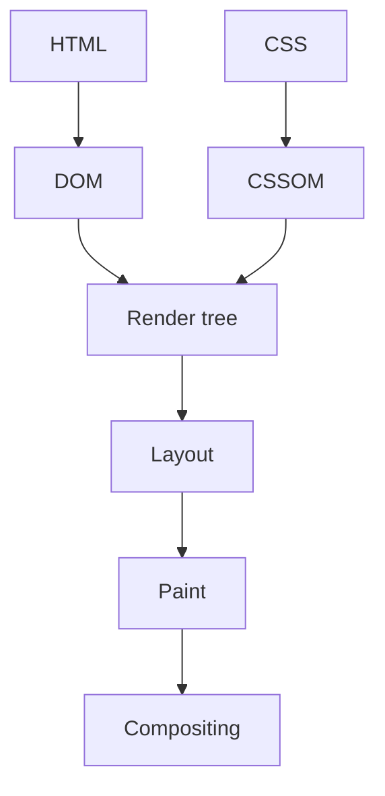

**Purpose** — it explains the path from HTML, CSS, and JavaScript to pixels and helps locate slow first render.

**How it works / is used** — the browser builds DOM and CSSOM, then layout, paint, and compositing; measure a waterfall and performance trace.

**Downsides and limits** — optimize the bottleneck, not every resource indiscriminately.

---
### Reflow / layout

**Что это** — этап рендеринга, на котором браузер пересчитывает геометрию элементов после изменения размеров, текста или CSS rules.

**Для чего используется** — позволяет избежать дорогих повторных расчётов геометрии при анимациях, обработчиках прокрутки и больших списках.

**Как используется / работает** — batch-ю DOM reads перед writes и избегаю layout thrashing в циклах/scroll handlers.

**Минусы и ограничения** — layout иногда неизбежен; ранняя микрооптимизация хуже понятного CSS.

```js
// Bad: reads and writes interleave — layout on every iteration.
items.forEach((el) => { el.style.height = el.offsetHeight + 10 + "px"; });

// Better: all reads first, then all writes.
const heights = items.map((el) => el.offsetHeight);
items.forEach((el, i) => { el.style.height = heights[i] + 10 + "px"; });
```

**Purpose** — layout computes element geometry after size, text, or CSS-rule changes.

**How it works / is used** — batch DOM reads before writes and avoid layout thrashing in loops or scroll handlers.

**Downsides and limits** — layout is sometimes unavoidable; premature micro-optimization is worse than clear CSS.

---
### Repaint

**Что это** — этап рендеринга, перерисовывающий пиксели без пересчёта layout, например после изменения цвета.

**Для чего используется** — помогает выбрать свойства анимации с меньшей стоимостью перерисовки на слабых устройствах.

**Как используется / работает** — анимирую transform и opacity, когда возможно, и проверяю paint flashing в DevTools.

**Минусы и ограничения** — даже без layout большие paint area могут быть дорогими.

---
**Purpose** — it redraws pixels without changing layout, for example after a color change.

**How it works / is used** — animate transform and opacity when possible and inspect paint flashing in DevTools.

**Downsides and limits** — even without layout, a large paint area can be expensive.

---
### Compositing

**Что это** — этап рендеринга, собирающий предварительно отрисованные layers в финальный кадр, часто на GPU.

**Для чего используется** — объясняет, почему анимация `transform` или `opacity` часто работает плавнее изменения геометрии элемента.

**Как используется / работает** — выбираю composited animations и проверяю layers вместо бездумного translateZ hack.

**Минусы и ограничения** — слишком много layers расходует GPU memory и может ухудшить performance.

---
**Purpose** — it combines prepainted layers into a final frame, often on the GPU.

**How it works / is used** — choose composited animations and inspect layers instead of blindly applying translateZ hacks.

**Downsides and limits** — too many layers consume GPU memory and can hurt performance.

---
### Core Web Vitals

**Что это** — набор user-centric метрик Google: LCP (loading), CLS (visual stability) и INP (responsiveness).

**Для чего используется** — связывает скорость загрузки, стабильность layout и отзывчивость с реальным пользовательским опытом и помогает выбрать приоритет оптимизаций.

**Как используется / работает** — смотрю field data и lab trace, затем связываю LCP, CLS и INP с конкретным пользовательским путём.

**Минусы и ограничения** — score не заменяет product judgment; synthetic результаты не всегда совпадают с реальными устройствами.

---
**Purpose** — it provides user-centric metrics for loading, visual stability, and responsiveness.

**How it works / is used** — inspect field data and lab traces, then connect LCP, CLS, and INP to a user journey.

**Downsides and limits** — a score does not replace product judgment, and synthetic results may differ from real devices.

---
### LCP — Largest Contentful Paint

**Что это** — метрика времени отрисовки крупнейшего видимого content element страницы.

**Для чего используется** — показывает, как быстро пользователь видит основной контент страницы, и направляет оптимизацию первого рендера.

**Как используется / работает** — оптимизирую LCP image/text: response time, critical CSS, image size, preload и render blocking.

**Минусы и ограничения** — «крупнейший» элемент меняется по viewport; не стоит preload-ить всё подряд.

---
**Purpose** — it measures when the largest visible content element has rendered.

**How it works / is used** — optimize LCP image or text through response time, critical CSS, image sizing, preload, and render blocking.

**Downsides and limits** — the largest element varies by viewport, and preloading everything is counterproductive.

---
### CLS — Cumulative Layout Shift

**Что это** — метрика суммарного неожиданного смещения layout во время жизни страницы.

**Для чего используется** — показывает, насколько интерфейс сдвигается во время загрузки, и помогает найти элементы без зарезервированного места.

**Как используется / работает** — резервирую место через width/height или aspect-ratio, не вставляю поздний контент над текущим UI.

**Минусы и ограничения** — допустимые user-initiated shifts не равны плохому CLS; нужно проверять конкретный сценарий.

---
**Purpose** — it measures unexpected layout shifts that frustrate users during loading.

**How it works / is used** — reserve space with width/height or aspect-ratio and avoid inserting late content above existing UI.

**Downsides and limits** — user-initiated shifts are not necessarily bad CLS, so inspect the actual scenario.

---
### INP — Interaction to Next Paint

**Что это** — метрика задержки между пользовательским взаимодействием и следующей отрисовкой кадра.

**Для чего используется** — показывает, насколько быстро интерфейс визуально отвечает на действия пользователя, и выявляет длинные задачи на main thread.

**Как используется / работает** — разбиваю long tasks, уменьшаю handler work и показываю immediate feedback для долгой mutation.

**Минусы и ограничения** — оптимизация только одного click не гарантирует хороший worst-case interaction.

---
**Purpose** — it measures delay between a user interaction and the next visual feedback.

**How it works / is used** — split long tasks, reduce handler work, and show immediate feedback for a long mutation.

**Downsides and limits** — optimizing one click does not guarantee a good worst-case interaction.

---
### requestAnimationFrame

**Что это** — browser API для планирования callback-а перед ближайшей отрисовкой кадра.

**Для чего используется** — синхронизирует визуальное обновление со следующим кадром браузера и уменьшает лишнюю работу между кадрами.

**Как используется / работает** — коалесцирую mouse/scroll updates в один rAF callback и меняю transform/opacity.

**Минусы и ограничения** — callback всё ещё на main thread; не использую его как scheduler для network work.

**Мини-пример** — при частых событиях `pointermove` обновляю положение индикатора не на каждое событие, а максимум раз за кадр:

```ts
const indicator = document.querySelector<HTMLElement>("#drag-indicator");
let frameId: number | null = null;
let latestX = 0;

window.addEventListener("pointermove", (event) => {
  latestX = event.clientX;
  if (frameId !== null) return;

  frameId = requestAnimationFrame(() => {
    if (indicator) indicator.style.transform = `translateX(${latestX}px)`;
    frameId = null;
  });
});
```

**Purpose** — it schedules a visual update before the next browser paint.

**How it works / is used** — coalesce mouse or scroll updates into one rAF callback and change transform or opacity.

**Downsides and limits** — the callback still runs on the main thread and is not a scheduler for network work.

---
### IntersectionObserver

**Что это** — browser API для наблюдения пересечения элемента с viewport или container без scroll polling.

**Для чего используется** — реализует ленивую загрузку, бесконечную прокрутку и аналитику показа без постоянного ручного опроса прокрутки.

**Как используется / работает** — применяю для lazy image, infinite scroll sentinel или impression analytics и disconnect-аю observer.

**Минусы и ограничения** — threshold и rootMargin требуют настройки; не заменяет нормальную pagination и accessibility.

```ts
const observer = new IntersectionObserver(([entry]) => {
  if (entry.isIntersecting) loadNextPage();
});
observer.observe(sentinel);
```

**Purpose** — it observes an element intersecting a viewport or container without continuous scroll polling.

**How it works / is used** — use it for lazy images, an infinite-scroll sentinel, or impression analytics and disconnect the observer.

**Downsides and limits** — threshold and rootMargin need tuning; it does not replace sound pagination and accessibility.

---
### ResizeObserver

**Что это** — browser API для наблюдения изменения размера конкретного элемента, а не всего окна.

**Для чего используется** — позволяет компоненту реагировать на свой контейнер, а не только на изменение окна браузера.

**Как используется / работает** — измеряю responsive chart или container-driven layout и обновляю state осторожно.

**Минусы и ограничения** — state update может создать resize loop; отписываюсь при unmount.

```ts
const observer = new ResizeObserver(([entry]) => {
  chart.resize(entry.contentRect.width, entry.contentRect.height);
});

observer.observe(chartContainer);
// On component removal: observer.disconnect().
```

**Purpose** — it reacts to size changes of a specific element rather than the whole window.

**How it works / is used** — measure a responsive chart or container-driven layout and update state carefully.

**Downsides and limits** — a state update can create a resize loop, and cleanup is required on unmount.

---
### Web Workers

**Что это** — механизм браузера для выполнения JavaScript в отдельном потоке без доступа к DOM.

**Для чего используется** — сохраняет интерфейс отзывчивым во время тяжёлого вычисления, разбора файла или построения поискового индекса.

**Как используется / работает** — отправляю serializable message в worker для parsing, image processing или большого search index.

**Минусы и ограничения** — worker не имеет DOM и несёт serialization/startup overhead; сеть или простой код не ускорит.

```ts
const worker = new Worker(new URL("./search-worker.ts", import.meta.url));
worker.postMessage({ type: "index", documents });
worker.onmessage = ({ data }) => setResults(data);
```

**Purpose** — it moves CPU-heavy computation off the main thread to keep the interface responsive.

**How it works / is used** — send a serializable message to a worker for parsing, image processing, or a large search index.

**Downsides and limits** — a worker has no DOM and has serialization and startup overhead; it will not speed up network or simple code.

---
### Web Vitals field monitoring

**Что это** — сбор performance-метрик с реальных устройств, сетей и user journeys после релиза.

**Для чего используется** — показывает производительность у реальных пользователей, а не только в лаборатории, и позволяет заметить регрессию после релиза.

**Как используется / работает** — отправляю sampled, anonymized metrics с route/device context в observability platform и сравниваю percentiles.

**Минусы и ограничения** — telemetry требует privacy review и sampling; averages скрывают страдания медленных пользователей.

```ts
import { onCLS, onINP, onLCP } from "web-vitals";

const report = (metric: Metric) =>
  navigator.sendBeacon("/vitals", JSON.stringify({ ...metric, route }));

onLCP(report); onCLS(report); onINP(report);
```

**Purpose** — it collects performance from real devices, networks, and user journeys after release.

**How it works / is used** — send sampled, anonymized metrics with route and device context to observability and compare percentiles.

**Downsides and limits** — telemetry needs privacy review and sampling; averages hide slow-user pain.

---
### Code splitting

**Что это** — разбиение JavaScript-бандла на chunks, загружаемые по route или по потребности.

**Для чего используется** — сокращает объём JavaScript, который пользователь должен скачать до первого полезного взаимодействия.

**Как используется / работает** — route-level splitting делаю по умолчанию, feature-level — когда измеренная initial bundle польза выше extra request.

**Минусы и ограничения** — слишком много small chunks создаёт waterfall; boundary должен отражать user journey.

```ts
exportButton.addEventListener("click", async () => {
  const { openExportDialog } = await import("./export-dialog"); // separate chunk
  openExportDialog();
});
```

**Purpose** — it splits JavaScript into chunks loaded by route or on demand.

**How it works / is used** — use route-level splitting by default and feature-level splitting when measured initial-bundle benefit exceeds extra requests.

**Downsides and limits** — too many small chunks create waterfalls, so boundaries should reflect the user journey.

---
### Tree shaking

**Что это** — удаление недостижимого ESM-кода из production bundle при сборке.

**Для чего используется** — не даёт неиспользуемому коду библиотек попадать в клиентскую сборку.

**Как используется / работает** — предпочитаю named ESM imports и side-effect-free modules, анализирую bundle при добавлении тяжёлой dependency.

**Минусы и ограничения** — CommonJS, side effects и barrel imports могут помешать elimination.

```ts
import { debounce } from "es-toolkit"; // named ESM import — unused code is dropped
import lodash from "lodash";           // antipattern: the whole package lands in the bundle
```

**Purpose** — it removes unreachable ESM code from a production bundle.

**How it works / is used** — prefer named ESM imports and side-effect-free modules, and analyze the bundle when adding a heavy dependency.

**Downsides and limits** — CommonJS, side effects, and barrel imports can prevent elimination.

---
### Bundle analysis

**Что это** — анализ реального состава и размера клиентского JavaScript-бандла.

**Для чего используется** — показывает, какая зависимость или маршрут реально раздувает сборку, прежде чем начинать оптимизацию.

**Как используется / работает** — запускаю analyzer перед/после изменения и ищу duplicate packages, тяжёлые editor/media libraries и client leaks.

**Минусы и ограничения** — размер не равен runtime cost; подтверждаю находку performance trace-ом и реальным UX.

---
**Purpose** — it reveals the real composition and size of client JavaScript.

**How it works / is used** — run an analyzer before and after a change and look for duplicate packages, heavy editor/media libraries, and client leaks.

**Downsides and limits** — size is not runtime cost; confirm findings with a performance trace and actual UX.

---
### Virtualization

**Что это** — техника рендеринга только видимой части большого списка (windowing).

**Для чего используется** — делает длинный список отзывчивым, ограничивая число одновременно созданных DOM-элементов.

**Как используется / работает** — применяю windowing с overscan для тысяч строк, сохраняя keyboard navigation и aria semantics.

**Минусы и ограничения** — variable heights, scroll restore и accessibility сложнее; не нужно для короткого списка.

```tsx
const parentRef = useRef<HTMLDivElement>(null);
const rows = useVirtualizer({
  count: projects.length,
  getScrollElement: () => parentRef.current,
  estimateSize: () => 40,
  overscan: 5,
});

return <div ref={parentRef} style={{ height: 480, overflow: "auto" }}>
  <div style={{ height: rows.getTotalSize(), position: "relative" }}>
    {rows.getVirtualItems().map((row) => (
      <div key={row.key} style={{ position: "absolute", transform: `translateY(${row.start}px)`, width: "100%" }}>
        <ProjectRow project={projects[row.index]} />
      </div>
    ))}
  </div>
</div>;
```

**Purpose** — it renders only the visible slice of a large list, reducing DOM and render cost.

**How it works / is used** — use windowing with overscan for thousands of rows while preserving keyboard navigation and ARIA semantics.

**Downsides and limits** — variable heights, scroll restoration, and accessibility are harder; it is unnecessary for a short list.

---
### Caching in the browser

**Что это** — слои повторного использования данных и assets в браузере: HTTP cache, service worker, in-memory.

**Для чего используется** — уменьшает повторную загрузку и задержку, когда ресурс можно безопасно использовать повторно.

**Как используется / работает** — различаю HTTP cache, service worker cache и in-memory query cache; задаю ownership и invalidation.

**Минусы и ограничения** — stale/offline data меняет UX и корректность; не кеширую персональные secrets небезопасно.

```http
# Hashed asset: cache for a year, never revalidate.
Cache-Control: public, max-age=31536000, immutable

# HTML document: always revalidate with the server.
Cache-Control: no-cache
```

**Purpose** — it reuses data and assets to reduce latency and bandwidth.

**How it works / is used** — distinguish HTTP cache, service-worker cache, and in-memory query cache; define ownership and invalidation.

**Downsides and limits** — stale or offline data affects UX and correctness; do not cache personal secrets unsafely.

---
### localStorage

**Что это** — синхронное key-value хранилище браузера по origin, переживающее закрытие вкладки и сессии.

**Для чего используется** — хранит небольшие несекретные пользовательские настройки между сессиями браузера.

**Как используется / работает** — читаю его только в browser context, version-ирую stored shape и обрабатываю parse/quota errors.

**Минусы и ограничения** — доступен любому JavaScript на origin и уязвим при XSS; synchronous API блокирует main thread и не годится для больших/секретных данных.

```ts
const stored = localStorage.getItem("editor-preferences");
const preferences = stored ? JSON.parse(stored) : { snapToGrid: true };
localStorage.setItem("editor-preferences", JSON.stringify(preferences));
```
**Purpose** — it persists small non-sensitive origin data across browser sessions, such as a theme preference or draft key.

**How it works / is used** — access it only in browser context, version the stored shape, and handle parse and quota errors.

**Downsides and limits** — any JavaScript on the origin can read it, making it exposed to XSS; its synchronous API blocks the main thread and it is unsuitable for large or secret data.

---
### sessionStorage

**Что это** — key-value хранилище браузера, живущее в пределах одной вкладки и её сессии.

**Для чего используется** — сохраняет временное состояние конкретной вкладки, не перенося его в следующую сессию или другую вкладку.

**Как используется / работает** — использую тот же origin API, но рассчитываю на отдельное хранилище каждой вкладки и очистку после её закрытия.

**Минусы и ограничения** — также доступен JavaScript при XSS и не подходит для auth secrets; не синхронизируется как shared state между вкладками.

```ts
const draftKey = `project-draft:${projectId}`;
sessionStorage.setItem(draftKey, JSON.stringify({ title, script }));

const draft = JSON.parse(sessionStorage.getItem(draftKey) ?? "null");
```

**Purpose** — it persists small non-sensitive data only for one browser tab or session, such as wizard progress.

**How it works / is used** — use the same origin API but expect per-tab storage and cleanup when that tab closes.

**Downsides and limits** — it is also readable by JavaScript during XSS and unsuitable for auth secrets; it is not shared state across tabs.

---
### Accessibility

**Что это** — свойство интерфейса быть пригодным для keyboard, screen reader, zoom и разных способностей пользователей.

**Для чего используется** — делает продукт доступным для клавиатуры, скринридеров и разных способов взаимодействия, а не только для мыши.

**Как используется / работает** — начинаю с semantic HTML, visible focus, labels, правильного tab order и теста keyboard-only.

**Минусы и ограничения** — ARIA не исправляет плохой HTML; custom widgets требуют особенно тщательной interaction semantics.

```tsx
<button type="button" aria-expanded={isOpen} aria-controls="filters">
  Filters
</button>
<section id="filters" hidden={!isOpen} aria-label="Project filters">
  <label>Status <select value={status} onChange={onStatusChange}><option>All</option></select></label>
</section>
```
**Purpose** — it makes UI usable with keyboard, screen reader, zoom, and different user abilities.

**How it works / is used** — start with semantic HTML, visible focus, labels, correct tab order, and keyboard-only testing.

**Downsides and limits** — ARIA does not repair bad HTML, and custom widgets need particularly careful interaction semantics.

---
### Progressive enhancement

**Что это** — подход, при котором базовый сценарий работает без JavaScript, а возможности браузера его улучшают.

**Для чего используется** — сохраняет базовый сценарий доступным при медленной сети, отключённом JavaScript или ограниченных возможностях устройства.

**Как используется / работает** — forms и navigation остаются семантичными; client enhancement добавляет optimistic UX или richer controls.

**Минусы и ограничения** — не любой rich editor реалистично работает без JS; подход требует дисциплины в server contract.

---
**Purpose** — it provides a working baseline without JavaScript and enhances it when browser capabilities exist.

**How it works / is used** — forms and navigation remain semantic; client enhancement adds optimistic UX or richer controls.

**Downsides and limits** — not every rich editor realistically works without JS, and the approach requires server-contract discipline.

## HTTP, Backend & Security

---
### REST — Representational State Transfer

**Что это** — архитектурный стиль HTTP API вокруг ресурсов, стандартных методов и status codes.

**Для чего используется** — даёт предсказуемый HTTP-контракт для типичных операций над ресурсами, который проще поддерживать клиентам и командам.

**Как используется / работает** — моделирую nouns и операции, версионирую только при необходимости, документирую request/response/error shape.

**Минусы и ограничения** — REST не означает CRUD любой ценой; сложные workflow иногда лучше выразить явной командой.

```http
GET    /api/projects        # list
POST   /api/projects        # create
GET    /api/projects/42     # single resource
PATCH  /api/projects/42     # partial update
DELETE /api/projects/42     # delete
```

**Purpose** — it defines a clear HTTP contract around resources, actions, and standard status codes.

**How it works / is used** — model nouns and operations, version only when necessary, and document request, response, and error shapes.

**Downsides and limits** — REST does not mean forcing every workflow into CRUD; complex flows may need explicit commands.

---
### GraphQL

**Что это** — язык запросов и typed schema, позволяющие клиенту запросить ровно нужные поля за один запрос.

**Для чего используется** — сокращает число запросов и переизбыток полей в сложных экранах, где клиентам нужны разные представления одних данных.

**Как используется / работает** — проектирую schema вокруг domain, ограничиваю query depth/cost, authorise-ю каждый resolver и batch-ю data access против N+1.

**Минусы и ограничения** — не устраняет backend complexity; caching, observability, schema evolution и authorization сложнее, чем в простом REST endpoint.

```graphql
query ProjectCard($id: ID!) {
  project(id: $id) {
    title
    owner { name }
    comments(first: 5) { text }
  }
}
```

**Purpose** — it gives the client a typed graph schema and lets it request exactly needed fields, useful for complex composed screens.

**How it works / is used** — design schema around the domain, limit query depth and cost, authorize every resolver, and batch data access against N+1.

**Downsides and limits** — it does not remove backend complexity; caching, observability, schema evolution, and authorization are harder than in a simple REST endpoint.

---
### HTTP methods

**Что это** — стандартные глаголы HTTP с закреплённой семантикой: GET читает, POST обрабатывает представление ресурса, PUT создаёт или заменяет representation по известному URI, PATCH меняет часть, DELETE удаляет.

**Для чего используется** — выражает намерение запроса стандартным способом, что важно для кэшей, повторов, прокси и понятности API.

**Как используется / работает** — выбираю method по contract и обеспечиваю соответствующие cache/idempotency ожидания.

**Минусы и ограничения** — HTTP семантика считает GET, PUT и DELETE идемпотентными, а POST/PATCH — не гарантированно; server implementation обязана соблюдать этот contract.

```http
GET    /api/projects/42   # read: cacheable, idempotent
PUT    /api/projects/42   # full replacement of the representation: idempotent
PATCH  /api/projects/42   # partial update: not guaranteed idempotent
DELETE /api/projects/42   # idempotent: retry does not change the outcome
POST   /api/projects      # processing/creation: retry may create a duplicate
```

**Purpose** — it conveys standardized operation semantics: GET reads, POST processes a resource representation, PUT creates or replaces a representation at a known URI, PATCH partially modifies, and DELETE removes.

**How it works / is used** — choose a method by contract and provide matching cache and idempotency expectations.

**Downsides and limits** — HTTP defines GET, PUT, and DELETE as idempotent, while POST and PATCH are not guaranteed to be; server implementation must honor that contract.

---
### ETag and conditional requests

**Что это** — HTTP-механизм версии representation (ETag) и условных запросов If-None-Match/If-Match.

**Для чего используется** — снижает трафик при неизменившихся данных и защищает от перезаписи более новой версии ресурса.

**Как используется / работает** — сервер возвращает ETag; client отправляет If-None-Match для cache validation или If-Match для conditional update.

**Минусы и ограничения** — ETag должен меняться при смысловом изменении representation; shared caches и weak/strong validators требуют ясной политики.

```http
GET /api/projects/42
If-None-Match: "project-42-v7"

HTTP/1.1 304 Not Modified
```

**Purpose** — it reduces transfer of unchanged representations and supports optimistic concurrency through a resource version.

**How it works / is used** — the server returns an ETag; the client sends If-None-Match for cache validation or If-Match for conditional update.

**Downsides and limits** — an ETag must change when the representation meaningfully changes; shared caches and weak versus strong validators need clear policy.

---
### Idempotency

**Что это** — свойство операции, при котором её повтор эквивалентен одному успешному выполнению.

**Для чего используется** — позволяет безопасно повторить запрос после сетевого сбоя, не создавая второе списание, заказ или запись.

**Как используется / работает** — для критичного POST принимаю idempotency key, сохраняю результат по key и возвращаю его повторно.

**Минусы и ограничения** — key имеет TTL и scope; нельзя применять его вместо правильной concurrency/transaction design.

```http
POST /api/payments
Idempotency-Key: 7d1e2a4b-9f31-4c8e-b2aa-1f0d6c9e5a77

HTTP/1.1 200 OK
# A retry with the same key returns the stored result, not a second charge.
```

**Purpose** — it makes a retried request safe by making it equivalent to one successful execution.

**How it works / is used** — for critical POST requests, accept an idempotency key, store the result by key, and return it on retry.

**Downsides and limits** — a key has TTL and scope and does not replace sound concurrency or transaction design.

---
### Status codes

**Что это** — стандартизированный machine-readable результат HTTP-операции в ответе сервера.

**Для чего используется** — даёт клиенту и наблюдаемости машиночитаемый результат запроса: успех, ошибка клиента, отсутствие прав или временный сбой.

**Как используется / работает** — 2xx — success, 400 validation, 401 unauthenticated, 403 forbidden, 404 absent, 409 conflict, 5xx server failure.

**Минусы и ограничения** — status без стабильного error body недостаточен; не маскирую domain validation под 500.

---
**Purpose** — it gives a client a machine-readable outcome for an HTTP operation.

**How it works / is used** — use 2xx for success, 400 validation, 401 unauthenticated, 403 forbidden, 404 absent, 409 conflict, and 5xx server failure.

**Downsides and limits** — status alone is insufficient without a stable error body, and domain validation should not become a 500.

---
### Pagination

**Что это** — выдача большой коллекции порциями ограниченного размера.

**Для чего используется** — ограничивает размер ответа и время выполнения запроса при работе с растущими коллекциями.

**Как используется / работает** — API возвращает items и next cursor/metadata; UI сохраняет filters и показывает loading/error состояние.

**Минусы и ограничения** — pagination требует deterministic sort; без него появляются пропуски и duplicates между страницами.

---
**Purpose** — it bounds response size and gives users a predictable way to browse large collections.

**How it works / is used** — return items plus a next cursor or metadata; preserve filters and show loading and error state in UI.

**Downsides and limits** — pagination needs deterministic sorting or pages can skip or duplicate rows.

---
### Cursor pagination

**Что это** — пагинация через указатель на последний элемент (cursor) вместо номера страницы.

**Для чего используется** — даёт стабильную последовательную выдачу в большой изменяющейся коллекции без дорогих смещений.

**Как используется / работает** — cursor кодирует последний sort key и unique tie-breaker, например createdAt плюс id.

**Минусы и ограничения** — нельзя легко прыгнуть на page 42 и нужно защищать/валидировать cursor.

```sql
SELECT * FROM projects
WHERE (created_at, id) < ($1, $2)
ORDER BY created_at DESC, id DESC
LIMIT 25;
```

**Purpose** — it pages through a large or changing sorted collection reliably.

**How it works / is used** — a cursor encodes the last sort key and a unique tie-breaker, such as createdAt plus id.

**Downsides and limits** — it cannot easily jump to page 42 and the cursor must be validated or protected.

---
### Offset pagination

**Что это** — пагинация через номер страницы и смещение (LIMIT/OFFSET).

**Для чего используется** — удобна для небольших стабильных таблиц и интерфейсов, где нужен переход на конкретную страницу.

**Как используется / работает** — SQL использует ORDER BY, LIMIT и OFFSET, а UI отображает numbered pages.

**Минусы и ограничения** — глубокий offset медленный и concurrent inserts вызывают duplicates/holes.

```sql
SELECT * FROM projects
ORDER BY created_at DESC, id DESC
LIMIT 25 OFFSET 50; -- page 3; a deep OFFSET scans every skipped row
```

**Purpose** — it simply implements page and limit for small, relatively stable tables.

**How it works / is used** — SQL uses ORDER BY, LIMIT, and OFFSET, while UI shows numbered pages.

**Downsides and limits** — deep offsets are slow and concurrent inserts cause duplicates or holes.

---
### Authentication

**Что это** — процесс установления того, кто делает запрос.

**Для чего используется** — не даёт анонимному клиенту выдавать себя за пользователя или сервис; это первый шаг перед проверкой прав.

**Как используется / работает** — проверяю credential/session/token на сервере, создаю principal и передаю его в use case.

**Минусы и ограничения** — authenticated пользователь не обязательно имеет право на действие; это отдельная authorization проверка.

```ts
const token = request.headers.get("authorization")?.replace("Bearer ", "");
const principal = await verifyAccessToken(token);
if (!principal) return new Response("Unauthorized", { status: 401 });
```

**Purpose** — it establishes who is making a request.

**How it works / is used** — validate a credential, session, or token on the server, create a principal, and pass it to the use case.

**Downsides and limits** — an authenticated user does not necessarily have permission to act; authorization is separate.

---
### Authorization

**Что это** — проверка права конкретного principal выполнить действие над конкретным ресурсом.

**Для чего используется** — предотвращает доступ аутентифицированного пользователя к чужим данным и запрещённым действиям.

**Как используется / работает** — policy проверяет tenant, ownership, role и domain rules в backend, а не только скрывает кнопку.

**Минусы и ограничения** — UI check полезен для UX, но не защищает endpoint; роли часто недостаточны без resource context.

```ts
const project = await projects.get(projectId);
if (project.tenantId !== user.tenantId || !can(user, "project:edit", project)) {
  return new Response("Forbidden", { status: 403 });
}
```
**Purpose** — it checks whether a particular principal can perform an action on a particular resource.

**How it works / is used** — policy checks tenant, ownership, role, and domain rules in the backend, not just by hiding a button.

**Downsides and limits** — a UI check helps UX but does not secure an endpoint, and roles alone often lack resource context.

---
### Sessions and cookies

**Что это** — схема хранения server-side login state с непрозрачным идентификатором в cookie.

**Для чего используется** — сохраняет авторизованное состояние между запросами без передачи учётных данных в каждом действии пользователя.

**Как используется / работает** — ставлю Secure, HttpOnly, SameSite и разумный expiry; сервер хранит или подписывает session state.

**Минусы и ограничения** — cookies автоматически идут на запрос, поэтому нужны CSRF protections и корректный domain scope.

```http
HTTP/1.1 200 OK
Set-Cookie: session=opaque-id-7f3a; Secure; HttpOnly; SameSite=Lax; Max-Age=1209600; Path=/
```

**Purpose** — it stores server-side login state through an opaque cookie identifier.

**How it works / is used** — set Secure, HttpOnly, SameSite, and reasonable expiry; the server stores or signs session state.

**Downsides and limits** — cookies travel automatically with requests, so CSRF protection and correct domain scope are needed.

---
### JWT — JSON Web Token

**Что это** — токен-формат с self-contained claims, проверяемый без server-side lookup на каждый запрос.

**Для чего используется** — позволяет переносить проверяемые утверждения о субъекте между сервисами без обращения к общей сессии на каждый запрос.

**Как используется / работает** — разрешаю только ожидаемый профиль: для типичного JWS валидирую signature, issuer, audience, expiry и минимальный набор claims; не кладу секреты в readable payload.

**Минусы и ограничения** — JWT может быть подписанным JWS, зашифрованным JWE или nested; наиболее частый signed JWS не скрывает payload, трудно отзывается и легко становится слишком долгоживущим.

```txt
header.payload.signature
eyJhbGciOiJSUzI1NiJ9.eyJzdWIiOiI0MiIsImF1ZCI6ImFwaSIsImV4cCI6MTc1MjU4NDAwMH0.MEUCIQ…
payload is signed but not encrypted: base64url is readable by anyone
```

**Purpose** — it carries self-contained claims between parties, often without a server-side lookup on every request.

**How it works / is used** — allow only the expected profile: for the common JWS, validate signature, issuer, audience, expiry, and minimal claims; never put secrets in a readable payload.

**Downsides and limits** — a JWT can be a signed JWS, encrypted JWE, or nested token; the common signed JWS does not hide its payload, is hard to revoke, and easily becomes too long-lived.

---
### Access token

**Что это** — короткоживущий credential, доказывающий API, что caller authenticated, и несущий его claims/scopes.

**Для чего используется** — даёт клиенту короткоживущую возможность обращаться к защищённому API от имени субъекта.

**Как используется / работает** — API валидирует token на каждом request и authorise-ит конкретное действие; выбираю короткий expiry и минимальные scopes.

**Минусы и ограничения** — token theft даёт доступ до expiry; client-side storage должен соответствовать threat model, а token не заменяет resource-level authorization.

---
**Purpose** — it is a short-lived credential that proves to an API that a caller is authenticated and carries certain claims or scopes.

**How it works / is used** — the API validates the token on each request and authorizes the specific action; choose short expiry and minimal scopes.

**Downsides and limits** — token theft grants access until expiry; client-side storage must fit the threat model, and a token does not replace resource-level authorization.

---
### Refresh token

**Что это** — долгоживущий credential для выпуска нового access token без повторного full login.

**Для чего используется** — продлевает сессию без долгоживущего токена доступа в каждом запросе и позволяет серверу отозвать обновление.

**Как используется / работает** — храню его более защищённо и дольше, rotation-ю при использовании, отслеживаю reuse и могу отозвать server-side session family.

**Минусы и ограничения** — это высокоценный credential: утечка опаснее access token; нельзя выдавать его browser JavaScript без явной модели угроз.

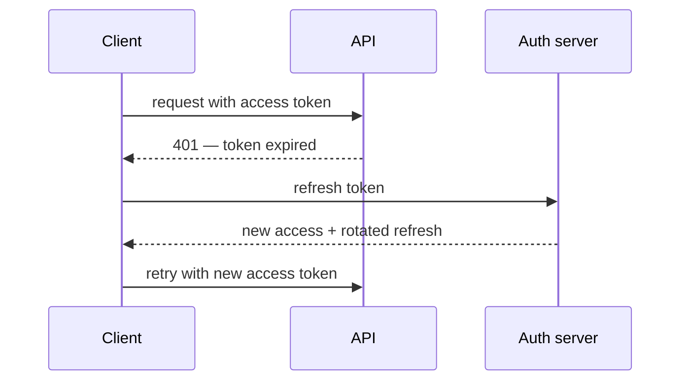

**Purpose** — it lets a system issue a new access token without a full login after a short-lived access token expires.

**How it works / is used** — store it more protectively and longer, rotate it on use, detect reuse, and allow server-side revocation of its session family.

**Downsides and limits** — it is a high-value credential, so leakage is more dangerous than for an access token; do not expose it to browser JavaScript without an explicit threat model.

---
### CSRF — Cross-Site Request Forgery

**Что это** — атака, при которой чужой сайт заставляет browser отправить authenticated cookie request.

**Для чего используется** — защищает cookie-аутентификацию от выполнения изменяющего запроса с чужого сайта от имени пользователя.

**Как используется / работает** — применяю SameSite cookies, CSRF token или origin/referrer validation для state-changing requests.

**Минусы и ограничения** — CORS не является CSRF защитой; token storage и cross-site flows требуют точной модели угроз.

```http
# The cookie is not sent from another site + the server verifies the header token.
Set-Cookie: session=opaque-id; Secure; HttpOnly; SameSite=Lax

POST /api/projects/42/delete
X-CSRF-Token: f3a91c0d…
```

**Purpose** — it is an attack where another site makes a browser send an authenticated cookie request.

**How it works / is used** — use SameSite cookies, a CSRF token, or origin and referrer validation for state-changing requests.

**Downsides and limits** — CORS is not CSRF protection, and token storage plus cross-site flows need a precise threat model.

---
### XSS — Cross-Site Scripting

**Что это** — класс атак с исполнением недоверенного script в origin приложения.

**Для чего используется** — описывает риск исполнения чужого сценария в браузере пользователя и направляет защиту на вывод данных и политику контента.

**Как используется / работает** — экранирую output по умолчанию, sanitise-ю разрешённый HTML, применяю CSP и не использую unsafe DOM sinks.

**Минусы и ограничения** — ручная regex-sanitization ненадёжна; rich-text feature требует audited sanitizer.

```js
// Dangerous: the user string executes as HTML.
element.innerHTML = comment.text;

// Safe: text stays text.
element.textContent = comment.text;
```

**Purpose** — it is the risk of executing untrusted script in the application’s origin.

**How it works / is used** — escape output by default, sanitize allowed HTML, use CSP, and avoid unsafe DOM sinks.

**Downsides and limits** — hand-written regex sanitization is unreliable; rich text needs an audited sanitizer.

---
### CORS — Cross-Origin Resource Sharing

**Что это** — политика браузера, определяющая, какой cross-origin JavaScript может читать response.

**Для чего используется** — разрешает браузерному клиенту на другом источнике читать только явно одобренные ответы API.

**Как используется / работает** — сервер разрешает конкретные origins, methods и headers; credentials требуют точный origin, не wildcard.

**Минусы и ограничения** — CORS не защищает server от прямого клиента и не заменяет authentication/authorization.

```http
Access-Control-Allow-Origin: https://app.example.com
Access-Control-Allow-Credentials: true
```

**Purpose** — it is a browser policy controlling which cross-origin JavaScript may read a response.

**How it works / is used** — the server allows specific origins, methods, and headers; credentials require an exact origin, not wildcard.

**Downsides and limits** — CORS does not protect a server from direct clients and cannot replace authentication or authorization.

---
### CORS preflight

**Что это** — предварительный OPTIONS-запрос браузера, проверяющий, разрешает ли server cross-origin request с non-simple method или headers.

**Для чего используется** — даёт серверу возможность заранее отклонить небезопасный межсайтовый запрос до отправки его основного тела.

**Как используется / работает** — browser отправляет OPTIONS без credentials; server отвечает allow-origin, methods, headers и при нужде allow-credentials, после чего browser решает, посылать ли actual request.

**Минусы и ограничения** — preflight добавляет latency и cache policy; он не защищает API от non-browser client и не заменяет auth.

```http
OPTIONS /api/projects
Access-Control-Request-Method: POST
Access-Control-Request-Headers: content-type

HTTP/1.1 204 No Content
Access-Control-Allow-Origin: https://app.example.com
Access-Control-Allow-Methods: POST
Access-Control-Allow-Headers: Content-Type
```
**Purpose** — the browser checks in advance whether a server permits a cross-origin request with non-simple method or headers.

**How it works / is used** — the browser sends credential-free OPTIONS; the server returns allowed origin, methods, headers, and when needed credentials, then the browser decides whether to send the actual request.

**Downsides and limits** — preflight adds latency and cache policy; it does not protect an API from non-browser clients or replace auth.

---
### CSP — Content Security Policy

**Что это** — HTTP-политика, ограничивающая допустимые источники script, style, images и frames.

**Для чего используется** — ограничивает источники скриптов и ресурсов, уменьшая последствия XSS и случайного подключения недоверенного кода.

**Как используется / работает** — начинаю с report-only, задаю nonce/hash для scripts и постепенно ужесточаю directives.

**Минусы и ограничения** — policy требует maintenance и может сломать third-party integrations; она defence-in-depth, не замена output escaping.

```http
Content-Security-Policy: default-src 'self';
  script-src 'self' 'nonce-r4nd0m';
  img-src 'self' https://cdn.example.com;
  frame-ancestors 'none'
```

**Purpose** — it restricts script, style, image, and frame sources to reduce XSS impact.

**How it works / is used** — start in report-only mode, use nonces or hashes for scripts, and tighten directives gradually.

**Downsides and limits** — policy needs maintenance and can break third-party integrations; it is defense in depth, not a substitute for escaping.

---
### Rate limiting

**Что это** — ограничение частоты запросов к endpoint по ключу (user, API key, IP).

**Для чего используется** — защищает API от злоупотреблений, случайных пиков и исчерпания ограниченного ресурса.

**Как используется / работает** — выбираю key по user/API key/IP, window/bucket и раздельные limits для login, write и expensive operations.

**Минусы и ограничения** — IP ненадёжен за NAT, а distributed limits требуют shared store; legitimate traffic нельзя необоснованно блокировать.

```ts
const key = `login:${request.headers.get("x-forwarded-for")}`;
const allowed = await limiter.consume(key, { limit: 5, windowMs: 60_000 });

if (!allowed) return new Response("Too Many Requests", { status: 429 });
```

**Purpose** — it protects an endpoint from abuse, brute force, and accidental traffic spikes.

**How it works / is used** — choose a key by user, API key, or IP, define window or bucket, and separate login, write, and expensive limits.

**Downsides and limits** — IP is unreliable behind NAT, distributed limits need a shared store, and legitimate traffic must not be blocked unfairly.

---
### Webhooks

**Что это** — HTTP-callback: внешняя система сама отправляет событие на ваш endpoint вместо polling.

**Для чего используется** — позволяет внешней системе сообщать об изменении сразу, вместо постоянного опроса её API.

**Как используется / работает** — проверяю signature и timestamp, быстро ack-аю, ставлю работу в queue и дедуплицирую event id.

**Минусы и ограничения** — delivery обычно at-least-once и неупорядочен; нужен retry, idempotency и observability.

```ts
if (!verifySignature(rawBody, request.headers.get("x-signature"))) {
  return new Response("Invalid signature", { status: 401 });
}
await queue.enqueue({ eventId: payload.id, type: payload.type });
return new Response(null, { status: 202 });
```

**Purpose** — it delivers an event from an external system without constant polling.

**How it works / is used** — validate signature and timestamp, acknowledge quickly, enqueue work, and deduplicate event IDs.

**Downsides and limits** — delivery is commonly at-least-once and unordered, requiring retry, idempotency, and observability.

---
### File uploads

**Что это** — приём пользовательских файлов, обычно напрямую в object storage по signed URL.

**Для чего используется** — отделяет тяжёлую передачу пользовательского файла от основного API и снижает риск принять опасный или чрезмерно большой контент.

**Как используется / работает** — выдаю short-lived signed upload URL, проверяю size/type server-side, сканирую и обрабатываю async.

**Минусы и ограничения** — MIME от клиента нельзя доверять; прямой upload требует строгих bucket permissions и lifecycle rules.

```ts
const { uploadUrl, fileKey } = await api.createUpload({ name: file.name, size: file.size });
await fetch(uploadUrl, { method: "PUT", body: file, headers: { "Content-Type": file.type } });
await api.completeUpload({ fileKey });
```
**Purpose** — it accepts user media or documents safely and at scale.

**How it works / is used** — issue a short-lived signed upload URL, validate size and type server-side, scan, and process asynchronously.

**Downsides and limits** — client MIME cannot be trusted, and direct upload requires strict bucket permissions and lifecycle rules.

---
### Observability

**Что это** — свойство системы быть понятной снаружи через logs, metrics и traces.

**Для чего используется** — позволяет понять поведение production-системы по телеметрии и найти причину сбоя без локального воспроизведения.

**Как используется / работает** — добавляю correlation id, structured logs, latency/error metrics и tracing по critical request path.

**Минусы и ограничения** — telemetry стоит денег и может утечь PII; сигнал должен быть actionable, а не просто шумным.

---
**Purpose** — it helps understand production behavior through logs, metrics, and traces.

**How it works / is used** — add correlation IDs, structured logs, latency and error metrics, and tracing on critical request paths.

**Downsides and limits** — telemetry costs money and can leak PII; signals should be actionable rather than noisy.

## SQL & Databases

---
### Relational model

**Что это** — модель данных из таблиц, ключей и constraints с поддержкой транзакций.

**Для чего используется** — даёт надёжную модель связанных сущностей, ограничений и запросов для транзакционных продуктовых данных.

**Как используется / работает** — моделирую tables, primary/foreign keys и constraints вокруг domain invariants, а не вокруг экранов UI.

**Минусы и ограничения** — join-heavy schema требует понимания access patterns; не каждая нагрузка лучше решается реляционной БД.

---
**Purpose** — it stores related entities with explicit constraints and supports reliable transactions.

**How it works / is used** — model tables, primary and foreign keys, and constraints around domain invariants, not UI screens.

**Downsides and limits** — join-heavy schemas require understanding access patterns, and not every workload suits a relational database.

---
### Normalization

**Что это** — приведение схемы к форме, где каждый независимый факт хранится один раз.

**Для чего используется** — уменьшает противоречивые дубли данных и упрощает обновление единственного источника истины.

**Как используется / работает** — держу user, organization и membership отдельно, связывая их keys и constraints.

**Минусы и ограничения** — чрезмерная нормализация усложняет hot reads; осознанная денормализация допустима с ownership и repair plan.

```sql
-- Before: a repeating group in one column.
-- orders(id, customer_name, products = 'camera, tripod')

-- After: each fact is stored once.
CREATE TABLE orders (
  id          bigint PRIMARY KEY,
  customer_id bigint REFERENCES customers (id)
);
CREATE TABLE order_items (
  order_id   bigint REFERENCES orders (id),
  product_id bigint REFERENCES products (id)
);
```

**Purpose** — it reduces duplication and update anomalies by separating independent facts.

**How it works / is used** — keep user, organization, and membership separately, linked by keys and constraints.

**Downsides and limits** — over-normalization complicates hot reads; deliberate denormalization is acceptable with ownership and a repair plan.

---
### Primary and foreign keys

**Что это** — primary key однозначно идентифицирует row, foreign key сохраняет ссылочную целостность.

**Для чего используется** — не даёт потерять идентичность записи и создать ссылку на несуществующую связанную сущность.

**Как используется / работает** — выбираю stable ID, добавляю FK и явную on delete policy по бизнес-смыслу.

**Минусы и ограничения** — cascade delete может неожиданно удалить данные; отсутствие FK переносит целостность в хрупкий application code.

```sql
CREATE TABLE comments (
  id         bigint GENERATED ALWAYS AS IDENTITY PRIMARY KEY,
  project_id bigint NOT NULL REFERENCES projects (id) ON DELETE CASCADE,
  body       text NOT NULL
);
```

**Purpose** — a primary key identifies a row uniquely, while a foreign key preserves referential integrity.

**How it works / is used** — choose a stable ID, add FKs, and set an explicit on-delete policy by business meaning.

**Downsides and limits** — cascade delete can remove data unexpectedly, while no FK moves integrity into fragile application code.

---
### Index

**Что это** — вспомогательная структура данных БД для быстрого lookup, sorting или join.

**Для чего используется** — сокращает задержку частых фильтров, сортировок и соединений таблиц без изменения интерфейса запроса.

**Как используется / работает** — строю index под реальный WHERE/JOIN/ORDER BY, проверяю EXPLAIN и selectivity.

**Минусы и ограничения** — лишние indexes замедляют insert/update; index не спасёт query, возвращающий слишком много данных.

```sql
CREATE INDEX projects_workspace_created_at_idx
ON projects (workspace_id, created_at DESC);
```

**Purpose** — it speeds up lookup, sorting, or joins at the cost of storage and slower writes.

**How it works / is used** — build an index for actual WHERE, JOIN, and ORDER BY patterns, then check EXPLAIN and selectivity.

**Downsides and limits** — extra indexes slow inserts and updates, and no index rescues a query returning too much data.

---
### Composite index

**Что это** — индекс по нескольким колонкам в заданном порядке.

**Для чего используется** — ускоряет реальный многоколонный шаблон запроса, когда одного индекса на отдельном поле недостаточно.

**Как используется / работает** — порядок колонок выбираю по equality predicates, затем range/sort и фактическому query plan.

**Минусы и ограничения** — index (a,b) не равноценно помогает запросу только по b; не угадываю порядок без EXPLAIN.

```sql
CREATE INDEX projects_workspace_updated_idx
  ON projects (workspace_id, updated_at DESC);

-- Speeds up: WHERE workspace_id = $1 ORDER BY updated_at DESC
```
**Purpose** — it covers a query filtering or sorting by several columns.

**How it works / is used** — choose column order from equality predicates, then range or sort, and verify the real query plan.

**Downsides and limits** — an index on (a,b) does not equally help a query on b alone; do not guess order without EXPLAIN.

---
### Query plan / EXPLAIN

**Что это** — EXPLAIN показывает оценочный plan optimizer-а; EXPLAIN ANALYZE выполняет запрос и показывает actual rows/time.

**Для чего используется** — показывает фактическую стратегию БД и позволяет исправлять медленный запрос по данным, а не догадкам.

**Как используется / работает** — начинаю с EXPLAIN, затем в безопасной среде сравниваю estimated и actual rows через EXPLAIN ANALYZE, ищу sequential scan, bad join order и missing index.

**Минусы и ограничения** — ANALYZE реально исполняет запрос, поэтому опасен для destructive statement-ов; plan зависит от data distribution и stats, а локальная маленькая БД может скрыть production проблему.

```sql
EXPLAIN ANALYZE
SELECT id, title
FROM projects
WHERE workspace_id = $1
ORDER BY updated_at DESC
LIMIT 20;
```

**Purpose** — EXPLAIN shows the optimizer’s estimated plan; EXPLAIN ANALYZE executes the query and shows actual rows and timing.

**How it works / is used** — start with EXPLAIN, then in a safe environment compare estimated and actual rows with EXPLAIN ANALYZE and look for sequential scans, bad join order, and missing indexes.

**Downsides and limits** — ANALYZE really executes the statement, so it is risky for destructive statements; plans depend on data distribution and statistics, and a tiny local database can hide a production issue.

---
### JOIN

**Что это** — операция SQL, объединяющая rows из таблиц по условию связи.

**Для чего используется** — позволяет получить связанные данные за один согласованный запрос вместо склейки записей в приложении.

**Как используется / работает** — INNER JOIN берёт совпадения, LEFT JOIN сохраняет левую сторону; выбираю только нужные columns.

**Минусы и ограничения** — join с one-to-many размножает родительские rows; нужно понимать cardinality и pagination.

```sql
SELECT p.id, p.name, u.name AS owner_name
FROM projects p
LEFT JOIN users u ON u.id = p.owner_id;
```

**Purpose** — it combines rows from tables through a relationship.

**How it works / is used** — INNER JOIN keeps matches, LEFT JOIN preserves the left side; select only required columns.

**Downsides and limits** — a one-to-many join duplicates parent rows, so cardinality and pagination matter.

---
### N+1 queries

**Что это** — анти-паттерн, при котором после одного list query выполняется запрос на каждую строку.

**Для чего используется** — выявляет причину роста задержки пропорционально числу строк и подсказывает объединить или пакетировать запросы.

**Как используется / работает** — выявляю trace/logs, затем делаю join, batch IN query или ORM eager loading.

**Минусы и ограничения** — giant join тоже может раздувать response; лечу конкретный access pattern, а не только число запросов.

```sql
-- Instead of querying the author for every project:
SELECT p.id, p.title, u.name AS author_name
FROM projects p
JOIN users u ON u.id = p.author_id
WHERE p.workspace_id = $1;
```

**Purpose** — it is an anti-pattern where one list query is followed by a query per row.

**How it works / is used** — find it in traces or logs, then use a join, batched IN query, or ORM eager loading.

**Downsides and limits** — a giant join can also bloat a response; fix the actual access pattern, not merely query count.

---
### Transactions

**Что это** — единица работы БД, в которой связанные writes фиксируются вместе или откатываются вместе.

**Для чего используется** — не допускает частичного применения связанного бизнес-изменения, например перевода денег или смены членства.

**Как используется / работает** — оборачиваю изменение баланса, membership или status transition в short DB transaction.

**Минусы и ограничения** — нельзя держать transaction во время сетевого вызова или user input; long transactions создают contention.

```sql
BEGIN;
UPDATE accounts SET balance = balance - 10 WHERE id = $1;
UPDATE accounts SET balance = balance + 10 WHERE id = $2;
COMMIT;
```

**Purpose** — it guarantees that related writes commit together or roll back together.

**How it works / is used** — wrap a balance change, membership change, or status transition in a short database transaction.

**Downsides and limits** — do not hold a transaction during a network call or user input; long transactions create contention.

---
### ACID — Atomicity, Consistency, Isolation, Durability

**Что это** — набор гарантий транзакционной БД: atomicity, consistency, isolation, durability.

**Для чего используется** — задаёт ожидаемые гарантии для критичных изменений данных и помогает выбрать подходящий уровень изоляции.

**Как используется / работает** — опираюсь на atomic commit и constraints, выбираю isolation level по риску конкурентных аномалий.

**Минусы и ограничения** — ACID не делает весь distributed workflow атомарным и не отменяет application bugs.

```sql
BEGIN;
UPDATE accounts SET balance = balance - 100 WHERE id = 1;
UPDATE accounts SET balance = balance + 100 WHERE id = 2;
COMMIT; -- atomic: both changes or neither, even on failure
```

**Purpose** — it describes atomicity, consistency, isolation, and durability in a transactional database.

**How it works / is used** — rely on atomic commit and constraints and choose isolation level for concurrency-anomaly risk.

**Downsides and limits** — ACID does not make an entire distributed workflow atomic or eliminate application bugs.

---
### Isolation levels

**Что это** — настройка транзакции, определяющая, какие concurrent changes она видит.

**Для чего используется** — позволяет уравновесить корректность конкурентных операций и стоимость блокировок для конкретного сценария.

**Как используется / работает** — начинаю с database default, затем усиливаю isolation или locking только для доказанного race.

**Минусы и ограничения** — более строгая isolation снижает concurrency и может давать serialization failures, которые нужно retry-ить.

```sql
BEGIN ISOLATION LEVEL REPEATABLE READ;
SELECT balance FROM accounts WHERE id = 1;
-- A repeated SELECT returns the same value: a concurrent COMMIT is not visible here.
COMMIT;
```

**Purpose** — it defines which concurrent changes a transaction can observe.

**How it works / is used** — start with the database default, then strengthen isolation or locking only for a proven race.

**Downsides and limits** — stricter isolation lowers concurrency and can cause serialization failures that require retry.

---
### Optimistic locking

**Что это** — контроль конкурентных изменений через версию записи вместо удержания lock.

**Для чего используется** — предотвращает молчаливую потерю изменения при редких конфликтах без удержания блокировки во время редактирования.

**Как используется / работает** — row хранит version/updatedAt; UPDATE включает old version в WHERE и проверяет affected rows.

**Минусы и ограничения** — conflict должен быть понятен пользователю; при частых collisions pessimistic lock может быть лучше.

```sql
UPDATE documents
SET body = $1, version = version + 1
WHERE id = $2 AND version = $3;
```

**Purpose** — it prevents silent lost updates without holding a long database lock.

**How it works / is used** — a row stores version or updatedAt; UPDATE includes the old version in WHERE and checks affected rows.

**Downsides and limits** — conflicts need understandable UX, and frequent collisions may favor pessimistic locking.

---
### Pessimistic locking

**Что это** — явная блокировка row в transaction на время изменения.

**Для чего используется** — защищает критический ресурс при частых конфликтах, когда откат оптимистичного изменения слишком дорог.

**Как используется / работает** — SELECT FOR UPDATE беру кратко перед write и освобождаю lock вместе с commit/rollback.

**Минусы и ограничения** — создаёт waits/deadlocks и плохо подходит для долгих user-driven flows.

```sql
BEGIN;
SELECT id, seats_left FROM workshops WHERE id = $1 FOR UPDATE;
UPDATE workshops SET seats_left = seats_left - 1 WHERE id = $1 AND seats_left > 0;
COMMIT;
```
**Purpose** — it reserves a row in a transaction when concurrent change is unacceptable.

**How it works / is used** — take SELECT FOR UPDATE briefly before a write and release it at commit or rollback.

**Downsides and limits** — it creates waits and deadlocks and is a poor fit for long user-driven flows.

---
### Deadlocks

**Что это** — взаимная блокировка, при которой transactions циклически ждут locks друг друга.

**Для чего используется** — сообщает о циклическом ожидании транзакций и помогает искать конфликтующий порядок захвата блокировок.

**Как используется / работает** — беру resources в едином порядке, держу transactions короткими и retry-ю безопасную aborted transaction.

**Минусы и ограничения** — retry не исправляет логическую contention проблему; нужны метрики и root-cause analysis.

```sql
-- T1: UPDATE accounts ... WHERE id = 1;  then waits for the lock on id = 2
-- T2: UPDATE accounts ... WHERE id = 2;  then waits for the lock on id = 1
-- Cycle: the database aborts one transaction.
-- Fix: acquire rows in one consistent order (for example, by id).
```

**Purpose** — it is a failure where transactions wait cyclically for each other’s locks.

**How it works / is used** — acquire resources in one order, keep transactions short, and retry a safely aborted transaction.

**Downsides and limits** — retry does not fix a logical contention problem; metrics and root-cause analysis are needed.

---
### Unique constraints

**Что это** — ограничение БД, гарантирующее уникальность значения или комбинации колонок.

**Для чего используется** — переносит гарантию уникальности в базу данных и защищает от гонок между параллельными запросами.

**Как используется / работает** — задаю unique на email или tenant-plus-slug и превращаю violation в понятный domain error.

**Минусы и ограничения** — pre-check «такой email есть?» не заменяет constraint; nullable semantics отличаются между БД.

```sql
ALTER TABLE users ADD CONSTRAINT users_email_unique UNIQUE (email);
-- A race between two concurrent signups yields error 23505, not a duplicate.
```

**Purpose** — it makes a duplicate business identity impossible even under concurrent requests.

**How it works / is used** — add unique on email or tenant-plus-slug and translate violations into a clear domain error.

**Downsides and limits** — a pre-check such as “email exists?” cannot replace the constraint, and nullable semantics vary by database.

---
### Migrations

**Что это** — версионированные скрипты изменения schema, применяемые вместе с кодом.

**Для чего используется** — делает изменение схемы повторяемым, проверяемым и согласованным между разработкой, CI и продакшеном.

**Как используется / работает** — делаю additive change, backfill, dual-read/write при нужде, затем отдельное removal после deploy.

**Минусы и ограничения** — destructive migration или long lock опасны; migration должна быть tested на realistic copy/data size.

```sql
-- Step 1: safe additive schema change.
ALTER TABLE projects ADD COLUMN slug text;
-- Step 2: backfill; new code writes both fields.
-- Step 3: add NOT NULL/UNIQUE only after rollout.
```
**Purpose** — it versions safe production-schema change alongside code.

**How it works / is used** — make additive changes, backfill, use dual read or write if needed, then remove separately after deployment.

**Downsides and limits** — destructive migration or a long lock is dangerous; test migration on realistic data size.

---
### Soft delete

**Что это** — пометка записи удалённой (deletedAt) вместо физического удаления.

**Для чего используется** — сохраняет возможность аудита и восстановления записи, когда физическое удаление опасно или преждевременно.

**Как используется / работает** — добавляю deletedAt и централизованный default scope, а при GDPR определяю отдельное purge правило.

**Минусы и ограничения** — все queries должны фильтровать deleted rows; unique indexes и восстановление усложняются.

```sql
ALTER TABLE projects ADD COLUMN deleted_at timestamptz;

-- Uniqueness among live rows only:
CREATE UNIQUE INDEX projects_slug_alive_idx
  ON projects (slug) WHERE deleted_at IS NULL;
```

**Purpose** — it hides a record from normal UI while preserving audit and recovery options.

**How it works / is used** — add deletedAt and a centralized default scope, with a separate purge rule for GDPR where required.

**Downsides and limits** — every query must filter deleted rows, and unique indexes plus restoration become harder.

---
### JSON columns

**Что это** — колонки типа JSON/JSONB для хранения вариативного attribute set.

**Для чего используется** — позволяет хранить редкие или эволюционирующие атрибуты без миграции каждой вариации схемы.

**Как используется / работает** — оставляю core relational fields в columns, валидирую JSON на записи и index-ирую только нужные paths.

**Минусы и ограничения** — JSON не повод избегать model design; queries, constraints и migrations становятся труднее.

```sql
SELECT id FROM projects
WHERE settings @> '{"autosave": true}'; -- JSONB containment

CREATE INDEX projects_settings_idx ON projects USING gin (settings);
```

**Purpose** — it stores a flexible attribute set when the schema is genuinely variable.

**How it works / is used** — keep core relational fields in columns, validate JSON on write, and index only needed paths.

**Downsides and limits** — JSON is not a reason to avoid model design; queries, constraints, and migrations become harder.

## Testing & DevOps

---
### Unit tests

**Что это** — быстрые тесты изолированного business rule или pure function.

**Для чего используется** — быстро фиксирует бизнес-правило и защищает его от регрессии без запуска сети, браузера или базы данных.

**Как используется / работает** — тестирую observable behavior с детерминированными inputs, особенно boundary и unhappy paths.

**Минусы и ограничения** — unit tests не доказывают интеграцию, schema correctness или настоящий browser flow.

```ts
test("rejects an expired token", () => {
  expect(validateToken(expiredToken)).toEqual({ ok: false, reason: "expired" });
});
```

**Purpose** — it quickly verifies an isolated business rule or pure function.

**How it works / is used** — test observable behavior with deterministic inputs, especially boundaries and unhappy paths.

**Downsides and limits** — unit tests do not prove integration, schema correctness, or a real browser flow.

---
### Integration tests

**Что это** — тесты совместной работы modules, HTTP layer, database или queue boundary.

**Для чего используется** — проверяет, что договорённость между слоями действительно работает, а не только что каждый слой корректен изолированно.

**Как используется / работает** — поднимаю реальный/ephemeral dependency либо contract-faithful fake и проверяю полный outcome.

**Минусы и ограничения** — медленнее и хрупче unit tests; test data и isolation требуют дисциплины.

```ts
test("POST /projects persists a project", async () => {
  const response = await app.fetch(new Request("http://app/projects", { method: "POST", body: '{"name":"Demo"}' }));
  expect(response.status).toBe(201);
});
```

**Purpose** — it verifies modules, an HTTP layer, a database, or a queue boundary working together.

**How it works / is used** — run a real or ephemeral dependency, or a contract-faithful fake, and assert the full outcome.

**Downsides and limits** — it is slower and more brittle than unit tests, and test data plus isolation need discipline.

---
### End-to-end tests

**Что это** — тесты пользовательского пути через настоящий browser и deployed-like систему.

**Для чего используется** — страхует самые ценные пользовательские сценарии от поломок, которые не видны на уровне отдельных модулей.

**Как используется / работает** — покрываю login, critical create/edit flow и visual assertion там, где риск оправдывает стоимость.

**Минусы и ограничения** — медленные и flaky, поэтому не заменяют unit/integration tests и нуждаются в stable selectors.

```ts
test("user can create a project", async ({ page }) => {
  await page.goto("/projects");
  await page.getByRole("button", { name: "Create project" }).click();
  await page.getByLabel("Name").fill("Demo");
  await page.getByRole("button", { name: "Save" }).click();
  await expect(page.getByText("Demo")).toBeVisible();
});
```

**Purpose** — it verifies a valuable user journey through a real browser and deployment-like system.

**How it works / is used** — cover login, critical create or edit flow, and visual assertions where risk justifies the cost.

**Downsides and limits** — it is slow and flaky, so it cannot replace unit or integration tests and needs stable selectors.

---
### Test pyramid

**Что это** — эвристика распределения тестов: много быстрых unit, меньше integration, единицы E2E.

**Для чего используется** — удерживает обратную связь быстрой и устойчивой, оставляя дорогие E2E только для действительно критичных путей.

**Как используется / работает** — большую часть logic проверяю unit, boundaries integration, а пару golden journeys end-to-end.

**Минусы и ограничения** — это эвристика, не quota; продукт с тяжёлой UI-интеграцией может нуждаться в другой форме.

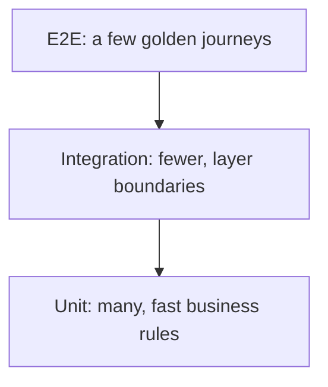

**Purpose** — it balances fast cheap tests with fewer high-value integration and E2E checks.

**How it works / is used** — test most logic with units, boundaries with integration, and a few golden journeys end to end.

**Downsides and limits** — it is a heuristic, not a quota; a UI-heavy product may need a different shape.

---
### Mock vs fake vs stub

**Что это** — три вида тестовых замен: stub возвращает готовый ответ, fake — рабочая упрощённая реализация, mock проверяет interaction.

**Для чего используется** — помогает выбрать тестовую замену, которая изолирует проверку, но не делает тест бессмысленно похожим на реализацию.

**Как используется / работает** — предпочитаю fake/stub для outcome tests, mock применяю узко для важного side effect.

**Минусы и ограничения** — tests, привязанные к внутренним вызовам, ломаются при безопасном refactor.

```ts
const stub = { getRate: () => 0.2 };      // canned answer
const fake = new InMemoryProjectRepo();   // working simplified implementation
const mock = vi.fn();                     // verifies interaction

await chargeUser(user, { sendReceipt: mock });
expect(mock).toHaveBeenCalledWith(user.email);
```

**Purpose** — it isolates a dependency differently: a stub returns answers, a fake is a working simplification, and a mock verifies interaction.

**How it works / is used** — prefer fakes or stubs for outcome tests and use mocks narrowly for important side effects.

**Downsides and limits** — tests coupled to internal calls break during safe refactoring.

---
### Contract testing

**Что это** — тесты согласованности producer и consumer по API/message contract.

**Для чего используется** — ловит несовместимое изменение API до того, как оно попадёт к потребителю отдельного сервиса.

**Как используется / работает** — фиксирую request/response schema и compatibility checks в CI, особенно между independently deployed services.

**Минусы и ограничения** — не заменяет end-to-end behavior и требует ownership/versioning contract-а.

```ts
expect(response).toMatchObject({
  status: 200,
  body: { id: expect.any(String), title: expect.any(String) },
});
```
**Purpose** — it verifies that producer and consumer agree on an API or message contract.

**How it works / is used** — define request and response schema and run compatibility checks in CI, especially across independently deployed services.

**Downsides and limits** — it does not replace end-to-end behavior and needs contract ownership and versioning.

---
### TDD — Test-Driven Development

**Что это** — цикл разработки red → green → refactor: тест формулирует behavior до реализации.

**Для чего используется** — заставляет сформулировать наблюдаемое поведение до реализации и оставляет регрессионный тест вместе с решением.

**Как используется / работает** — red test описывает acceptance criterion, green implementation делает его pass, refactor сохраняет clarity.

**Минусы и ограничения** — не превращаю TDD в ритуал для CSS или exploratory prototype; тест должен быть meaningful.

---
**Purpose** — it helps state behavior and a small design seam before implementing the minimum solution.

**How it works / is used** — a red test states an acceptance criterion, green implementation makes it pass, and refactor restores clarity.

**Downsides and limits** — do not turn TDD into ritual for CSS or exploratory prototypes; the test must be meaningful.

---
### Test flakiness

**Что это** — недетерминированные падения теста, разрушающие доверие к CI.

**Для чего используется** — сигнализирует, что тест зависит от времени, порядка, общей среды или сети; это повод искать источник недетерминизма, а не только перезапускать тест.

**Как используется / работает** — убираю real time, random, shared state, arbitrary sleeps и network dependency; retry — только временное containment.

**Минусы и ограничения** — игнорировать flaky test опасно: он скрывает regression и замедляет команду.

---
**Purpose** — it is a nondeterministic failure that destroys trust in CI.

**How it works / is used** — remove real time, randomness, shared state, arbitrary sleeps, and network dependency; retry is temporary containment only.

**Downsides and limits** — ignoring a flaky test is dangerous because it hides regressions and slows the team.

---
### CI — Continuous Integration

**Что это** — автоматическая проверка каждого изменения до merge в общую ветку.

**Для чего используется** — не даёт не проверенному изменению попасть в общую ветку и делает качество сборки общим правилом команды.

**Как используется / работает** — запускаю typecheck, tests, lint, build и быстрые security checks на clean reproducible environment.

**Минусы и ограничения** — медленный/noisy pipeline обходят; local и CI gates должны быть согласованы.

```yaml
- run: bun install --frozen-lockfile
- run: bun run lint
- run: bun test
```

**Purpose** — it automatically verifies every change before merge.

**How it works / is used** — run typecheck, tests, lint, build, and fast security checks in a clean reproducible environment.

**Downsides and limits** — teams bypass slow or noisy pipelines, so local and CI gates must agree.

---
### CD — Continuous Delivery / Continuous Deployment

**Что это** — repeatable процесс доставки проверенного artifact до environment.

**Для чего используется** — сокращает риск и время доставки проверенной версии от коммита до окружения.

**Как используется / работает** — build once, promote artifact, применяю migrations/health checks и сохраняю audit trail deployment-а.

**Минусы и ограничения** — автоматический deploy не отменяет feature flags, monitoring и rollback plan.

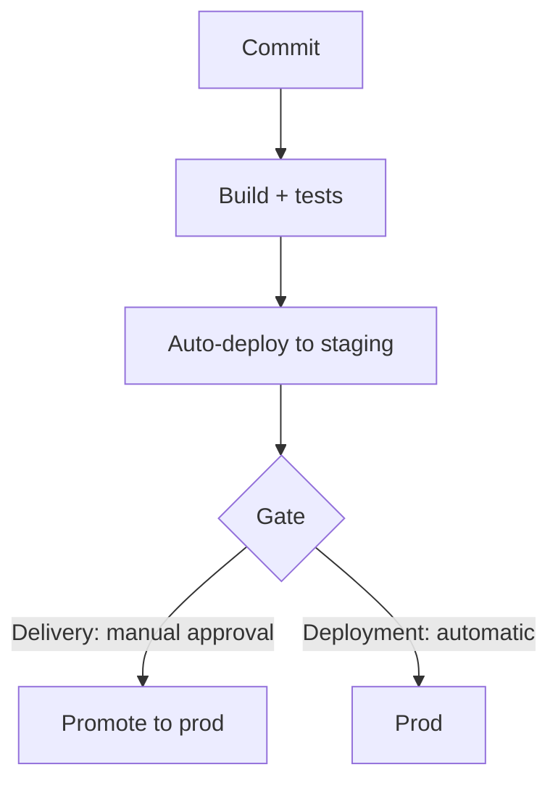

**Purpose** — it reliably delivers a verified artifact to an environment through a repeatable process.

**How it works / is used** — build once, promote the artifact, run migrations and health checks, and retain deployment audit trail.

**Downsides and limits** — automatic deployment does not remove the need for feature flags, monitoring, and rollback plan.

---
### Docker

**Что это** — контейнеризация: упаковка приложения и dependencies в воспроизводимый image.

**Для чего используется** — уменьшает расхождение между локальной разработкой, CI и развёрнутым окружением.

**Как используется / работает** — multi-stage build оставляет runtime image маленьким, pin-ю base image и запускаю как non-root.

**Минусы и ограничения** — container не заменяет config/security/observability; large image ухудшает cold start и supply-chain риск.

```dockerfile
FROM node:22-alpine AS build
WORKDIR /app
COPY . .
RUN npm ci && npm run build
FROM node:22-alpine
COPY --from=build /app/dist ./dist
CMD ["node", "dist/server.js"]
```

**Purpose** — it packages an application and dependencies into a reproducible image.

**How it works / is used** — use multi-stage builds for a small runtime image, pin the base image, and run as non-root.

**Downsides and limits** — a container does not replace configuration, security, or observability; a large image hurts cold start and supply-chain risk.

---
### Environment configuration

**Что это** — вынесение deploy-specific values и secrets из application code в окружение.

**Для чего используется** — отделяет код от различающихся адресов, секретов и переключателей окружений без их вшивания в сборку.

**Как используется / работает** — валидирую env schema на startup, храню secrets в secret manager и документирую required variables.

**Минусы и ограничения** — env sprawl не заменяет typed config; secret нельзя логировать или отправлять в client bundle.

```ts
const config = {
  databaseUrl: process.env.DATABASE_URL,
  port: Number(process.env.PORT ?? 3000),
};

if (!config.databaseUrl) throw new Error("DATABASE_URL is required");
```
**Purpose** — it separates deployment-specific values and secrets from application code.

**How it works / is used** — validate an env schema at startup, keep secrets in a secret manager, and document required variables.

**Downsides and limits** — env sprawl does not replace typed config, and a secret must not be logged or sent to the client bundle.

---
### Feature flags

**Что это** — runtime-переключатели функциональности, разделяющие deploy и release.

**Для чего используется** — позволяет включать функцию постепенно, тестировать на сегменте и быстро остановить её без нового развёртывания.

**Как используется / работает** — flag имеет owner, audience, expiry и metric; rollout делаю по tenant/user percentage.

**Минусы и ограничения** — stale flags создают combinatorial complexity; security-sensitive access нельзя оставлять только на frontend flag.

```ts
if (flags.isEnabled("new-timeline", { tenantId, userId })) {
  return <NewTimeline />;
}
return <LegacyTimeline />;
```
**Purpose** — it decouples deployment from release, enabling gradual feature exposure and safe rollback.

**How it works / is used** — a flag has owner, audience, expiry, and metric; roll out by tenant, user, or percentage.

**Downsides and limits** — stale flags create combinatorial complexity, and security-sensitive access cannot rely on a frontend flag alone.

---
### Blue-green deployment

**Что это** — схема релиза с двумя одинаковыми окружениями и переключением traffic между ними.

**Для чего используется** — даёт быстрое и обратимое переключение между двумя версиями приложения при выпуске.

**Как используется / работает** — новая environment проходит smoke/health checks, затем load balancer переводит traffic.

**Минусы и ограничения** — удваивает infrastructure на время и требует backward-compatible DB schema.

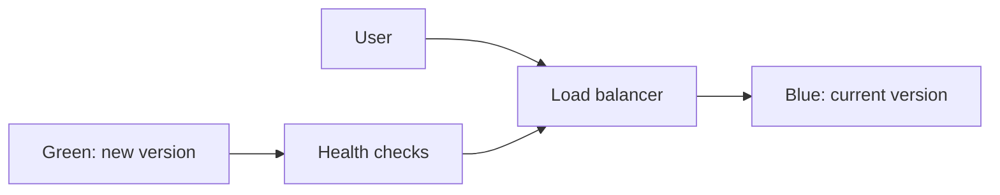

**Purpose** — it switches traffic between two equivalent versions for fast rollback.

**How it works / is used** — the new environment passes smoke and health checks, then the load balancer moves traffic.

**Downsides and limits** — it temporarily doubles infrastructure and requires backward-compatible database schema.

---
### Canary deployment

**Что это** — схема релиза с постепенным переводом малой доли пользователей на новую версию.

**Для чего используется** — ограничивает радиус поражения новой версии, сначала показывая её небольшой доле трафика.

**Как используется / работает** — постепенно увеличиваю traffic при стабильных error, latency и business metrics.

**Минусы и ограничения** — нужен хороший observability и статистически достаточно traffic; проблемы data migration могут затронуть всех.

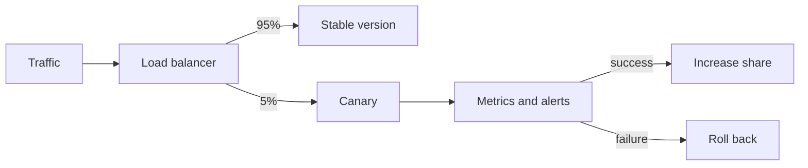

**Purpose** — it limits blast radius by exposing a new version to a small share of users first.

**How it works / is used** — gradually increase traffic when error, latency, and business metrics remain healthy.

**Downsides and limits** — it needs strong observability and enough traffic for confidence; data-migration issues can still affect everyone.

---
### Rollback

**Что это** — возврат сервиса к известной working version после harmful release.

**Для чего используется** — сокращает время восстановления после неудачного релиза и делает риск выпуска управляемым.

**Как используется / работает** — заранее определяю trigger, one-click artifact rollback и compatible schema/feature flags.

**Минусы и ограничения** — code rollback не отменяет необратимую data mutation, поэтому critical writes требуют repair strategy.

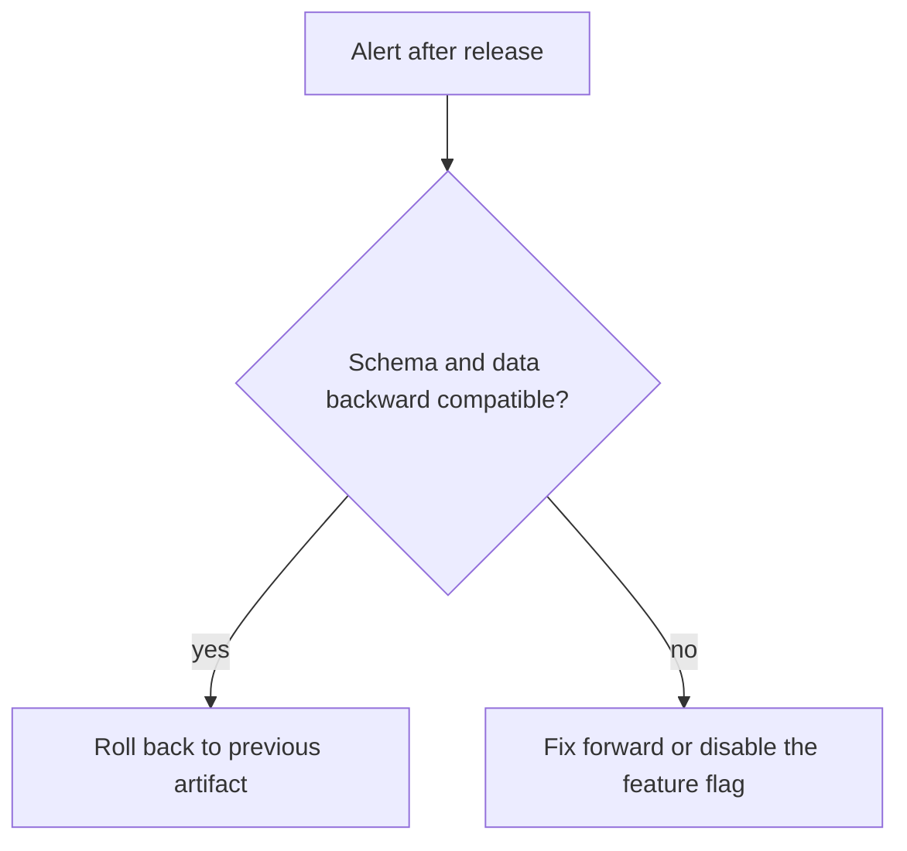

**Purpose** — it quickly returns a service to a known working version after a harmful release.

**How it works / is used** — define triggers in advance, keep one-click artifact rollback, and use compatible schema and feature flags.

**Downsides and limits** — code rollback does not undo irreversible data mutation, so critical writes need a repair strategy.

---
### SLI, SLO, SLA — Service Level Indicator, Objective, Agreement

**Что это** — SLI измеряет service behavior, SLO задаёт целевой уровень, SLA — внешнее обещание с последствиями.

**Для чего используется** — переводит надёжность сервиса в измеримые цели и даёт error budget для решений о темпе релизов.

**Как используется / работает** — выбираю user-facing indicator, например successful video publish latency, и error budget для release decisions.

**Минусы и ограничения** — metric без user value стимулирует неверную оптимизацию; SLA не стоит обещать без operational capacity.

---
**Purpose** — SLI measures service behavior, SLO sets a target, and SLA is an external promise with consequences.

**How it works / is used** — choose a user-facing indicator, such as successful video-publish latency, and use an error budget for release decisions.

**Downsides and limits** — a metric without user value drives wrong optimization, and SLA should not be promised without operational capacity.

---
### Incident response

**Что это** — процесс реакции на production incident: роли, коммуникация, стабилизация, postmortem.

**Для чего используется** — сокращает ущерб и время восстановления при production-сбое за счёт заранее определённых ролей и процесса.

**Как используется / работает** — назначаю incident lead, фиксирую timeline, стабилизирую service, communicate-ю и делаю blameless postmortem.

**Минусы и ограничения** — postmortem без follow-up owners ничего не меняет; не надо в момент инцидента искать виноватого.

---
**Purpose** — it structures response to a production incident to reduce impact and recovery time.

**How it works / is used** — assign an incident lead, record a timeline, stabilize service, communicate, and write a blameless postmortem.

**Downsides and limits** — a postmortem without follow-up owners changes nothing, and an incident is not the time to find blame.

## Architecture & System Design

---
### Monolith

**Что это** — архитектура с одной deployable единицей для всей product functionality.

**Для чего используется** — минимизирует операционную сложность, пока границы домена и независимое масштабирование не требуют отдельных сервисов.

**Как используется / работает** — держу clear modules и internal boundaries внутри одного repo/process, извлекая сервис только по доказанному давлению.

**Минусы и ограничения** — без modularity растёт coupling и deployment blast radius; один runtime не означает один огромный файл.

---
**Purpose** — it puts product functionality in one deployable, simplifying local development and transactions.

**How it works / is used** — keep clear modules and internal boundaries in one repo or process, extracting a service only for proven pressure.

**Downsides and limits** — without modularity coupling and deployment blast radius grow; one runtime does not mean one giant file.

---
### Microservices

**Что это** — архитектура из независимо развёртываемых сервисов вокруг bounded contexts.

**Для чего используется** — даёт независимое владение, масштабирование и выпуск только там, где эта свобода оправдывает распределённую сложность.

**Как используется / работает** — выделяю service после ясного domain boundary, API ownership и operational capability команды.

**Минусы и ограничения** — добавляет network, distributed data, observability и on-call complexity; не стартовая архитектура по умолчанию.

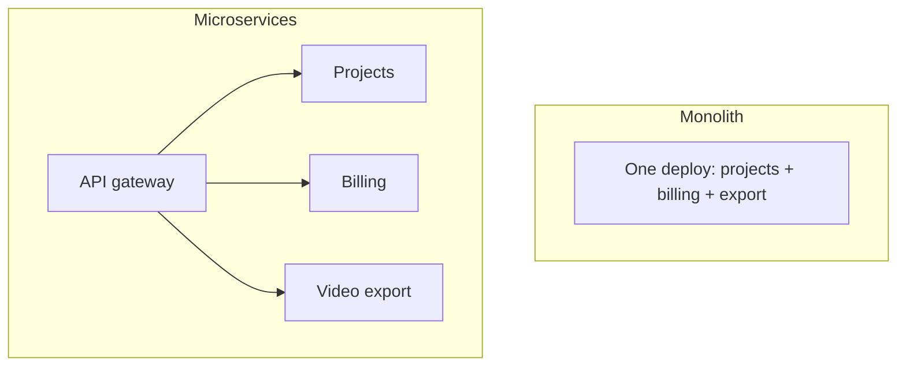

**Purpose** — it enables independent deployment, scaling, and ownership for genuinely independent bounded contexts.

**How it works / is used** — extract a service after a clear domain boundary, API ownership, and team operational capability exist.

**Downsides and limits** — it adds network, distributed-data, observability, and on-call complexity; it is not the default starting architecture.

---
### Modular monolith

**Что это** — монолит с domain modules и enforced internal boundaries внутри одного deployable.

**Для чего используется** — сохраняет простоту одного развёртывания, но не позволяет доменным частям незаметно превратиться в спагетти-код.

**Как используется / работает** — модули общаются через explicit interfaces/events, не импортируют private persistence детали друг друга.

**Минусы и ограничения** — boundaries требуют discipline/tooling; shared database всё ещё допускает обход архитектуры.

---
**Purpose** — it combines simple deployment with domain modules and enforced internal boundaries.

**How it works / is used** — modules communicate through explicit interfaces or events and do not import each other’s private persistence details.

**Downsides and limits** — boundaries need discipline and tooling, while a shared database still allows architectural bypass.

---
### Bounded context

**Что это** — граница домена, внутри которой term и model имеют одно точное значение.

**Для чего используется** — предотвращает смешение разных значений одних и тех же сущностей между командами и доменами.

**Как используется / работает** — отделяю, например, content authoring, rendering и billing с явными translated contracts между ними.

**Минусы и ограничения** — не делю по таблицам или оргструктуре механически; boundary должен отражать язык и change patterns.

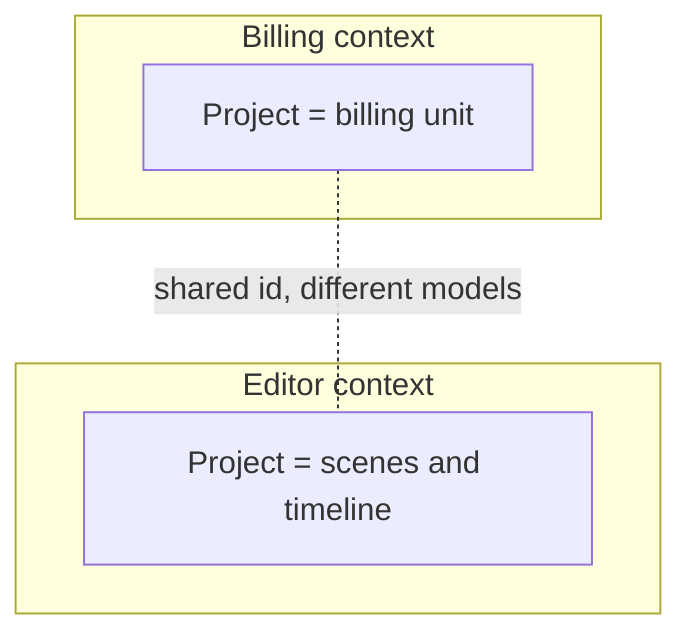

**Purpose** — it defines where a domain term and model have one precise meaning.

**How it works / is used** — separate content authoring, rendering, and billing with explicit translated contracts between them.

**Downsides and limits** — do not split mechanically by tables or org chart; a boundary should reflect language and change patterns.

---
### Clean architecture

**Что это** — слоистая архитектура, где domain/use-case logic не зависит от framework, database и transport.

**Для чего используется** — снижает зависимость бизнес-правил от фреймворка, базы и транспорта, облегчая тестирование и замену инфраструктуры.

**Как используется / работает** — handlers/adapters переводят input, application service применяет business rule через ports.

**Минусы и ограничения** — лишние layers для простой CRUD-фичи замедляют delivery; abstraction должна соответствовать volatility.

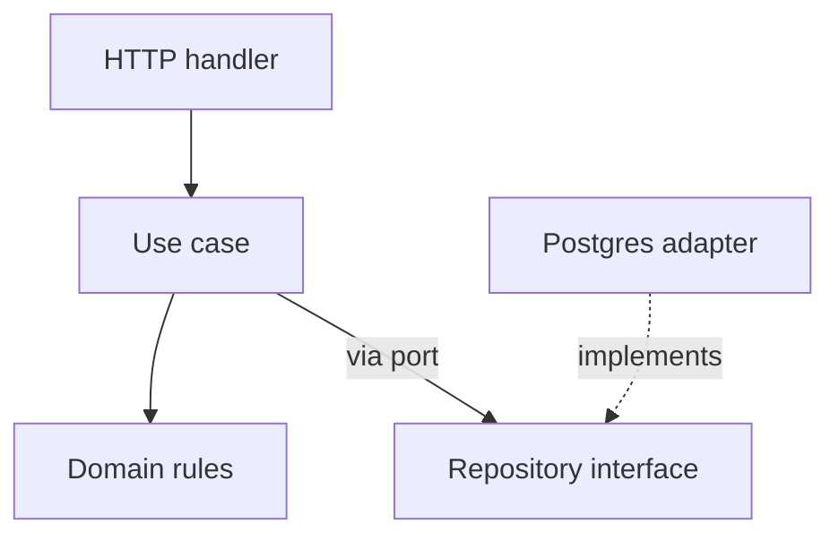

**Purpose** — it keeps domain and use-case logic independent from framework, database, and transport.

**How it works / is used** — handlers and adapters translate input, while an application service applies business rules through ports.

**Downsides and limits** — extra layers for simple CRUD slow delivery; abstraction should match volatility.

---
### Hexagonal architecture

**Что это** — архитектура ports-and-adapters: domain общается с HTTP, DB, queue и внешними API через интерфейсы.

**Для чего используется** — даёт приложению менять HTTP, базу, очередь или внешний сервис через адаптеры без переписывания доменной логики.

**Как используется / работает** — use case зависит от interface, а конкретный adapter подключается на composition root.

**Минусы и ограничения** — не каждый helper заслуживает port; слишком много interfaces скрывает простой flow.

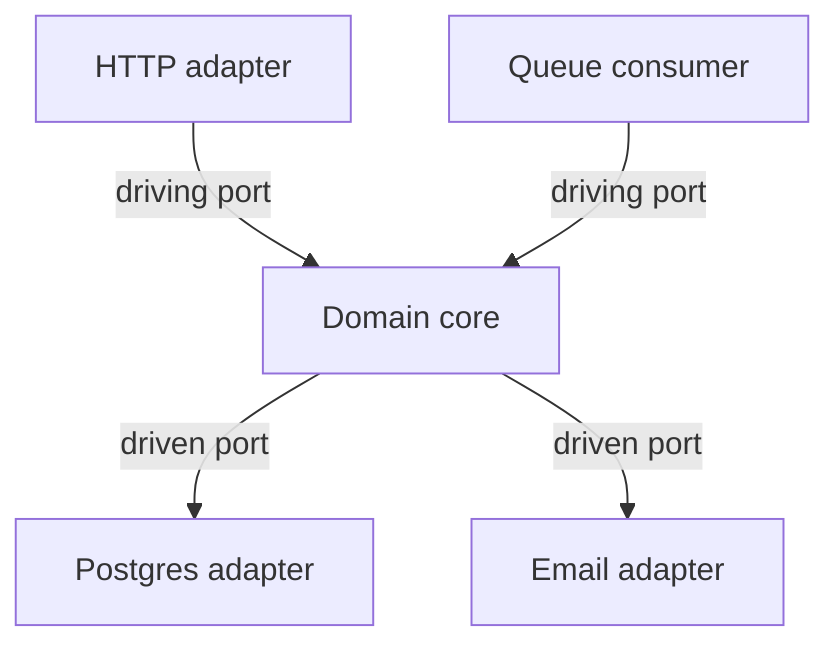

**Purpose** — it isolates a domain through ports and adapters for HTTP, DB, queues, and external APIs.

**How it works / is used** — a use case depends on an interface and a concrete adapter is wired at the composition root.

**Downsides and limits** — not every helper deserves a port, and too many interfaces hide a simple flow.

---
### CQRS — Command Query Responsibility Segregation

**Что это** — паттерн разделения моделей и путей команд (write) и чтения (read).

**Для чего используется** — позволяет оптимизировать чтение и запись по разным требованиям, когда одной модели становится недостаточно.

**Как используется / работает** — write model защищает invariants, read projection оптимизируется под конкретный screen/query.

**Минусы и ограничения** — усложняет consistency и operations; для обычного CRUD часто достаточно обычной read model.

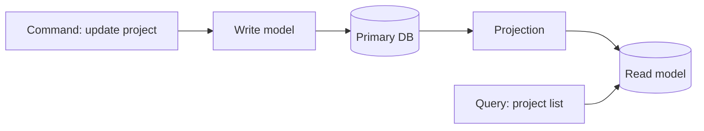

**Purpose** — it separates command and query models or paths when their requirements differ greatly.

**How it works / is used** — the write model protects invariants while a read projection is optimized for a specific screen or query.

**Downsides and limits** — it complicates consistency and operations; ordinary CRUD often needs only a normal read model.

---
### Event sourcing

**Что это** — хранение состояния как immutable последовательности domain events.

**Для чего используется** — сохраняет полную историю бизнес-изменений и позволяет восстановить состояние или построить новое представление данных.

**Как используется / работает** — aggregate воспроизводится из events, projections строят read models, schema events version-ируется.

**Минусы и ограничения** — replay, evolution, debugging и eventual consistency дороги; audit log сам по себе не требует event sourcing.

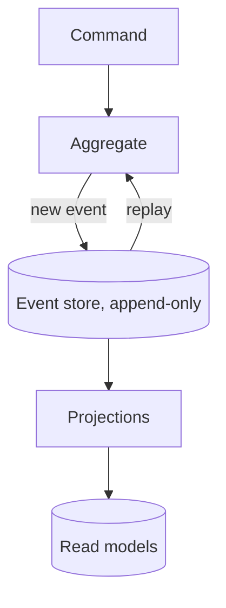

**Purpose** — it stores an immutable sequence of domain events as the source of state and audit history.

**How it works / is used** — an aggregate is rebuilt from events, projections make read models, and event schemas are versioned.

**Downsides and limits** — replay, evolution, debugging, and eventual consistency are costly; an audit log alone does not require event sourcing.

---
### Event-driven architecture

**Что это** — архитектура, где producer публикует события, а asynchronous consumers реагируют на них.

**Для чего используется** — ослабляет связь между производителем и потребителями фоновых действий и интеграций.

**Как используется / работает** — producer публикует named fact, consumers idempotently обрабатывают его и мониторят lag/failure.

**Минусы и ограничения** — tracing и ordering сложнее; event нельзя трактовать как synchronous RPC с другим названием.

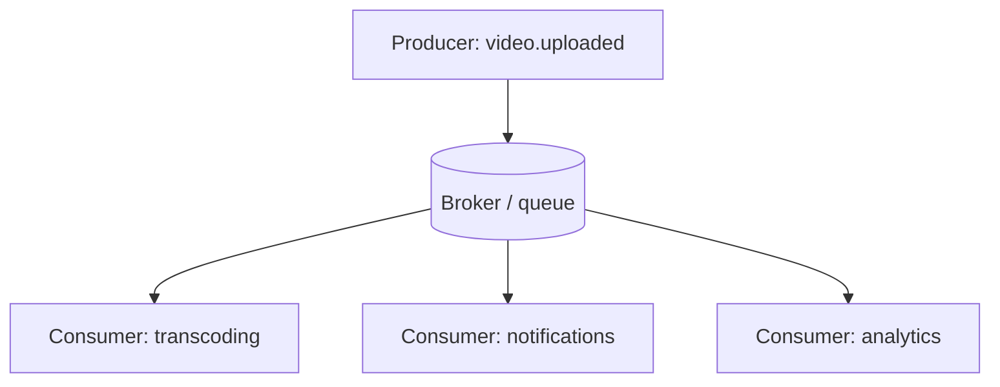

**Purpose** — it loosely couples producers and asynchronous consumers for background workflows.

**How it works / is used** — a producer publishes a named fact, consumers process it idempotently, and lag and failure are monitored.

**Downsides and limits** — tracing and ordering are harder, and an event must not be treated as synchronous RPC with another name.

---
### WebSocket

**Что это** — протокол двустороннего persistent connection между client и server поверх одного TCP-соединения.

**Для чего используется** — доставляет двусторонние обновления с малой задержкой для совместной работы, статуса и присутствия.

**Как используется / работает** — устанавливаю authenticated connection, задаю message schema/version, heartbeat, reconnect/backoff и server-side fan-out через pub/sub при нескольких instances.

**Минусы и ограничения** — connection lifecycle, scaling и authorization сложнее HTTP; не использую WebSocket, если редкий update проще доставить polling или SSE.

```ts
const socket = new WebSocket("wss://api.example.com/live");
socket.addEventListener("message", ({ data }) => updateProject(JSON.parse(data)));
```

**Purpose** — it maintains a bidirectional persistent connection between client and server for presence, collaboration, live status, or low-latency interaction.

**How it works / is used** — establish an authenticated connection, define message schema and versioning, heartbeat, reconnect and backoff, and server-side fan-out through pub/sub across instances.

**Downsides and limits** — connection lifecycle, scaling, and authorization are more complex than HTTP; do not use WebSocket when infrequent updates are simpler with polling or SSE.

---
### SSE — Server-Sent Events

**Что это** — односторонний server-to-client stream событий по обычному HTTP (EventSource).

**Для чего используется** — упрощает одностороннюю доставку прогресса и уведомлений через обычное HTTP-соединение.

**Как используется / работает** — browser открывает EventSource, server посылает named events и id; client reconnect-ится и может передать last event id для continuation.

**Минусы и ограничения** — канал односторонний и text-based; client-to-server commands всё равно идут обычным HTTP, а connection limits/proxy buffering нужно проверить.

```ts
const events = new EventSource("/api/jobs/42/events");
events.addEventListener("progress", (event) => setProgress(JSON.parse(event.data)));
```

**Purpose** — it delivers a server-to-client stream of updates over ordinary HTTP, such as video-generation progress or notifications.

**How it works / is used** — the browser opens EventSource, the server sends named events and IDs, and the client reconnects and can provide the last event ID for continuation.

**Downsides and limits** — the channel is one-way and text-based; client-to-server commands still use normal HTTP, and connection limits or proxy buffering must be verified.

---
### Message queue

**Что это** — буфер асинхронных задач между producer и worker-ами.

**Для чего используется** — отделяет долгую или повторяемую работу от HTTP-ответа и сглаживает временные пики нагрузки.

**Как используется / работает** — API сохраняет job, enqueue-ит message, worker берёт task с retry, visibility timeout и dead-letter policy.

**Минусы и ограничения** — queue обычно at-least-once; handler обязан быть idempotent и observable.

```ts
await queue.enqueue({ type: "render-video", jobId });
queue.consume("render-video", async ({ jobId }) => await renderVideo(jobId));
```

**Purpose** — it buffers slow or retryable work such as video rendering, email, or document processing.

**How it works / is used** — API saves a job, enqueues a message, and a worker takes work with retry, visibility timeout, and dead-letter policy.

**Downsides and limits** — queues are usually at-least-once, so handlers must be idempotent and observable.

---
### Idempotent consumer

**Что это** — обработчик сообщений, у которого повторная доставка не повторяет side effect.

**Для чего используется** — не даёт повторной доставке сообщения повторно выполнить побочный эффект, например списание или отправку письма.

**Как используется / работает** — храню processed event id или делаю write естественно unique/conditional в transaction.

**Минусы и ограничения** — dedup store тоже требует retention и concurrency safety; не полагаюсь только на message broker.

```sql
INSERT INTO processed_events (event_id) VALUES ($1)
ON CONFLICT DO NOTHING;
-- Run the side effect only if a new row was inserted.
```
**Purpose** — it safely processes a duplicate message or webhook without repeating a side effect.

**How it works / is used** — store processed event IDs or make a write naturally unique or conditional inside a transaction.

**Downsides and limits** — a dedup store also needs retention and concurrency safety; do not rely on the broker alone.

---
### Outbox pattern

**Что это** — паттерн атомарной записи события в таблицу outbox той же транзакцией, что и business write.

**Для чего используется** — не теряет событие между успешной записью в БД и публикацией в брокер.

**Как используется / работает** — business write и outbox row пишутся одной transaction; relay публикует row и помечает его delivered.

**Минусы и ограничения** — добавляет polling/relay/cleanup, а consumer всё равно должен быть idempotent.

```sql
BEGIN;
INSERT INTO videos (id, status) VALUES ($1, 'queued');
INSERT INTO outbox (topic, payload) VALUES ('video.queued', json_build_object('id', $1));
COMMIT;
```
**Purpose** — it prevents losing an event between a database commit and broker publish.

**How it works / is used** — write the business change and outbox row in one transaction; a relay publishes the row and marks it delivered.

**Downsides and limits** — it adds polling, relay, and cleanup, and consumers still must be idempotent.

---
### Cache-aside

**Что это** — паттерн кэширования: приложение само читает cache, при miss идёт в БД и заполняет cache.

**Для чего используется** — снижает задержку и нагрузку чтения, сохраняя базу данных источником истины.

**Как используется / работает** — read пытается cache, при miss читает DB и заполняет TTL; mutation invalidates/updates key.

**Минусы и ограничения** — stale cache и stampede требуют design; нельзя кешировать без явной freshness requirement.

```ts
let project = await cache.get(`project:${id}`);
if (!project) {
  project = await db.projects.find(id);
  await cache.set(`project:${id}`, project, { ttl: 60 });
}
```

**Purpose** — it lowers read latency and load while keeping the database as source of truth.

**How it works / is used** — reads try cache, load DB on miss, and populate TTL; mutations invalidate or update the key.

**Downsides and limits** — stale cache and stampede need design; do not cache without an explicit freshness requirement.

---
### Distributed lock

**Что это** — механизм взаимного исключения между instances через общее хранилище (lease с TTL).

**Для чего используется** — координирует единственное выполнение критичной задачи несколькими экземплярами приложения.

**Как используется / работает** — применяю lease с TTL и owner token, а downstream write делаю safe при duplicate execution.

**Минусы и ограничения** — lock может истечь во время работы; это не магия exactly-once и требует failure model.

```ts
const token = crypto.randomUUID();
const lock = await redis.set(`render:${videoId}`, token, { NX: true, PX: 30_000 });
if (!lock) return;
try {
  await renderVideo(videoId);
} finally {
  // Atomic compare-and-delete: never release a lease acquired by another worker.
  await redis.eval(
    'if redis.call("get", KEYS[1]) == ARGV[1] then return redis.call("del", KEYS[1]) end',
    { keys: [`render:${videoId}`], arguments: [token] },
  );
}
```
**Purpose** — it coordinates single execution of a scheduled or critical job across instances.

**How it works / is used** — use a lease with TTL and owner token, while making downstream writes safe under duplicate execution.

**Downsides and limits** — a lock can expire mid-work; it is not exactly-once magic and needs a failure model.

---
### Load balancing

**Что это** — распределение requests между healthy instances через выделенный балансировщик.

**Для чего используется** — распределяет нагрузку и даёт приложению пережить отказ отдельного экземпляра.

**Как используется / работает** — load balancer делает health checks, routing и иногда sticky sessions; app остаётся stateless насколько возможно.

**Минусы и ограничения** — session affinity ухудшает баланс и failover; shared dependencies часто становятся реальным bottleneck.

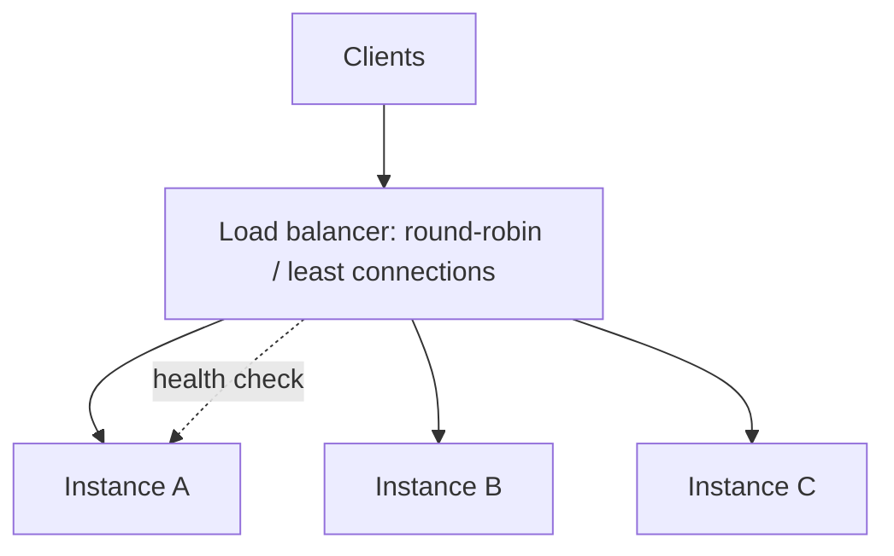

**Purpose** — it distributes requests across healthy instances for availability and horizontal scale.

**How it works / is used** — a load balancer performs health checks and routing, sometimes sticky sessions; keep the app as stateless as possible.

**Downsides and limits** — session affinity weakens balance and failover, while shared dependencies often become the real bottleneck.

---
### Backpressure

**Что это** — механизм сдерживания producer-а, когда работа поступает быстрее, чем consumer её обрабатывает.

**Для чего используется** — сообщает, что входящий поток работы превышает пропускную способность потребителя, и подсказывает ограничить параллелизм, очередь или скорость приёма.

**Как используется / работает** — ограничиваю concurrency/queue size, возвращаю retryable response или замедляю producer, мониторю lag.

**Минусы и ограничения** — dropping/limiting work — product decision; бесконечная очередь лишь отложит failure.

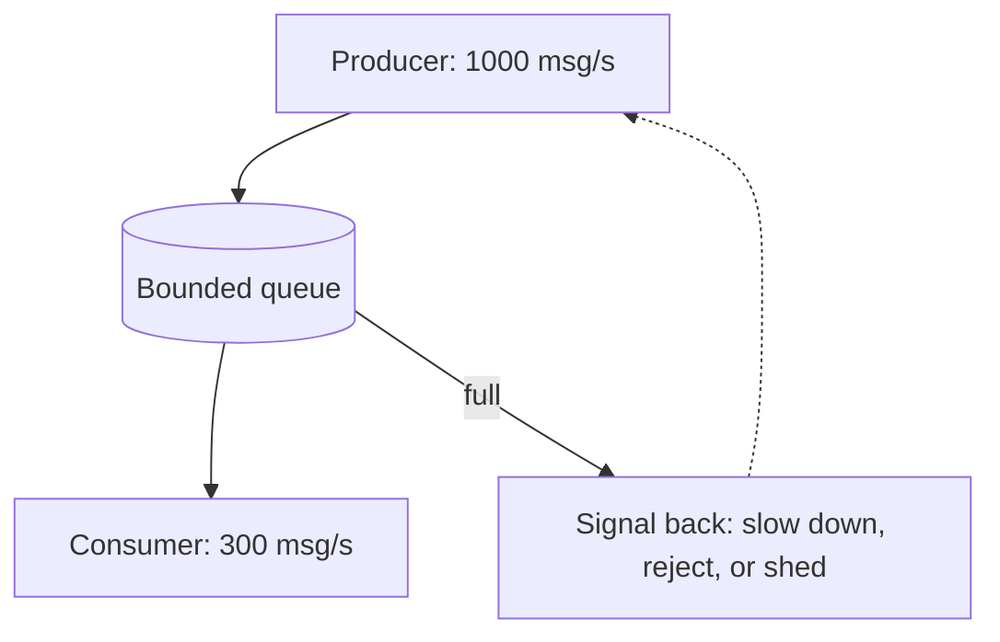

**Purpose** — it prevents collapse when a producer creates work faster than a consumer can process it.

**How it works / is used** — limit concurrency or queue size, return a retryable response or slow the producer, and monitor lag.

**Downsides and limits** — dropping or limiting work is a product decision; an infinite queue only delays failure.

---
### Rate limiting vs backpressure

**Что это** — rate limit защищает policy/abuse boundary, backpressure защищает downstream capacity.

**Для чего используется** — разделяет защиту политики API и защиту реальной пропускной способности зависимых систем.

**Как используется / работает** — API limit ставлю на caller, concurrency/queue limit — на service or worker capacity.

**Минусы и ограничения** — один механизм не заменяет другой; limits без user messaging выглядят как случайная поломка.

---
**Purpose** — rate limiting protects a policy or abuse boundary, while backpressure protects downstream capacity.

**How it works / is used** — apply API limits to callers and concurrency or queue limits to service or worker capacity.

**Downsides and limits** — one mechanism does not replace the other, and limits without user messaging look like random failure.

---
### System-design interview framing

**Что это** — структура ответа на system-design интервью: от требований к обоснованной схеме.

**Для чего используется** — превращает расплывчатое интервью-задание в проверяемые требования, а решение — в последовательное инженерное обоснование.

**Как используется / работает** — уточняю users, core flow, scale, latency, consistency, failures и non-goals, затем начинаю с simplest viable design.

**Минусы и ограничения** — нельзя преждевременно рисовать Kafka/микросервисы; но и нельзя молча делать опасные assumptions.

---
**Purpose** — it turns an ambiguous prompt into a reasoned engineering design.

**How it works / is used** — clarify users, core flow, scale, latency, consistency, failures, and non-goals, then start with the simplest viable design.

**Downsides and limits** — do not prematurely draw Kafka or microservices, but do not silently make risky assumptions either.

## AI, LLM & Product Engineering

---
### LLM — Large Language Model

**Что это** — нейросетевая модель, генерирующая или преобразующая text/structured output по prompt и context.

**Для чего используется** — автоматизирует генерацию и преобразование языка там, где результат можно проверить, ограничить контекстом или оставить на утверждение человеку.

**Как используется / работает** — рассматриваю модель как вероятностный component: ограничиваю task, даю relevant context, schema и evaluation.

**Минусы и ограничения** — output может быть неверным, нестабильным и дорогим; модель не является source of truth.

---
**Purpose** — it generates or transforms text or structured output from a prompt and supplied context.

**How it works / is used** — treat the model as a probabilistic component: constrain the task and provide relevant context, schema, and evaluation.

**Downsides and limits** — output can be wrong, variable, and expensive; the model is not a source of truth.

---
### Prompt engineering

**Что это** — практика формулирования задачи модели: роль, ограничения, формат, примеры.

**Для чего используется** — повышает воспроизводимость результата модели без попытки компенсировать промптом отсутствие данных, валидации или продуктового решения.

**Как используется / работает** — задаю role/task, constraints, input delimiters, desired format и few-shot examples только при доказанной пользе.

**Минусы и ограничения** — длинный prompt повышает latency/cost и не заменяет retrieval, validation или product design.

---
**Purpose** — it makes a model task clearer, more reproducible, and more testable.

**How it works / is used** — specify role and task, constraints, input delimiters, desired format, and few-shot examples only when proven useful.

**Downsides and limits** — a long prompt raises latency and cost and cannot replace retrieval, validation, or product design.

---
### System prompt

**Что это** — служебная инструкция с устойчивыми правилами поведения модели и product guardrails.

**Для чего используется** — задаёт стабильные продуктовые правила модели, не смешивая их с пользовательским содержимым.

**Как используется / работает** — отделяю system instructions от user content, версиирую их и оцениваю изменения на representative eval set.

**Минусы и ограничения** — system prompt не является security boundary против malicious input; нужен least privilege у tools и validation output.

---
**Purpose** — it sets durable model-behavior rules and product guardrails.

**How it works / is used** — separate system instructions from user content, version them, and evaluate changes on a representative eval set.

**Downsides and limits** — a system prompt is not a security boundary against malicious input; tools need least privilege and output validation.

---
### Tokens and context window

**Что это** — tokens определяют billing/latency, а context window — сколько input/output модель может учитывать за запрос.

**Для чего используется** — позволяет контролировать стоимость, задержку и объём доказательств, которые модель действительно сможет учесть.

**Как используется / работает** — budget-ирую instructions, retrieved evidence и response; chunk-ую документы по смыслу, а не по случайному лимиту.

**Минусы и ограничения** — большой context не гарантирует внимание к нужному факту и может ухудшить cost/качество.

```txt
A 200k-token window — input and output share one budget:
  system prompt        1k
  chat history        12k
  RAG context          8k
  question            0.2k
  output reserve       8k   ← without a reserve the answer gets truncated
Does not fit → summarize the history instead of silently dropping the tail.
```

**Purpose** — tokens determine billing and latency, while the context window limits input and output the model can consider per request.

**How it works / is used** — budget instructions, retrieved evidence, and response; chunk documents by meaning rather than arbitrary limits.

**Downsides and limits** — large context does not guarantee attention to the right fact and can worsen cost or quality.

---
### Embeddings

**Что это** — векторное представление контента для оценки семантической близости, поиска и кластеризации.

**Для чего используется** — позволяет находить семантически похожие документы, кластеры и рекомендации, когда точного совпадения слов недостаточно.

**Как используется / работает** — embed-ю chunks и query одной model family, храню metadata/filter fields и re-index-ирую при смене модели.

**Минусы и ограничения** — similarity не доказывает factual relevance; multilingual/domain quality нужно измерять на своих запросах.

```ts
const [a, b] = await embed(["how to trim a video", "clip cutting tool"]);
cosineSimilarity(a, b); // ~0.8 — semantically close with no shared words
```

**Purpose** — it turns content into a vector for semantic similarity, search, or clustering.

**How it works / is used** — embed chunks and queries with one model family, store metadata and filter fields, and reindex when the model changes.

**Downsides and limits** — similarity does not prove factual relevance; multilingual and domain quality must be measured on real queries.

---
### Vector database

**Что это** — хранилище embeddings с быстрым поиском approximate nearest neighbors и metadata filters.

**Для чего используется** — делает поиск ближайшего релевантного контекста достаточно быстрым для прикладных сценариев RAG и рекомендаций.

**Как используется / работает** — индексирую chunks с source/version/permissions metadata, выполняю top-k search и применяю tenant filter до ответа.

**Минусы и ограничения** — это не замена source database и access control; index freshness, deletes и cost требуют ownership.

```ts
const matches = await vectorIndex.search({
  vector: await embed(question),
  limit: 8,
  filter: { tenantId, permission: "read" },
});
```
**Purpose** — it stores embeddings and rapidly finds approximate nearest neighbors with metadata filters.

**How it works / is used** — index chunks with source, version, and permissions metadata, run top-k search, and apply tenant filters before response.

**Downsides and limits** — it does not replace a source database or access control; index freshness, deletes, and cost need ownership.

---
### RAG — Retrieval-Augmented Generation

**Что это** — паттерн генерации с предварительным поиском: найденные разрешённые знания добавляются в prompt.

**Для чего используется** — связывает ответ модели с разрешёнными и свежими источниками, снижая риск ответа «из памяти» модели.

**Как используется / работает** — query → retrieve → rerank/filter → assemble cited context → generate answer with source links.

**Минусы и ограничения** — плохой retrieval не спасёт сильная модель; RAG снижает, но не устраняет hallucinations.

**Мини-пример** — для вопроса о policy сначала достаю актуальные policy chunks, а не прошу модель «вспомнить».

```ts
const matches = await vectorSearch.embedAndFind(question, { tenantId, limit: 8 });
const context = matches.map(({ text, sourceUrl }) => ({ text, sourceUrl }));
const answer = await llm.generate({ question, context });
```

**Purpose** — it adds retrieved, authorized, and fresh knowledge to a prompt before generation.

**How it works / is used** — query, retrieve, rerank or filter, assemble cited context, then generate with source links.

**Downsides and limits** — strong models cannot rescue bad retrieval, and RAG reduces but does not eliminate hallucinations.

**Mini-example** — for a policy question, retrieve current policy chunks rather than asking the model to remember.

---
### Reranking

**Что это** — второй этап поиска, переупорядочивающий initial retrieval results более точной моделью.

**Для чего используется** — улучшает точность малого контекста для модели после быстрого, но более шумного первичного поиска.

**Как используется / работает** — беру широкий cheap top-k по vector search, затем reranker выбирает небольшой high-precision context.

**Минусы и ограничения** — добавляет latency/cost; плохие chunks или filters остаются плохой базой.

---
**Purpose** — it improves the order of initial retrieval results before sending them to the model.

**How it works / is used** — retrieve a broad cheap top-k with vector search, then use a reranker for small high-precision context.

**Downsides and limits** — it adds latency and cost; poor chunks or filters remain a poor foundation.

---
### Hallucination

**Что это** — режим сбоя, при котором модель уверенно утверждает неподтверждённый или выдуманный факт.

**Для чего используется** — сообщает, что ответ модели может быть уверенным, но не подтверждённым фактами; требует проверки источников и критичных полей.

**Как используется / работает** — ограничиваю answer предоставленными sources, требую citations, валидирую structured fields и даю abstain path.

**Минусы и ограничения** — prompt warning «не галлюцинируй» недостаточен; high-stakes output нуждается в human review или deterministic verification.

---
**Purpose** — it is a failure mode where a model confidently asserts an unsupported or fabricated fact.

**How it works / is used** — constrain answers to supplied sources, require citations, validate structured fields, and provide an abstain path.

**Downsides and limits** — a prompt warning not to hallucinate is insufficient; high-stakes output needs human review or deterministic verification.

---
### Structured output

**Что это** — ответ модели в заданной схеме (JSON schema/function tool) вместо свободного текста.

**Для чего используется** — превращает ответ модели в проверяемый контракт, пригодный для следующего шага продукта или сервера.

**Как используется / работает** — задаю JSON schema/function tool, валидирую ответ на сервере и retry-ю/repair-ю malformed output bounded числом раз.

**Минусы и ограничения** — schema validates shape, не truth; сложная schema увеличивает failure rate и prompt cost.

```ts
const answer = await llm.generate({
  responseFormat: {
    type: "json_schema",
    schema: { type: "object", required: ["summary", "risks"] },
  },
});

const result = SummarySchema.parse(answer);
```

**Purpose** — it turns a model response into a predictable object usable in a product workflow.

**How it works / is used** — define a JSON schema or function tool, validate server-side, and retry or repair malformed output a bounded number of times.

**Downsides and limits** — schema validates shape, not truth; a complex schema raises failure rate and prompt cost.

---
### Tool calling

**Что это** — механизм, в котором модель запрашивает действие или данные через строго описанный application tool.

**Для чего используется** — позволяет модели инициировать ограниченное действие через проверяемый серверный контракт, а не давать ей прямой доступ к системам.

**Как используется / работает** — model выбирает tool и arguments, backend валидирует permissions/arguments, выполняет действие и возвращает result.

**Минусы и ограничения** — model никогда не получает прямой доступ к DB/production; tool output тоже может содержать prompt injection.

```ts
const tools = [{ name: "get_project", parameters: { type: "object", properties: { id: { type: "string" } } } }];
if (call.name === "get_project") return getProjectForUser(userId, call.arguments.id);
```

**Purpose** — it lets a model request an action or data through a strictly described application tool.

**How it works / is used** — the model selects a tool and arguments, the backend validates permissions and arguments, executes, then returns a result.

**Downsides and limits** — the model must never receive direct database or production access, and tool output can also contain prompt injection.

---
### Prompt injection

**Что это** — атака, при которой недоверенный контент пытается переопределить инструкции модели или выманить данные и действия инструментов.

**Для чего используется** — сообщает о попытке недоверенного содержимого изменить инструкции модели или получить доступ к данным и действиям инструментов.

**Как используется / работает** — помечаю untrusted content как data, ограничиваю tool permissions, validate-ю operations и не раскрываю secrets модели.

**Минусы и ограничения** — одного delimiter недостаточно; treat external documents, web pages и user text как hostile inputs.

```ts
const tool = tools[call.name];
if (!tool || !canUseTool(user, tool) || !tool.schema.safeParse(call.arguments).success) {
  throw new Error("Rejected tool call");
}
```
**Purpose** — it is an attack or failure where untrusted content tries to override instructions or obtain data or tool actions.

**How it works / is used** — label untrusted content as data, limit tool permissions, validate operations, and never expose secrets to the model.

**Downsides and limits** — delimiters alone are insufficient; treat external documents, web pages, and user text as hostile inputs.

---
### Evaluation (evals)

**Что это** — измеримые проверки качества LLM feature на представительном наборе примеров.

**Для чего используется** — показывает, улучшило или ухудшило изменение промпта или модели качество фичи до выката на пользователей.

**Как используется / работает** — собираю representative examples, rubric/expected facts, automated checks и human calibration; track-ю quality, latency, cost.

**Минусы и ограничения** — маленький «красивый» eval set легко overfit-ится; production feedback всё равно нужен.

```ts
for (const example of evalSet) {
  const answer = await generate(example.input);
  expect(score(answer, example.expected)).toBeGreaterThanOrEqual(0.9);
}
```
**Purpose** — it measures whether an LLM feature actually solves its task before and after a prompt or model change.

**How it works / is used** — collect representative examples, rubric or expected facts, automated checks, and human calibration; track quality, latency, and cost.

**Downsides and limits** — a small “nice” eval set is easy to overfit, so production feedback is still needed.

---
### AI — Artificial Intelligence: latency and cost

**Что это** — инженерная дисциплина удержания LLM feature интерактивной и экономически оправданной.

**Для чего используется** — удерживает функцию с ИИ интерактивной и экономически оправданной при реальной нагрузке.

**Как используется / работает** — выбираю smallest capable model, сокращаю context/output, cache-ю safe results, async-ю long generation и показываю progress.

**Минусы и ограничения** — дешёвая модель может ухудшить quality/support cost; cache нельзя применять к personal/fresh content без policy.

---
**Purpose** — it makes an LLM feature economically and interactively viable.

**How it works / is used** — choose the smallest capable model, reduce context and output, cache safe results, run long generation asynchronously, and show progress.

**Downsides and limits** — a cheaper model can increase quality or support cost; do not cache personal or fresh content without policy.

---
### Human-in-the-loop

**Что это** — схема работы, в которой финальное решение остаётся за человеком, а модель готовит draft.

**Для чего используется** — оставляет человеку контроль там, где цена ошибочного решения модели выше стоимости проверки.

**Как используется / работает** — модель предлагает draft/score с evidence, человек approve/edit/reject, а feedback улучшает evals.

**Минусы и ограничения** — ручной review создаёт очередь и latency; нужно выбирать рискованные decision points, а не всё подряд.

---
**Purpose** — it keeps a human as final decision-maker where the cost of an AI error is high.

**How it works / is used** — the model proposes a draft or score with evidence, a person approves, edits, or rejects, and feedback improves evals.

**Downsides and limits** — manual review creates a queue and latency; choose risky decision points rather than reviewing everything.

---
### Product discovery

**Что это** — процесс проверки, какую проблему пользователя стоит решать, до масштабной реализации.

**Для чего используется** — проверяет, что команда решает реальную проблему пользователя до дорогой реализации и масштабирования.

**Как используется / работает** — формулирую target user, job-to-be-done, current workaround, hypothesis и smallest experiment с success signal.

**Минусы и ограничения** — interviews не равны реальному поведению; discovery не должна становиться бесконечной отсрочкой доставки.

---
**Purpose** — it validates which user problem is worth solving before large-scale implementation.

**How it works / is used** — define target user, job to be done, current workaround, hypothesis, and smallest experiment with a success signal.

**Downsides and limits** — interviews are not the same as behavior, and discovery must not become endless delivery delay.

---
### Product metrics

**Что это** — измеримые показатели пользы фичи для пользователя и бизнеса.

**Для чего используется** — показывает, приносит ли фича ценность пользователю и бизнесу, а не только работает технически.

**Как используется / работает** — связываю input, activation, success и guardrail metrics с конкретным journey; сегментирую по cohort/tenant.

**Минусы и ограничения** — vanity metrics легко растут без value; metric нельзя использовать без privacy/ethics review.

---
**Purpose** — it shows whether a feature creates user or business value rather than merely technical output.

**How it works / is used** — connect input, activation, success, and guardrail metrics to a specific journey and segment by cohort or tenant.

**Downsides and limits** — vanity metrics can rise without value, and metrics need privacy and ethics review.

---
### A/B testing

**Что это** — контролируемый эксперимент со случайным разделением пользователей между вариантами.

**Для чего используется** — измеряет причинный эффект изменения продукта, а не полагается на впечатления или сравнение разных периодов.

**Как используется / работает** — заранее задаю hypothesis, primary metric, guardrails, sample size и assignment unit, затем анализирую эффект.

**Минусы и ограничения** — плохая randomization, peeking и multiple comparisons создают ложные выводы; не каждый change достоин эксперимента.

---
**Purpose** — it causally compares feature or product-decision variants on randomly assigned users.

**How it works / is used** — define hypothesis, primary metric, guardrails, sample size, and assignment unit before analysis.

**Downsides and limits** — poor randomization, peeking, and multiple comparisons create false conclusions, and not every change needs an experiment.

---
### Analytics events

**Что это** — структурированные записи действий пользователя и шагов воронки для продуктового анализа и отладки.

**Для чего используется** — даёт данные о реальном поведении пользователей для воронок, экспериментов и отладки продуктовых гипотез.

**Как используется / работает** — event имеет stable name, schema, timestamp, actor/context и documented ownership; отправляю только нужные данные.

**Минусы и ограничения** — PII и duplicate events искажают аналитику; tracking plan требует versioning и privacy controls.

```ts
track("project_exported", {
  projectId,
  format: "mp4",
  durationSec: 42,
  plan: user.plan, // no PII: identifiers instead of email
});
```

**Purpose** — it records user actions and funnel steps for product analysis and debugging.

**How it works / is used** — an event has stable name, schema, timestamp, actor and context, plus documented ownership; send only necessary data.

**Downsides and limits** — PII and duplicate events distort analytics, so a tracking plan needs versioning and privacy controls.

---
### Optimistic UI

**Что это** — паттерн UI, показывающий ожидаемый результат mutation до network response.

**Для чего используется** — сокращает воспринимаемую задержку, показывая ожидаемый результат до ответа сервера там, где откат понятен пользователю.

**Как используется / работает** — обновляю local cache предсказуемо, сохраняю previous state и rollback-ю при ошибке; server остаётся source of truth.

**Минусы и ограничения** — плохо подходит для high-conflict/irreversible actions; error/reconciliation UX должен быть явным.

```ts
const previous = queryClient.getQueryData(["projects"]);
queryClient.setQueryData(["projects"], addProjectOptimistically(input));
try { await api.createProject(input); }
catch { queryClient.setQueryData(["projects"], previous); }
```
**Purpose** — it provides immediate feedback by showing expected mutation results before the network response.

**How it works / is used** — update local cache predictably, retain previous state, and roll back on error; the server remains source of truth.

**Downsides and limits** — it is a poor fit for high-conflict or irreversible actions, and error plus reconciliation UX must be explicit.

---
### Design systems

**Что это** — переиспользуемый набор компонентов, tokens и accessibility patterns с документацией.

**Для чего используется** — ускоряет создание согласованных интерфейсов и не даёт доступности или визуальным правилам расходиться между фичами.

**Как используется / работает** — начинаю с shared primitives и documented usage, поддерживаю versioning, visual regression и design-engineering collaboration.

**Минусы и ограничения** — не делаю универсальный компонент на все случаи; premature systemisation замедляет product learning.

---
**Purpose** — it creates a reusable language of components, tokens, and accessibility patterns for speed and consistency.

**How it works / is used** — start with shared primitives and documented usage, maintain versioning, visual regression, and design-engineering collaboration.

**Downsides and limits** — do not build one universal component for every case; premature systemization slows product learning.

## Fast system-design practice prompts

Перед интервью проговорите вслух по 10–15 минут каждый сценарий: requirements → API/data model → happy path → failure/retry → scale/observability → trade-offs.

---
### 1. Создать AI-видео из текста

**По-русски:** начинаю с POST /projects/:id/renders с idempotency key. В одной transaction создаю render job и outbox event; worker берёт job из queue, получает разрешённые input assets, вызывает generation/render stages и сохраняет итог в object storage. В БД храню state machine (queued → running → completed/failed/cancelled), а UI получает status через polling или SSE. Retries только для transient failure, cancel — идемпотентный и проверяется между stages. Сначала это modular monolith с worker-ами; отдельно масштабирую CPU/GPU rendering только при измеренной очереди/нагрузке.

**In English:** I would start with POST /projects/:id/renders and an idempotency key. One transaction creates a render job and outbox event; a worker consumes it, accesses authorized input assets, runs generation and rendering stages, and saves the result to object storage. The database keeps a state machine (queued → running → completed/failed/cancelled), while the UI receives status through polling or SSE. Retry only transient failures, make cancellation idempotent, and check it between stages. I would begin with a modular monolith plus workers and separately scale CPU/GPU rendering only when queue pressure proves the need.

---
### 2. Совместное редактирование учебного сценария

**По-русски:** сначала уточняю, нужна ли настоящая одновременная правка текста. Для autosave без real-time collaboration достаточно revision number и optimistic locking: client отправляет base revision, server возвращает 409 Conflict при устаревшей версии. Presence и live cursors идут через WebSocket как ephemeral data. Если требуется одновременное редактирование одного rich-text поля без конфликтов, выбираю CRDT или OT, храню snapshots и append-only operations, а permissions проверяю на каждом connection и write.

**In English:** I would first clarify whether true simultaneous text editing is required. For autosave without real-time collaboration, a revision number and optimistic locking are enough: the client sends its base revision and the server returns 409 Conflict for a stale version. Presence and live cursors travel over WebSocket as ephemeral data. If users must edit the same rich-text field concurrently without conflicts, I would choose CRDT or OT, store snapshots plus append-only operations, and check permissions on every connection and write.

---
### 3. Загрузка 5 GB видео

**По-русски:** browser не проксирует 5 GB через application server. API authorise-ит upload и выдаёт short-lived signed multipart URL; browser загружает части напрямую в storage, умеет resume и показывает локальный progress. После complete server проверяет ownership/size/type, ставит scan/transcode job в очередь и только затем помечает asset usable. Нужны quota, expiry незавершённых uploads, content validation по байтам, malware scan и lifecycle policy.

**In English:** The browser should not proxy 5 GB through the application server. The API authorizes the upload and issues short-lived signed multipart URLs; the browser uploads parts directly to storage, supports resume, and shows local progress. After complete, the server verifies ownership, size, and type, queues scanning and transcoding, and marks the asset usable only afterward. Include quota, expiry for incomplete uploads, byte-level content validation, malware scanning, and lifecycle policy.

---
### 4. Поиск по проектам и сценариям

**По-русски:** начинаю с Postgres full-text search и structured filters, а не с отдельного search cluster. API принимает query/filters/cursor и возвращает results с deterministic sort (rank, updated_at, id); authorization/tenant filter применяются до выдачи. UI debounce-ит query, отменяет устаревший request и показывает cursor pagination. Vector retrieval добавляю, только если keyword/full-text search не покрывает semantic intent; его results всё равно проходят metadata и permission filters.

**In English:** I would start with Postgres full-text search and structured filters rather than a separate search cluster. The API accepts query, filters, and cursor, then returns results with deterministic sort (rank, updated_at, id); authorization and tenant filters apply before returning results. The UI debounces query input, cancels stale requests, and uses cursor pagination. I would add vector retrieval only if keyword and full-text search fail to cover semantic intent; its results still pass metadata and permission filters.

---
### 5. Analytics для learning content

**По-русски:** сначала определяю события и метрики: например, lesson_started, scene_completed, assessment_submitted, а не расплывчатые «engagement». Client отправляет versioned, минимальный по PII event с event id и timestamp; ingestion API валидирует schema и кладёт event в durable queue/storage. Асинхронный pipeline дедуплицирует, обрабатывает late events и строит aggregates для dashboard. Хранение и retention согласую с privacy/legal requirements, а metric definitions документирую рядом с dashboard.

**In English:** I would first define events and metrics, for example lesson_started, scene_completed, and assessment_submitted, rather than vague “engagement.” The client sends a versioned, PII-minimized event with event ID and timestamp; the ingestion API validates schema and stores it in a durable queue or storage. An asynchronous pipeline deduplicates, handles late events, and builds dashboard aggregates. Retention follows privacy and legal requirements, and metric definitions live beside the dashboard.

---
### 6. Notification system

**По-русски:** domain mutation записывает notification intent и outbox event в одной transaction. Worker применяет user preferences, dedupe key и channel policy, затем создаёт delivery record и отправляет email/in-app notification через provider. Provider webhooks обновляют delivery state идемпотентно; transient errors получают exponential backoff и dead-letter visibility. Unsubscribe и quiet hours применяются до отправки. In-app inbox хранится в БД, а SSE/WebSocket — только ускоряет его обновление в UI, не является source of truth.

**In English:** A domain mutation writes notification intent and an outbox event in one transaction. A worker applies user preferences, a dedupe key, and channel policy, then creates a delivery record and sends email or in-app notification through a provider. Provider webhooks update delivery state idempotently; transient failures receive exponential backoff and dead-letter visibility. Apply unsubscribe and quiet hours before send. The in-app inbox lives in the database, while SSE or WebSocket only accelerates UI updates and is not the source of truth.

## Final interview reminders

- Начинайте с простого решения и называйте условие, при котором усложните его.
- Отделяйте факт от предположения: «At this scale I would start with…; if we observe…, I would add…».
- Для любой mutation проговорите validation, authorization, idempotency, error UX и observability.
- Для AI отвечайте не только про модель: где данные, как устроены evaluation, безопасность, latency/cost и human fallback.
- Не выдумывайте опыт. Честный ответ «I have not operated this in production, but I would validate it by…» сильнее уверенного неверного.
